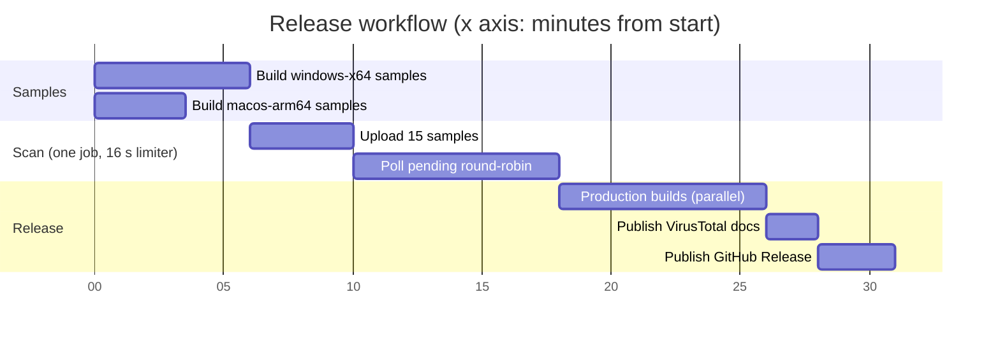

# Scanner isolation PoC

Small, independent binaries isolate packaging layers.
No DeckBridge application code ships here.

## Samples

| Sample | Isolated layer |
| --- | --- |
| `hello-c.exe` | Plain native executable baseline |
| `hello-native.dll` | Plain native library baseline |
| `hello-tray.exe` | Minimal Windows tray API usage |
| `tjs.exe` | Unmodified slim Txiki runtime |
| `hello-txiki.exe` | Txiki with compiled Hello World |
| `hello-txiki-library.exe` | Txiki plus embedded, extracted DLL |
| `hello-tauri.exe` | Empty Tauri executable |
| `hello-tauri-setup.exe` | NSIS installer containing empty Tauri executable |
| `hello-tauri.dmg` | Plain DMG containing empty Tauri app |

## Comparison

| Layer | macOS arm64 | Windows x64 | VirusTotal result |
| --- | --- | --- | --- |
| Plain C executable | Built, ran | Workflow prepared | Pending upload |
| Native library | Built, loaded | Workflow prepared | Pending upload |
| Tray executable | Not applicable | Workflow prepared | Pending upload |
| Stock Txiki runtime | Built, ran | Workflow prepared | Pending upload |
| Compiled Txiki Hello World | Built, ran | Workflow prepared | Pending upload |
| Txiki with embedded library | Built, ran | Workflow prepared | Pending upload |
| Empty Tauri executable | Built | Workflow prepared | Pending upload |
| Empty Tauri installer | DMG built | NSIS workflow prepared | Pending upload |

Scores remain pending until release scans run.

Windows samples build on `windows-latest`.
macOS arm64 samples build on `macos-15`.
Dispatch `Build VirusTotal isolation samples`.
Manual dispatch uploads binaries as Actions artifacts.
Manual dispatch never sends files to VirusTotal.
Release workflow runs both platforms before production builds.
Both platforms build in parallel.
One scan job then submits all samples through one rate limiter.
Release scans upload samples to VirusTotal publicly.
Missing `VIRUSTOTAL_API_KEY` blocks release.
Release results populate `docs/virustotal.md`.
Docs deployment follows publication automatically.
Workflow uses production `mise.toml` tool versions.
Build checks production Tauri locks and CLI.
Txiki release tag comes from production `mise.toml`.

## Release timeline

Estimated minutes from release start.
Build steps use measured v0.17.0 times.
Scan length is estimated.



The scan starts after the slower sample build finishes.
The scan fails if any file exceeds its 8-minute deadline.
v0.17.0 ran samples serially: 43 minutes of samples, 57 minutes total.

Local macOS build supports matching baselines:

```sh
python3 build.py --tjs /path/to/tjs
```

Without `--tjs`, script downloads arm64 runtime.
Windows workflow downloads x64 runtime automatically.
Pass `--tauri` for executable plus DMG.
Set `TAURI_CLI` for existing CLI installation.
Optional: run `node scan.mjs` with `VT_API_KEY`.
No arguments scans `artifacts/` for this host.
Pass `windows-x64=<dir> macos-arm64=<dir>` for explicit platforms.
This uploads every sample to VirusTotal publicly.
Script writes platform-specific Markdown and JSON reports.

## Interpretation

Compare adjoining samples, not scan totals alone.
Installer detections suggest packaging influence.
Txiki-only detections suggest runtime influence.
Embedded-library differences suggest extraction influence.
Scan results cannot prove maliciousness or safety.

Release 0.17.0 [findings](https://lukasmega.github.io/DeckBridge/virustotal-v0.17.0) provide reference scores.
