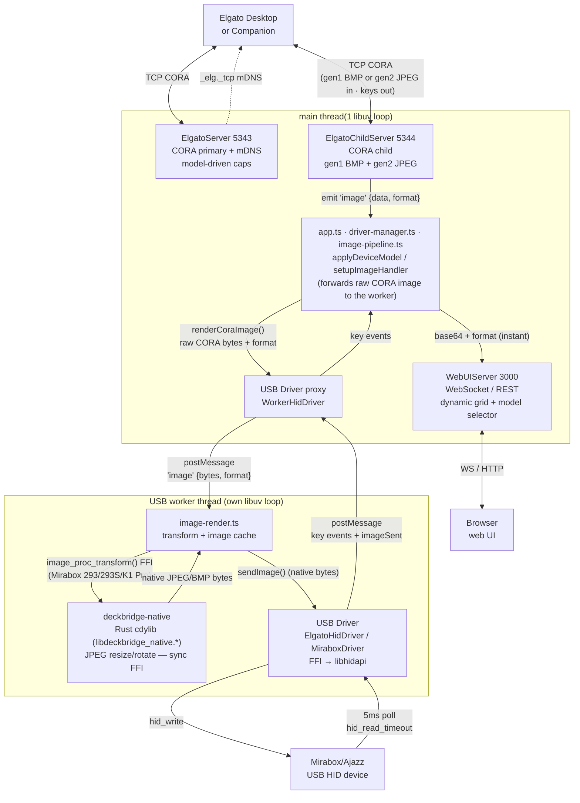
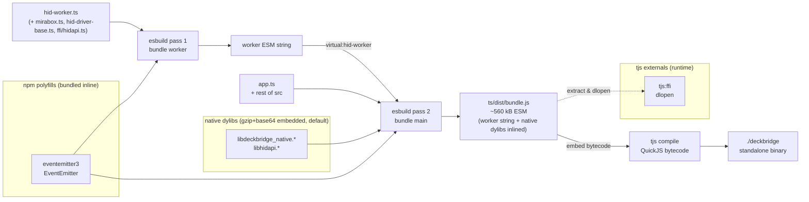
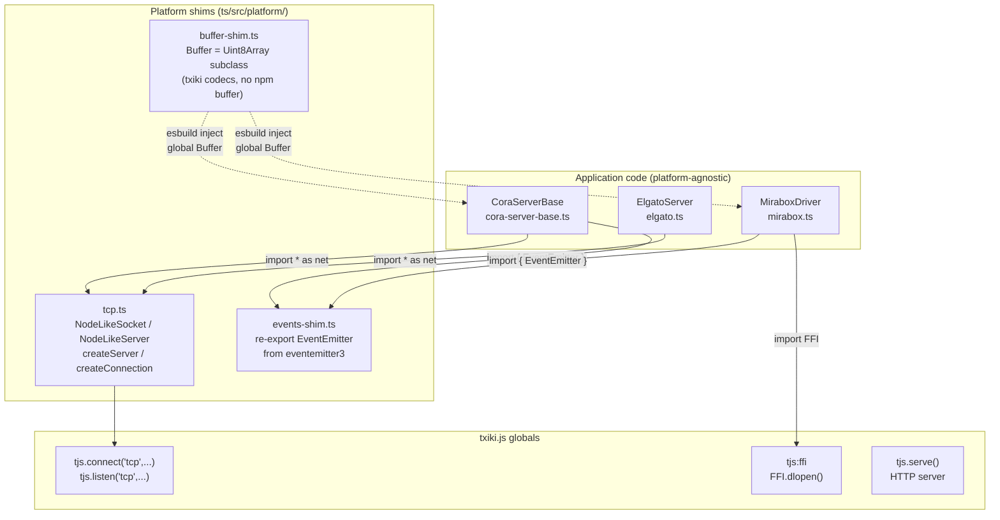
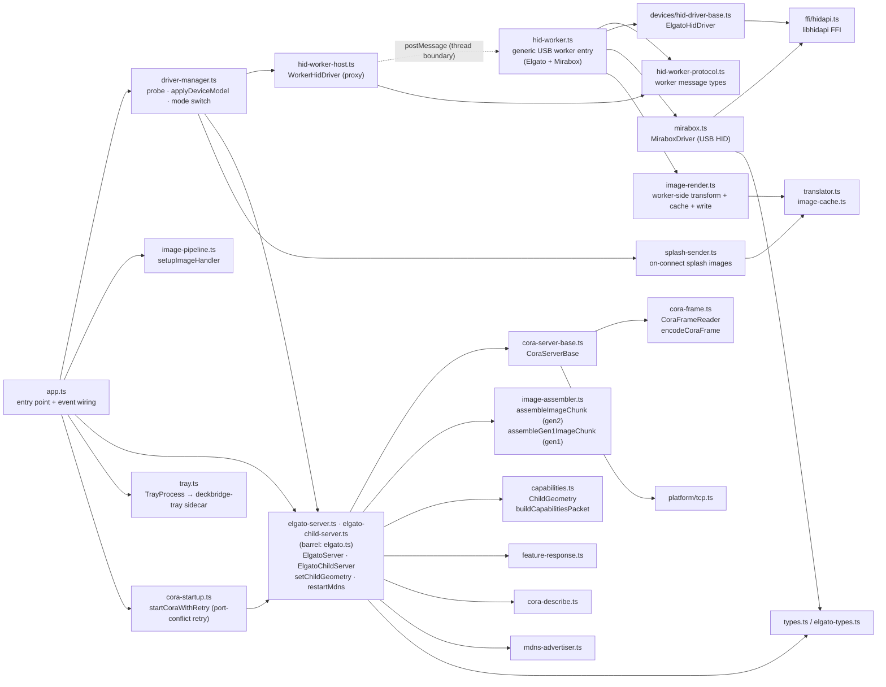

# DeckBridge — architecture & development

Deep technical documentation: build pipeline, threading model, protocol handling, and
module layout. For the user-facing overview see [README.md](README.md); rendered docs at
<https://lukasmega.github.io/DeckBridge/>.

**Runtime:** [txiki.js](https://github.com/saghul/txiki.js) (QuickJS-ng + libuv + libffi)

## Quick start (from source)

```bash
# Prerequisites: libhidapi installed (txiki.js runtime is provided by mise)
mise run start

# Or step by step:
mise run build     # fetch txiki.js (mise) + bundle TS + build Rust sidecars (cdylib + tray)
mise run compile   # produce ./deckbridge binary
./deckbridge
```

## Slim txiki.js runtime (size optimization)

`mise run compile` self-embeds the txiki.js runtime, so a smaller runtime means a smaller
`deckbridge`. This app uses only `tjs:ffi`, raw TCP, and `tjs.serve` (HTTP + WebSocket) —
**none** of txiki.js's `sqlite3` or `WebAssembly`/WASI (WAMR) — so it ships a **slim**
runtime.

By default `$TJS` comes from mise's `github:lukasMega/txiki.js` tool ([`mise.toml`](mise.toml)):
a **prebuilt slim** runtime with sqlite3 + wasm/WAMR removed and symbols stripped, no
toolchain needed. It's produced from [`patches/txiki-slim.patch`](patches/txiki-slim.patch),
which drops `src/wasm.c`, `src/mod_sqlite3.c`, the `deps/sqlite3` + WAMR CMake wiring, and
the matching init/version/include sites (guarded by `#ifndef TJS_SLIM`). Rebuild from
source only to change the runtime or target a platform without a prebuilt:

```bash
mise run tjs-build     # apply the slim patch + compile from source
```

**Build deps (from-source only):** `cmake`, a C/C++ toolchain, `make`, `libffi`
— macOS: `xcode-select --install && brew install cmake libffi`; Debian/Ubuntu:
`sudo apt-get install -y build-essential cmake git libffi-dev`.

(`scripts/tjs-setup` is the legacy acquisition task, output under `vendor/`; it no-ops when
`$TJS` already exists. Released binaries use the slim runtime.)

## Running a packaged release

The standalone `deckbridge` binary is self-contained — just `./deckbridge`. Native dylibs
(`libdeckbridge_native`, `libhidapi`) are embedded (gzip+base64) and auto-extracted to a per-version
cache dir on first run (see [Build pipeline](#build-pipeline) for paths); no sidecar `.dylib`/`.so`
needed. A `deckbridge-tray` sidecar next to the binary is auto-detected and launched if present — the
tray is optional.

## Data flow



### Concurrency model

DeckBridge runs on **two threads**, connected only by `postMessage`:

- **Main thread** — the CORA TCP servers (Elgato primary/child), the WebUI HTTP/WebSocket server,
  and the orchestration forwarding each received CORA image to the worker. It must stay responsive:
  CORA image chunks are **ACK-paced** (Elgato waits for our ACK before the next), so any stall here
  throttles image delivery *and* the WebUI previews riding on it.
- **USB worker thread** — owns the libhidapi handle and does all **synchronous, blocking** work that
  must never stall the main loop: the JPEG/BMP **transform** (`image-render.ts` →
  `image_proc_transform` FFI, 50–200 ms) + LRU **image cache**, then HID I/O (`hid_write` uploads,
  `hid_read_timeout` key polling). The main thread hands over raw CORA bytes via
  `WorkerHidDriver.renderCoraImage()`; the worker transforms, caches, and writes — so neither the
  transform nor a large upload stalls the CORA ACK loop (P1). A single generic worker
  (`hid-worker.ts`, proxied by `WorkerHidDriver`) serves every device; its `createDriver()` picks
  `ElgatoHidDriver` (MK.2, Mini) or `MiraboxDriver` (293/293S/K1 Pro) by `driverKind`.

The split makes a full profile load fast on **both** sides: the main thread pushes every image to
the browser immediately while the device updates in parallel on the worker. USB I/O gets a whole
thread; the WebUI rides the main thread's spare time. Mock mode stays on the main thread.

To keep image bursts from flooding the WebUI, per-chunk CORA tx/ACK and keepalive logs are `debug`
level, and `WebUIServer.notifyComm()` batches comm entries into one `commBatch` message every ~100 ms
(`COMM_BROADCAST_FLUSH_MS`) instead of one WS message per chunk.

### Network exposure

The CORA servers (5343/5344) listen on **all interfaces** (`0.0.0.0`) with **no
authentication** — protocol-inherent, as the real Elgato Network Dock has none either. Any LAN host
can connect, push images, and read key events. Set `DECKBRIDGE_BIND` (e.g. `127.0.0.1`) to restrict
the listen address. The WebUI (3000) ignores `DECKBRIDGE_BIND` and always binds `127.0.0.1`.

To reduce session-stealing, an actively-used CORA connection (sent data within
`CLIENT_EVICTION_GRACE_MS`, default 10 s) can't be evicted by a new connection — the newcomer's
socket is closed instead. A quiet connection (desktop app closed) can still be replaced.

Malformed-input guards on the CORA path: incoming images (gen2 JPEG / gen1 BMP) are decoded by
`deckbridge-native` with bounded limits (max 500×500 px, 900 KB decode alloc), so an
oversized/malformed image is rejected rather than allocating large buffers (real key images are ≤
~800 px); image chunks with an out-of-range `keyIndex` are dropped before assembly (an
unauthenticated peer can't grow assembly buffers or repaint key 0 via index coercion); and a frame
header declaring a `payloadLength` larger than the receive buffer forces a resync past the bad
header instead of stalling the reader.

### Startup & error handling

The CORA ports (5343/5344) are protocol-fixed and can't fall back like the WebUI port. If either is
in use (a second DeckBridge, a real Network Dock, or the ESP32 bridge), `startCoraWithRetry`
([cora-startup.ts](ts/src/cora-startup.ts)) logs "port in use" to the console + WebUI feed and
retries every few seconds, keeping the already-started WebUI alive instead of crashing. A shutdown
signal during the wait still exits cleanly.

A global `unhandledrejection` handler (`app.ts`) turns an otherwise-fatal rejection into a graceful
`shutdown()` (device disconnect handshake, socket teardown, tray kill) rather than a hard-abort with
no cleanup. (txiki aborts on an un-`preventDefault`'d rejection, and a synchronous throw in a timer
callback has no global hook, so the two recurring timers — CORA keepalive and WebUI comm-flush — are
wrapped too.) On shutdown the `deckbridge-tray` sidecar is sent `SIGTERM` so it doesn't outlive the
main process.

## HID device detection

At startup `app.ts` constructs a `DriverManager` ([driver-manager.ts](ts/src/driver-manager.ts)); its `probeAndOpen()` iterates `DEVICE_MODELS` in priority order and returns the first device that opens. If none, it retries every 2 s (`RECONNECT_DELAY_MS`).

### Probe order

| Priority | Model | VID | PIDs | Open strategy |
|----------|-------|-----|------|---------------|
| 1 | Stream Deck MK.2 | `0x0fd9` | `0x0080`, `0x006d`, `0x00a5` | VID+PID |
| 2 | Stream Deck Mini | `0x0fd9` | `0x0063`, `0x0090`, `0x00b3`, `0x00b8` | VID+PID |
| 3 | Mirabox 293V3/Ajazz | `0x6603` | `0x1005`, `0x1006`, `0x1010` | usage-page path first, then VID+PID |
| 4 | Mirabox 293S | `0x5548` | `0x6670` | usage-page path first, then VID+PID |
| 5 | Mirabox K1 Pro | `0x6603` | `0x1015`, `0x1019` | usage-page path first, then VID+PID |

Elgato models are probed first so they take priority over Mirabox; the loop is generic — every model opens through the same `WorkerHidDriver`. Models needing key remapping (Mirabox 293/293S/K1 Pro, via `hasInputKeyMap(model)`) have wire input codes translated by `deviceInputToMk2Index()` before forwarding to the CORA child server; Elgato models (empty `keyMap`) pass through unchanged.

### Open strategy per device

`ElgatoHidDriver.open()` ([hid-driver-base.ts](ts/src/devices/hid-driver-base.ts)) and `MiraboxDriver.open()` ([mirabox.ts](ts/src/mirabox.ts)) both try path-based open first, then diverge on the fallback:

1. **Path-based open** — if the model sets `usagePage` + `usage`, calls `findHidPath()` → `deckbridge-native` → `mirabox_hid_find_path(vid, pid, usagePage, usage)` (Mirabox passes each PID in turn to disambiguate models sharing VID+usage, e.g. K1 Pro vs 293; Elgato passes `pid=0`, any product). Opening by path avoids claiming system-owned interfaces on macOS (the OS grants the first `hid_open` caller exclusive access to a VID+PID).
2. **VID+PID fallback** — one attempt per PID, no retries. `ElgatoHidDriver` always falls back to `hid_open(VID, PID)` per PID. `MiraboxDriver` falls back **only off macOS**: on macOS a failed path-open throws immediately, because `hid_open(VID, PID)` there opens the device's first IOKit interface (often an unrelated collection) and a permission-denied open SIGBUSes the process — path-based open is the only safe route.

Only the Mirabox models set `usagePage`/`usage` (all use `0xffa0`/`1`); Elgato models skip step 1.

### libhidapi loading

`loadHidapi()` ([ffi/hidapi.ts](ts/src/ffi/hidapi.ts)) tries a platform-specific candidate list via `FFI.dlopen`. If the `HIDAPI_LIB` env var is set (packaged releases: the extracted embedded lib), it is tried first:

| Platform | Candidates (tried in order, after `HIDAPI_LIB`) |
|----------|-----------------------------|
| macOS | `/opt/homebrew/lib/libhidapi.dylib` (Apple Silicon), `/usr/local/lib/libhidapi.dylib` (Intel), bare `libhidapi.dylib` |
| Linux | `/usr/lib/x86_64-linux-gnu/libhidapi-hidraw.so.0`, `/usr/lib/libhidapi-hidraw.so.0`, bare `libhidapi-hidraw.so.0`, bare `libhidapi.so` |
| Windows | `hidapi.dll`, `C:\Windows\System32\hidapi.dll` |

If all candidates fail, the error includes install instructions (`brew install hidapi` / `sudo apt install libhidapi-dev`). The handle is shared across the worker session (module-level `_workerHidLib`); `hid_exit()` + `close()` run on disconnect.

### HID path enumeration

The Rust `deckbridge-native` cdylib ([rust/deckbridge-native/](rust/deckbridge-native/)) is loaded at runtime via the `DECKBRIDGE_NATIVE_LIB` env var. Among its exports is:

```c
int mirabox_hid_find_path(uint16_t vid, uint16_t pid, uint16_t usage_page, uint16_t usage,
                          uint8_t *buf, size_t buf_len);
// pid == 0 matches any product ID. Returns 1 and writes the null-terminated HID path into buf on success, 0 if not found.
```

If `DECKBRIDGE_NATIVE_LIB` is unset, path-based open is skipped and the driver falls straight through to VID+PID.

### Serial and firmware reading

`ElgatoHidDriver.open()` calls `_readDeviceInfo()` after acquiring the handle, reading serial (feature report 0x03/0x06) and firmware (0x04/0x05) into `deviceSerial`/`deviceFirmware`. The worker propagates them via the `'opened'` message, and `applyDeviceModel()` forwards them to the CORA capabilities packet — only when `model.cora.usePhysicalIdentity` is set — so the desktop sees the physical device's own serial/firmware.

### Adding a new device model

Full walkthrough: [docs/adding-a-device.md](docs/adding-a-device.md). In short:

1. Create a `DeviceModel` ([driver.ts](ts/src/devices/driver.ts)) under `devices/elgato/` or `devices/mirabox/`; most behavior is in the nested specs (`image`, `wire` (Mirabox), `keyMap`, `cora`, optional `splash`).
2. Add to `DEVICE_MODELS` in [registry.ts](ts/src/devices/registry.ts) — list position is probe priority.
3. Set `usagePage`+`usage` only for a vendor-specific HID interface (all Mirabox use `0xffa0`/`1`); undefined for standard Elgato VID+PID.
4. Set `driverKind` — `'elgato-hid'` or `'mirabox'`; `createDriver()` in [hid-worker.ts](ts/src/hid-worker.ts) is the single registration point.
5. For a new wire protocol beyond the four variants, add a `DeviceProtocol` literal: Elgato variants implement pack/parse under [protocol/](ts/src/devices/protocol/) (in `PROTOCOL_STRATEGY`); Mirabox variants are driven by `wire` fields in `mirabox.ts`.

## CORA device capabilities

The CORA capabilities packet (sent to the Elgato desktop on connect) advertises the child device geometry: rows, columns, key count, image dimensions, PID, product name, and serial.

`applyDeviceModel()` in [driver-manager.ts](ts/src/driver-manager.ts) is the single entry point for any model change. Each model's `cora` spec (`DeviceCoraSpec`) drives it:

1. **PID** — `model.cora.productId`. Elgato models use their real USB PID; Mirabox 293/293S advertise `ELGATO_MK2_PID`; K1 Pro advertises the Mini PID (`0x0063`).
2. **Geometry** — `model.cora.advertiseGeometry ?? modelToChildGeometry(model)`. Mirabox 293/293S pin `MK2_CHILD_GEOMETRY` (advertise as MK.2); K1 Pro pins `MINI_CHILD_GEOMETRY`; Elgato models derive geometry from their own dimensions.
3. **Identity** — when `model.cora.usePhysicalIdentity` is true (Elgato only), the device's real serial/firmware (read by the worker) is patched into the config; Mirabox keeps the default dock identity.

It then applies the change to both CORA servers and the WebUI:

- `resetImagePipeline()` + `webui.resetImages()` — drop the old model's per-key write queues and
  cached WebUI images so stale keys don't linger, then broadcast a repaint
- `server.setDeviceConfig(patch)` — update PID (+ serial/firmware for Elgato)
- `setChildGeometry(geo)` on both CORA servers (child reallocates `keyStates`, keeping the overlapping prefix on a hot-swap)
- `server.restartMdns(pid)` — re-advertise with the new PID (skipped when PID + serial are unchanged, to avoid dns-sd/avahi churn on every unplug/replug)
- `server.pushChildCapabilities()` — push updated caps to a connected desktop
- `webui.notifyDeviceModel(...)` — broadcast model state to the browser

Called on real connect (with worker serial/firmware), disconnect (resets to `DEFAULT_MODEL` = MK.2),
mock-mode startup, and a WebUI model-selector change.

## WebUI (`http://localhost:3000`)

### Dynamic grid

The key grid rebuilds when the model changes: `rebuildGrid(keyCount, columns)` sets `grid.style.gridTemplateColumns` and creates the right number of buttons. Initial render is 5×3 (MK.2 default); the first `status` WebSocket message (sent on connect) rebuilds to the actual layout.

| Device | Grid |
|--------|------|
| Stream Deck MK.2 | 5×3 (15 keys) |
| Stream Deck Mini | 3×2 (6 keys) |
| Mirabox 293V3/Ajazz | 5×3 (advertised as MK.2) |
| Mirabox 293S | 5×3 (left 5 of 6 hardware columns; advertised as MK.2) |
| Mirabox K1 Pro | 3×2 (advertised as Mini) |

### Device model selector

A `<select id="model-select">` dropdown switches the advertised model in **mock mode** (visible but disabled while a physical device is connected — the device determines the model). Selecting one tears down the mock driver, creates a new `MockDriver` with that geometry, and calls `applyDeviceModel(model)` (updates CORA caps, mDNS, grid). The dropdown is populated from `/api/state` on load; changes POST to `/api/device-model`.

## System tray

A small Rust sidecar (`deckbridge-tray`, built with the `tray-icon` + `tao` crates) shows a status icon and menu. The
main process spawns it and talks to it over two channels: the tray's **stdout** (lifecycle + menu
events) and a **loopback TCP** connection (icon/status pushes). `ts/src/tray.ts` (`TrayProcess`)
owns the TS side; `app.ts` pushes a `TrayState` on every device/client connect and disconnect.
`TrayProcess.close()` sends the sidecar `SIGTERM` so it doesn't outlive the main process across
shutdowns/restarts.

| Icon | Condition |
|------|-----------|
| green (`full`) | USB device open **and** Elgato client connected |
| yellow (`usb_only`) | USB device open, no Elgato client |
| gray (`disconnected`) | no USB device |

The menu offers **Open Web UI**, **Check Requirements** (the `/requirements` diagnostics page), and
**Quit**. The tray is spawned only when `DECKBRIDGE_TRAY_BIN` points at the binary (`mise run start` sets it);
if it is unset or the spawn fails, `startTray()` returns `null` and the app runs normally. See
[rust/deckbridge-tray/README.md](rust/deckbridge-tray/README.md) for the full protocol.

## Build pipeline

Two esbuild passes (`build.mjs`): the generic USB worker (`hid-worker.ts`) is bundled into a
self-contained ESM **string**, embedded into the main bundle via the virtual module
`virtual:hid-worker`. (The browser-side `ui-entry.ts` subtree is bundled the same way and embedded
as text via the `ui-ts-as-text` plugin.)

Native dylibs (`libdeckbridge_native`, `libhidapi`) are **gzip+base64-encoded** into `bundle.js` at
build time (default on; `EMBED_NATIVE_LIBS=0` / `--no-embed` to disable), making the bundle
**platform-specific**. At runtime they extract on first run to `~/Library/Caches/deckbridge/native-<hash>/`
(macOS) or `${XDG_CACHE_HOME:-~/.cache}/deckbridge/native-<hash>/` (Linux). `DECKBRIDGE_NATIVE_LIB` /
`HIDAPI_LIB` take precedence when set (dev: `mise run build` populates them from the just-built dylibs).



At runtime the worker starts as a **blob-URL module worker**
(`new Worker(URL.createObjectURL(new Blob([src])), { type: 'module' })`): a compiled `tjs` binary
can't load a worker from a disk path or `data:` URL, but a blob URL works in both `tjs run` and the
compiled binary — keeping the single-file binary self-contained.

## Testing

```bash
mise run test        # bundle + run every ts/test/*.test.ts on the txiki.js runtime
mise run ci-checks   # lint + typecheck + test + knip
```

Tests run on the same QuickJS/txiki.js runtime as the app (not Node), with **no test framework**:
each `ts/test/*.test.ts` is a standalone script using `tjs:assert` + a local `test()`/`runTest()`
helper and exits `tjs.exit(failed > 0 ? 1 : 0)`. The `test` task bundles each with
`node build.mjs --test <name>` then runs `$TJS run dist/test/<name>.js` (also the single-file recipe).

All tests are **hardware-free** (pure logic, fakes, local sockets). Real-device work lives in the
`smoke` task (USB HID, needs a Mirabox) or `e2e` (black-box test of a packaged zip).

| Area | Test files · notable coverage |
|---|---|
| CORA framing | `packets` (Mirabox builders + framing), `cora-frame` (resync/overflow/oversized-`payloadLength` E10), `assembler`, `elgato-child-image-bounds` (out-of-range `keyIndex` drop, L4) |
| Image pipeline | `translator` (key-map incl. `-1` E2 + Rust transform), `image-cache` (full-buffer FNV-1a incl. icon-on-black regression, LRU), `image-pipeline`, `image-render` (worker transform/cache/remap/passthrough), `hash-bench` |
| Drivers & models | `device-models` (probe order, keyMap perms, 293S 6th-col drop, caps geometry), `driver-manager` (connect/reconnect, mode-switch, E1), `hid-worker-host` (failed-`open` reuse — SIGBUS-safe), `mirabox-parse` (0x04 vs 0x00), `k1pro-chunk-pad` |
| Servers | `server` (primary+child over real TCP; L6/E3/E4/H3 + WebUI brightness), `pairing` (full MK.2 handshake), `feature-response` (report-id branches + MAC guard) |
| Web & infra | `web-ui-server` (MAC/port/Broadcaster, NaN-PID V4, `resetImages` L3), `key-preview`, `tray` (path helpers + `SIGTERM` L1), `mdns-advertiser` (per-platform `buildArgs`, E9), `native-libs` (extract/gunzip/cleanup), `buffer-shim` |
| Probes (non-assertion) | `k1pro-probe-layout`, `splash-size` — reproduce K1 Pro JPEG variants byte-for-byte and write samples under `/tmp` for offline analysis |

### Coverage

```bash
mise run coverage    # instrument, run all tests, emit merged report
```

`mise run coverage` runs the full tjs suite under **Istanbul source instrumentation** — which is
engine-agnostic (rewrites JS to increment counters on `globalThis.__coverage__`), so tests run on
real **txiki.js/QuickJS-ng**, not Node/vitest (which can't host the FFI, socket, and worker tests).
Each process flushes its map to `ts/coverage/.tmp/<name>.json`; `scripts/coverage-report.mjs` (Node)
merges them into `ts/coverage/` — stdout summary, `index.html` (+ `lcov-report/`), and `lcov.info`.
The task builds the Rust dylib first (`depends = ["deckbridge-native"]`) so FFI tests run for real.
Set `COVERAGE_ENFORCE=1` to fail below thresholds (off by default).

## Platform abstraction layer



## Module map



## Directory layout

```
deckbridge/
├── mise.toml           ← task runner (build, compile, run, typecheck, test)
├── docs-site/          ← Docusaurus documentation site (npm; mermaid→SVG, local search)
├── ts/
│   ├── build.mjs       ← esbuild config (also bundles tests via --test <name>)
│   ├── tsconfig.json
│   ├── package.json    ← dev deps: esbuild, typescript/tsgo (@typescript/native-preview), eventemitter3, preact, lint/coverage tooling (oxlint/eslint, istanbul, knip)
│   ├── test/           ← *.test.ts suite (run on the txiki.js runtime; see "Testing")
│   ├── src/   (see the Module map above for relationships)
│   │   ├── app.ts · driver-manager.ts · image-pipeline.ts · splash-sender.ts · logger.ts
│   │   │       ← main-thread composition: probe/open, applyDeviceModel, CORA image → WebUI + worker
│   │   ├── hid-worker-host.ts · hid-worker.ts · hid-worker-protocol.ts · image-render.ts · mirabox.ts
│   │   │       ← USB worker: WorkerHidDriver proxy, createDriver(), worker-side transform+cache+write
│   │   ├── elgato.ts · elgato-server.ts · elgato-child-server.ts · cora-server-base.ts · cora-startup.ts
│   │   │   · cora-frame.ts · cora-describe.ts   ← CORA primary/child (5343/5344), framing, port-retry
│   │   ├── capabilities.ts · feature-response.ts · image-assembler.ts · translator.ts · image-cache.ts
│   │   │       ← caps/ChildGeometry, GET_REPORT, gen1/gen2 assembly, key-map + transform, LRU cache
│   │   ├── native-libs.ts · mdns-advertiser.ts · tray.ts · comm-format.ts · types.ts · elgato-types.ts
│   │   │       ← native-lib extraction, mDNS, tray sidecar, wire-trace hex, shared types
│   │   ├── mirabox-smoke.ts · k1pro-probe.ts · *.d.ts · assets/   ← hardware probes, ambient types, splash JPEGs
│   │   ├── ffi/          ← hidapi.ts (libhidapi) · image-proc.ts (libdeckbridge_native, DECKBRIDGE_NATIVE_LIB)
│   │   ├── devices/      ← driver.ts (DeviceModel + specs) · registry.ts · hid-connection.ts (HidDeviceBase)
│   │   │                    · hid-driver-base.ts (ElgatoHidDriver) · mock.ts · elgato/ · mirabox/ · protocol/
│   │   ├── platform/     ← tcp.ts · buffer-shim.ts · events-shim.ts (shims over txiki globals)
│   │   └── web/          ← server/ (WebUIServer, http/router/routes/broadcaster/…) · client/ (browser UI)
│   └── dist/             ← bundle.js (~560 kB, worker + native dylibs inlined) · hid-worker.js (debug)
├── rust/
│   ├── deckbridge-native/   ← JPEG resize/rotate + HID path-enum cdylib (FFI via DECKBRIDGE_NATIVE_LIB);
│   │                          Cargo features: jpeg-upstream (default) / jpeg-fork, HID behind `usb`
│   ├── jpeg-encoder/        ← vendored jpeg-encoder 0.6.1 fork (interleaved optimized Huffman; JPEG_FORK=1)
│   └── deckbridge-tray/     ← system-tray sidecar binary (Rust; tray-icon + tao)
```

## Implementation phases

All phases are complete (✅). Milestones, in order:

- **1–10 — foundation:** esbuild scaffold; pure-logic modules (Buffer/EventEmitter shims);
  platform TCP wrapper; HID via `tjs:ffi`→libhidapi; Rust `deckbridge-native` cdylib; mDNS
  subprocess; web server (WS+REST); main entry wiring; tests; standalone `tjs compile` binary.
- **11–16 — device + UI:** USB worker thread (HID off the main loop); Elgato MK.2/Mini USB +
  model registry; gen1 BMP CORA images (format-aware WebUI MIME); model-driven CORA capabilities
  (`ChildGeometry`, dynamic PID/serial/firmware, `applyDeviceModel`); WebUI dynamic grid + model
  selector; Rust `deckbridge-tray` sidecar + `/requirements`.
- **17–20 — refactor + hardening:** split `app.ts` into `driver-manager`/`image-pipeline`/`logger`
  + generic `hid-worker` (`createDriver`); multi-model Mirabox (293V3, 293S `mirabox-cora-v1`, K1 Pro
  `chunkPadByte`) via nested `DeviceModel` specs + `PROTOCOL_STRATEGY`; on-connect splash + slim
  txiki.js runtime; robustness audit (probe re-check/in-flight guard, CORA keyIndex/payload bounds,
  `unhandledrejection`→graceful shutdown, tray `SIGTERM`, `keyStates` resize, mDNS/NaN-PID guards).
