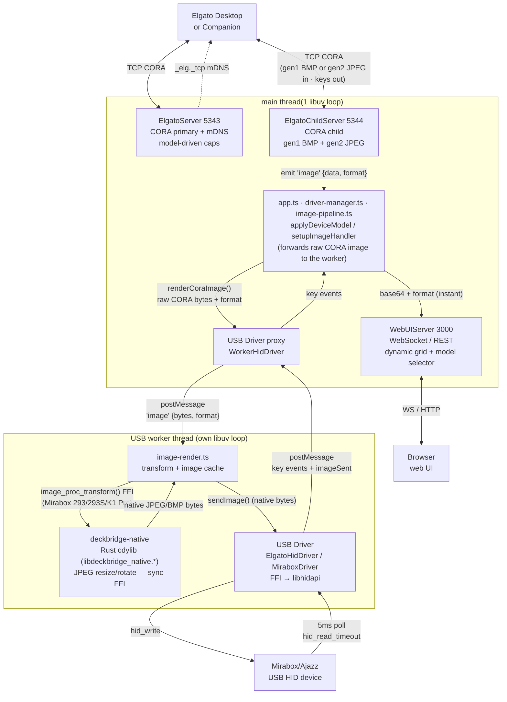
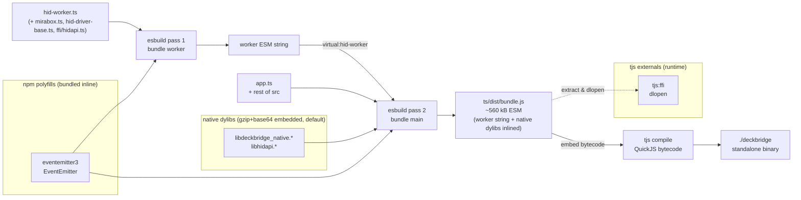
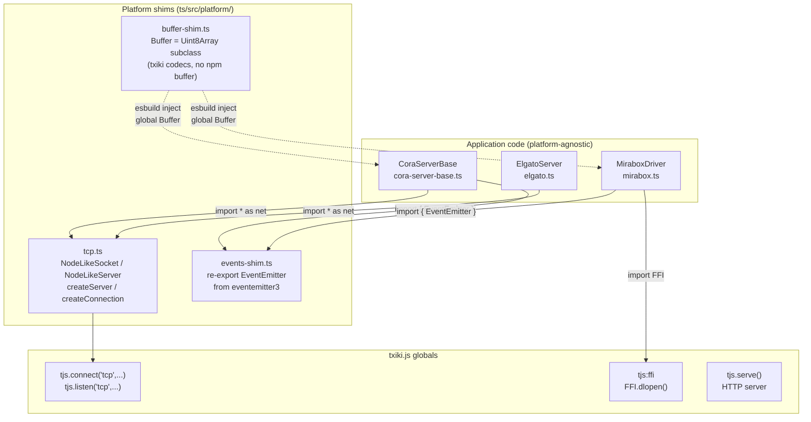
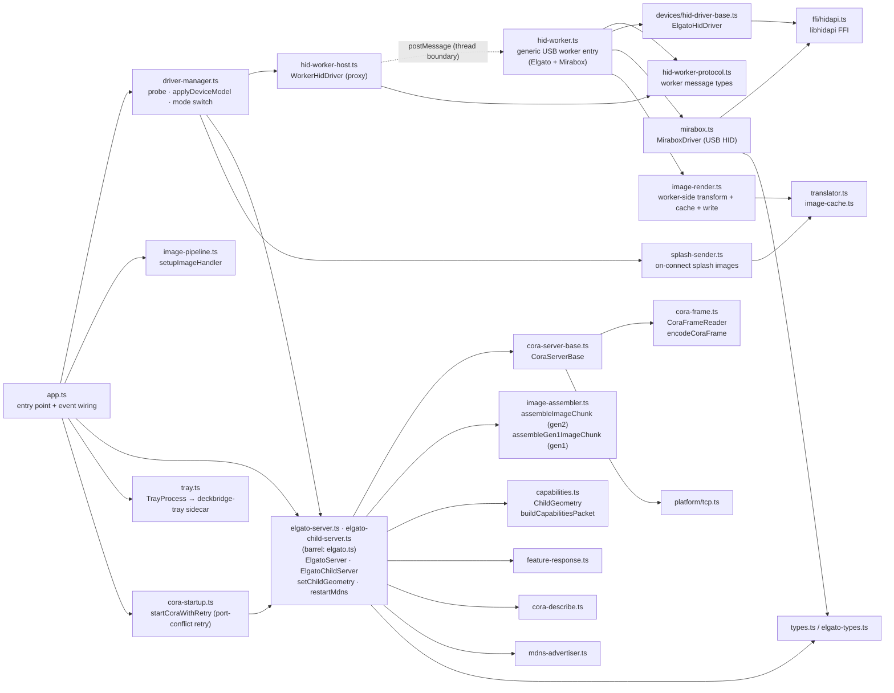

# DeckBridge — architecture & development

Deep technical documentation: build pipeline, threading model, protocol handling, and
module layout. For the user-facing overview see [README.md](README.md); rendered docs at
<https://lukasmega.github.io/DeckBridge/>.

**Runtime:** [txiki.js](https://github.com/saghul/txiki.js) (QuickJS-ng + libuv + libffi)

## Quick start (from source)

```bash
# Prerequisites: libhidapi installed (txiki.js runtime is provided by mise)
mise run start

# Or step by step:
mise run build     # fetch txiki.js (mise) + bundle TS + build Rust sidecars (cdylib + tray)
mise run compile   # produce ./deckbridge binary
./deckbridge
```

## Slim txiki.js runtime (size optimization)

`mise run compile` self-embeds the txiki.js runtime into the final binary, so a
smaller runtime means a smaller `deckbridge`. This app uses only `tjs:ffi`, raw
TCP, and `tjs.serve` (HTTP + WebSocket) — it needs **none** of txiki.js's
`sqlite3` or `WebAssembly`/WASI (WAMR) support, so it ships a **slim** runtime.

By default `$TJS` is provided by mise from the `github:lukasMega/txiki.js` tool
(see [`mise.toml`](mise.toml)) — a **prebuilt slim** runtime with sqlite3 +
wasm/WAMR removed and symbols stripped. No toolchain required for the common path.

The slim runtime is produced from source with
[`patches/txiki-slim.patch`](patches/txiki-slim.patch) — it drops `src/wasm.c`,
`src/mod_sqlite3.c`, the `deps/sqlite3` + WAMR CMake wiring, and the matching
module-init / version-report / include sites (guarded by `#ifndef TJS_SLIM`).
Rebuild it from source only to change the runtime or target a platform without a
prebuilt:

```bash
mise run tjs-build     # apply the slim patch + compile from source
```

**Build dependencies (from-source only):** `cmake` + a C/C++ toolchain (Apple
Clang / GCC), `make`, and `libffi`.

- macOS: `xcode-select --install && brew install cmake libffi`
- Debian/Ubuntu: `sudo apt-get install -y build-essential cmake git libffi-dev`

`scripts/tjs-setup` is the legacy acquisition task (`tjs-download.mjs` /
`tjs-build.mjs`, output under `vendor/`); both scripts no-op when `$TJS` already
exists. Released binaries use the slim runtime.

## Running a packaged release

The standalone `deckbridge` binary is self-contained — simply run:

```bash
./deckbridge
```

**Native library extraction**: Native dylibs (`libdeckbridge_native`, `libhidapi`) are
embedded (gzip+base64) in the binary and auto-extracted to a platform-specific cache directory on
first run:
- **macOS**: `~/Library/Caches/deckbridge/native-<hash>/`
- **Linux**: `${XDG_CACHE_HOME:-~/.cache}/deckbridge/native-<hash>/`

No sidecar `.dylib` or `.so` files are needed.

**System tray**: If a `deckbridge-tray` binary exists as a sidecar next to `deckbridge`, it is
auto-detected and launched. The tray is optional — the app runs with or without it.

## Data flow



### Concurrency model

DeckBridge runs on **two threads**, connected only by `postMessage`:

- **Main thread** — the CORA TCP servers (Elgato primary/child), the WebUI HTTP/WebSocket server,
  and the orchestration that forwards each received CORA image to the worker. It must stay
  responsive: CORA image chunks are **ACK-paced** (Elgato waits for our ACK before sending the
  next), so any stall here throttles image delivery *and* the WebUI previews that ride on it.
- **USB worker thread** — owns the libhidapi handle and does all the **synchronous, blocking** work
  that must never stall the main loop: the JPEG/BMP **transform** (`image-render.ts` →
  `image_proc_transform` FFI, 50–200 ms) plus the LRU **image cache**, then the HID I/O itself
  (`hid_write` for uploads, `hid_read_timeout` for key presses). The main thread hands over raw CORA
  bytes via `WorkerHidDriver.renderCoraImage()`; the worker transforms, caches, and writes — so
  neither the transform nor a large upload ever stalls the CORA ACK loop (P1).

  A single generic worker — `hid-worker.ts`, proxied by `WorkerHidDriver` (`hid-worker-host.ts`) —
  serves every device. Its `createDriver()` factory instantiates `ElgatoHidDriver` (MK.2, Mini) or
  `MiraboxDriver` (Mirabox 293/293S/K1 Pro, from `mirabox.ts`) based on the model's `driverKind`.

This split is what makes a full profile load fast on **both** sides: the main thread receives every
image and pushes it to the browser immediately, while the device updates in parallel on the worker.
USB I/O is the top priority and gets a whole thread to itself; the WebUI is served from the main
thread's spare time. Mock mode stays on the main thread.

To keep image bursts from flooding the WebUI, per-chunk CORA tx/ACK and keepalive log entries are
emitted at `debug` level, and `WebUIServer.notifyComm()` batches live comm entries and broadcasts
them as a single `commBatch` message roughly every 100 ms (`COMM_BROADCAST_FLUSH_MS`) instead of one
WS message per chunk.

### Network exposure

The CORA servers (ports 5343/5344) listen on **all interfaces** (`0.0.0.0`) by default and have
**no authentication** — this is protocol-inherent, the real Elgato Network Dock has none either.
Any host on the LAN can connect, push images to the device, and read key events. To restrict the
listen address, set `DECKBRIDGE_BIND` (e.g. `DECKBRIDGE_BIND=127.0.0.1` or a specific interface IP) before
starting DeckBridge.

To reduce session-stealing, an actively-used CORA connection (one that has sent data within
`CLIENT_EVICTION_GRACE_MS`, default 10 s) cannot be evicted by a new incoming connection — the
newcomer's socket is closed instead. A connection that has gone quiet (e.g. the desktop app
closed) can still be replaced by the next connecting client.

The WebUI (port 3000) is unaffected by `DECKBRIDGE_BIND` and always binds to `127.0.0.1` (localhost-only).

Images arriving over CORA (gen2 JPEG / gen1 BMP) are decoded by `deckbridge-native` with bounded limits —
max 500×500 px and 900 KB of decode allocation — so a malformed/oversized image is rejected with
an error rather than causing large allocations. Real device key images are well under this (≤ ~800
px down to ~80 px depending on model).

Other malformed-input guards on the CORA path: image chunks whose `keyIndex` is out of range for the
advertised geometry are dropped before assembly (so an unauthenticated peer can't grow per-key
assembly buffers with arbitrary indices, and can't repaint key 0 via index coercion); a CORA frame
header that declares a `payloadLength` larger than the receive buffer forces a resync past the bad
header instead of stalling the reader.

### Startup & error handling

The CORA ports (5343/5344) are protocol-fixed and cannot fall back like the WebUI port can. If
either is already in use (a second DeckBridge, a real Elgato Network Dock, or the ESP32 bridge),
`startCoraWithRetry` ([cora-startup.ts](ts/src/cora-startup.ts)) logs a clear "port in use" message
to the console and the WebUI log feed and retries every few seconds, keeping the already-started
WebUI alive instead of crashing mid-startup. A shutdown signal during the wait still exits cleanly.

A global `unhandledrejection` handler (`app.ts`) converts an otherwise-fatal unhandled promise
rejection into a graceful `shutdown()` — running the device disconnect handshake, socket teardown,
and tray kill — rather than letting the runtime hard-abort with no cleanup. (txiki aborts the
process on an un-`preventDefault`'d unhandled rejection, and a synchronous throw inside a timer
callback has no global hook, so the two recurring synchronous timers — CORA keepalive and the WebUI
comm-flush — are additionally wrapped so a throw there can't take the process down.) On shutdown the
spawned `deckbridge-tray` sidecar is sent `SIGTERM` so it does not outlive the main process.

## HID device detection

At startup, `app.ts` constructs a `DriverManager` ([driver-manager.ts](ts/src/driver-manager.ts)) with its dependencies (server, webui, etc.). Its private `probeAndOpen()` iterates `DEVICE_MODELS` in priority order and returns the first device that opens successfully. If no device is found the app retries every 2 s (`RECONNECT_DELAY_MS`).

### Probe order

| Priority | Model | VID | PIDs | Open strategy |
|----------|-------|-----|------|---------------|
| 1 | Stream Deck MK.2 | `0x0fd9` | `0x0080`, `0x006d`, `0x00a5` | VID+PID |
| 2 | Stream Deck Mini | `0x0fd9` | `0x0063`, `0x0090`, `0x00b3`, `0x00b8` | VID+PID |
| 3 | Mirabox 293V3/Ajazz | `0x6603` | `0x1005`, `0x1006`, `0x1010` | usage-page path first, then VID+PID |
| 4 | Mirabox 293S | `0x5548` | `0x6670` | usage-page path first, then VID+PID |
| 5 | Mirabox K1 Pro | `0x6603` | `0x1015`, `0x1019` | usage-page path first, then VID+PID |

Elgato models are probed first (see [registry.ts](ts/src/devices/registry.ts)) so they take priority over Mirabox. The loop is fully generic — every model opens through the same `WorkerHidDriver`. Models whose key indices need remapping (Mirabox 293/293S/K1 Pro, detected by `hasInputKeyMap(model)`) have their wire input codes translated by `deviceInputToMk2Index()` before the key event is forwarded to the CORA child server; Elgato models (empty `keyMap`) pass through unchanged.

### Open strategy per device

`ElgatoHidDriver.open()` ([hid-driver-base.ts](ts/src/devices/hid-driver-base.ts)) and `MiraboxDriver.open()` ([mirabox.ts](ts/src/mirabox.ts)) both try path-based open first, then diverge on the fallback:

1. **Path-based open** — if the model defines `usagePage` + `usage`, calls `findHidPath()` → `deckbridge-native` Rust cdylib → `mirabox_hid_find_path(vid, pid, usagePage, usage)` (Mirabox passes each of its PIDs in turn to disambiguate models that share VID+usage, e.g. K1 Pro vs 293; Elgato passes `pid=0`, matching any product). Opening by path avoids claiming system-owned interfaces on macOS (the OS typically grants the first `hid_open` caller exclusive access to a VID+PID).
2. **VID+PID fallback** — one attempt per PID, no retries. `ElgatoHidDriver` always falls back to `hid_open(VID, PID)` for each PID in `model.usbProductIds` until one succeeds. `MiraboxDriver` only falls back **off macOS**: on macOS a failed path-based open throws immediately instead, because `hid_open(VID, PID)` there opens the device's first IOKit interface (often an unrelated keyboard/consumer collection), and a permission-denied open of it SIGBUSes the whole process — path-based open is the only safe route there.

Only the Mirabox models set `usagePage`/`usage` (all use `0xffa0`/`1`); Elgato models skip step 1.

### libhidapi loading

`loadHidapi()` ([ffi/hidapi.ts](ts/src/ffi/hidapi.ts)) tries a platform-specific candidate list via `FFI.dlopen`. If the `HIDAPI_LIB` env var is set (packaged releases: the extracted embedded lib), it is tried first:

| Platform | Candidates (tried in order, after `HIDAPI_LIB`) |
|----------|-----------------------------|
| macOS | `/opt/homebrew/lib/libhidapi.dylib` (Apple Silicon), `/usr/local/lib/libhidapi.dylib` (Intel), bare `libhidapi.dylib` |
| Linux | `/usr/lib/x86_64-linux-gnu/libhidapi-hidraw.so.0`, `/usr/lib/libhidapi-hidraw.so.0`, bare `libhidapi-hidraw.so.0`, bare `libhidapi.so` |
| Windows | `hidapi.dll`, `C:\Windows\System32\hidapi.dll` |

If all candidates fail, the error includes install instructions (`brew install hidapi` / `sudo apt install libhidapi-dev`).

The handle is shared across the worker session (module-level `_workerHidLib`); `hid_exit()` + `close()` are called on disconnect.

### HID path enumeration

The Rust `deckbridge-native` cdylib ([rust/deckbridge-native/](rust/deckbridge-native/)) is loaded at runtime via the `DECKBRIDGE_NATIVE_LIB` env var. Among its exports is:

```c
int mirabox_hid_find_path(uint16_t vid, uint16_t pid, uint16_t usage_page, uint16_t usage,
                          uint8_t *buf, size_t buf_len);
// pid == 0 matches any product ID. Returns 1 and writes the null-terminated HID path into buf on success, 0 if not found.
```

If `DECKBRIDGE_NATIVE_LIB` is not set the path-based open is skipped entirely and the driver falls straight through to VID+PID.

### Serial and firmware reading

`ElgatoHidDriver.open()` calls `_readDeviceInfo()` after acquiring the device handle. This reads serial (feature report 0x03/0x06) and firmware (0x04/0x05) and stores them in `deviceSerial`/`deviceFirmware`. The worker propagates these to the main thread via the `'opened'` message (`WorkerHidDriver` exposes the same fields). `applyDeviceModel()` in `driver-manager.ts` forwards them to the CORA capabilities packet (only when `model.cora.usePhysicalIdentity` is set) so the Elgato desktop sees the physical device's own serial and firmware version.

### Adding a new device model

1. Create a model file under [ts/src/devices/elgato/](ts/src/devices/elgato/) or [ts/src/devices/mirabox/](ts/src/devices/mirabox/) implementing the `DeviceModel` interface ([driver.ts](ts/src/devices/driver.ts)). Most behavior lives in the nested specs: `image` (`DeviceImageSpec`), `wire` (`DeviceWireSpec`, Mirabox only), `keyMap` (`DeviceKeyMap`), `cora` (`DeviceCoraSpec`), and optional `splash`.
2. Add it to `DEVICE_MODELS` in [registry.ts](ts/src/devices/registry.ts) — list position is probe priority.
3. Set `usagePage` + `usage` only if the device exposes a vendor-specific HID interface that must be selected by usage page (all Mirabox models use `0xffa0`/`1`). Leave them undefined for standard Elgato VID+PID enumeration.
4. Set `driverKind` to select the worker-side driver — `'elgato-hid'` (`ElgatoHidDriver`) or `'mirabox'` (`MiraboxDriver`). `createDriver()` in [hid-worker.ts](ts/src/hid-worker.ts) is the single registration point.
5. If the wire protocol differs from the four existing variants (`elgato-gen1`, `elgato-gen2`, `mirabox-cora`, `mirabox-cora-v1`), add a new `DeviceProtocol` literal to [driver.ts](ts/src/devices/driver.ts). Elgato variants implement pack/parse under [ts/src/devices/protocol/](ts/src/devices/protocol/) (registered in `PROTOCOL_STRATEGY`); Mirabox variants are driven by the `wire` spec fields in `mirabox.ts`.

## CORA device capabilities

The CORA capabilities packet (sent to the Elgato desktop on connect) advertises the child device geometry: rows, columns, key count, image dimensions, PID, product name, and serial.

`applyDeviceModel()` in [driver-manager.ts](ts/src/driver-manager.ts) is the single entry point for any model change. Each model's `cora` spec (`DeviceCoraSpec`) drives it:

1. **PID** — `model.cora.productId`. Elgato models use their real USB PID; Mirabox 293/293S advertise `ELGATO_MK2_PID`; K1 Pro advertises the Mini PID (`0x0063`).
2. **Geometry** — `model.cora.advertiseGeometry ?? modelToChildGeometry(model)`. Mirabox 293/293S pin `MK2_CHILD_GEOMETRY` (advertise as MK.2); K1 Pro pins `MINI_CHILD_GEOMETRY`; Elgato models derive geometry from their own dimensions.
3. **Identity** — when `model.cora.usePhysicalIdentity` is true (Elgato only), the device's real serial/firmware (read by the worker) is patched into the config; Mirabox keeps the default dock identity.

It then applies the change to both CORA servers and the WebUI:

- `resetImagePipeline()` + `webui.resetImages()` — drop the previous model's per-key write queues and
  cached WebUI images so stale keys from a different-sized model don't linger (then broadcast a repaint)
- `server.setDeviceConfig(patch)` — update PID (+ serial/firmware for Elgato)
- `server.setChildGeometry(geo)` + `childServer.setChildGeometry(geo)` — both CORA servers (child reallocates `keyStates`, preserving the overlapping prefix on a live hot-swap)
- `server.restartMdns(pid)` — re-advertise on mDNS with the new PID (skipped when the advertised PID + serial are unchanged, to avoid dns-sd/avahi respawn churn on every unplug/replug)
- `server.pushChildCapabilities()` — push updated caps to any already-connected desktop
- `webui.notifyDeviceModel(...)` — broadcast model state to the browser

`applyDeviceModel` is called on real device connect (with serial/firmware from the worker), on disconnect (resets to `DEFAULT_MODEL` = MK.2), on mock-mode startup, and in response to a WebUI model-selector change.

## WebUI

The web UI is served at `http://localhost:3000`.

### Dynamic grid

The key grid rebuilds automatically when the connected device model changes. `rebuildGrid(keyCount, columns)` sets `grid.style.gridTemplateColumns` dynamically and creates the correct number of key buttons. The initial render is 5×3 (MK.2 defaults); the first `status` WebSocket message (sent immediately on connect) rebuilds to the actual device layout.

| Device | Grid |
|--------|------|
| Stream Deck MK.2 | 5×3 (15 keys) |
| Stream Deck Mini | 3×2 (6 keys) |
| Mirabox 293V3/Ajazz | 5×3 (advertised as MK.2) |
| Mirabox 293S | 5×3 (left 5 of 6 hardware columns; advertised as MK.2) |
| Mirabox K1 Pro | 3×2 (advertised as Mini) |

### Device model selector

A `<select id="model-select">` dropdown lets you switch the advertised device model in **mock mode**. In real mode the selector is visible but disabled **while a physical device is connected** (the device determines the model); with no device connected it stays enabled.

Selecting a model in mock mode:
1. Tears down the current mock driver
2. Creates a new `MockDriver` with the selected model's geometry
3. Calls `applyDeviceModel(model)` — updates CORA caps, mDNS, and the WebUI grid

The dropdown is populated from `/api/state` (`deviceModels` array) on page load. Model changes are POSTed to `POST /api/device-model`.

## System tray

A small Rust sidecar (`deckbridge-tray`, built with the `tray-icon` + `tao` crates) shows a status icon and menu. The
main process spawns it and talks to it over two channels: the tray's **stdout** (lifecycle + menu
events) and a **loopback TCP** connection (icon/status pushes). `ts/src/tray.ts` (`TrayProcess`)
owns the TS side; `app.ts` pushes a `TrayState` on every device/client connect and disconnect.
`TrayProcess.close()` sends the sidecar `SIGTERM` so it doesn't outlive the main process across
shutdowns/restarts.

| Icon | Condition |
|------|-----------|
| green (`full`) | USB device open **and** Elgato client connected |
| yellow (`usb_only`) | USB device open, no Elgato client |
| gray (`disconnected`) | no USB device |

The menu offers **Open Web UI**, **Check Requirements** (the `/requirements` diagnostics page), and
**Quit**. The tray is spawned only when `DECKBRIDGE_TRAY_BIN` points at the binary (`mise run start` sets it);
if it is unset or the spawn fails, `startTray()` returns `null` and the app runs normally. See
[rust/deckbridge-tray/README.md](rust/deckbridge-tray/README.md) for the full protocol.

## Build pipeline

Two esbuild passes (`build.mjs`): the generic USB worker (`hid-worker.ts`) is bundled into a
self-contained ESM **string**, embedded into the main bundle via the virtual module
`virtual:hid-worker`. (The browser-side `ui-entry.ts` subtree is bundled the same way and embedded
as text via the `ui-ts-as-text` plugin.)

Native dylibs (`libdeckbridge_native`, `libhidapi`) are **gzip+base64-encoded** into the
`bundle.js` at build time (enabled by default; set `EMBED_NATIVE_LIBS=0` or pass `--no-embed` to
disable). When embedding is enabled, `ts/dist/bundle.js` is **platform-specific** — it contains
only the native libraries for the target platform. At runtime, embedded dylibs are extracted on
first run to:
- **macOS**: `~/Library/Caches/deckbridge/native-<hash>/`
- **Linux**: `${XDG_CACHE_HOME:-~/.cache}/deckbridge/native-<hash>/`

The env vars `DECKBRIDGE_NATIVE_LIB`, `HIDAPI_LIB` take precedence when already set —
useful in the dev workflow (`mise run build` populates them from the just-built dylibs).



At runtime the worker is started as a **blob-URL module worker**
(`new Worker(URL.createObjectURL(new Blob([src])), { type: 'module' })`). A compiled `tjs` binary
can't load a worker from a disk path or a `data:` URL, but a blob URL works in both `tjs run` and
the compiled binary — so the single-file binary stays self-contained.

## Testing

```bash
mise run test        # bundle + run every ts/test/*.test.ts on the txiki.js runtime
mise run ci-checks   # lint + typecheck + test + knip
```

Tests run on the same QuickJS/txiki.js runtime as the app (not Node). There is **no test
framework**: each `ts/test/*.test.ts` is a standalone script using `tjs:assert`, a local
`test()`/`runTest()` helper with `passed`/`failed` counters, and exits `tjs.exit(failed > 0 ? 1 : 0)`.
The `test` task (`mise.toml`) bundles each file with `node build.mjs --test <name>` and runs
`$TJS run dist/test/<name>.js`. To run a single file:
`node build.mjs --test cora-frame && $TJS run dist/test/cora-frame.js`.

All tests are **hardware-free** (pure logic, fakes, or local TCP/HTTP sockets). Anything needing a
real device lives in the `smoke` task (USB HID, requires a Mirabox) or the `e2e` task (black-box test
of a packaged release zip).

| Test file | Covers |
|---|---|
| `packets.test.ts` | Mirabox packet builders (CRT/BAT/LIG/CLE/STP/CONNECT) + CORA framing encode/decode/reader |
| `cora-frame.test.ts` | `CoraFrameReader` mid-stream resync, multi-frame drain, split-across-append, partial-header retention, receive-buffer overflow trims oldest bytes + logs one `warn`, oversized declared `payloadLength` forces resync (E10) |
| `assembler.test.ts` | `assembleImageChunk` — single/multi-page, independent keys |
| `elgato-child-image-bounds.test.ts` | out-of-range CORA `keyIndex` image chunks dropped before assembly, warn logged once per key (L4) |
| `translator.test.ts` | key-index mapping (incl. out-of-range → `-1`, E2) + `transformImageForDevice` via the Rust sidecar |
| `feature-response.test.ts` | `buildFeatureResponse` / `fwVersionBuf` — every report-id branch + MAC-length guard |
| `device-models.test.ts` | `findModel`, probe order, per-model keyMap permutations, 293S 6th-column drop, `buildCapabilitiesPacket` geometry |
| `image-cache.test.ts` | `hashJpeg` determinism + full-buffer FNV-1a hashing (length prefix + entire buffer; large-buffer cases incl. differing first/last/middle bytes — icon-on-black regression, differing length), `LruCache` eviction/recency, `makeCacheKey` namespacing |
| `image-pipeline.test.ts` | `setupImageHandler` (thin) — synchronous WebUI `notifyImageUpdate` at arrival, then forwards raw CORA bytes via `renderCoraImage`; mock-driver (no `renderCoraImage`) + null-driver safety |
| `image-render.test.ts` | `renderImage` (worker side) — Rust-sidecar transform produces a valid JPEG ≤ maxBytes, cache hit returns identical bytes, key remap, out-of-range key skipped, passthrough/gen1 forwards bytes unchanged |
| `hash-bench.test.ts` | FNV hash benchmark + correctness (fails the build on a hash regression) |
| `driver-manager.test.ts` | `DriverManager` — mock-mode connect/key/reconnect, key-map routing incl. 293S 6th-column drop, `applyDeviceModel`, mode-switch teardown ordering, post-probe state re-check + in-flight guard (E1) |
| `hid-worker-host.test.ts` | `WorkerHidDriver` — failed `open()` keeps the worker alive for reuse instead of terminating (SIGBUS-prone on macOS), a second `open()` reuses the kept worker and rejects the same way, `close()` tears down the worker + revokes the blob URL, `setImageOverride` posts `{type, mode}` |
| `server.test.ts` | primary + child CORA servers over real TCP (keepalive, feature reports, capabilities, key events, image/brightness) + WebUI `POST /api/brightness`; post-start error logged not swallowed (L6); client-takeover does not trigger outbound reconnect (E3); `setChildGeometry` always reallocates `keyStates` preserving prefix (E4); `startCoraWithRetry` port-conflict retry + shutdown bail (H3) |
| `pairing.test.ts` | full MK.2 pairing handshake (primary + child, short + full probe → operational) |
| `mirabox-parse.test.ts` | `parseAckReport` — K1 Pro (reportId 0x04) vs 293 (0x00) offsets, non-ACK banner rejection |
| `k1pro-chunk-pad.test.ts` | `padChunkBoundaries` — sacrificial-byte wire encoding vs the K1 Pro drop-last-byte-per-chunk firmware bug (layout + round-trip) |
| `k1pro-probe-layout.test.ts` | not an assertion test — reproduces the K1 Pro JPEG COM-padding probe variants byte-for-byte and writes them to `/tmp/k1pro-probe` for offline boundary analysis |
| `splash-size.test.ts` | not an assertion test — measures encoded K1 Pro splash JPEG sizes per state (connecting/connected/error) × `maxBytes` (0/1600) and writes samples to `/tmp/k1pro-splash` |
| `tray.test.ts` | tray-launcher path helpers (`parentDir`, `isAbsolutePath`) + child-process `kill('SIGTERM')` termination (L1) |
| `web-ui-server.test.ts` | `isValidMacAddress` input validation, `pickFallbackPort` range, `Broadcaster.size` open/close/error tracking, `applyMockConfig` `NaN` PID rejected (V4), `resetImages()` clears image maps (L3) |
| `mdns-advertiser.test.ts` | `buildArgs` per-platform (Linux avahi / macOS+Windows dns-sd / empty-platform default), `platformName()` no-throw guard (E9) |
| `native-libs.test.ts` | `envVarFor` lib→env-var mapping, `gunzip(b64ToBytes(...))` roundtrip, `extractLibs` (correct content, 0o755 mode, idempotent size-check skip, wrong-size file re-extracted), `cleanupOldHashDirs` removes stale `native-*` dirs while keeping the current one |
| `key-preview.test.ts` | shared web preview: `imageSrc` MIME/URL selection, image store apply/clear |
| `buffer-shim.test.ts` | hand-rolled `Buffer` shim (Uint8Array subclass): alloc/from/concat, copy, view-`slice`, byte + subsequence `indexOf`, LE/BE int read/writes, `write`, utf8/ascii/hex/base64 `toString` + round-trips, unsupported-encoding throws |

### Coverage

```bash
mise run coverage    # instrument, run all tests, emit merged report
```

`mise run coverage` runs the full tjs test suite under **Istanbul source instrumentation**.
Instrumentation is engine-agnostic (it rewrites JS to increment counters on a plain
`globalThis.__coverage__` object), so the tests run on the real **txiki.js/QuickJS-ng**
runtime — not Node or vitest, which cannot host the FFI, socket, and worker-thread tests.

Each test process flushes its coverage map to `ts/coverage/.tmp/<name>.json` on exit.
`scripts/coverage-report.mjs` (Node) then merges all maps via the Istanbul libraries and
writes the report artefacts to `ts/coverage/`:

- text summary printed to stdout
- `coverage/index.html` (and the browsable `coverage/lcov-report/`) — line-level HTML report
- `coverage/lcov.info` — LCOV data for editor integrations and CI

The task builds the Rust dylib first (via `depends = ["deckbridge-native"]`) so the
FFI-touching tests (`translator`, `image-render`, `device-models`, `packets`) execute
for real and their code paths register as covered.

Set `COVERAGE_ENFORCE=1` to fail the report step when coverage falls below the configured
thresholds (off by default; `mise run test` remains the fast, threshold-free default).

## Platform abstraction layer



## Module map



## Directory layout

```
deckbridge/
├── mise.toml           ← task runner (build, compile, run, typecheck, test)
├── docs-site/          ← Docusaurus documentation site (npm; mermaid→SVG, local search)
├── ts/
│   ├── build.mjs       ← esbuild config (also bundles tests via --test <name>)
│   ├── tsconfig.json
│   ├── package.json    ← dev deps: esbuild, typescript/tsgo (@typescript/native-preview), eventemitter3, preact, lint/coverage tooling (oxlint/eslint, istanbul, knip)
│   ├── test/           ← *.test.ts suite (run on the txiki.js runtime; see "Testing")
│   ├── src/
│   │   ├── app.ts                  ← entry point (main thread): construct servers, wire events, signals
│   │   ├── driver-manager.ts       ← probe/open, applyDeviceModel, real⇄mock mode switch, reconnect
│   │   ├── image-pipeline.ts       ← setupImageHandler (main): CORA image → WebUI base64 + forward raw bytes to worker
│   │   ├── image-render.ts         ← worker-side: transform (deckbridge-native FFI) + LRU cache + sendImage to device
│   │   ├── splash-sender.ts        ← on-connect splash images (checkmark / connected)
│   │   ├── logger.ts               ← leveled logger (console + WebUI + worker fan-out)
│   │   ├── hid-worker-host.ts      ← WorkerHidDriver: main-thread proxy to the USB worker
│   │   ├── hid-worker.ts           ← generic USB worker entry — createDriver() (Elgato + Mirabox)
│   │   ├── hid-worker-protocol.ts  ← main↔worker message types
│   │   ├── mirabox.ts              ← Mirabox USB HID driver (FFI), instantiated by hid-worker.ts
│   │   ├── tray.ts                 ← TrayProcess: spawns deckbridge-tray, stdout events + TCP state push
│   │   ├── translator.ts          ← key-index mapping + transformImageForDevice() via deckbridge-native FFI
│   │   ├── image-cache.ts         ← LRU cache (full-buffer FNV-1a: length + whole buffer) to skip redundant FFI calls
│   │   ├── elgato.ts              ← barrel re-exporting ElgatoServer / ElgatoChildServer
│   │   ├── elgato-server.ts       ← ElgatoServer (CORA primary, port 5343) + DeviceConfig
│   │   ├── elgato-child-server.ts ← ElgatoChildServer (CORA child, port 5344); gen1 BMP + gen2 JPEG
│   │   ├── cora-server-base.ts    ← abstract TCP/CORA server
│   │   ├── cora-startup.ts        ← startCoraWithRetry: retry CORA bind on port conflict + shutdown bail
│   │   ├── cora-frame.ts          ← CORA binary framing
│   │   ├── cora-describe.ts       ← protocol debug descriptions
│   │   ├── capabilities.ts        ← ChildGeometry · buildCapabilitiesPacket · MK2/MINI_CHILD_GEOMETRY
│   │   ├── comm-format.ts         ← hex formatting for the comm-log wire trace (formatCommHex)
│   │   ├── feature-response.ts    ← GET_REPORT response builder
│   │   ├── image-assembler.ts     ← assembleImageChunk (gen2 JPEG) · assembleGen1ImageChunk (gen1 BMP)
│   │   ├── native-libs.ts         ← extracts embedded native dylibs to a per-version cache dir, sets DECKBRIDGE_NATIVE_LIB/HIDAPI_LIB
│   │   ├── mdns-advertiser.ts     ← mDNS advertiser (spawns dns-sd / avahi-publish)
│   │   ├── types.ts               ← shared constants + interfaces (GEN1_* constants, ImageEvent)
│   │   ├── elgato-types.ts        ← DeviceConfig interface
│   │   ├── mirabox-smoke.ts       ← USB smoke-test entry (mise run smoke)
│   │   ├── k1pro-probe.ts         ← K1 Pro JPEG size-threshold probe entry (mise run k1pro-probe)
│   │   ├── tjs.d.ts / globals.d.ts ← ambient type declarations (txiki.js, Buffer global)
│   │   ├── assets/                ← splash source JPEGs (checkmark / connected) as TS modules
│   │   ├── ffi/
│   │   │   ├── hidapi.ts          ← libhidapi dlopen bindings
│   │   │   └── image-proc.ts      ← libdeckbridge_native dlopen bindings (DECKBRIDGE_NATIVE_LIB)
│   │   ├── devices/
│   │   │   ├── driver.ts          ← DeviceModel + nested specs (image/wire/keyMap/cora/splash) + DeviceProtocol
│   │   │   ├── registry.ts        ← DEVICE_MODELS list (probe order) + findModel
│   │   │   ├── hid-connection.ts  ← HidDeviceBase: shared libhidapi plumbing (per-worker lib singleton, device handle, poll read loop, write, cleanup) — base of ElgatoHidDriver + MiraboxDriver
│   │   │   ├── hid-driver-base.ts ← ElgatoHidDriver base (open/close/read/write + _readDeviceInfo)
│   │   │   ├── mock.ts            ← MockDriver (mock mode)
│   │   │   ├── elgato/            ← mk2.ts, mini.ts
│   │   │   ├── mirabox/           ← mirabox-293.ts, mirabox-293s.ts, mirabox-k1pro.ts
│   │   │   └── protocol/          ← elgato-gen1.ts, elgato-gen2.ts, index.ts (PROTOCOL_STRATEGY)
│   │   ├── platform/
│   │   │   ├── tcp.ts             ← tjs.connect/listen → Node-net API
│   │   │   ├── buffer-shim.ts     ← Buffer as a Uint8Array subclass (no npm buffer)
│   │   │   └── events-shim.ts     ← re-exports EventEmitter from eventemitter3
│   │   └── web/
│   │       ├── server/           ← WebUIServer: web-ui-server.ts, http.ts, router.ts, routes.ts,
│   │       │                        broadcaster.ts, assets.ts, requirements.ts, types.ts, index.ts (barrel)
│   │       └── client/           ← browser modules: ui-entry.ts + ui-*.ts, key-preview.ts,
│   │                                ui.html, requirements.html, ui-*.css, ui.js (stub swapped at build)
│   └── dist/
│       ├── bundle.js              ← esbuild output (~560 kB, worker + native dylibs inlined)
│       └── hid-worker.js          ← bundled worker (also embedded in bundle.js; kept for debugging)
├── rust/
│   ├── deckbridge-native/             ← JPEG resize/rotate + HID path enumeration cdylib (in-process FFI,
│   │   │                           loaded via DECKBRIDGE_NATIVE_LIB)
│   │   ├── Cargo.toml           ← encoder backend features: jpeg-upstream (default) / jpeg-fork;
│   │   │                           HID enumeration behind `usb` feature
│   │   └── src/lib.rs
│   ├── jpeg-encoder/            ← vendored jpeg-encoder 0.6.1 fork (optimized Huffman kept
│   │   │                           interleaved); opt-in via JPEG_FORK=1 mise run build
│   │   └── src/
│   └── deckbridge-tray/               ← system-tray sidecar binary (Rust; tray-icon + tao crates)
│       └── src/main.rs
```

## Implementation phases

| Phase | Status | Description |
|-------|--------|-------------|
| 1 | ✅ | Scaffold + esbuild pipeline |
| 2 | ✅ | Pure-logic modules (Buffer polyfill, EventEmitter) |
| 3 | ✅ | Platform TCP wrapper (`tjs.connect`/`tjs.listen`) |
| 4 | ✅ | HID transport via `tjs:ffi` → libhidapi |
| 5 | ✅ | Rust deckbridge-native cdylib (in-process FFI via `DECKBRIDGE_NATIVE_LIB`) |
| 6 | ✅ | mDNS advertiser (`dns-sd`/`avahi` subprocess) |
| 7 | ✅ | Web server (WS + REST) |
| 8 | ✅ | Main entry point (wire all phases) |
| 9 | ✅ | Tests |
| 10 | ✅ | Standalone binary (`tjs compile`) |
| 11 | ✅ | USB worker thread — `hid_write`/`hid_read` off the main loop (fast WebUI **and** fast device) |
| 12 | ✅ | Elgato USB device support — MK.2 + Mini direct USB; HID worker; model registry |
| 13 | ✅ | Gen1 CORA image support — BMP chunks (Mini); `ImageEvent.data`+`format`; format-aware WebUI MIME |
| 14 | ✅ | Model-driven CORA capabilities — `ChildGeometry`; dynamic PID/serial/firmware; `applyDeviceModel` |
| 15 | ✅ | WebUI dynamic grid + device model selector — `rebuildGrid()`; mock-mode dropdown |
| 16 | ✅ | System tray sidecar (Rust `deckbridge-tray`) + `/requirements` page — status icon + menu over stdout/TCP |
| 17 | ✅ | Main-thread refactor — split `app.ts` into `driver-manager.ts` + `image-pipeline.ts` + `logger.ts`; generic `hid-worker.ts` (`createDriver`) replaces the per-vendor worker |
| 18 | ✅ | Multi-model Mirabox support — 293V3, 293S (`mirabox-cora-v1`, 512-byte packets), K1 Pro (report 0x04, `chunkPadByte`); nested `DeviceModel` specs + `PROTOCOL_STRATEGY` |
| 19 | ✅ | On-connect splash screens (`splash-sender.ts`) + slim from-source txiki.js runtime |
| 20 | ✅ | Robustness audit (Phase 0/1) — probe-state re-check + in-flight guard (E1), CORA keyIndex/payload bounds (L4/E2/E10), global `unhandledrejection` → graceful shutdown (H1), tray `SIGTERM` (L1), socket close-callback deferral (E3), `keyStates` resize (E4), worker message serialization (E5), WebUI image-map reset (L3), CORA port-conflict retry (H3), mDNS churn/NaN-PID/platform guards (V4/E9/L5) |
