# Device artwork

```
Date:   2026-09-11
Scope:  Vector illustrations + reference photos for every supported device
Status: Complete — 16/16 SVGs, 48 verified reference photos across 12 product families
```

Preview sheet for the device artwork.

- **SVGs** in `docs/img/devices/` are **original vector illustrations**, generated by
  `ts/scripts/gen-device-svgs.mjs` so the whole set shares one layout engine — identical
  key-face recipe, recess treatment, stand language and label typography. Only the grid
  shape, key pitch, chassis tone, accent hue, wordmark placement and stand type change.
- **Photos** are vendor/eshop product shots used as drawing references. They live in
  `.cache/device-photos/` (gitignored) and are re-fetchable with
  `.cache/device-photos/fetch.sh`.

```bash
node ts/scripts/gen-device-svgs.mjs           # write the SVGs
node ts/scripts/gen-device-svgs.mjs --check   # fail if any file is out of date
.cache/device-photos/fetch.sh                 # re-download the 48 reference photos
```

## Licensing

| Asset | Status |
|---|---|
| `docs/img/devices/*.svg` | Original work, drawn from scratch. Safe to commit and ship in the docs site. |
| `.cache/device-photos/**` | **Copyrighted** vendor and eshop product photography. Reference only — gitignored, not committed, not published. The tables below record every source URL so anything needed later can be re-fetched or properly licensed. |

## Style recipe

| Element | Treatment |
|---|---|
| Chassis | rounded rect, top→bottom gradient, 10% white hairline edge; `rx` 18 (Elgato slab) / 14 (typical) / 10 (Mirabox 293V3's squarer alloy plate) |
| Key panel | inset recess at 22% black, 7 px inside the bezel |
| Key face | 62 px, `rx=9`, dark edge ring + gradient face + gloss overlay + 7% white inner stroke |
| Lit keys | ~1/3 of faces, tinted with the brand accent at a deterministic per-key opacity |
| Key pitch | per-device gap ratio traced from photos: Fifine 0.19, Elgato 0.22, Mirabox 293S 0.24, Ajazz/rebadges 0.30, Mirabox 293V3 0.32, K1 Pro 0.38 |
| Status strip | 38 px flush LCD window, 3 zones with hairline dividers — **no keycap bevel** (see finding below) |
| Knobs | 21 px circles, chassis-tone gradient, accent indicator tick at 12 o'clock |
| Stand | `wedge` (detachable cradle) · `integrated` (one-piece flare) · `bracket` (folding easel) · `none` |
| Labels | brand wordmark in its real position (top / top-left / bottom / bottom-right), grid caption on the free edge of the same band |
| Underglow | accent light bar along the base — Fifine D6 only |

Colorways: `graphite` (Elgato), `black` (Mirabox, Mars Gaming, Mad Dog), `ink`
(Ajazz, Fifine, Rise Mode, TMICE), `white` (the AKP153R light colorway).

## Findings from the photo research

Three things the research turned up that changed the drawings — and one that touches the
driver model, not just the artwork:

1. **The 6th column is a display, not keys.** On the Mirabox 293S *and* all six v1
   rebadges, the right-hand column is a single continuous, flush LCD strip split into
   three status zones (CPU / temperature / clock / weather). It is not pressable and has
   no keycaps. DeckBridge exposes those three zones as extra key ids 16/17/18
   (`ts/src/devices/driver.ts`) — which is fine as a wire-id namespace, but the hardware
   has no switches there. Worth confirming against a real unit before anyone relies on
   press events from those ids.
2. **Mirabox K1 Pro is a keyboard.** It is an 87-key TKL mechanical keyboard with the
   Stream Dock module (3 knobs + 3×2 LCD keys) built into its top-right corner, not a
   standalone puck. The standalone 6-key + 3-knob unit in Mirabox's line is the **N3**.
   The illustration draws the deck module only, to keep the set consistent.
3. **Chassis families split three ways on the stand.** Mad Dog GK150K and the Ajazz
   AKP153 family use a detachable wedge cradle; Mars Gaming, Rise Mode, TMICE and the
   Fifine D6 are one-piece molded wedges; the Mirabox 293V3 uses a folding 5-position
   easel bracket; the Elgato Mini's wedge is integral while the MK.2's is detachable.

> **Grid caveat.** The key grids always mirror `ts/src/devices/registry.ts` — what
> DeckBridge actually drives. The Ajazz rev. 2 boards are registered as plain 15-key
> devices, so they are drawn without the status strip even though the retail AKP153E/R
> chassis has one.

## Illustrations

### Elgato

| | |
|---|---|
| **Stream Deck MK.2** — 15 keys (5×3)<br />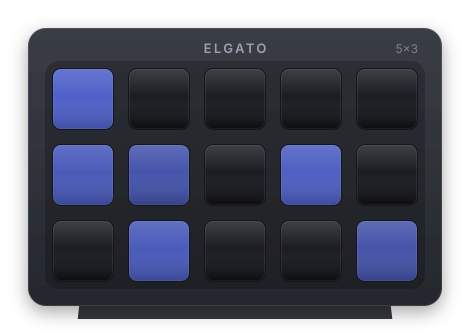 | **Stream Deck Mini** — 6 keys (3×2)<br />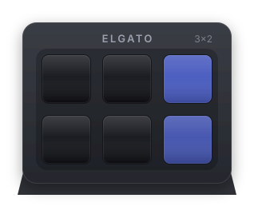 |

### Mirabox

| | |
|---|---|
| **Mirabox 293V3** — 15 keys (5×3)<br />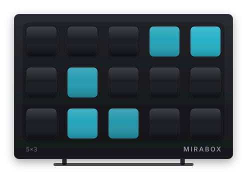 | **Mirabox 293S** — 15 keys + 3-zone strip<br />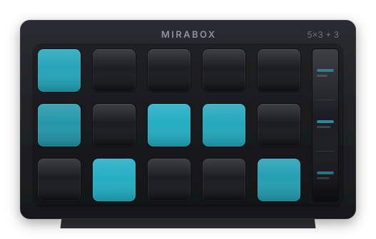 |
| **Mirabox K1 Pro** — 6 keys (3×2) + 3 encoders<br />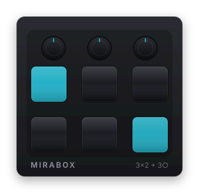 | |

### Ajazz

| | |
|---|---|
| **AKP153E (rev. 2)** — 15 keys (5×3)<br />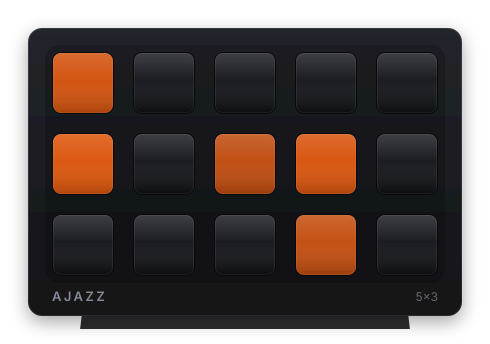 | **AKP153R (rev. 2)** — 15 keys, white<br />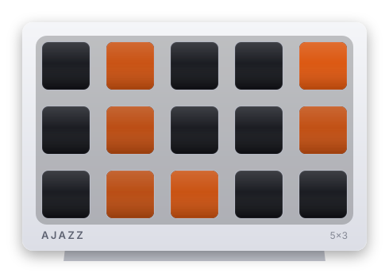 |
| **AKP153** — 15 keys + strip<br />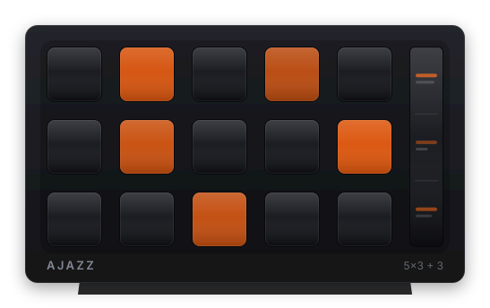 | **AKP153E (rev. 1)** — 15 keys + strip<br />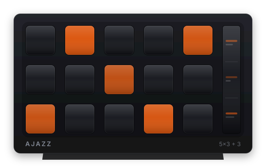 |
| **AKP153R (rev. 1)** — 15 keys + strip, white<br />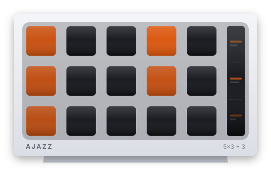 | |

### Fifine

| | |
|---|---|
| **AmpliGame D6** — 15 keys (5×3)<br />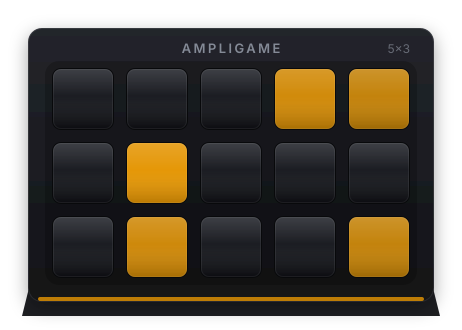 | **AmpliGame D6 (rev. 2)** — 15 keys (5×3)<br />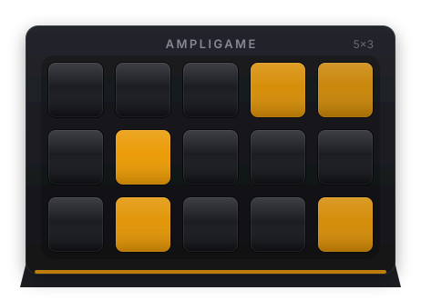 |

### v1 rebadges

| | |
|---|---|
| **Mars Gaming MSD-ONE**<br />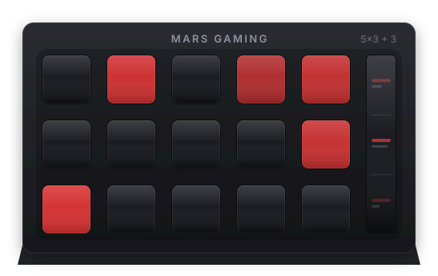 | **Mad Dog GK150K**<br />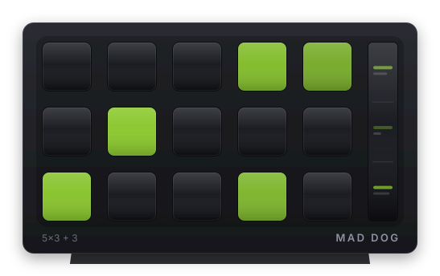 |
| **Rise Mode Vision 01**<br />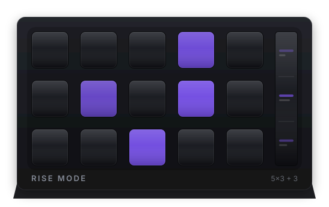 | **TMICE Stream Controller**<br />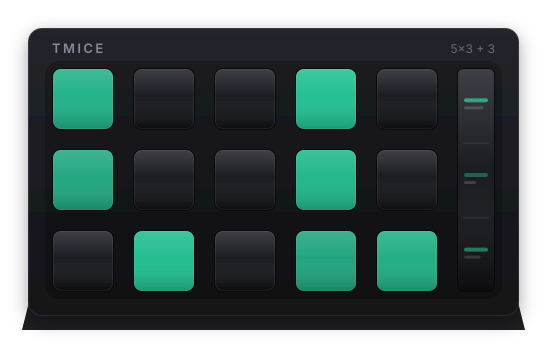 |

## Reference photos

All URLs below were verified to return HTTP 200 with an image content type at the time of
research (2026-09-11) and are mirrored in `.cache/device-photos/<dir>/`.

### Registry model → photo set

Several registry models are revisions or regional SKUs of one physical product and share
photography:

| Registry model | Photo set |
|---|---|
| `mk2` | `mk2/` |
| `mini` | `mini/` |
| `mirabox-293` | `mirabox-293/` |
| `mirabox-293s` | `mirabox-293s/` |
| `mirabox-k1pro` | `mirabox-k1pro/` (deck module is the top-right corner of the keyboard) |
| `ajazz-akp153e-rev2`, `ajazz-akp153r-rev2` | `ajazz-akp153e/` — same chassis, USB IDs differ |
| `ajazz-akp153`, `ajazz-akp153e`, `ajazz-akp153r` | `ajazz-akp153/` + `ajazz-akp153e/` |
| `fifine-d6`, `fifine-d6-rev2` | `fifine-d6/` — revisions are externally identical |
| `mars-msd-one` | `mars-msd-one/` |
| `maddog-gk150k` | `maddog-gk150k/` |
| `risemode-vision-01` | `risemode-vision-01/` |
| `tmice-stream-controller` | `tmice-stream-controller/` |

**No distinct photography exists for the AKP153R.** It is a regional SKU of the AKP153 —
identical chassis, different USB IDs. Both black and white colorways shipped under all
three AKP153 SKUs.

### Elgato Stream Deck MK.2 — `elgato.com` (official CDN)

| File | Shot | Source |
|---|---|---|
| `hero-black.jpg` | 3/4 front-left in wedge stand, keys lit | [cloudinary](https://res.cloudinary.com/elgato-pwa/image/upload/v1679475550/Products/10GBA9901/above-the-fold/desktop/mk.2-black-01_seyirh.jpg) · [page](https://www.elgato.com/us/en/p/stream-deck-mk2-black) |
| `hero-white.jpg` | Same pose, ice colorway | [cloudinary](https://res.cloudinary.com/elgato-pwa/image/upload/v1679475637/Products/10GBA9911/above-the-fold/desktop/mk.2-white-01_vzth4y.jpg) · [page](https://www.elgato.com/us/en/p/stream-deck-mk2-white) |
| `in-the-box.png` | Flat-lay, unit out of the cradle, unlit keys — best proportion reference | [cloudinary](https://res.cloudinary.com/elgato-pwa/image/upload/f_auto/q_auto/v1757598042/Products/10GBA9901/In%20The%20Box/Stream_Deck_MK2_Black_In_The_Box_New.png) |
| `desk-rear.jpg` | Rear-3/4 on desk, cable exit | [cloudinary](https://res.cloudinary.com/elgato-pwa/image/upload/v1676211190/Products/10GBA9901/above-the-fold/desktop/mk.2-black-abf-desktop-02_oqbdpl.jpg) |

Design notes: ~118×84×25 mm soft-touch slab, removable faceplate. Asymmetric bezel — thick
top band (~18% of face height) carrying an Elgato glyph + `STREAM DECK`, thin sides and
bottom. Detachable hollow wedge cradle, fixed ~55° tilt, open at the back. USB-C centred on
the rear. No knobs or side buttons.

### Elgato Stream Deck Mini — `elgato.com` (official CDN)

| File | Shot | Source |
|---|---|---|
| `hero.jpg` | Current hero, 3/4 front-left, keys lit | [cloudinary](https://res.cloudinary.com/elgato-pwa/image/upload/v1747742495/Products/10GAI9901/above-the-fold/NEW/Stream-Deck-Mini-ATF-01.jpg) · [page](https://www.elgato.com/us/en/p/stream-deck-mini) |
| `hero-old.jpg` | Prior hero, same pose | [cloudinary](https://res.cloudinary.com/elgato-pwa/image/upload/v1679564457/Products/10GAI9901/above-the-fold/desktop/sd-mini-01_xwmagf.jpg) |
| `in-the-box.png` | Flat-lay — clearest view of the one-piece base and rear cable exit | [cloudinary](https://res.cloudinary.com/elgato-pwa/image/upload/f_auto/q_auto/v1774253621/Products/10GAI9901/In%20The%20Box/Stream_Deck_Mini_In_The_Box_v2.png) |
| `desk-front.jpg` | Near-front on a dark desk, keys legible | [cloudinary](https://res.cloudinary.com/elgato-pwa/image/upload/v1747742493/Products/10GAI9901/above-the-fold/NEW/Stream-Deck-Mini-ATF-03.jpg) |

Design notes: matte black only. Body and wedge base are **one continuous molding** — no
removable cradle, no faceplate. Same asymmetric bezel language as the MK.2, proportionally
more prominent top band. 3×2 keys at the same size/pitch as MK.2 keys. USB-C at the rear,
offset left.

### Mirabox 293V3 / HSV293SV3 — `mirabox.net` (official)

| File | Shot | Source |
|---|---|---|
| `hero.jpg` | 3/4 front-left on the folding bracket, keys lit | [cdn](https://cdn.shopify.com/s/files/1/0369/7721/3576/files/293V3-_1700-3.jpg) · [page](https://mirabox.net/products/mirabox-stream-controller-deck-293-v3) |
| `packing-list.jpg` | Device alone, bracket removed, **unlit keys** | [cdn](https://cdn.shopify.com/s/files/1/0369/7721/3576/files/293-V3-EN-1700-9.jpg) |
| `tilt-positions.jpg` | Five side-profile silhouettes, every tilt incl. flat | [cdn](https://cdn.shopify.com/s/files/1/0369/7721/3576/files/293-V3-EN-1700-10.jpg) |
| `spec-infographic.jpg` | Caliper dimensions + "Aluminum Alloy Panel (Anodizing)" callout | [cdn](https://cdn.shopify.com/s/files/1/0369/7721/3576/files/293_a0f063c3-f405-4328-aa1a-6c304dd4d69e.jpg) |

Design notes: matte anodized aluminum front plate, black plastic rear shell. Squarer
plate (~3–4 mm radius), near-uniform bezel, **no top branding band** — circular MiraBox
mark bottom-right. Keys are raised transparent caps standing proud of the plate over a
single continuous LCD; key area ~115×60 mm, gap ~0.3–0.35× key width. Detachable folding
bracket with 5 notch positions including flat. USB-C rear, upper-left.

### Mirabox 293S — `mirabox.net` (official)

| File | Shot | Source |
|---|---|---|
| `hero.jpg` | Clean white-background angled hero on the wedge stand | [cdn](https://mirabox.net/cdn/shop/files/01_1500x1500_f14b5e23-8733-4b53-be48-84aee79ca509.jpg) · [page](https://mirabox.net/products/mirabox-293s) |
| `three-views.jpg` | **Best engineering reference** — front, rear (USB-C + stand mount), side (detachable bracket) | [cdn](https://mirabox.net/cdn/shop/files/QW-293s-1600x1600-8black.jpg) |
| `angled-lit.jpg` | Front-right, keys lit, status strip showing memo/CPU/net tiles | [cdn](https://mirabox.net/cdn/shop/files/QW-293s-1600x1600-1black.jpg) |
| `front-on.jpg` | Front-on — clearest view of the strip segmentation | [cdn](https://mirabox.net/cdn/shop/files/QW-293s-1600x1600-3black.jpg) |

Design notes: matte black flat slab, 132×80×25 mm, 148 g bare / 200 g with stand. 6×3
tiles: columns 1–5 are glossy square keycaps in recessed wells (gap ~0.2–0.25× pitch);
column 6 is a narrow portrait status strip. `MiraBox®` wordmark centred on the top bezel.
Separate detachable wedge bracket with a large oval cutout doubling as a cable
pass-through. USB-C centred on the rear.

### Ajazz AKP153 / AKP153E / AKP153R — `ajazzbrand.com`, `attackshark.com`

| File | Shot | Source |
|---|---|---|
| `ajazz-akp153/hero-white.jpg` | **Best hero** — white unit 3/4 on the detachable wedge, full grid + strip | [cdn](https://cdn.shopify.com/s/files/1/0823/5050/6282/files/1_62edf2a1-9020-40e3-b408-8e582a5fe83e.jpg?v=1712582671) · [page](https://attackshark.com/products/ajazz-akp153-stream-deck) |
| `ajazz-akp153/side-screen-macro.jpg` | Macro of the right column — one continuous flush LCD, 3 zones | [cdn](https://cdn.shopify.com/s/files/1/0823/5050/6282/files/3_ca8e5f5f-7320-4514-8978-dd8f1be571cc.jpg?v=1712582668) |
| `ajazz-akp153/catalog.jpg` | Catalogue hero | [cdn](https://cdn.shopify.com/s/files/1/0823/5050/6282/files/AKP153.jpg?v=1712557588) |
| `ajazz-akp153/feature.jpg` | Feature panel | [cdn](https://cdn.shopify.com/s/files/1/0823/5050/6282/files/2_4b8b6d37-91e7-42c2-86f6-672c83bd29fe.jpg?v=1712582669) |
| `ajazz-akp153e/hero.jpg` | White angled + black flat, both colorways | [cdn](https://cdn.shopify.com/s/files/1/0704/7210/6227/files/AKP153E.jpg?v=1772158720) · [page](https://ajazzbrand.com/products/ajazz-akp153-desk-controller) |
| `ajazz-akp153e/pair.jpg` | Black + white pair 3/4, USB-C visible on the left flank | [cdn](https://cdn.shopify.com/s/files/1/0704/7210/6227/files/1_05acd579-c97d-4369-b26d-41c6fe8907c6.jpg?v=1772158720) |
| `ajazz-akp153e/feature.jpg` | Feature panel | [cdn](https://cdn.shopify.com/s/files/1/0704/7210/6227/files/1.2.jpg?v=1772158720) |

Design notes: flat slab, ~10 mm thick, chamfered top edge, matte white or black. 15 glossy
domed caps with a dark collar, ~15% corner radius, gap ~0.28–0.32× key width; column 6 is
a flush 3-zone LCD at roughly the same gutter. Bezel is slim on three sides, **taller at the
bottom** to carry the `AJAZZ` wordmark + triangular glyph. Detachable 40° wedge with a
triangular side cutout. USB-C on the left/rear edge, colour-matched braided cable. No
encoders. The `ajazzbrand.com` AKP153E page reuses AKP153 photography — one of its own
title cards reads "AKP153 Studio Controller", confirming a single physical product.

### Mirabox K1 Pro — `mirabox.net` (official), `shine-tone.com` (reseller)

| File | Shot | Source |
|---|---|---|
| `hero.jpg` | Keyboard hero | [cdn](https://cdn.shopify.com/s/files/1/0369/7721/3576/files/A09.jpg?v=1778230614) · [page](https://mirabox.net/products/mirabox-k1-pro-mechanical-ai-keyboard-with-stream-deck) |
| `deck-module.jpg` | **Best reference** — angled close-up of the top-right corner: 3 knobs + 3×2 LCD panel | [cdn](https://cdn.shopify.com/s/files/1/0369/7721/3576/files/LCDAIKeyboard_K1Pro_B10.jpg?v=1754537775) |
| `black-main.jpg` | Black variant, main product shot | [cdn](https://cdn.shopify.com/s/files/1/0369/7721/3576/files/LCDAIKeyboard_K1Pro_B9.jpg?v=1754537775) |
| `topdown-white.jpg` | Flat top-down + bottom-down, white variant — ideal tracing reference | [shine-tone](https://shine-tone.com/cdn/shop/files/A06.jpg?v=1751889091&width=1946) |

Design notes: 386×143×38 mm TKL tray case, matte black or white, 850 g. The deck module
runs down the right side: a trough of **3 knurled aluminum knobs**, then a recessed
3×2 LCD key island (transparent glossy caps, gap ≈ 0.35–0.4× key width), then a status LED
strip and the arrow cluster. USB-C on the rear edge behind the knob trough. Flip-out feet,
no detachable stand, no logo on the deck module. Standalone equivalent: the **MiraBox N3**
(`https://mirabox.net/products/mirabox-n3`).

### Fifine AmpliGame D6 — `fifinemicrophone.com` (official)

| File | Shot | Source |
|---|---|---|
| `front.png` | Black, 3/4 top-front hero, keys lit, RGB underglow | [cdn](https://fifinemicrophone.com/cdn/shop/files/FIFINE-ampligame-D6-stream-controller-black-front-view.png) · [page](https://fifinemicrophone.com/products/fifine-ampligame-d6-stream-deck) |
| `back.png` | Rear 3/4 — fifine logo on the riser, USB-C + RGB button, wedge foot | [cdn](https://fifinemicrophone.com/cdn/shop/files/FIFINE-ampligame-D6-stream-controller-black-back-view.png) |
| `left-side.png` | Steep left iso — wedge slope + perimeter RGB strip | [cdn](https://fifinemicrophone.com/cdn/shop/files/FIFINE-ampligame-D6-stream-controller-black-left-side-view.png) |
| `white-front.png` | White colorway, front 3/4 | [cdn](https://fifinemicrophone.com/cdn/shop/files/FIFINE-ampligame-D6-stream-controller-white-front-view.png) |
| `in-the-box.jpg` | **Keys dark/unlit** — best bezel + key-well geometry reference | [cdn](https://fifinemicrophone.com/cdn/shop/files/What_s_Included_in_FIFINE_AmpliGame_D6_Stream_Controller.jpg) |

Design notes: matte black (also white, MPN `D6W`). Doorstop wedge with the tilt molded
into the body — **no stand at all**. Wide top bezel carrying a centred `AMPLIGAME`
wordmark; `fifine` lowercase on the rear riser. 5×3 domed caps in recessed square wells,
the tightest gap of the set (~0.18–0.2× pitch). A continuous diffused RGB strip runs the
whole base perimeter (9 modes, long-press to toggle) plus an accent line on the rear riser.
Rear face: one recessed round RGB/brightness button beside a single USB-C. Box is the
controller + a 2.5 m cable + manual. The "D6 Pro" listing serves byte-identical assets —
same hardware, different SKU name.

### Mars Gaming MSD-ONE — `marsgaming.eu` (official)

| File | Shot | Source |
|---|---|---|
| `hero.jpg` | Black + white units 3/4 front, keys lit | [cdn](https://marsgaming.eu/35435-large_default/msd-one.jpg) · [page](https://marsgaming.eu/en/control-decks/msd-one) |
| `black-side.jpg` | Black 3/4 right — wedge profile + triangular cutout | [cdn](https://marsgaming.eu/35436-large_default/msd-one.jpg) |
| `white-side.jpg` | White, same angle | [cdn](https://marsgaming.eu/35437-large_default/msd-one.jpg) |
| `keycap-macro.jpg` | Low-angle macro — keycap relief, side strip | [cdn](https://marsgaming.eu/35438-large_default/msd-one.jpg) |

Design notes: graphite or white matte. **One-piece wedge** — body and riser molded
together, large triangular cutout through both sides tapering to a thin front lip. 5×3
translucent caps with visible clear side walls; right-hand 3-segment flush strip
(clock+city / temperature+weather / date). `MARS GAMING` centred on the top bezel. Cable
exits rear, USB-C on the device end. Gallery URLs end in `.jpg` but serve PNG bytes with
an alpha channel.

### Mad Dog GK150K — `erli.pl`, `ceneo.pl` (marketplace)

`maddog.pl`'s own product page 404s and the Media Expert / Avans group returns 403 to
scripted access, so these come from marketplace listings.

| File | Shot | Source |
|---|---|---|
| `hero.jpg` | 3/4 front, black, 15 lit keys + weather tile, MAD DOG logo | [erli](https://i.erli.pl/133gjtw.33ee5c.xl.jpg) · [page](https://erli.pl/produkt/panel-mad-dog-stream-deck-gk150k-czarny,243411772) |
| `topdown.jpg` | Top-down, hand pressing a key; strip shows weather / 22:08 Kraków / Mar 28 | [erli](https://i.erli.pl/133gjty.de4e14.xl.jpg) |
| `rear-port.jpg` | Rear/underside close-up — USB-C being plugged in, regulatory print | [erli](https://i.erli.pl/133gjtz.52aa0e.xl.jpg) |
| `stand-detached.jpg` | Deck separated from its detachable wedge, held in hand | [erli](https://i.erli.pl/133gju0.6ece87.xl.jpg) |

Also available: [ceneo catalogue hero](https://image.ceneostatic.pl/data/products/178614690/i-mad-dog-panel-stream-deck-gk150k-czarny.jpg).

Design notes: matte black soft-touch slab (white variant sold as **GK150W**), rounded
corners, slight top chamfer. **Detachable** ~45° wedge with an elongated triangular side
cutout and an oval finger cutout in the base plate. 5×3 clear-walled caps in recessed
bezels; right-hand 3-segment strip that reads as one dark rectangle when unpowered.
`MAD DOG` wordmark + bulldog glyph bottom-right, white. USB-C centred on the rear edge,
braided detachable cable. The GK150W is community-identified as a rebadged Mirabox 293S.
The `.xl.jpg` URLs return real WebP bytes despite the extension.

### Rise Mode Vision 01 (RM-MC-01-B / -W) — `kabum.com.br`

| File | Shot | Source |
|---|---|---|
| `side-profile.jpg` | Left profile — one-piece wedge, triangular cutout | [kabum](https://images.kabum.com.br/produtos/fotos/516955/mesa-controladora-rise-mode-streaming-vision-01-15-teclas-lcd-usb-preto-rm-mc-01-b_1718625033_gg.jpg) · [page](https://www.kabum.com.br/produto/516955) |
| `hero.jpg` | 3/4 front, black, keys lit, strip showing CPU/RAM | [kabum](https://images.kabum.com.br/produtos/fotos/516955/mesa-controladora-rise-mode-streaming-vision-01-15-teclas-lcd-usb-preto-rm-mc-01-b_1718625034_gg.jpg) |
| `rear.jpg` | Rear face, braided cable exiting bottom-centre | [kabum](https://images.kabum.com.br/produtos/fotos/516955/mesa-controladora-rise-mode-streaming-vision-01-15-teclas-lcd-usb-preto-rm-mc-01-b_1718625035_gg.jpg) |
| `front-on.jpg` | Straight-on face — best grid geometry reference | [kabum](https://images.kabum.com.br/produtos/fotos/516955/mesa-controladora-rise-mode-streaming-vision-01-15-teclas-lcd-usb-preto-rm-mc-01-b_1718625036_gg.jpg) |

Design notes: matte black (`-B`) or white (`-W`, Kabum product 516954). ABS body, acrylic
buttons, 132×85×63 mm. **One-piece wedge** with a large rounded-triangle cutout through
each side. 5×3 glossy clear-walled caps (LCD area 15.5×15.5 mm), generous bezel margin;
right column is one continuous glossy LCD window spanning all three key rows, split into
three tiles, **noticeably wider than the inter-column gap**. Branding is a stylized flame
glyph only — no wordmark — tampo-printed light grey on the bottom bezel under column 3.
USB-C rear, bottom-centre.

⚠️ The official `lojarisemode.com.br` gallery **mixes three different products**: five of
its eight images are the Vision 01, one is a 15-key unit with no side strip on a hinged
stand, and two are the *Vision 01 Sound* (6 keys, 3 knobs, 3 round buttons). The Kabum
listing above is the safe source — it contains only the correct SKU.

### TMICE Stream Controller — `amazon.sa` (ASIN B0CRVSPT2V)

`tmicetech.com` returns HTTP 402 (Shopify store disabled); amazon.com, eBay and
shopabunda all block scripted access. The Amazon.sa listing carries the full A+ gallery.

| File | Shot | Source |
|---|---|---|
| `hero-white.jpg` | White unit 3/4 — full wedge + side cutout | [amazon](https://m.media-amazon.com/images/I/81Yjk7g8faL._AC_SL1500_.jpg) · [page](https://www.amazon.sa/-/en/TMICE-Stream-Controller-Production-Customizable/dp/B0CRVSPT2V) |
| `side-screen.jpg` | "LCD Side Screen" crop — 3-tile strip (23% CPU / 29°C / 69% RAM) | [amazon](https://m.media-amazon.com/images/I/71AekLscMPL._AC_SL1500_.jpg) |
| `logo-macro.jpg` | Top-left macro — engraved `TMICE` logo + clear keycap walls | [amazon](https://m.media-amazon.com/images/I/81zHZvNjfJL._AC_SL1500_.jpg) |
| `gallery.jpg` | A+ gallery panel | [amazon](https://m.media-amazon.com/images/I/819coqClUDL._AC_SL1500_.jpg) |

Design notes: off-white matte (black variant in the same listing family). **One-piece
wedge**, generously rounded top-face corners, rounded-triangle side cutout — same tooling
family as the Mars Gaming and Rise Mode bodies. Keycaps are the most raised of the set:
tall, thick smoked-acrylic side walls, chrome-look chamfered rim. Right column is a flush
3-tile LCD, display only. `TMICE` is debossed top-left above the first key column in the
chassis colour — very low contrast. USB-C on the rear edge.
