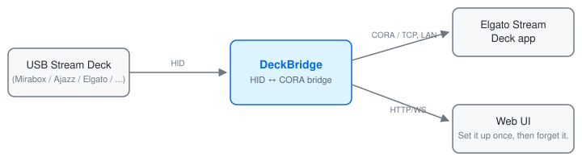

# DeckBridge

[](https://lukasmega.github.io/deno-kv-analytics/badge)

Use a USB Stream Deck with the Elgato Stream Deck app **over your local network** — no
[Elgato Network Dock](https://www.elgato.com/us/en/p/network-dock-stream-deck) (>70 USD)
required.

Plug your deck into any computer, run DeckBridge there, and the Elgato app on any machine
on the same network finds it like real Elgato hardware. One small program (<5 MB), nothing
else to install.


**📖 Documentation:** <https://lukasmega.github.io/DeckBridge/>

> **⚠️ Experimental project:** DeckBridge is experimental. The author does not plan to add
> support for devices beyond those already listed as supported, but will accept reasonable
> pull requests for new devices when they include proof that the hardware works. DeckBridge
> supports only 6-button (3×2) grids like the Stream Deck Mini and grids with up to 15
> buttons (5×3) like the Stream Deck MK.2.

> **🛠 How it was built:** DeckBridge started as a small personal project. The code was
> written largely with [Claude Code](https://claude.com/claude-code) (mostly Opus), but the
> author spent a significant amount of their free time debugging it and testing against
> real hardware — protocol quirks, per-device HID report formats and image pipelines only
> show up on an actual deck.


[//]: # ()

DeckBridge sits between the USB deck and the Elgato app: it speaks HID to the deck
and CORA (Elgato's network-dock protocol) to the app, so the app treats it like real
Elgato hardware over the network. The Web UI is a side channel for status/config.

You still use the Elgato Stream Deck app as normal — DeckBridge just lets it drive
third-party USB decks (Mirabox, Ajazz, Fifine, …) that Elgato's app doesn't natively
support. Set it up once, then forget it: run DeckBridge in the background (tray icon)
and it stays out of the way.

## Supported devices

Full side-by-side comparison (USB IDs, key grid, panel size, test status):
**[Supported devices](https://lukasmega.github.io/DeckBridge/devices)**. Every value
DeckBridge uses to drive a deck: **[Device specs](https://lukasmega.github.io/DeckBridge/device-specs)**.
Both are generated from the device registry, so they never drift from the code.

| Device | Grid | Image size | Protocol |
|---|---|---|---|
| Stream Deck MK.2 | 15 buttons (5×3) | 72×72 | elgato-gen2 |
| Stream Deck Mini | 6 buttons (3×2) | 80×80 | elgato-gen1 |
| Mirabox 293V3 | 15 buttons (5×3) | 112×112 | mirabox-cora |
| Mirabox 293S | 15 buttons (5×3) | 85×85 | mirabox-cora-v1 |
| Mirabox K1 Pro | 6 buttons (3×2) | 64×64 | mirabox-cora |
| Fifine AmpliGame D6 (rev. 2) | 15 buttons (5×3) | 112×112 | mirabox-cora |
| Ajazz AKP153E (rev. 2) | 15 buttons (5×3) | 95×95 | mirabox-cora |

<details>
<summary>untested devices</summary>

| Device | Grid | Image size | Protocol |
|---|---|---|---|
| Fifine AmpliGame D6 | 15 buttons (5×3) | 112×112 | mirabox-cora |
| Ajazz AKP153R (rev. 2) | 15 buttons (5×3) | 112×112 | mirabox-cora |
| Ajazz AKP153 | 15 buttons (5×3) | 85×85 | mirabox-cora-v1 |
| Ajazz AKP153E (rev. 1) | 15 buttons (5×3) | 85×85 | mirabox-cora-v1 |
| Ajazz AKP153R (rev. 1) | 15 buttons (5×3) | 85×85 | mirabox-cora-v1 |
| Mars Gaming MSD-ONE | 15 buttons (5×3) | 85×85 | mirabox-cora-v1 |
| Mad Dog GK150K | 15 buttons (5×3) | 85×85 | mirabox-cora-v1 |
| Risemode Vision 01 | 15 buttons (5×3) | 85×85 | mirabox-cora-v1 |
| TMICE Stream Controller | 15 buttons (5×3) | 85×85 | mirabox-cora-v1 |

</details>

Mirabox 293V3 also matches the HSV293SV3 / "293S V3" refresh — untested.

<details>
<summary>details about supported devices</summary>

Hardware-tested on macOS: Stream Deck MK.2, Stream Deck Mini, 293V3, 293S, K1 Pro, and
Fifine AmpliGame D6 (rev. 2). The Ajazz AKP153 rev. 2 models, the Fifine AmpliGame D6 rev. 1, the 7 v1
rebadges of the 293S board (Ajazz AKP153/E/R rev. 1, Mars Gaming MSD-ONE, Mad Dog GK150K,
Risemode Vision 01, TMICE Stream Controller), and the Linux/Windows builds are implemented
but not hardware-verified. The Ajazz rev. 2 boards and the Fifine D6 are the same hardware
as the 293V3 behind a different USB VID/PID, so they reuse the 293V3 model verbatim (the
D6 ships in two revisions that differ only in USB packet size: 512 bytes for PID `0x0007`,
1024 bytes for PID `0x0060`); the 7 v1 rebadges are the same hardware as the 293S behind
a different USB VID/PID, so they reuse the 293S model verbatim — report anything that
misbehaves.

</details>

> **Platform status:** DeckBridge is currently **tested on macOS only**.

## Quick start

1. Download the release for your OS, unzip, and run `deckbridge`.
2. Plug in your deck.
3. Open the Elgato Stream Deck app on any machine on the same network — it discovers
   DeckBridge automatically.

A web page at <http://localhost:3000> shows your deck's keys and a live log.

Full install and troubleshooting steps:
[Getting Started](https://lukasmega.github.io/DeckBridge/getting-started).

## CLI usage

```
deckbridge [command] [flags]

Commands:
  run                 Start the bridge (default when no command given)
  devices             List detected stream deck HID devices, then exit
  diagnose            Write a diagnostics report (for bug reports), then exit
  version             Print version/build info, then exit
  help                Print usage, then exit

Flags (for run):
  --mock                    Start with the mock driver (no hardware)
  --bind <addr>             Listen address for CORA + WebUI  [default 0.0.0.0]
  --webui-port <n>          WebUI HTTP/WS port               [default 3000]
  --no-webui                Do not start the WebUI server
  --open                    Auto-open browser (desktop convenience)
  --headless                Shorthand: no tray, no browser open, skip Elgato-app poll
  --log-level <lvl>         debug|info|warn|error|silent (runtime override)
  --no-overrides            Safe mode: ignore settings.json modelOverrides
  --cache-dir <path>        Settings + native-lib extraction root (default: XDG cache dir)
  -h, --help                Show this help
  -V, --version             Show version

Flags (for diagnose):
  --out <path>              Write the report here instead of the cache dir
  --redact-commands         Replace extra-key commands/plugin args with <redacted>

Log level precedence: --log-level > $DECKBRIDGE_LOG_LEVEL > settings.json
"logLevel" > the level baked in at build time.
```

For unattended Linux (Raspberry Pi / DietPi) under systemd, see
[Headless Linux](https://lukasmega.github.io/DeckBridge/headless-linux) and
`scripts/packaging/linux/`.

## ⚠ Hobby use only

DeckBridge is a free community tool for personal and hobby use. It is not affiliated
with, endorsed by, or supported by Elgato / Corsair, and it does not replace the Elgato
Network Dock. For professional or reliable setups, use officially supported Elgato
hardware.

DeckBridge contains no reverse-engineered code — it reuses existing open-source projects
([credits](https://lukasmega.github.io/DeckBridge/references)).

## For developers

Build from source, architecture, protocols, and testing: [ARCHITECTURE.md](docs/ARCHITECTURE.md).
Technical guides:
[Adding a device](https://lukasmega.github.io/DeckBridge/adding-a-device) ·
[Image flow](https://lukasmega.github.io/DeckBridge/image-flow) ·
[HID via FFI](https://lukasmega.github.io/DeckBridge/hidapi-ffi)

## License

[MIT](LICENSE). The vendored [`rust/jpeg-encoder`](rust/jpeg-encoder) fork keeps its
upstream license ((MIT OR Apache-2.0) AND IJG); third-party notices in
[`scripts/LICENSE-hidapi.txt`](scripts/LICENSE-hidapi.txt).
