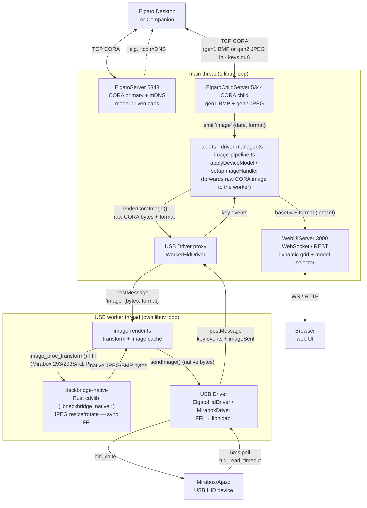
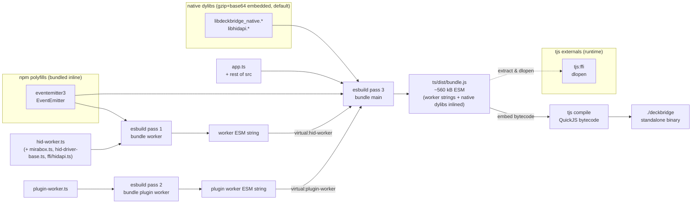
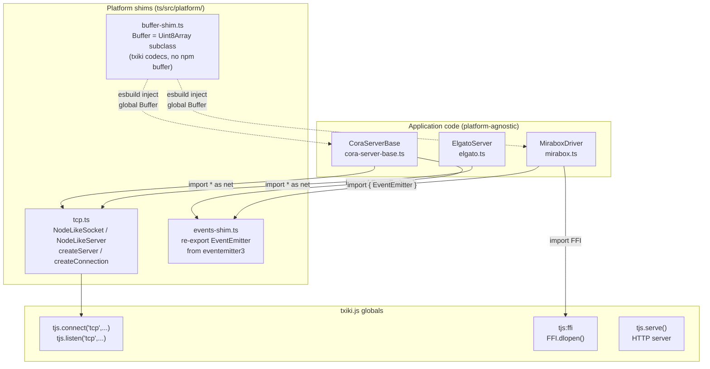
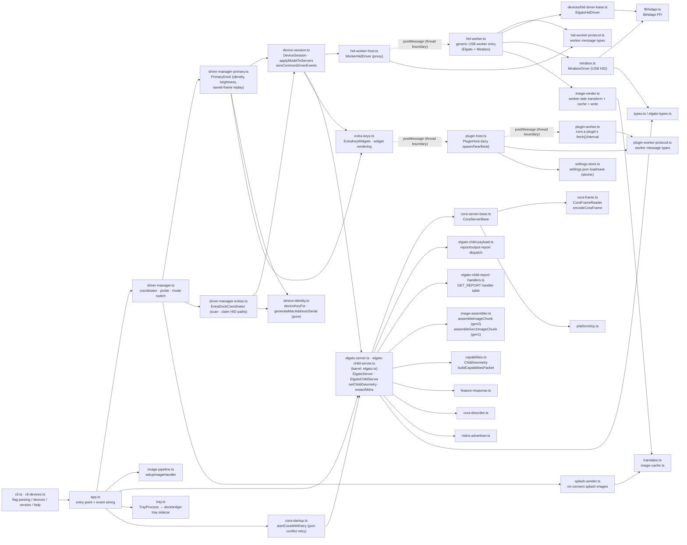

# DeckBridge — architecture & development

Deep technical documentation: build pipeline, threading model, protocol handling, and
module layout. For the user-facing overview see
[README.md](https://github.com/lukasMega/DeckBridge/blob/main/README.md); rendered docs at
<https://lukasmega.github.io/DeckBridge/>.

**Runtime:** [txiki.js](https://github.com/saghul/txiki.js) (QuickJS-ng + libuv + libffi)

## Quick start (from source)

```bash
# Prerequisites: libhidapi installed (txiki.js runtime is provided by mise)
mise run start

# Or step by step:
mise run build     # fetch txiki.js (mise) + bundle TS + build Rust sidecars (cdylib + tray)
mise run compile   # produce ./deckbridge binary
./deckbridge
```

## Slim txiki.js runtime (size optimization)

`mise run compile` self-embeds the txiki.js runtime, so a smaller runtime means a smaller
`deckbridge`. This app uses only `tjs:ffi`, raw TCP, and `tjs.serve` (HTTP + WebSocket) —
**none** of txiki.js's `sqlite3` or `WebAssembly`/WASI (WAMR) — so it ships a **slim**
runtime.

`mise run tjs-setup` (a dependency of `build`) puts that runtime at `$TJS` under
`../vendor`, and no-ops when it already exists. It downloads the prebuilt
**`slim-ffi`** asset of `$TXIKI_VERSION` (pinned in [`../mise.toml`](../mise.toml)) from
[lukasMega/txiki.js-with-slim-builds](https://github.com/lukasMega/txiki.js-with-slim-builds/releases)
— no toolchain needed. That profile keeps `tjs:ffi`, WebCrypto, `run`/`compile` and the
REPL, and drops TLS, WebAssembly, SQLite, mimalloc and the `eval`/`serve`/`test`/`bundle`/
`app` subcommands, built MinSizeRel + hardened with compressed bytecode. TLS costs ~430 KB
and buys nothing: every `fetch()` in this repo runs in the browser UI, not the runtime.

Effect on the shipped binary (macOS arm64): **6.4 MB → 2.4 MB**.

From-source is the fallback — required on **macOS x86_64** (no prebuilt slim asset) and
useful when changing the runtime itself:

```bash
mise run tjs-build     # or TJS_FROM_SOURCE=1 mise run build
```

[`../scripts/tjs-build.mjs`](../scripts/tjs-build.mjs) clones the fork at `$TXIKI_VERSION`
and runs *its* `scripts/build-dist.mjs --profile ffi` — the same driver that produces the
published assets, so the result matches the download byte for byte in configuration.

**Build deps (from-source only):** `git`, `cmake`, `npm`, a C/C++ toolchain, `libffi`
— macOS: `xcode-select --install && brew install cmake libffi`; Debian/Ubuntu:
`sudo apt-get install -y build-essential cmake git libffi-dev`.

## Running a packaged release

The standalone `deckbridge` binary is self-contained — just `../deckbridge`. Native dylibs
(`libdeckbridge_native`, `libhidapi`) are embedded (gzip+base64) and auto-extracted to a per-version
cache dir on first run (see [Build pipeline](#build-pipeline) for paths); no sidecar `.dylib`/`.so`
needed. A `deckbridge-tray` sidecar next to the binary is auto-detected and launched if present — the
tray is optional.

## Data flow



### Concurrency model

DeckBridge's core loop runs on **two threads**, connected only by `postMessage`, per connected
device:

- **Main thread** — the CORA TCP servers (Elgato primary/child), the WebUI HTTP/WebSocket server,
  and the orchestration forwarding each received CORA image to the worker. It must stay responsive:
  CORA image chunks are **ACK-paced** (Elgato waits for our ACK before the next), so any stall here
  throttles image delivery *and* the WebUI previews riding on it.
- **USB worker thread** — owns the libhidapi handle and does all **synchronous, blocking** work that
  must never stall the main loop: the JPEG/BMP **transform** (`image-render.ts` →
  `image_proc_transform` FFI, 50–200 ms) + LRU **image cache**, then HID I/O (`hid_write` uploads,
  `hid_read_timeout` key polling). The main thread hands over raw CORA bytes via
  `WorkerHidDriver.renderCoraImage()`; the worker transforms, caches, and writes — so neither the
  transform nor a large upload stalls the CORA ACK loop (P1). A single generic worker
  (`hid-worker.ts`, proxied by `WorkerHidDriver`) serves every device; its `createDriver()` picks
  `ElgatoHidDriver` (MK.2, Mini) or `MiraboxDriver` (293/293S/K1 Pro) by `driverKind`.

The split makes a full profile load fast on **both** sides: the main thread pushes every image to
the browser immediately while the device updates in parallel on the worker. USB I/O gets a whole
thread; the WebUI rides the main thread's spare time. Mock mode stays on the main thread.

**Multi-device**: this whole pair (CORA server pair + worker thread) repeats per physical device.
A separate, much lighter third worker type also exists for plugins (lazily spawned, not part of
the CORA/image path).

To keep image bursts from flooding the WebUI, per-chunk CORA tx/ACK and keepalive logs are `debug`
level, and `WebUIServer.notifyComm()` batches comm entries into one `commBatch` message every ~100 ms
(`COMM_BROADCAST_FLUSH_MS`) instead of one WS message per chunk.

### Network exposure

The CORA servers (5343/5344) listen on **all interfaces** (`0.0.0.0`) with **no
authentication** — protocol-inherent, as the real Elgato Network Dock has none either. Any LAN host
can connect, push images, and read key events. Set `DECKBRIDGE_BIND` (e.g. `127.0.0.1`) to restrict
the listen address. The WebUI (3000) ignores `DECKBRIDGE_BIND` and always binds `127.0.0.1`.

To reduce session-stealing, an actively-used CORA connection (sent data within
`CLIENT_EVICTION_GRACE_MS`, default 10 s) can't be evicted by a new connection — the newcomer's
socket is closed instead. A quiet connection (desktop app closed) can still be replaced.

Malformed-input guards on the CORA path: incoming images (gen2 JPEG / gen1 BMP) are decoded by
`deckbridge-native` with bounded limits (max 500×500 px, 900 KB decode alloc), so an
oversized/malformed image is rejected rather than allocating large buffers (real key images are ≤
~800 px); image chunks with an out-of-range `keyIndex` are dropped before assembly (an
unauthenticated peer can't grow assembly buffers or repaint key 0 via index coercion); and a frame
header declaring a `payloadLength` larger than the receive buffer forces a resync past the bad
header instead of stalling the reader.

### Startup & error handling

The CORA ports (5343/5344) are protocol-fixed and can't fall back like the WebUI port. If either is
in use (a second DeckBridge, a real Network Dock, or the ESP32 bridge), `startCoraWithRetry`
([cora-startup.ts](../ts/src/cora-startup.ts)) logs "port in use" to the console + WebUI feed and
retries every few seconds, keeping the already-started WebUI alive instead of crashing. A shutdown
signal during the wait still exits cleanly.

A global `unhandledrejection` handler (`app.ts`) turns an otherwise-fatal rejection into a graceful
`shutdown()` (device disconnect handshake, socket teardown, tray kill) rather than a hard-abort with
no cleanup. (txiki aborts on an un-`preventDefault`'d rejection, and a synchronous throw in a timer
callback has no global hook, so the two recurring timers — CORA keepalive and WebUI comm-flush — are
wrapped too.) On shutdown the `deckbridge-tray` sidecar is sent `SIGTERM` so it doesn't outlive the
main process.

## CLI

`app.ts` is still the sole entry point — there's no separate CLI binary. But CLI parsing
([cli.ts](../ts/src/cli.ts)) is the very first thing `app.ts` does, before anything else runs,
because `version`/`help`/`devices` must exit immediately and any flags must land in `tjs.env`
before other modules read it. `parseCliArgs()` is a hand-rolled, zero-dependency parser (deliberately
kept dependency-free — it must not import anything else in the tree) recognizing one of four
commands (`run` (default), `devices`, `version`, `help`) plus flags: `--mock`, `--bind`,
`--webui-port`, `--no-webui`, `--open`, `--headless`, `--log-level`, `--cache-dir`, `-h/--help`,
`-V/--version`. `applyFlagsToEnv()` normalizes flags into the corresponding `DECKBRIDGE_*` env vars
(flags override pre-existing env vars, which override defaults), so every downstream reader
(including the HID worker thread, since env is process-wide) keeps using its existing env-var reads
unchanged.

`devices` ([cli-devices.ts](../ts/src/cli-devices.ts)) enumerates HID devices via
`deckbridge-native` — enumeration-only, never `hid_open` (the same macOS SIGBUS rule as
`driver-manager.ts`'s presence check applies here too) — and prints a formatted table before
`app.ts` calls `tjs.exit(0)`. Not wired into any `mise` task or `package.json` bin; it's invoked
directly (`./deckbridge devices`).

## HID device detection

At startup `app.ts` constructs a `DriverManager` ([driver-manager.ts](../ts/src/driver-manager.ts)); its `probeAndOpen()` iterates `DEVICE_MODELS` in priority order and returns the first device that opens. If none, it retries every 2 s (`RECONNECT_DELAY_MS`).

### Probe order

| Priority | Model | VID | PIDs | Open strategy |
|----------|-------|-----|------|---------------|
| 1 | Stream Deck MK.2 | `0x0fd9` | `0x0080`, `0x006d`, `0x00a5` | VID+PID |
| 2 | Stream Deck Mini | `0x0fd9` | `0x0063`, `0x0090`, `0x00b3`, `0x00b8` | VID+PID |
| 3 | Mirabox 293V3 | `0x6603` | `0x1005`, `0x1006`, `0x1010`, `0x1014` ‡ | usage-page path first, then VID+PID |
| 4 | Mirabox 293S | `0x5548` | `0x6670` | usage-page path first, then VID+PID |
| 5 | Mirabox K1 Pro | `0x6603` | `0x1015`, `0x1019` | usage-page path first, then VID+PID |
| 6 | Ajazz AKP153E (rev. 2) † | `0x0300` | `0x3010` | usage-page path first, then VID+PID |
| 7 | Ajazz AKP153R (rev. 2) † | `0x0300` | `0x3011` | usage-page path first, then VID+PID |
| 8 | Ajazz AKP153 § | `0x5548` | `0x6674` | usage-page path first, then VID+PID |
| 9 | Ajazz AKP153E § | `0x0300` | `0x1010` | usage-page path first, then VID+PID |
| 10 | Ajazz AKP153R § | `0x0300` | `0x1020` | usage-page path first, then VID+PID |
| 11 | Mars Gaming MSD-ONE § | `0x0b00` | `0x1000` | usage-page path first, then VID+PID |
| 12 | Mad Dog GK150K § | `0x0c00` | `0x1000` | usage-page path first, then VID+PID |
| 13 | Risemode Vision 01 § | `0x0a00` | `0x1001` | usage-page path first, then VID+PID |
| 14 | TMICE Stream Controller § | `0x0500` | `0x1001` | usage-page path first, then VID+PID |

‡ `0x1014` is the **HSV293SV3 / "293S V3"** refresh — the same v3 board, so it rides the
293V3 model rather than getting its own entry (opendeck-akp153 names `0x1005` and `0x1014`
identically; keydeck's two device JSONs differ only in PID). Untested — no hardware. Note
it reports as "Mirabox 293V3" in the WebUI and mDNS name.

† **Untested — no hardware.** Both are the 293V3 board behind a different VID/PID: same
`mirabox-cora` v3 wire (1024-byte CRT packets, 512-byte reads), same `0xffa0`/`1` usage,
same 3×6 grid and key map, so `ajazz/akp153-rev2.ts` clones `MIRABOX_293_MODEL`. Rev. 1
(`0x0300:0x1010`/`0x1020`) is a **v1/512-byte** device and is deliberately not in the
registry — it would need a 293S-style model.

§ **Untested — no hardware, whole block.** The 7 v1 rebadges of the 293S board
(`devices/rebadge/akp153-v1-clones.ts`) — same `mirabox-cora-v1` wire (512-byte
packets, keydown-only), same `0xffa0`/`1` usage, same 3×6 grid and key map, so each
clones `MIRABOX_293S_MODEL` verbatim (only `id`/`name`/`vendor`/`usbVendorId`/
`usbProductIds` differ). Rest on two agreeing reference implementations (keydeck +
opendeck-akp153) plus the 293S board itself being hardware-verified — nothing here has
been probed on real units. v1 firmware also reports a hardcoded serial shared by every
unit of every v1 model (`355499441494`); `deviceKeyFor()` disambiguates by model id (see
[Settings persistence](#settings-persistence)).

Elgato models are probed first so they take priority over Mirabox; the loop is generic — every model opens through the same `WorkerHidDriver`. Models needing key remapping (Mirabox 293/293S/K1 Pro, via `hasInputKeyMap(model)`) have wire input codes translated by `deviceInputToMk2Index()` before forwarding to the CORA child server; Elgato models (empty `keyMap`) pass through unchanged.

### Open strategy per device

`ElgatoHidDriver.open()` ([hid-driver-base.ts](../ts/src/devices/hid-driver-base.ts)) and `MiraboxDriver.open()` ([mirabox.ts](../ts/src/mirabox.ts)) both try path-based open first, then diverge on the fallback:

1. **Path-based open** — if the model sets `usagePage` + `usage`, calls `findHidPath()` → `deckbridge-native` → `mirabox_hid_find_path(vid, pid, usagePage, usage)` (Mirabox passes each PID in turn to disambiguate models sharing VID+usage, e.g. K1 Pro vs 293; Elgato passes `pid=0`, any product). Opening by path avoids claiming system-owned interfaces on macOS (the OS grants the first `hid_open` caller exclusive access to a VID+PID).
2. **VID+PID fallback** — one attempt per PID, no retries. `ElgatoHidDriver` always falls back to `hid_open(VID, PID)` per PID. `MiraboxDriver` falls back **only off macOS**: on macOS a failed path-open throws immediately, because `hid_open(VID, PID)` there opens the device's first IOKit interface (often an unrelated collection) and a permission-denied open SIGBUSes the process — path-based open is the only safe route.

Only the Mirabox models set `usagePage`/`usage` (all use `0xffa0`/`1`); Elgato models skip step 1.

### libhidapi loading

`loadHidapi()` ([ffi/hidapi.ts](../ts/src/ffi/hidapi.ts)) tries a platform-specific candidate list via `FFI.dlopen`. If the `HIDAPI_LIB` env var is set (packaged releases: the extracted embedded lib), it is tried first:

| Platform | Candidates (tried in order, after `HIDAPI_LIB`) |
|----------|-----------------------------|
| macOS | `/opt/homebrew/lib/libhidapi.dylib` (Apple Silicon), `/usr/local/lib/libhidapi.dylib` (Intel), bare `libhidapi.dylib` |
| Linux | `/usr/lib/x86_64-linux-gnu/libhidapi-hidraw.so.0`, `/usr/lib/libhidapi-hidraw.so.0`, bare `libhidapi-hidraw.so.0`, bare `libhidapi.so` |
| Windows | `hidapi.dll`, `C:\Windows\System32\hidapi.dll` |

If all candidates fail, the error includes install instructions (`brew install hidapi` / `sudo apt install libhidapi-dev`). The handle is shared across the worker session (module-level `_workerHidLib`); `hid_exit()` + `close()` run on disconnect.

### HID path enumeration

The Rust `deckbridge-native` cdylib ([rust/deckbridge-native/](https://github.com/lukasMega/DeckBridge/tree/main/rust/deckbridge-native)) is loaded at runtime via the `DECKBRIDGE_NATIVE_LIB` env var. Among its exports is:

```c
int mirabox_hid_find_path(uint16_t vid, uint16_t pid, uint16_t usage_page, uint16_t usage,
                          uint8_t *buf, size_t buf_len);
// pid == 0 matches any product ID. Returns 1 and writes the null-terminated HID path into buf on success, 0 if not found.
```

If `DECKBRIDGE_NATIVE_LIB` is unset, path-based open is skipped and the driver falls straight through to VID+PID.

### Serial and firmware reading

`ElgatoHidDriver.open()` calls `_readDeviceInfo()` after acquiring the handle, reading serial (feature report 0x03/0x06) and firmware (0x04/0x05) into `deviceSerial`/`deviceFirmware`. The worker propagates them via the `'opened'` message, and `applyDeviceModel()` forwards them to the CORA capabilities packet — only when `model.cora.usePhysicalIdentity` is set — so the desktop sees the physical device's own serial/firmware.

### Adding a new device model

Full walkthrough: [docs/adding-a-device.md](adding-a-device.md). In short:

1. Create a `DeviceModel` ([driver.ts](../ts/src/devices/driver.ts)) under `devices/elgato/` or `devices/mirabox/`; most behavior is in the nested specs (`image`, `wire` (Mirabox), `keyMap`, `cora`, optional `splash`).
2. Add to `DEVICE_MODELS` in [registry.ts](../ts/src/devices/registry.ts) — list position is probe priority.
3. Set `usagePage`+`usage` only for a vendor-specific HID interface (all Mirabox use `0xffa0`/`1`); undefined for standard Elgato VID+PID.
4. Set `driverKind` — `'elgato-hid'` or `'mirabox'`; `createDriver()` in [hid-worker.ts](../ts/src/hid-worker.ts) is the single registration point.
5. For a new wire protocol beyond the four variants, add a `DeviceProtocol` literal: Elgato variants implement pack/parse under [protocol/](https://github.com/lukasMega/DeckBridge/tree/main/ts/src/devices/protocol) (in `PROTOCOL_STRATEGY`); Mirabox variants are driven by `wire` fields in `mirabox.ts`.

## CORA device capabilities

The CORA capabilities packet (sent to the Elgato desktop on connect) advertises the child device geometry: rows, columns, key count, image dimensions, PID, product name, and serial.

`applyDeviceModel()` in [driver-manager.ts](../ts/src/driver-manager.ts) is the entry point for a
primary-dock model change; it delegates its server-facing half to `applyModelToServers()`
([device-session.ts](../ts/src/device-session.ts)), which is the single implementation shared with
every extra dock. Each model's `cora`
spec (`DeviceCoraSpec`) drives it:

1. **PID** — `model.cora.productId`. Elgato models use their real USB PID; Mirabox 293/293S advertise `ELGATO_MK2_PID`; K1 Pro advertises the Mini PID (`0x0063`).
2. **Geometry** — `model.cora.advertiseGeometry ?? modelToChildGeometry(model)`. Mirabox 293/293S pin `MK2_CHILD_GEOMETRY` (advertise as MK.2); K1 Pro pins `MINI_CHILD_GEOMETRY`; Elgato models derive geometry from their own dimensions.
3. **Identity** — when `model.cora.usePhysicalIdentity` is true (Elgato only), the device's real serial/firmware (read by the worker) is patched into the config; Mirabox keeps the default dock identity.

It then applies the change to both CORA servers and the WebUI:

- `resetImagePipeline()` + `webui.resetImages()` — drop the old model's per-key write queues and
  cached WebUI images so stale keys don't linger, then broadcast a repaint
- `server.setDeviceConfig(patch)` — update PID (+ serial/firmware for Elgato)
- `setChildGeometry(geo)` on both CORA servers (child reallocates `keyStates`, keeping the overlapping prefix on a hot-swap)
- `server.restartMdns(pid)` — re-advertise with the new PID (skipped when PID + serial are unchanged, to avoid dns-sd/avahi churn on every unplug/replug)
- `server.pushChildCapabilities()` — push updated caps to a connected desktop
- `webui.notifyDeviceModel(...)` — broadcast model state to the browser

Called on real connect (with worker serial/firmware), disconnect (resets to `DEFAULT_MODEL` = MK.2),
mock-mode startup, and a WebUI model-selector change.

## Multi-device: extra docks

DeckBridge can run more than one emulated Network Dock at once — one **primary** dock (the only one
with WebUI/tray coupling) plus up to `MAX_DEVICE_SESSIONS - 1` (= 3) **extra**, headless docks, one
per additional physical HID device found. `driver-manager.ts` is now a thin coordinator over two
extracted pieces:

- **`PrimaryDock`** ([driver-manager-primary.ts](../ts/src/driver-manager-primary.ts)) — the
  index-0 dock's presentation state: identity resolution, brightness, extra-key widgets, and
  replaying saved per-key frames across a USB replug so the Elgato desktop doesn't see a blank grid.
- **`ExtraDockCoordinator`** ([driver-manager-extras.ts](../ts/src/driver-manager-extras.ts)) — runs
  its own scan timer (every `RECONNECT_DELAY_MS`) over HID paths not already claimed by the primary
  or another extra dock, and spins up a [`DeviceSession`](../ts/src/device-session.ts) per newly
  found physical unit (`createExtraSession()`), keyed by HID path with a pool of free session
  indices (1..3, lowest wins).

A **`DeviceSession`** is a fully self-contained extra dock: its own CORA server pair on ports
strided by `CORA_PORT_STRIDE` (`5343 + 2·index` / `5344 + 2·index`), its own mDNS advertisement and
device identity, its own `WorkerHidDriver` (its own worker thread and libhidapi handle), and its own
`ExtraKeyWidgets` scheduler. It shares `applyModelToServers()` and `wireCommonDriverEvents()` with
the primary dock so the CORA identity/geometry push and key-dispatch wiring have one implementation
each. Extras have no WebUI grid/tray/saved-frame-replay in v1 — that stays primary-only.

`app.ts` wires a `sessionServersFactory`, calls `driverManager.startScan()` on startup, and
`stopAllExtraSessions()` on shutdown.

## Settings persistence

Per-device settings (brightness, brightness override, image-mode override, extra-key widget config)
and device identity (a stable MAC/serial pair so the Elgato desktop doesn't see a "new" device every
reconnect) persist to `<cacheRoot>/settings.json` (same cache root as the extracted native libs; see
[Build pipeline](#build-pipeline)):

- [settings-store.ts](../ts/src/settings-store.ts) — disk I/O only: `loadSettings()`/`saveSettings()`
  write atomically (`<target>.tmp-<pid>-<counter>` + rename, same pattern as `native-libs.ts`), and
  `pluginsDir()` resolves the plugin-file directory.
- [device-identity.ts](../ts/src/device-identity.ts) — pure, no I/O. `deviceKeyFor(hidPath, serial?,
  modelId?)` prefers a stable `usb:<serial>`-prefixed key over the volatile HID path;
  `generateMacAddress()` / `generateSerial()` derive a deterministic MAC/serial from that key via
  FNV-1a hashing, so replugging the same physical device reproduces the same identity. `protocol_version
  1` devices (293S + its 7 rebadges, `model.wire.sharedSerial`) all report the same hardcoded USB
  serial, so callers pass `modelId` for those models — the key becomes `usb:<serial>:<modelId>`,
  keeping two *different* v1 models apart (two units of the *same* v1 model still collide; there's no
  per-unit bit available). `settings-store.ts` migrates a pre-fix bare `usb:355499441494` entry to the
  293S-suffixed key on load, once, only when unambiguous (exactly one bare entry, no suffixed entry
  yet) — so an existing 293S user's identity survives the fix instead of forcing an Elgato re-pair.
- [web/server/persisted-settings.ts](../ts/src/web/server/persisted-settings.ts) — `PersistedSettings`
  is the sole `settings.json` writer: shape-guards on load and on JSON import (a corrupt `extraKeys`
  map is stripped rather than dropping the whole identity entry, which would otherwise force an
  Elgato re-pair), `getOrCreateIdentity()`, `importDevices()`, `syncDockBrightness()`.
- [web/server/settings-identity-controller.ts](../ts/src/web/server/settings-identity-controller.ts)
  — the `WebUIServer`-facing glue: identity for the Elgato-app-facing fields, settings-import, and
  pushing an imported brightness/override/extra-key change live to the running driver + WS clients.

Nothing outside these four files touches `settings.json` directly — `DriverManager`/
`ExtraDockCoordinator`/`DeviceSession` go through `webui.getOrCreateDeviceIdentity()` /
`webui.extraKeyConfigFor()`.

## WebUI (`http://localhost:3000`)

### Dynamic grid

The key grid rebuilds when the model changes: `rebuildGrid(keyCount, columns)` sets `grid.style.gridTemplateColumns` and creates the right number of buttons. Initial render is 5×3 (MK.2 default); the first `status` WebSocket message (sent on connect) rebuilds to the actual layout.

| Device | Grid |
|--------|------|
| Stream Deck MK.2 | 5×3 (15 keys) |
| Stream Deck Mini | 3×2 (6 keys) |
| Mirabox 293V3 | 5×3 (advertised as MK.2) |
| Mirabox 293S | 5×3 (left 5 of 6 hardware columns; advertised as MK.2) |
| Mirabox K1 Pro | 3×2 (advertised as Mini) |
| Ajazz AKP153E/R (rev. 2) | 5×3 (same as 293V3; advertised as MK.2) |
| AKP153/E/R, MSD-ONE, GK150K, Vision 01, TMICE Stream Controller (v1 rebadges) | 5×3 (left 5 of 6 hardware columns, same as 293S; advertised as MK.2) |

### Device model selector

A `<select id="model-select">` dropdown switches the advertised model in **mock mode** (visible but disabled while a physical device is connected — the device determines the model). Selecting one tears down the mock driver, creates a new `MockDriver` with that geometry, and calls `applyDeviceModel(model)` (updates CORA caps, mDNS, grid). The dropdown is populated from `/api/state` on load; changes POST to `/api/device-model`.

### `WebUIServer` collaborators

`web-ui-server.ts` composes several focused collaborators rather than doing everything itself:

| Class | File | Owns |
|---|---|---|
| `ActivityBuffers` | `web/server/activity-buffers.ts` | ring buffers for logs/CORA-comm/key-events; batches comm entries on the `COMM_BROADCAST_FLUSH_MS` timer (see [Concurrency model](#concurrency-model)) |
| `DockRegistry` | `web/server/dock-registry.ts` | the live per-dock `DockStatus[]` list + which dock is selected |
| `ImageChannel` | `web/server/image-channel.ts` | per-dock CORA image cache + the single live WS image channel (mirrors only the selected dock; instant dock-switch without an Elgato re-push) |
| `PersistedSettings` | `web/server/persisted-settings.ts` | `settings.json` — see [Settings persistence](#settings-persistence) |
| `SettingsIdentityController` | `web/server/settings-identity-controller.ts` | identity/import glue over `PersistedSettings` |
| `ExtraKeysController` | `web/server/extra-keys-controller.ts` | extra-key widget config — see [Plugins and extra-key widgets](#plugins-and-extra-key-widgets) |
| `MockConfig` (`defaultMockConfig`/`mergeMockConfig`) | `web/server/mock-config.ts` | the mock driver's spoofed identity fields, validated for the WebUI's mock-config editor |
| `WebRequestGuard` (`isAllowedWebRequest`) | `web/server/web-request-guard.ts` | Host/Origin check against `localhost`/`127.0.0.1`/`[::1]` (+ this machine's own interface IPs when `--bind 0.0.0.0`) — DNS-rebinding/CSRF hardening for the WebUI, independent of the CORA ports' lack of auth (see [Network exposure](#network-exposure)) |

## Plugins and extra-key widgets

Some device models expose physical keys **outside** the emulated CORA grid — the Mirabox 293S's 6th
column (wire ids 16/17/18, `model.keyMap.extraKeys`) has no switches under those keys, display-only,
so they can't act as CORA keys but can show something. [extra-keys.ts](../ts/src/extra-keys.ts) lets
the WebUI assign each one a **widget**: `clock`, `date`, `text`, `weather` (Open-Meteo, no API key,
plain HTTP since the slim runtime has no TLS), `command` (runs a user-supplied shell command and
shows its stdout — full trust, same tradeoff as a build script), `plugin` (below), or `none`.
`renderWidgetLines()` picks the text, `composeWidgetBmp()` rasterizes it via a packed bitmap font
(`assets/font-atlas.ts`) into a 24-bit BMP pushed through the existing splash path — so the worker's
transform, not the main thread, does the FFI JPEG encode. A per-dock `ExtraKeyWidgets` scheduler
(one instance per connected dock: the primary's own, and one per `DeviceSession`) ticks every second
and repaints a key only when its content changed.
[web/server/extra-keys-controller.ts](../ts/src/web/server/extra-keys-controller.ts) is the
WebUI-facing glue: assign/clear a widget (persists + broadcasts), "run now" for command widgets, and
the plugin dropdown/status for the popup.

### Plugins — a third, lazily-spawned worker thread

A `plugin` widget runs arbitrary user JS from a file in `pluginsDir()` (see
[Settings persistence](#settings-persistence)) on its own worker thread — separate from, and much
lighter than, the always-on USB worker:

- **`plugin-worker.ts`** — the worker entry. A plugin exports `{ interval?, async fetch(ctx) }`.
  Before importing any plugin file it deletes the global `fetch`/`WebSocket`, because calling either
  inside *any* txiki Worker aborts the whole process (a runtime constraint, not a plugin-specific
  bug) — so a plugin's own `ctx.fetch` is proxied back to the main thread over `postMessage` instead.
  `pollLoop()` imports the plugin once, then polls it forever at its configured interval, posting a
  `value`/`error` message each tick.
- **`plugin-host.ts`** — main-thread owner, `class PluginHost`. Spawns the worker lazily on the
  *first* request for a configured plugin key, and tears it down once no plugin keys reference it
  (unlike the always-on HID worker). Runs a `ping`/`pong` heartbeat (`HEARTBEAT_MS = 2000`) and
  respawns a hung/crashed worker, permanently disabling a plugin after `MAX_CONSECUTIVE_KILLS = 3`
  crash-loop restarts. Also executes the actual `fetch()` calls proxied from the worker
  (`http://` only — no TLS in the slim build). Exposes `pluginValueFor()` (used by `extra-keys.ts`),
  `pluginKeyStatus()`, and `listPluginFiles()` (the WebUI dropdown).
- **`plugin-worker-protocol.ts`** — the `MainToPluginWorker`/`PluginWorkerToMain` message union,
  mirroring `hid-worker-protocol.ts`'s role for the USB worker.

Built the same way as the HID worker (see [Build pipeline](#build-pipeline)): a second esbuild pass
bundles `plugin-worker.ts` into an ESM string embedded as `virtual:plugin-worker`, spawned as a
blob-URL module worker. Plugin JS has the same trust level as the `command` widget — full fs/spawn/
FFI access; the worker thread is a crash/CPU isolation boundary only, not a sandbox. `app.ts` and
`driver-manager*.ts` have no references to plugins — the whole subsystem is private to
`extra-keys.ts` plus the WebUI controller, entirely outside the core CORA/USB orchestration.

## System tray

A small Rust sidecar (`deckbridge-tray`, built with the `tray-icon` + `tao` crates) shows a status icon and menu. The
main process spawns it and talks to it over two channels: the tray's **stdout** (lifecycle + menu
events) and a **loopback TCP** connection (icon/status pushes). `../ts/src/tray.ts` (`TrayProcess`)
owns the TS side; `app.ts` pushes a `TrayState` on every device/client connect and disconnect.
`TrayProcess.close()` sends the sidecar `SIGTERM` so it doesn't outlive the main process across
shutdowns/restarts.

| Icon | Condition |
|------|-----------|
| green (`full`) | USB device open **and** Elgato client connected |
| yellow (`usb_only`) | USB device open, no Elgato client |
| gray (`disconnected`) | no USB device |

The menu offers **Open Web UI**, **Check Requirements** (the `/requirements` diagnostics page), and
**Quit**. The tray is spawned only when `DECKBRIDGE_TRAY_BIN` points at the binary (`mise run start` sets it);
if it is unset or the spawn fails, `startTray()` returns `null` and the app runs normally. See
[rust/deckbridge-tray/README.md](https://github.com/lukasMega/DeckBridge/blob/main/rust/deckbridge-tray/README.md) for the full protocol.

## Build pipeline

Three esbuild passes (`build.mjs`): the generic USB worker (`hid-worker.ts`) is bundled into a
self-contained ESM **string**, embedded into the main bundle via the virtual module
`virtual:hid-worker`; the plugin worker (`plugin-worker.ts`, see
[Plugins and extra-key widgets](#plugins-and-extra-key-widgets)) is bundled the same way as
`virtual:plugin-worker`. (The browser-side `ui-entry.ts` subtree is bundled the same way too and
embedded as text via the `ui-ts-as-text` plugin.)

Native dylibs (`libdeckbridge_native`, `libhidapi`) are **gzip+base64-encoded** into `bundle.js` at
build time (default on; `EMBED_NATIVE_LIBS=0` / `--no-embed` to disable), making the bundle
**platform-specific**. At runtime they extract on first run to `~/Library/Caches/deckbridge/native-<hash>/`
(macOS) or `${XDG_CACHE_HOME:-~/.cache}/deckbridge/native-<hash>/` (Linux). `DECKBRIDGE_NATIVE_LIB` /
`HIDAPI_LIB` take precedence when set (dev: `mise run build` populates them from the just-built dylibs).



At runtime the worker starts as a **blob-URL module worker**
(`new Worker(URL.createObjectURL(new Blob([src])), { type: 'module' })`): a compiled `tjs` binary
can't load a worker from a disk path or `data:` URL, but a blob URL works in both `tjs run` and the
compiled binary — keeping the single-file binary self-contained.

## Testing

```bash
mise run test        # bundle + run every ts/test/*.test.ts on the txiki.js runtime
mise run ci-checks   # lint + typecheck + test + knip
```

Tests run on the same QuickJS/txiki.js runtime as the app (not Node), with **no test framework**:
each `ts/test/*.test.ts` is a standalone script using `tjs:assert` + a local `test()`/`runTest()`
helper and exits `tjs.exit(failed > 0 ? 1 : 0)`. The `test` task bundles each with
`node build.mjs --test <name>` then runs `$TJS run dist/test/<name>.js` (also the single-file recipe).

All tests are **hardware-free** (pure logic, fakes, local sockets). Real-device work lives in the
`smoke` task (USB HID, needs a Mirabox) or `e2e` (black-box test of a packaged zip).

| Area | Test files · notable coverage |
|---|---|
| CORA framing | `packets` (Mirabox builders + framing), `cora-frame` (resync/overflow/oversized-`payloadLength` E10), `assembler`, `elgato-child-image-bounds` (out-of-range `keyIndex` drop, L4) |
| Image pipeline | `translator` (key-map incl. `-1` E2 + Rust transform), `image-cache` (full-buffer FNV-1a incl. icon-on-black regression, LRU), `image-pipeline`, `image-render` (worker transform/cache/remap/passthrough), `hash-bench` |
| Drivers & models | `device-models` (probe order, keyMap perms, 293S 6th-col drop, caps geometry), `driver-manager` (connect/reconnect, mode-switch, E1), `device-session` (per-index ports, splash on start, key/image event wiring, mDNS rename), `hid-worker-host` (failed-`open` reuse — SIGBUS-safe), `mirabox-parse` (0x04 vs 0x00), `k1pro-chunk-pad` |
| Servers | `server` (primary+child over real TCP; L6/E3/E4/H3 + WebUI brightness), `pairing` (full MK.2 handshake), `feature-response` (report-id branches + MAC guard) |
| Web & infra | `web-ui-server` (MAC/port/Broadcaster, NaN-PID V4, `resetImages` L3), `ui-helpers-docks` (dock list vs legacy-field synthesis), `key-preview`, `tray` (path helpers + `SIGTERM` L1), `mdns-advertiser` (per-platform `buildArgs`, E9), `native-libs` (extract/gunzip/cleanup), `buffer-shim` |
| Settings & identity | `settings-store` (atomic write, corrupt/missing/array-shaped JSON → `{}`, concurrent-save safety), `device-identity` (stable `usb:<serial>` key vs unstable path fallback, deterministic MAC/serial, no-collision sampling) |
| CLI | `cli` (flag parsing incl. `tjs run <bundle>` vs compiled-binary argv shape), `cli-devices` (device table formatting, known/unknown VID+PID rows) |
| Plugins & extra keys | `extra-keys` (widget rendering: clock/date/text/weather/command/plugin, lat/lon parsing), `plugin-host` (message round-trip, lazy spawn, heartbeat respawn, `MAX_CONSECUTIVE_KILLS` disable, `http://`-only fetch proxy) |
| Probes (non-assertion) | `k1pro-probe-layout`, `splash-size` — reproduce K1 Pro JPEG variants byte-for-byte and write samples under `/tmp` for offline analysis |

### Coverage

```bash
mise run coverage    # instrument, run all tests, emit merged report
```

`mise run coverage` runs the full tjs suite under **Istanbul source instrumentation** — which is
engine-agnostic (rewrites JS to increment counters on `globalThis.__coverage__`), so tests run on
real **txiki.js/QuickJS-ng**, not Node/vitest (which can't host the FFI, socket, and worker tests).
Each process flushes its map to `ts/coverage/.tmp/<name>.json`; `scripts/coverage-report.mjs` (Node)
merges them into `../ts/coverage` — stdout summary, `index.html` (+ `lcov-report/`), and `lcov.info`.
The task builds the Rust dylib first (`depends = ["deckbridge-native"]`) so FFI tests run for real.
Set `COVERAGE_ENFORCE=1` to fail below thresholds (off by default).

## Platform abstraction layer



## Module map



## Directory layout

```
deckbridge/
├── mise.toml           ← task runner (build, compile, run, typecheck, test)
├── docs-site/          ← Docusaurus documentation site (npm; mermaid→SVG, local search)
├── ts/
│   ├── build.mjs       ← esbuild config (also bundles tests via --test <name>)
│   ├── tsconfig.json
│   ├── package.json    ← dev deps: esbuild, typescript/tsgo (@typescript/native-preview), eventemitter3, preact, lint/coverage tooling (oxlint/eslint, istanbul, knip)
│   ├── test/           ← *.test.ts suite (run on the txiki.js runtime; see "Testing")
│   ├── src/   (see the Module map above for relationships)
│   │   ├── cli.ts · cli-devices.ts   ← flag parsing (run/devices/version/help), device-list subcommand
│   │   ├── app.ts · driver-manager.ts · driver-manager-primary.ts · driver-manager-extras.ts
│   │   │   · device-session.ts · device-identity.ts · image-pipeline.ts · splash-sender.ts · logger.ts
│   │   │       ← main-thread composition: probe/open, applyDeviceModel, multi-dock sessions,
│   │   │         CORA image → WebUI + worker
│   │   ├── extra-keys.ts · plugin-host.ts   ← non-grid key widgets (clock/date/text/weather/command/plugin),
│   │   │                                       lazily-spawned plugin-worker host
│   │   ├── settings-store.ts   ← settings.json load/save (atomic write), pluginsDir()
│   │   ├── hid-worker-host.ts · hid-worker.ts · hid-worker-protocol.ts · image-render.ts · mirabox.ts
│   │   │       ← USB worker: WorkerHidDriver proxy, createDriver(), worker-side transform+cache+write
│   │   ├── plugin-worker.ts · plugin-worker-protocol.ts   ← plugin worker entry + its message protocol
│   │   ├── elgato.ts · elgato-server.ts · elgato-child-server.ts · elgato-child-payload.ts
│   │   │   · elgato-child-report-handlers.ts · cora-server-base.ts · cora-startup.ts
│   │   │   · cora-frame.ts · cora-describe.ts   ← CORA primary/child (5343/5344), framing, port-retry
│   │   ├── capabilities.ts · feature-response.ts · image-assembler.ts · translator.ts · image-cache.ts
│   │   │       ← caps/ChildGeometry, GET_REPORT, gen1/gen2 assembly, key-map + transform, LRU cache
│   │   ├── native-libs.ts · mdns-advertiser.ts · tray.ts · os-utils.ts · comm-format.ts · types.ts · elgato-types.ts
│   │   │       ← native-lib extraction, mDNS, tray sidecar, browser-open/platform-name, wire-trace hex, shared types
│   │   ├── mirabox-smoke.ts · k1pro-probe.ts · *.d.ts · assets/   ← hardware probes, ambient types, splash JPEGs, font atlas
│   │   ├── ffi/          ← hidapi.ts (libhidapi) · image-proc.ts (libdeckbridge_native, DECKBRIDGE_NATIVE_LIB)
│   │   ├── devices/      ← driver.ts (DeviceModel + specs) · registry.ts · hid-connection.ts (HidDeviceBase)
│   │   │                    · hid-driver-base.ts (ElgatoHidDriver) · mock.ts · elgato/ · mirabox/ · protocol/
│   │   ├── platform/     ← tcp.ts · buffer-shim.ts · events-shim.ts (shims over txiki globals)
│   │   └── web/          ← server/ (WebUIServer + activity-buffers/dock-registry/image-channel/
│   │                          persisted-settings/settings-identity-controller/extra-keys-controller/
│   │                          mock-config/web-request-guard/…) · client/ (browser UI)
│   └── dist/             ← bundle.js (~560 kB, worker + native dylibs inlined) · hid-worker.js (debug)
├── rust/
│   ├── deckbridge-native/   ← JPEG resize/rotate + HID path-enum cdylib (FFI via DECKBRIDGE_NATIVE_LIB);
│   │                          Cargo features: jpeg-upstream (default) / jpeg-fork, HID behind `usb`
│   ├── jpeg-encoder/        ← vendored jpeg-encoder 0.6.1 fork (interleaved optimized Huffman; JPEG_FORK=1)
│   └── deckbridge-tray/     ← system-tray sidecar binary (Rust; tray-icon + tao)
```
