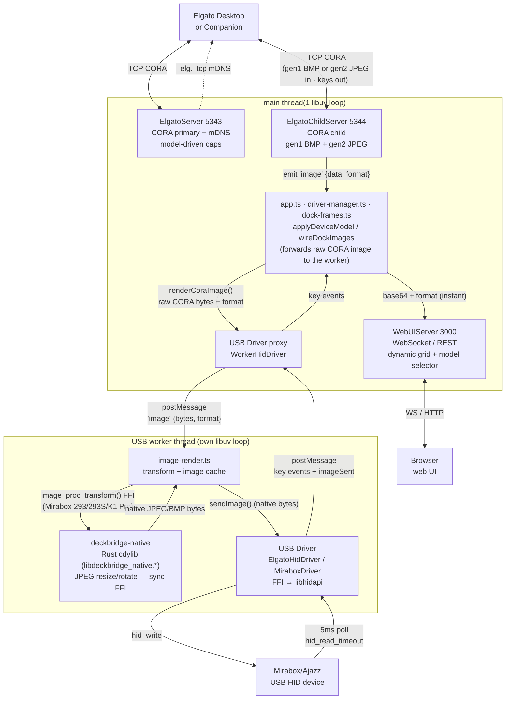
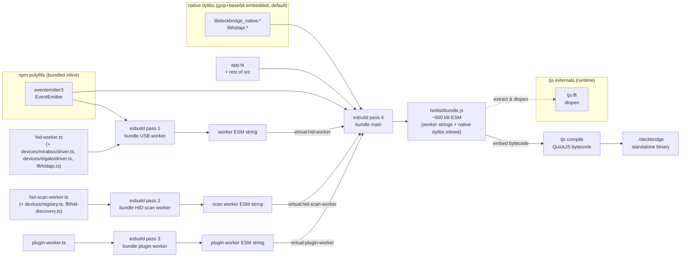
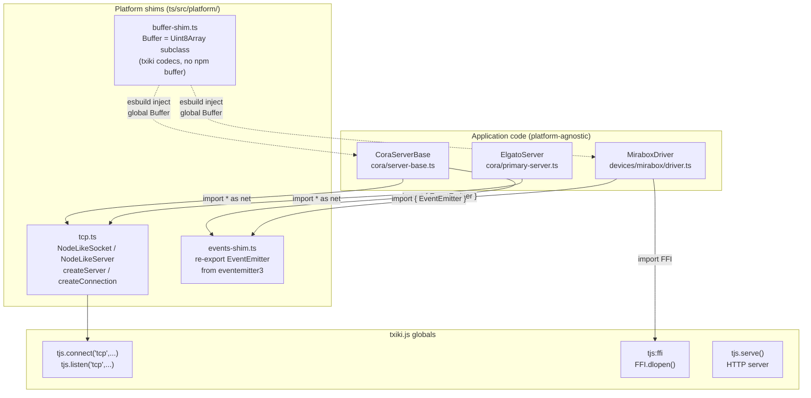
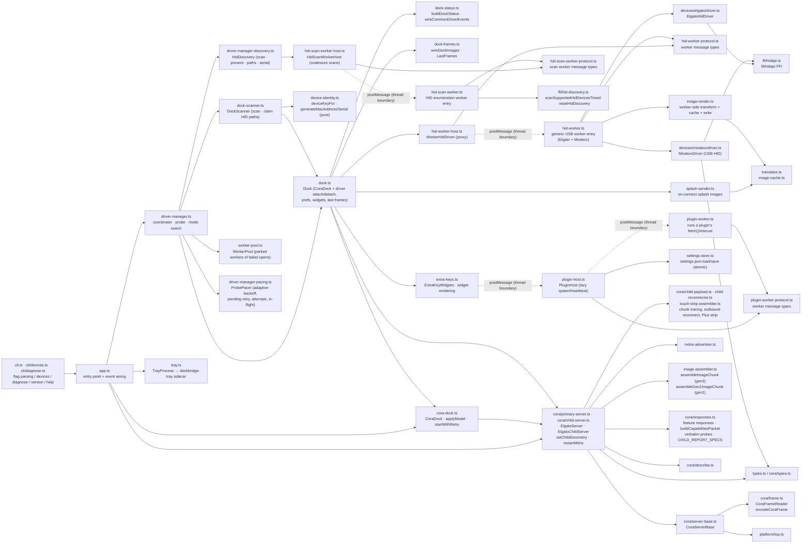

# DeckBridge — architecture & development

Deep technical documentation: build pipeline, threading model, protocol handling, and
module layout. For the user-facing overview see
[README.md](https://github.com/lukasMega/DeckBridge/blob/main/README.md); rendered docs at
<https://lukasmega.github.io/DeckBridge/>.

**Runtime:** [txiki.js](https://github.com/saghul/txiki.js) (QuickJS-ng + libuv + libffi)

## Quick start (from source)

```bash
# Prerequisites: libhidapi installed (txiki.js runtime is provided by mise)
mise run start

# Or step by step:
mise run build     # fetch txiki.js (mise) + bundle TS + build Rust sidecars (cdylib + tray)
mise run compile   # produce ./deckbridge binary
./deckbridge
```

## Slim txiki.js runtime (size optimization)

`mise run compile` self-embeds the txiki.js runtime, so a smaller runtime means a smaller
`deckbridge`. The app uses only `tjs:ffi`, raw TCP and `tjs.serve` (HTTP + WebSocket) — none
of txiki.js's `sqlite3` or `WebAssembly`/WASI — so it ships a **slim** runtime.

`mise run tjs-setup` (a dependency of `build`) puts it at `$TJS` under `../vendor`, and no-ops
when it already exists. It downloads the prebuilt **`slim-ffi`** asset of `$TXIKI_VERSION`
(pinned in [`mise.toml`](https://github.com/lukasMega/DeckBridge/blob/main/mise.toml)) from
[lukasMega/txiki.js-with-slim-builds](https://github.com/lukasMega/txiki.js-with-slim-builds/releases);
no toolchain needed. The profile keeps `tjs:ffi`, WebCrypto, `run`/`compile` and the REPL, and
drops TLS, WebAssembly, SQLite, mimalloc and the `eval`/`serve`/`test`/`bundle`/`app`
subcommands (MinSizeRel, hardened, compressed bytecode). TLS costs ~430 KB and buys nothing:
every `fetch()` in this repo runs in the browser UI. Effect on the shipped binary (macOS
arm64): **6.4 MB → 2.4 MB**.

Building from source is the fallback — required on **macOS x86_64** (no prebuilt asset) and
useful when changing the runtime itself:

```bash
mise run tjs-build     # or TJS_FROM_SOURCE=1 mise run build
```

[`../scripts/tjs-build.mjs`](../scripts/tjs-build.mjs) clones the fork at `$TXIKI_VERSION` and
runs its `scripts/build-dist.mjs --profile ffi`, the same driver that produces the published
assets.

**Build deps (from-source only):** `git`, `cmake`, `npm`, a C/C++ toolchain, `libffi`
— macOS: `xcode-select --install && brew install cmake libffi`; Debian/Ubuntu:
`sudo apt-get install -y build-essential cmake git libffi-dev`.

## Running a packaged release

The standalone `deckbridge` binary is self-contained. Native dylibs (`libdeckbridge_native`,
`libhidapi`) are embedded (gzip+base64) and auto-extracted to a per-version cache dir on first
run (paths: [Build pipeline](#build-pipeline)). A `deckbridge-tray` sidecar next to the binary
is launched if present; the tray is optional.

## Data flow


```mermaid
flowchart TD
    ELGATO["Elgato Desktop<br/>or Companion"]
    BROWSER["Browser<br/>web UI"]
    USB["Mirabox/Ajazz<br/>USB HID device"]

    subgraph "main thread(1 libuv loop)"
        EL_SERVER["ElgatoServer 5343<br/>CORA primary + mDNS<br/>model-driven caps"]
        EL_CHILD["ElgatoChildServer 5344<br/>CORA child<br/>gen1 BMP + gen2 JPEG"]
        APP["app.ts · driver-manager.ts · dock-frames.ts<br/>applyDeviceModel / wireDockImages<br/>(forwards raw CORA image to the worker)"]
        WEB["WebUIServer 3000<br/>WebSocket / REST<br/>dynamic grid + model selector"]
        HOST["USB Driver proxy<br/>WorkerHidDriver"]
    end

    subgraph "USB worker thread (own libuv loop)"
        REND["image-render.ts<br/>transform + image cache"]
        IMG["deckbridge-native<br/>Rust cdylib (libdeckbridge_native.*)<br/>JPEG resize/rotate — sync FFI"]
        MIR["USB Driver<br/>ElgatoHidDriver / MiraboxDriver<br/>FFI → libhidapi"]
    end

    ELGATO <-- "TCP CORA" --> EL_SERVER
    ELGATO <-- "TCP CORA<br/>(gen1 BMP or gen2 JPEG in · keys out)" --> EL_CHILD
    EL_CHILD -- "emit 'image' {data, format}" --> APP
    APP -- "base64 + format (instant)" --> WEB
    WEB <-- "WS / HTTP" --> BROWSER
    APP -- "renderCoraImage()<br/>raw CORA bytes + format" --> HOST
    HOST -- "postMessage<br/>'image' {bytes, format}" --> REND
    REND -- "image_proc_transform() FFI<br/>(Mirabox 293/293S/K1 Pro)" --> IMG
    IMG -- "native JPEG/BMP bytes" --> REND
    REND -- "sendImage() (native bytes)" --> MIR
    MIR -- "postMessage<br/>key events + imageSent" --> HOST
    HOST -- "key events" --> APP
    MIR -- "hid_write" --> USB
    USB -- "5ms poll<br/>hid_read_timeout" --> MIR
    EL_SERVER -.->|"_elg._tcp mDNS"| ELGATO
```

### Concurrency model

Per connected device, DeckBridge's core loop runs on **two threads** joined only by
`postMessage`. Two further worker types sit outside that loop (HID enumeration and plugins;
see *Supporting workers*), for **four** thread contexts in total:

- **Main thread** — the CORA TCP servers (Elgato primary/child), the WebUI HTTP/WebSocket
  server, and the orchestration forwarding each received CORA image to the worker. It must stay
  responsive: CORA image chunks are **ACK-paced** (Elgato waits for our ACK before the next),
  so any stall here throttles image delivery *and* the WebUI previews riding on it.
- **USB worker thread** — owns the libhidapi handle and all **synchronous, blocking** work: the
  JPEG/BMP **transform** (`image-render.ts` → `image_proc_transform` FFI, ~1 ms) + LRU **image
  cache**, then HID I/O (`hid_write` uploads, `hid_read_timeout` key polling). The main thread
  hands over raw CORA bytes via `WorkerHidDriver.renderCoraImage()`, so neither the transform
  nor a large upload stalls the ACK loop (P1). One generic worker (`hid-worker.ts`, proxied by
  `WorkerHidDriver`) serves every device; `USB_DRIVERS`
  ([usb-drivers.ts](../ts/src/devices/usb-drivers.ts)) picks by `model.protocol`:
  `ElgatoHidDriver` (MK.2, Mini), `MiraboxDriver` (293/293S/K1 Pro), or `Akp05Driver`
  (AJAZZ AKP05/AKP05E).

A full profile load is fast on **both** sides: the main thread pushes every image to the
browser immediately while the device updates in parallel on the worker. Mock mode stays on the
main thread. **Multi-device**: this pair (CORA server pair + worker thread) repeats per
physical device.

`WorkerHidDriver` uses bounded `HidWorkQueue` admission. Waiting complete-key images can
coalesce; touch updates and controls preserve ordering; worker completion messages release
admission credits. See [Threading and ordering](image-flow.md#threading--ordering).

#### Supporting workers

Two lighter worker types sit outside the CORA/image hot path:

- **HID scan worker** ([hid-scan-worker.ts](../ts/src/worker/hid-scan-worker.ts), proxied by
  `HidScanWorkerHost` in [hid-scan-worker-host.ts](../ts/src/worker/hid-scan-worker-host.ts),
  messages in [hid-scan-worker-protocol.ts](../ts/src/worker/hid-scan-worker-protocol.ts)) —
  owns HID **enumeration**. `hid_enumerate` can block for seconds on Windows and on a wedged
  macOS HID interface, so it never runs on the main thread. One worker for the process
  lifetime; the host coalesces concurrent callers onto one native scan, so a fixed probe timer
  cannot queue duplicate scans behind a blocked interface. It builds its VID/PID match list
  from `DEVICE_MODELS` and calls `scanSupportedHidDevicesTimed()`
  ([ffi/hid-discovery.ts](../ts/src/ffi/hid-discovery.ts)), returning the device list and the
  elapsed time that feeds the adaptive probe backoff below. A `reset` message triggers
  `resetHidDiscovery()`, which **must** run on this thread: a new `IOHIDManager` binds to the
  run loop of whichever thread called `hid_init`.
- **Plugin worker** ([plugin-worker.ts](../ts/src/plugin/plugin-worker.ts), proxied by
  [plugin-host.ts](../ts/src/plugin/plugin-host.ts)) — runs plugin-widget code for side keys,
  lazily spawned. A crash/CPU isolation boundary, **not** a capability sandbox; the host pings
  it every `HEARTBEAT_MS` (2 s) and kills/restarts a wedged worker, giving up after
  `MAX_CONSECUTIVE_KILLS` (3).

<details>
<summary>WebUI log batching</summary>

To keep image bursts from flooding the WebUI, per-chunk CORA tx/ACK and keepalive logs are
`debug` level, and `WebUIServer.notifyComm()` batches comm entries into one `commBatch` message
every ~100 ms (`COMM_BROADCAST_FLUSH_MS`). In `__SIMPLE_ONLY__` builds (the default — no
log/comm panel) the `commBatch`/`logBatch` broadcasts and the `/api/state` `logs`/`commLogs`
fields are skipped; the ring buffers keep filling, since diagnostics reads them directly.

</details>

### Network exposure

The CORA servers (5343/5344) listen on **all interfaces** (`0.0.0.0`) with **no
authentication** — protocol-inherent, as the real Elgato Network Dock has none either. Any LAN
host can connect, push images, and read key events. `DECKBRIDGE_BIND` (e.g. `127.0.0.1`)
restricts the listen address. The WebUI (3000) binds `127.0.0.1` by default; `--bind` /
`DECKBRIDGE_BIND` moves both the CORA servers and the WebUI.

`/api/push/*` is the one token-authenticated path (bearer token, `Origin` absent or the
WebUI's own, no `Host` check; see [push-api.md](push-api.md)). A token authorizes nothing else,
and the admin routes stay unauthenticated on a LAN bind. A push flows: route → `PushController`
→ in-memory `PushChannels` → coalesced `pushChanged` event → `ExtraKeyWidgets.paintChanged()`,
which repaints only changed keys. The CORA servers are never touched.

To reduce session-stealing, a CORA connection that sent data within `CLIENT_EVICTION_GRACE_MS`
(default 10 s) can't be evicted by a new connection; the newcomer's socket is closed. A quiet
connection (desktop app closed) can still be replaced.

<details>
<summary>Malformed-input guards on the CORA path</summary>

- Incoming images (gen2 JPEG / gen1 BMP) are decoded by `deckbridge-native` with bounded limits
  (max 800×500 px, 900 KiB decode alloc); real key images are ≤ ~800 px.
- Image chunks with an out-of-range `keyIndex` are dropped before assembly, so an
  unauthenticated peer can't grow assembly buffers or repaint key 0 via index coercion.
- A frame header declaring a `payloadLength` larger than the receive buffer forces a resync
  past the bad header instead of stalling the reader.

</details>

### Startup & error handling

The CORA ports (5343/5344) are protocol-fixed and can't fall back like the WebUI port. If
either is in use (a second DeckBridge, a real Network Dock, the ESP32 bridge),
`CoraDock.startWithRetry()` ([cora-dock.ts](../ts/src/main/cora-dock.ts)) logs "port in use" to
the console + WebUI feed and retries every few seconds (unbounded for the primary dock),
keeping the started WebUI alive instead of crashing. A shutdown signal during the wait still
exits cleanly. A scanned dock calls it with `maxAttempts: 1`: a bind failure throws back to the
`DockScanner`'s scan-tick retry instead of looping in place.

<details>
<summary>Shutdown and unhandled rejections</summary>

A global `unhandledrejection` handler (`app.ts`) turns an otherwise-fatal rejection into a
graceful `shutdown()` (device disconnect handshake, socket teardown, tray kill). txiki aborts
on an un-`preventDefault`'d rejection, and a synchronous throw in a timer callback has no
global hook, so the two recurring timers (CORA keepalive, WebUI comm-flush) are wrapped too.
On shutdown the `deckbridge-tray` sidecar gets `SIGTERM` so it doesn't outlive the main
process.

</details>

## CLI

<details>
<summary>CLI parsing internals</summary>

`app.ts` is the sole entry point (no separate CLI binary), and CLI parsing
([cli.ts](../ts/src/shared/cli.ts)) runs first: `version`/`help`/`devices` must exit
immediately, and flags must land in `tjs.env` before other modules read it. `parseCliArgs()` is
a hand-rolled parser that must not import anything else in the tree. It recognizes six commands
(`run` (default), `devices`, `diagnose`, `push`, `version`, `help`) plus flags: `--bind`,
`--webui-port`, `--no-webui`, `--open`, `--headless`, `--log-level`, `--no-overrides`,
`--cache-dir`, `-h/--help`, `-V/--version`, and the `diagnose`-only `--out` and
`--redact-commands`. `push` has positional args and its own flags, so the parser hands it the
remaining args (`rest`) and [cli/push.ts](../ts/src/cli/push.ts) — a thin HTTP client for
`/api/push/:channel` that loads no native libs and opens no device — parses them.
`applyFlagsToEnv()` normalizes flags into `DECKBRIDGE_*` env vars (flags override env, which
overrides defaults), so every downstream reader, including the HID worker thread (env is
process-wide), keeps its existing env reads. Builds made with `DECKBRIDGE_BUILD_MOCK=1` also
accept `--mock`; release builds omit the mock driver and simulation routes.

</details>

`devices` ([cli/devices.ts](../ts/src/cli/devices.ts)) enumerates HID devices via
`deckbridge-native` — enumeration-only, never `hid_open` (the macOS SIGBUS rule of
`driver-manager.ts`'s presence check) — and prints a table before `tjs.exit(0)`. It is wired
into no `mise` task; invoke it as `./deckbridge devices`.

`diagnose` ([cli/diagnose.ts](../ts/src/cli/diagnose.ts)) writes a diagnostics report for bug
reports and exits — no server, never `hid_open`. It shares its builder with
`GET /api/diagnostics`: `web/server/diagnostics.ts` is a **pure** function over injected
sources, so both emit an identical report. The report embeds settings.json verbatim, commands
and all, by decision; `--redact-commands` opts out, and a review notice is the first line.
`--out <path>` overrides the default cache-dir location.

## HID device detection

At startup `app.ts` constructs a `DriverManager`
([driver-manager.ts](../ts/src/main/driver-manager.ts)); `probeAndOpen()` iterates
`DEVICE_MODELS` in priority order and returns the first device that opens. It delegates three
concerns: `driver-manager-discovery.ts` (`HidDiscovery`) scans on the scan worker and answers
presence/path/serial queries from that snapshot; `worker-pool.ts` (`WorkerPool`) keeps the
parked worker of a failed open for reuse (shared with the dock scan); `driver-manager-pacing.ts`
(`ProbePacer`) owns the reconnect state — the one pending retry timer, the failed-attempt count
the tray shows, and the probe-in-flight flag. `DriverManager` itself holds only the mode
(`'real'`/`'mock'`); the driver is dock 0's (`Dock.driver`). Tests inject fakes of the first two
through `DriverManagerDeps`.

<details>
<summary>Adaptive probe backoff</summary>

The retry interval is **adaptive, not fixed**. `ProbePacer` starts at `HID_POLL_INTERVAL_MS`
(3 s) and keeps it while scans stay fast; once a scan takes `SLOW_ENUMERATE_MS` (250 ms) or
longer, `pacer.note()` doubles the delay on each slow scan, capped at
`RECONNECT_BACKOFF_MAX_MS` (30 s). A machine where `hid_enumerate` is pathologically slow thus
backs off instead of scanning every 3 s.

</details>

### Probe order

`DEVICE_MODELS` defines explicit probe priority; the registry currently holds eighteen USB
models. Elgato MK.2 and Mini come first, then Mirabox 293, 293S and K1, then AKP05E and AKP05,
then the remaining rebadges. See [registry source](../ts/src/devices/registry.ts).
[Supported devices](devices.mdx) records support evidence and
[Device specs](device-specs.mdx) derives registry values; do not duplicate those inventories
here.

Family differences that stay model-specific:

- D6 revisions use different packet sizes; descriptor correction accepts only listed
  candidates.
- AKP153E rev. 2 has calibrated mappings; AKP153R keeps unverified inherited defaults.
- Rev. 1 rebadges are registered separately, with image batching disabled by default.
- Stream Deck + is emulation-only: `CORA_PROFILES` never enters USB discovery.

### Open strategy per device

Every driver opens by path only, through `HidDeviceBase._openPath(path)`
([devices/hid-device-base.ts](../ts/src/devices/hid-device-base.ts)). The scan worker
enumerates, `HidDiscovery.paths(model)` filters that snapshot by VID + PIDs (+ `usagePage`/
`usage` when the model sets them), and `DriverManager`/`DockScanner` pass one path per physical
unit to `open(hidPath)`. A model with no matching path is skipped; the USB worker never
enumerates.

There is no `hid_open(VID, PID)` fallback. On macOS it opens the device's first IOKit
interface (often an unrelated collection), and a permission-denied open SIGBUSes the process;
elsewhere it can grab the wrong unit when two of the same model are plugged in. A refused
`hid_open_path` releases hidapi (`_releaseLibAfterFailedOpen`, so `worker.terminate()` stays
safe) and throws — on macOS with the Input Monitoring hint — and the next scan retries.

Mirabox/Ajazz/Fifine models set `usagePage`/`usage` (all `0xffa0`/`1`) to pick the data
interface; Elgato models match on VID + PID alone.

### libhidapi loading

<details>
<summary>libhidapi candidate paths</summary>

`loadHidapi()` ([ffi/hidapi.ts](../ts/src/ffi/hidapi.ts)) tries a platform-specific candidate
list via `FFI.dlopen`, `HIDAPI_LIB` first when set (packaged releases: the extracted embedded
lib):

| Platform | Candidates (tried in order, after `HIDAPI_LIB`) |
|----------|-----------------------------|
| macOS | `/opt/homebrew/lib/libhidapi.dylib` (Apple Silicon), `/usr/local/lib/libhidapi.dylib` (Intel), bare `libhidapi.dylib` |
| Linux | `/usr/lib/x86_64-linux-gnu/libhidapi-hidraw.so.0`, `/usr/lib/libhidapi-hidraw.so.0`, bare `libhidapi-hidraw.so.0`, bare `libhidapi.so` |
| Windows | `hidapi.dll`, `C:\Windows\System32\hidapi.dll` |

If all fail, the error includes install instructions (`brew install hidapi` /
`sudo apt install libhidapi-dev`). The handle is shared across the worker session
(`_workerHidLib`); `hid_exit()` + `close()` run on disconnect.

</details>

### HID path enumeration

<details>
<summary>Discovery call chain</summary>

Production discovery uses `mirabox_hid_list_supported()`: `hid-scan-worker.ts` supplies
registry-derived VID/PID pairs, `ffi/hid-discovery.ts` parses the returned rows, and
`HidDiscovery.paths(model)` applies usage filters afterward. USB workers receive explicit
interface paths. Full diagnostics use `mirabox_hid_list_all()`. The native exports keep legacy
lookup helpers that production discovery bypasses. Missing native libraries produce empty
discovery. See [HID via FFI](hidapi-ffi.md).

</details>

### Serial and firmware reading

<details>
<summary>Reading serial and firmware</summary>

`ElgatoHidDriver.open()` calls `_readDeviceInfo()` after acquiring the handle, reading serial
(feature report 0x03/0x06) and firmware (0x04/0x05) into `deviceSerial`/`deviceFirmware`. The
worker propagates them via the `'opened'` message, and `applyDeviceModel()` forwards them to the
CORA capabilities packet — only when `model.cora.usePhysicalIdentity` is set.

</details>

### Adding a new device model

Follow [Adding support](adding-a-device.md). Known protocols reuse existing worker drivers; a
new model still needs:

1. Model facts and registration.
2. Variant-specific hardware evidence.
3. Linux permissions and artwork.
4. Regenerated published device data.
5. Relevant independent regression cases.

New protocols need additional registrations (factories, tuning, documentation families), and
Elgato-compatible strategies need a complete `ProtocolStrategy`. Keep FFI imports inside
worker-side modules.

## CORA device capabilities

The CORA capabilities packet (sent to the Elgato desktop on connect) advertises the child
device geometry: rows, columns, key count, image dimensions, PID, product name, and serial.

`applyDeviceModel()` in [driver-manager.ts](../ts/src/main/driver-manager.ts) is the entry
point for a primary-dock model change. It delegates its server-facing half to
`applyModelToServers()` ([dock-status.ts](../ts/src/main/dock-status.ts)), wrapped as
`CoraDock.applyModel()` ([cora-dock.ts](../ts/src/main/cora-dock.ts)) for every dock
(`Dock.setModel()`/`Dock.start()`). The model's `cora` spec (`DeviceCoraSpec`) drives it:

1. **PID** — `model.cora.productId`. Elgato models use their real USB PID; Mirabox 293/293S
   advertise `ELGATO_MK2_PID`; K1 Pro advertises the Mini PID (`0x0063`).
2. **Geometry** — `advertisedGeometry(model)` resolves `model.cora.advertiseAs` through the
   registry and derives geometry from that canonical model (293/293S → `mk2`, K1 Pro →
   `mini`; Elgato models omit it). No copied geometry constants exist.
3. **Identity** — when `model.cora.usePhysicalIdentity` is true (Elgato only), the worker's
   real serial/firmware is patched into the config; Mirabox keeps the default dock identity.

<details>
<summary>Server and WebUI update sequence</summary>

- `webui.resetImages()` clears browser previews. `Dock.setModel()` selects model-specific
  retained frames. Worker lifecycle changes reset admission queues.
- `server.setDeviceConfig(patch)` — update PID (+ serial/firmware for Elgato).
- `setChildGeometry(geo)` on both CORA servers (the child reallocates `keyStates`, keeping the
  overlapping prefix on a hot-swap).
- `server.restartMdns(pid)` — re-advertise with the new PID (skipped when PID + serial are
  unchanged, to avoid dns-sd/avahi churn on every unplug/replug).
- `server.pushChildCapabilities()` — push updated caps to a connected desktop.
- `webui.notifyDeviceModel(...)` — broadcast model state to the browser.

Called on real connect (with worker serial/firmware), disconnect (resets to `DEFAULT_MODEL` =
MK.2), mock-mode startup, and a WebUI model-selector change.

</details>

## Multi-device: scanned docks

DeckBridge runs **one** dock by default: once the primary device is connected it stops scanning
USB, and no second dock is created. `"multiDeck": true` in settings.json (Settings → *Multiple
decks*) raises the cap to `MAX_MULTI_DECK_DOCKS` (= 2): dock 0 (the primary, the only one with
tray/key-activity coupling) plus one **scanned** dock. Turning it off tears the scanned dock
down. `MAX_DOCKS` (= 4) is the structural ceiling: it sizes the dock-index/CORA-port space, not
the user-facing limit.

Every dock is one **`Dock`** ([dock.ts](../ts/src/main/dock.ts)): a **`CoraDock`** server pair
([cora-dock.ts](../ts/src/main/cora-dock.ts), which owns the pairing watchdog, `applyModel()` and
`startWithRetry()`), whichever driver is attached (`attach()`/`detach()` — a `DockDriver`
([devices/driver.ts](../ts/src/devices/driver.ts)): the `WorkerHidDriver` proxy, or `MockDriver`
whose worker-only calls are no-ops, so no call site needs `?.`), the per-device identity and
`DockPrefs`, the `ExtraKeyWidgets` scheduler, knob (`EncoderActions`) and side-key
(`ExtraKeyActions`) overrides, and its own last-frame store (`LastFrames`,
[dock-frames.ts](../ts/src/main/dock-frames.ts)). The Dock handles the CORA side itself: images
(`wireDockImages()`: driver, then frame store, then WebUI mirror), Elgato-app brightness (unless
the per-device override is on), and pairing (`markPaired`, auto-restart notice, the ~1 s
brightness re-push). Everything a Dock reports goes through optional `DockHooks` (status,
disconnect, key activity, WebUI mirrors, …), so the WebUI mirror is just the hook set the caller
passes.

<details>
<summary>Standby and brightness (DockStandby)</summary>

`Dock.brightness` is the **requested** level (the slider, `settings.json`); the level on the
panel is the **effective** one, computed by the per-dock `DockStandby`
([dock-standby.ts](../ts/src/main/dock-standby.ts), pure maths in
[standby-policy.ts](../ts/src/main/standby-policy.ts), injectable clock, main-thread timers
only). It owns the display state (`active | dimmed | night | standby | off`), the input gate that
swallows a waking press at the single choke point in `wireDriver`, the 15 s app-gone debounce
over the CORA child link, and the optional sleep/wake shell hooks
([standby-hooks.ts](../ts/src/main/standby-hooks.ts)). `StandbyClockPainter`
([standby-clock.ts](../ts/src/main/standby-clock.ts)) paints the standby clock; the app's frames
come back from `LastFrames`. The only new worker message is `setSleep`, sent solely for a model
that declares `sleep`; the rest reuses `setBrightness` and the splash path. The WebUI reads the
state from the ordinary `status` broadcast (`displayState`, `effectiveBrightness`) and edits
settings through `GET`/`POST /api/standby`.

</details>

<details>
<summary>DriverManager dock bookkeeping</summary>

`DriverManager` emits one `'changed'` event for any dock/probe state change (dock attached or
stopped, brightness, pairing, rename, failed probe); app.ts refreshes the WebUI dock list and
the tray from that one listener. It keeps every live dock in one `Map<index, Dock>`: WebUI
per-dock actions go to `driverManager.dock(i)` (or `dockForDevice(deviceKey)` for an identity
edit), `getDockStatuses()` lists every dock with a driver attached, and an image-only tuning
change loops the map (`Dock.applyTuning()` re-derives the effective model from the registry
entry). Dock 0's servers live for the process: `DriverManager` attaches each newly probed driver
to it, detaches it on unplug, and `attach()` replays the app's last frames over the splash when
the same model returns (the Elgato app keeps its pairing and never re-pushes).

</details>

**`DockScanner`** ([dock-scanner.ts](../ts/src/main/dock-scanner.ts)) runs its own scan timer
(every `HID_POLL_INTERVAL_MS`) over HID paths not claimed by the primary or another scanned
dock, and builds a `Dock` per newly found unit (`createDock()`) into that same map, claiming its
HID path and drawing its index from a pool of free indices (1..cap-1, lowest wins). With
multi-deck off the pool is **empty and the timer never runs**: a single connected deck ends all
USB enumeration, rather than a 3 s tick for the life of the process.

A scanned dock is self-contained: its own CORA server pair on ports strided by
`CORA_PORT_STRIDE` (`5343 + 2·index` / `5344 + 2·index`), its own mDNS advertisement and
identity, its own `WorkerHidDriver` (own worker thread and libhidapi handle). `Dock.start()`
binds with `maxAttempts: 1` (the primary's `startWithRetry()` retries unboundedly because its
ports are protocol-fixed); the scanner's tick is its retry. A scanned dock has no tray, no
key-activity feed and no replug replay: it stops with its USB unit, and a replugged unit is a
new dock.

`app.ts` wires a `coraDockFactory` returning a `CoraDock` per identity, calls
`driverManager.startScan()` on startup and `stopScannedDocks()` on shutdown. The primary dock's
CORA pair is wrapped in a `CoraDock` the same way and handed to `DriverManager` (`cora` dep),
which wraps it as dock 0.

## Browser deck: a dock with no USB device

A phone or tablet page is **dock 3** (`VIRTUAL_DOCK_INDEX`, CORA ports 5349/5350): fixed, not
pool-allocated, so its ports — and the Elgato pairing, which is by IP:port — never move. It is
the same `Dock` as every other, built around a **`VirtualDeckDriver`**
([main/virtual-deck/](../ts/src/main/virtual-deck/virtual-deck-driver.ts)) instead of a USB
worker: a main-thread `DockDriver` with no FFI. `renderCoraImage` (on the ACK path, so O(1))
stores the frame and hands it to the **`DeckHub`**; a page's key press becomes a driver `'key'`
event and takes the normal `wireCommonDriverEvents` → `child.sendKeyEvent` path.
`DriverManager.addExternalDock` registers it and reserves the index in the `DockScanner`, so a
scan can never take it.

The pages talk to a **fourth listener**, `DeckServer`
([web/server/virtual-deck/](../ts/src/web/server/virtual-deck/deck-server.ts), port 44660): a
separate `tjs.serve` that exists only while the feature is on and serves the page,
`POST /deck/api/pair` and one WebSocket; no admin route is reachable on it.
`VirtualDock` ([virtual-dock.ts](../ts/src/main/virtual-deck/virtual-dock.ts)) starts and
unwinds dock + hub + listener together; `wireVirtualDeck()` is the only thing `app.ts` calls.

<details>
<summary>Wire format, flow control and credentials</summary>

The wire format is [contract-deck.ts](../ts/src/web/contract-deck.ts): JSON control messages and
binary image frames (`[type, key, format, 0] + JPEG`). tjs has no dependable send-buffer signal,
so each page acks frames and `FrameQueue` keeps only the newest frame per key while the window
is full. `HeldKeys` merges mirrored pages; liveness (3.5 s of silence) and a lateness check
(`InputFreshness`, 1 s) mean a held key is always released and a press that sat in a socket
buffer is dropped, never replayed.

Credentials are the push plan's `dbp_…` records (hashed in `settings.json` `accessTokens`) with
scope `deck`. A pairing is a one-time code exchanged at `/deck/api/pair`, and the WebSocket
authenticates with its first message (browsers cannot set `Authorization` on a WebSocket). The
page bundle is built separately for old browsers (`DECK_JS_TARGETS` in `ts/build.mjs`, plus a
legacy-API check).

</details>

## Settings persistence

Per-device settings (brightness, brightness override, extra-key widget config) and device
identity (a stable MAC/serial pair, so the Elgato desktop doesn't see a "new" device on every
reconnect) persist to `<cacheRoot>/settings.json` (same cache root as the extracted native libs;
see [Build pipeline](#build-pipeline)):

- [settings-store.ts](../ts/src/infra/settings-store.ts) — disk I/O only:
  `loadSettings()`/`saveSettings()` write atomically (`<target>.tmp-<pid>-<counter>` + rename,
  as in `native-libs.ts`), and `pluginsDir()` resolves the plugin-file directory.
- [device-identity.ts](../ts/src/infra/device-identity.ts) — pure, no I/O.
  `deviceKeyFor(hidPath, serial?, modelId?)` prefers a stable `usb:<serial>` key over the
  volatile HID path; `generateMacAddress()`/`generateSerial()` derive a deterministic MAC/serial
  from that key via FNV-1a, so replugging the same device reproduces its identity.
- [settings.ts](../ts/src/infra/settings.ts) — `PersistedSettings` is the sole `settings.json`
  writer, loaded once by `app.ts` before the WebUI (also under `--no-webui`). It shape-guards on
  load and on JSON import (a corrupt `extraKeys` map is stripped rather than dropping the whole
  identity entry, which would force an Elgato re-pair) and provides `getOrCreateIdentity()`,
  `importDevices()`, `syncDockBrightness()`.
- [dock-prefs.ts](../ts/src/infra/dock-prefs.ts) — `settings.for(deviceKey)` returns a
  `DockPrefs`: one dock's brightness override, extra keys, strip mode, knobs and tap feedback,
  read and written live. A dock with no entry (mock mode, pre-connect) gets a runtime-only
  fallback, never persisted.
- [web/server/settings-file-controller.ts](../ts/src/web/server/settings-file-controller.ts) —
  the WebUI's file surface: export, open in the OS, and import, pushing imported
  brightness/override/extra-key changes live to the driver and WS clients.

Nothing outside these files touches `settings.json`: `DriverManager`/`Dock`/`DockScanner` get
the `PersistedSettings` instance from `app.ts` and read per-device values through `DockPrefs`.

<details>
<summary>Identity keys for protocol_version 1 devices</summary>

`protocol_version 1` devices (293S + its 7 rebadges, `model.wire.sharedSerial`) all report the
same hardcoded USB serial, so callers pass `modelId` for them and the key becomes
`usb:<serial>:<modelId>`. That keeps two *different* v1 models apart; two units of the *same* v1
model still collide, since no per-unit bit exists. `settings-store.ts` migrates a pre-fix bare
`usb:355499441494` entry to the 293S-suffixed key on load, once, only when unambiguous (exactly
one bare entry, no suffixed entry yet), so an existing 293S user keeps their identity instead of
re-pairing in Elgato.

</details>

## WebUI (`http://localhost:3000`)

### Dynamic grid

The key grid rebuilds when the model changes: `KeyPreview.rebuild(keyCount, columns)`
(key-preview.ts) sets `root.style.gridTemplateColumns` and creates the buttons;
`KeyGridPreview.tsx` calls it from an effect keyed on
`[keyCount, columns, modelId, coraProfile, clickable]`. The initial render is 5×3 (MK.2
default); the first `status` WebSocket message rebuilds to the actual layout.

<details>
<summary>Grid per device</summary>

| Device | Grid |
|--------|------|
| Stream Deck MK.2 | 5×3 (15 keys) |
| Stream Deck Mini | 3×2 (6 keys) |
| Mirabox 293V3 | 5×3 (advertised as MK.2) |
| Mirabox 293S | 5×3 (left 5 of 6 hardware columns; advertised as MK.2) |
| Mirabox K1 Pro | 3×2 (advertised as Mini) |
| Ajazz AKP153E/R (rev. 2) | 5×3 (same as 293V3; advertised as MK.2) |
| Fifine AmpliGame D6 (rev. 1 and rev. 2) | 5×3 (same as 293V3; advertised as MK.2) |
| AKP153/E/R, MSD-ONE, GK150K, Vision 01, TMICE Stream Controller (v1 rebadges) | 5×3 (left 5 of 6 hardware columns, same as 293S; advertised as MK.2) |

</details>

### Device model selector

A `<select id="model-select">` dropdown switches the advertised model in **mock mode** (visible
but disabled while a physical device is connected — the device determines the model).
Selecting one tears down the mock driver, creates a new `MockDriver` with that geometry, and
calls `applyDeviceModel(model)` (CORA caps, mDNS, grid). The dropdown is populated from
`/api/state`; changes POST to `/api/device-model`.

### `WebUIServer` collaborators

`web-ui-server.ts` composes focused collaborators. Route handlers get the per-concern
controllers on `RouteContext` directly; `WebUIController` holds only the state that spans them
(full state, dock selection, mock device).

<details>
<summary>Collaborator table</summary>

| Class | File | Owns |
|---|---|---|
| `ActivityBuffers` | `web/server/activity-buffers.ts` | ring buffers for logs/CORA-comm/key-events; batches comm entries on the `COMM_BROADCAST_FLUSH_MS` timer (see [Concurrency model](#concurrency-model)); broadcast skipped in `__SIMPLE_ONLY__` builds, ring buffers still fill |
| `DockRegistry` | `web/server/dock-registry.ts` | the live per-dock `DockStatus[]` list + which dock is selected |
| `ImageChannel` | `web/server/image-channel.ts` | per-dock CORA image cache + the single live WS image channel (mirrors only the selected dock; instant dock-switch without an Elgato re-push) |
| `PersistedSettings` | `infra/settings.ts` (passed in by `app.ts`) | `settings.json` — see [Settings persistence](#settings-persistence) |
| `SettingsFileController` | `web/server/settings-file-controller.ts` | settings export/import + the multi-deck toggle |
| `ExtraKeysController` | `web/server/extra-keys-controller.ts` | extra-key widget config — see [Plugins and extra-key widgets](#plugins-and-extra-key-widgets) |
| `MockConfig` (`defaultMockConfig`/`mergeMockConfig`) | `web/server/mock-config.ts` | the mock driver's spoofed identity fields, validated for the WebUI's mock-config editor |
| `WebRequestGuard` (`isAllowedWebRequest`) | `web/server/web-request-guard.ts` | Host/Origin check against `localhost`/`127.0.0.1`/`[::1]` (+ this machine's own interface IPs when `--bind 0.0.0.0`) — DNS-rebinding/CSRF hardening for the WebUI, independent of the CORA ports' lack of auth (see [Network exposure](#network-exposure)) |

</details>

## Plugins and extra-key widgets

Some device models expose physical keys **outside** the emulated CORA grid. The Mirabox 293S's
6th column (wire ids 16/17/18, `model.keyMap.extraKeys`) has no switches, so those keys are
display-only: not CORA keys, but able to show something. [extra-keys.ts](../ts/src/main/extra-keys.ts)
lets the WebUI assign each a **widget**: `clock`, `date`, `text`, `weather` (Open-Meteo, no API
key, plain HTTP since the slim runtime has no TLS), `command` (runs a user-supplied shell command
and shows its stdout — full trust, like a build script), `plugin` (below), or `none`.
`renderWidgetLines()` picks the text; [widget-layout.ts](../ts/src/shared/widget-layout.ts)
lays it out in pixels and [widget-raster.ts](../ts/src/shared/widget-raster.ts) rasterizes it
into a 24-bit BMP in the style's colours. The BMP goes through the existing splash path, so the
worker's transform, not the main thread, does the FFI JPEG encode. Each paint (bitmap, lines,
style, clipped flag) is mirrored to the WebUI. A per-dock `ExtraKeyWidgets` scheduler (one
instance per `Dock` with a driver attached) ticks every second and repaints a key only when its
content changed.

<details>
<summary>Text layout, fonts and size preview</summary>

Layout uses one of three six-rung font ladders (`assets/font-atlas.ts`: Spleen monospace,
proportional X11 Helvetica with per-glyph advances, or **Slim** = Barlow Condensed, OFL-1.1,
rasterized anti-aliased at generate time into a 4-bit alpha atlas with tight per-glyph boxes),
per the key's `style` (`ExtraKeyTextStyle`: size step or `'fit'`, wrap, font, alignment,
padding, line gap −8..8 px, tight lines, bold/outline, ellipsis). Rasterization stamps 1-bit
glyphs and blends alpha glyphs over the canvas. `POST /api/extra-key/preview` re-lays the last
painted lines at every size in that style for the size picker; that is exact because the lines
don't depend on the size. All atlases hold ASCII, Latin-1 and `…`;
`scripts/gen-font-atlas.mjs` regenerates them from the upstream BDFs and TTFs.

</details>

Extra keys *with* a switch exist too: the AJAZZ AKP05E paired as a Stream Deck + (its default)
drops its right column from the 4×2 Plus grid, and its emulation key map lists those keys in
`extraKeys` (image wire ids 15/10) with input codes in the parallel `extraKeyInputs` (5/10).
`wireCommonDriverEvents` routes such a press to `onExtraKey` by image wire id instead of CORA,
and a per-dock `ExtraKeyActions` ([command-actions.ts](../ts/src/main/command-actions.ts),
shared with the knob override in `encoders.ts`) runs the key's `pressCommand`, at most one
process per key.
[web/server/extra-keys-controller.ts](../ts/src/web/server/extra-keys-controller.ts) is the
WebUI-facing glue: assign/clear a widget or set a press command (independent fields of one
config; persists + broadcasts), "run now" for command widgets, and the plugin dropdown/status.

### Plugins — a third, lazily-spawned worker thread

A `plugin` widget runs arbitrary user JS from a file in `pluginsDir()` (see
[Settings persistence](#settings-persistence)) on its own worker thread, much lighter than the
always-on USB worker. Plugin JS has the same trust level as the `command` widget (full
fs/spawn/FFI access); the worker is a crash/CPU isolation boundary only. `app.ts` and
`driver-manager*.ts` never reference plugins: the subsystem is private to `extra-keys.ts` plus
the WebUI controller, outside the core CORA/USB orchestration.

<details>
<summary>Plugin worker, host and protocol</summary>

- **`plugin-worker.ts`** — the worker entry. A plugin exports `{ interval?, async fetch(ctx) }`.
  Before importing any plugin file it deletes the global `fetch`/`WebSocket`, because calling
  either inside *any* txiki Worker aborts the whole process (a runtime constraint). A plugin's
  `ctx.fetch` is proxied to the main thread over `postMessage` instead. `pollLoop()` imports the
  plugin once, then polls it at its configured interval, posting a `value`/`error` message per
  tick.
- **`plugin-host.ts`** — main-thread `class PluginHost`. Spawns the worker lazily on the
  *first* request for a configured plugin key and tears it down once no plugin keys reference
  it. Runs a `ping`/`pong` heartbeat (`HEARTBEAT_MS = 2000`), respawns a hung/crashed worker,
  and permanently disables a plugin after `MAX_CONSECUTIVE_KILLS = 3` crash-loop restarts. Also
  executes the `fetch()` calls proxied from the worker (`http://` only — no TLS in the slim
  build). Exposes `pluginValueFor()` (used by `extra-keys.ts`), `pluginKeyStatus()` and
  `listPluginFiles()` (the WebUI dropdown).
- **`plugin-worker-protocol.ts`** — the `MainToPluginWorker`/`PluginWorkerToMain` message union,
  the plugin counterpart of `hid-worker-protocol.ts`.

Built like the HID worker (see [Build pipeline](#build-pipeline)): a second esbuild pass bundles
`plugin-worker.ts` into an ESM string embedded as `virtual:plugin-worker`, spawned as a blob-URL
module worker.

</details>

## System tray

A small Rust sidecar (`deckbridge-tray`, built with `tray-icon` + `tao`) shows a status icon and
menu. The main process spawns it and talks to it over two channels: the tray's **stdout**
(lifecycle + menu events) and a **loopback TCP** connection (icon/status pushes).
`../ts/src/infra/tray.ts` (`TrayProcess`) owns the TS side; `app.ts` pushes a `TrayState` on
every device/client connect and disconnect. `TrayProcess.close()` sends the sidecar `SIGTERM`
so it doesn't outlive the main process.

| Icon | Condition |
|------|-----------|
| green (`full`) | USB device open **and** Elgato client connected |
| yellow (`usb_only`) | USB device open, no Elgato client |
| gray (`disconnected`) | no USB device |

The menu offers **Open Web UI**, **Check Requirements** (the `/requirements` diagnostics page),
**Restart Elgato App** (see [Troubleshooting](./troubleshooting.md#restarting-the-elgato-app))
and **Quit**. Rust only emits the click event for the restart item; the restart runs on the TS
side, which owns settings, logging and the running-process check. The tray is spawned only when
`DECKBRIDGE_TRAY_BIN` points at the binary (`mise run start` sets it); if it is unset or the
spawn fails, `startTray()` returns `null` and the app runs normally. Protocol details:
[rust/deckbridge-tray/README.md](https://github.com/lukasMega/DeckBridge/blob/main/rust/deckbridge-tray/README.md).

## Build pipeline

Four esbuild passes (`build.mjs`). Each worker is bundled into a self-contained ESM **string**
and embedded into the main bundle through a virtual module:

| Pass | Entry | Virtual module | Also written to (debug) |
|---|---|---|---|
| 1 | `hid-worker.ts` (generic USB worker — Mirabox + Elgato gen1/gen2) | `virtual:hid-worker` | `dist/hid-worker.js` |
| 2 | `hid-scan-worker.ts` (HID enumeration, see [Supporting workers](#supporting-workers)) | `virtual:hid-scan-worker` | `dist/hid-scan-worker.js` |
| 3 | `plugin-worker.ts` (see [Plugins and extra-key widgets](#plugins-and-extra-key-widgets)) | `virtual:plugin-worker` | `dist/plugin-worker.js` |
| 4 | `app.ts` + rest of `src` | — | `dist/bundle.js` |

The browser-side `ui-entry.ts` subtree is bundled the same way and embedded as text via the
`ui-ts-as-text` plugin.

Native dylibs (`libdeckbridge_native`, `libhidapi`) are **gzip+base64-encoded** into
`bundle.js` at build time (default on; `EMBED_NATIVE_LIBS=0` / `--no-embed` disables), making
the bundle **platform-specific**. On first run they extract to
`~/Library/Caches/deckbridge/native-<hash>/` (macOS) or
`${XDG_CACHE_HOME:-~/.cache}/deckbridge/native-<hash>/` (Linux). `DECKBRIDGE_NATIVE_LIB` /
`HIDAPI_LIB` take precedence when set (dev: `mise run build` populates them from the just-built
dylibs).

<details>
<summary>Build pipeline diagram</summary>


```mermaid
flowchart LR
    WTS["hid-worker.ts<br/>(+ devices/mirabox/driver.ts, devices/elgato/driver.ts, ffi/hidapi.ts)"]
    SWTS["hid-scan-worker.ts<br/>(+ devices/registry.ts, ffi/hid-discovery.ts)"]
    PWTS["plugin-worker.ts"]
    TS["app.ts<br/>+ rest of src"]
    EB1["esbuild pass 1<br/>bundle USB worker"]
    EBS["esbuild pass 2<br/>bundle HID scan worker"]
    EBP["esbuild pass 3<br/>bundle plugin worker"]
    WSTR["worker ESM string"]
    SWSTR["scan worker ESM string"]
    PWSTR["plugin worker ESM string"]
    EB2["esbuild pass 4<br/>bundle main"]
    BUNDLE["ts/dist/bundle.js<br/>~560 kB ESM<br/>(worker strings + native dylibs inlined)"]
    TJSC["tjs compile<br/>QuickJS bytecode"]
    BIN["./deckbridge<br/>standalone binary"]

    WTS --> EB1 --> WSTR
    SWTS --> EBS --> SWSTR
    PWTS --> EBP --> PWSTR
    WSTR -->|"virtual:hid-worker"| EB2
    SWSTR -->|"virtual:hid-scan-worker"| EB2
    PWSTR -->|"virtual:plugin-worker"| EB2
    TS --> EB2 --> BUNDLE
    BUNDLE -->|"embed bytecode"| TJSC --> BIN

    subgraph "native dylibs (gzip+base64 embedded, default)"
        IMG_DL["libdeckbridge_native.*<br/>libhidapi.*"]
    end
    IMG_DL --> EB2

    subgraph "npm polyfills (bundled inline)"
        EE["eventemitter3<br/>EventEmitter"]
    end
    EE --> EB1
    EE --> EB2

    subgraph "tjs externals (runtime)"
        FFI["tjs:ffi<br/>dlopen"]
    end
    BUNDLE -.->|"extract & dlopen"| FFI
```

</details>

At runtime the worker starts as a **blob-URL module worker**
(`new Worker(URL.createObjectURL(new Blob([src])), { type: 'module' })`): a compiled `tjs` binary
can't load a worker from a disk path or `data:` URL, but a blob URL works in both `tjs run` and
the compiled binary, keeping the single-file binary self-contained.

## Testing

```bash
mise run test        # bundle + run every ts/test/*.test.ts on the txiki.js runtime
mise run test-client # browser regressions for the web UI, in headless Chrome
mise run ci-checks   # lint + typecheck + test + test-client + knip
```

Tests run on the same QuickJS/txiki.js runtime as the app (not Node), with **no test
framework**: each `ts/test/*.test.ts` is a standalone script using `tjs:assert` + a local
`test()`/`runTest()` helper, and exits `tjs.exit(failed > 0 ? 1 : 0)`. The `test` task bundles
each with `node build.mjs --test <name>` then runs `$TJS run dist/test/<name>.js` (also the
single-file recipe).

All tests are **hardware-free** (pure logic, fakes, local sockets). Real-device work lives in
the `smoke` task (USB HID, needs a Mirabox) or `e2e` (black-box test of a packaged zip).

The web UI has a separate suite: `ts/test/client-regressions.tsx` renders Preact against a real
DOM in **headless Chrome**. `ts/scripts/test-client.mjs` bundles it to an IIFE, loads it in a
temp HTML page with `--dump-dom`, and asserts the dump contains `data-result="pass"` (browser
from `CHROME_BIN`, else the macOS Chrome path, else `google-chrome` on `PATH`). It covers what
can't run under `tjs`: the hand-rolled `useSyncExternalStore` port, the shallow-memo `useStore`
selector (`ts/src/web/client/lib/store.ts`), and the clipboard copy UI. It is a `.tsx`, so
`mise run test` never picks it up; `ci-checks` runs it as `test-client`.

<details>
<summary>Test coverage by area</summary>

Test file names, by area (`ts/test/<name>.test.ts`):

- **CORA framing** — `packets`, `cora-frame` (resync, oversized `payloadLength`), `assembler`, `elgato-child-image-bounds` (out-of-range `keyIndex` drop).
- **Image pipeline** — `translator`, `image-cache`, `dock-frames` (driver-before-WebUI order, same-model replay), `image-render`.
- **Drivers & models** — `device-models` (probe order, keyMap permutations), `driver-manager`, `dock`, `hid-worker-host` (failed-`open` reuse), `hid-worker-batching`, `mirabox-parse`, `k1pro-chunk-pad`.
- **Device catalog** — `device-catalog-baseline` (hand-written expectations per model), `device-catalog-validate` (a failing fixture per validator check), `packet-replay` (versioned fixtures in `ts/test/fixtures/packets/` replayed through the real drivers on a fake hidapi).
- **Servers** — `server` (primary + child over real TCP), `pairing` (full MK.2 handshake), `feature-response`.
- **Web & infra** — `web-ui-server`, `ui-helpers-docks`, `key-preview`, `tray`, `mdns-advertiser`, `native-libs`, `buffer-shim`.
- **Settings & identity** — `settings-store` (atomic write, corrupt JSON), `device-identity` (stable key, deterministic MAC/serial).
- **CLI** — `cli` (incl. `tjs run <bundle>` vs compiled argv shape), `cli-devices`.
- **Standby** — `standby-settings`, `standby-policy`, `dock-standby`, `standby-clock`, `standby-hooks`, `mirabox-driver-sleep`.
- **Plugins & extra keys** — `extra-keys`, `plugin-host` (lazy spawn, heartbeat respawn, `MAX_CONSECUTIVE_KILLS`).
- **Captured hardware** — `hid-report-descriptor` replays the real report descriptor of a Fifine D6 rev. 2 (`test/fixtures/fifine-d6-rev2.report-descriptor.json`, from `mise run d6-capture`).
- **Probes (non-assertion)** — `k1pro-probe-layout`, `splash-size` write samples under `/tmp` for offline analysis.

</details>

### Coverage

```bash
mise run coverage    # instrument, run all tests, emit merged report
```

The task runs the full tjs suite under **Istanbul source instrumentation**, which is
engine-agnostic (JS rewritten to increment counters on `globalThis.__coverage__`), so tests run
on real **txiki.js/QuickJS-ng**, not Node/vitest (which can't host the FFI, socket and worker
tests). Each process flushes its map to `ts/coverage/.tmp/<name>.json`;
`ts/scripts/coverage-report.mjs` (Node) merges them into `../ts/coverage` (stdout summary,
`index.html` + `lcov-report/`, `lcov.info`). The task builds the Rust dylib first
(`depends = ["deckbridge-native"]`) so FFI tests run for real. `COVERAGE_ENFORCE=1` fails below
thresholds (off by default).

## Platform abstraction layer

<details>
<summary>Platform shim diagram</summary>


```mermaid
flowchart TD
    subgraph "Application code (platform-agnostic)"
        CSB["CoraServerBase<br/>cora/server-base.ts"]
        ELG["ElgatoServer<br/>cora/primary-server.ts"]
        MIR["MiraboxDriver<br/>devices/mirabox/driver.ts"]
    end

    subgraph "Platform shims (ts/src/platform/)"
        TCP["tcp.ts<br/>NodeLikeSocket / NodeLikeServer<br/>createServer / createConnection"]
        BUF_SHIM["buffer-shim.ts<br/>Buffer = Uint8Array subclass<br/>(txiki codecs, no npm buffer)"]
        EV_SHIM["events-shim.ts<br/>re-export EventEmitter<br/>from eventemitter3"]
    end

    subgraph "txiki.js globals"
        TJS_TCP["tjs.connect('tcp',...)<br/>tjs.listen('tcp',...)"]
        TJS_FFI["tjs:ffi<br/>FFI.dlopen()"]
        TJS_SERVE["tjs.serve()<br/>HTTP server"]
    end

    CSB -- "import * as net" --> TCP
    ELG -- "import * as net" --> TCP
    TCP --> TJS_TCP

    MIR -- "import FFI" --> TJS_FFI

    CSB -- "import { EventEmitter }" --> EV_SHIM
    MIR -- "import { EventEmitter }" --> EV_SHIM

    BUF_SHIM -. "esbuild inject<br/>global Buffer" .-> CSB
    BUF_SHIM -. "esbuild inject<br/>global Buffer" .-> MIR
```

</details>

## Module map

<details>
<summary>Module dependency diagram</summary>


```mermaid
graph LR
    CLI["cli.ts · cli/devices.ts · cli/diagnose.ts<br/>flag parsing / devices / diagnose / version / help"]
    APP["app.ts<br/>entry point + event wiring"]

    DM["driver-manager.ts<br/>coordinator · probe · mode switch"]
    DM_E["dock-scanner.ts<br/>DockScanner (scan · claim HID paths)"]
    DM_D["driver-manager-discovery.ts<br/>HidDiscovery (scan · present · paths · serial)"]
    DM_POOL["worker-pool.ts<br/>WorkerPool (parked workers of failed opens)"]
    DM_PACE["driver-manager-pacing.ts<br/>ProbePacer (adaptive backoff,<br/>pending retry, attempts, in-flight)"]
    DS["dock.ts<br/>Dock (CoraDock + driver attach/detach,<br/>prefs, widgets, last frames)"]
    DSS["dock-status.ts<br/>buildDockStatus · wireCommonDriverEvents"]
    DID["device-identity.ts<br/>deviceKeyFor · generateMacAddress/Serial (pure)"]
    IP["dock-frames.ts<br/>wireDockImages · LastFrames"]
    SPLASH["splash-sender.ts<br/>on-connect splash images"]
    CORA_DOCK["cora-dock.ts<br/>CoraDock · applyModel · startWithRetry"]
    EK["extra-keys.ts<br/>ExtraKeyWidgets · widget rendering"]

    HOST_HID["hid-worker-host.ts<br/>WorkerHidDriver (proxy)"]
    WRK_HID["hid-worker.ts<br/>generic USB worker entry<br/>(Elgato + Mirabox)"]
    PROTO_HID["hid-worker-protocol.ts<br/>worker message types"]
    HID_BASE["devices/elgato/driver.ts<br/>ElgatoHidDriver"]
    MIR["devices/mirabox/driver.ts<br/>MiraboxDriver (USB HID)"]
    REND["image-render.ts<br/>worker-side transform + cache + write"]

    HOST_SCAN["hid-scan-worker-host.ts<br/>HidScanWorkerHost (coalesces scans)"]
    WRK_SCAN["hid-scan-worker.ts<br/>HID enumeration worker entry"]
    PROTO_SCAN["hid-scan-worker-protocol.ts<br/>scan worker message types"]
    HID_DISC["ffi/hid-discovery.ts<br/>scanSupportedHidDevicesTimed · resetHidDiscovery"]

    HOST_PLG["plugin-host.ts<br/>PluginHost (lazy spawn/heartbeat)"]
    WRK_PLG["plugin-worker.ts<br/>runs a plugin's fetch()/interval"]
    PROTO_PLG["plugin-worker-protocol.ts<br/>worker message types"]

    TRAY_N["tray.ts<br/>TrayProcess → deckbridge-tray sidecar"]
    SETTINGS["settings-store.ts<br/>settings.json load/save (atomic)"]

    HIDAPI["ffi/hidapi.ts<br/>libhidapi FFI"]

    ELG["cora/primary-server.ts · cora/child-server.ts<br/>ElgatoServer · ElgatoChildServer<br/>setChildGeometry · restartMdns"]
    ELG_PAYLOAD["cora/child-payload.ts · child-reconnector.ts<br/>touch-strip-assembler.ts<br/>chunk tracing, outbound reconnect, Plus strip"]
    CSB["cora/server-base.ts<br/>CoraServerBase"]
    CF["cora/frame.ts<br/>CoraFrameReader<br/>encodeCoraFrame"]

    MDNS["mdns-advertiser.ts"]
    IMG_A["image-assembler.ts<br/>assembleImageChunk (gen2)<br/>assembleGen1ImageChunk (gen1)"]
    FEAT["cora/responses.ts<br/>feature responses · buildCapabilitiesPacket<br/>verbatim probes · CHILD_REPORT_SPECS"]
    DESC["cora/describe.ts"]
    TRANS["translator.ts<br/>image-cache.ts"]
    TYPES["types.ts / cora/types.ts"]

    TCP["platform/tcp.ts"]

    CLI --> APP
    APP --> DM
    DS --> IP
    APP --> ELG
    APP --> TRAY_N
    APP --> CORA_DOCK
    CORA_DOCK --> ELG
    DS --> CORA_DOCK
    DM --> DS
    DM --> DM_E
    DM --> DM_D
    DM --> DM_POOL
    DM --> DM_PACE
    DM_D --> HOST_SCAN
    HOST_SCAN -.->|"postMessage (thread boundary)"| WRK_SCAN
    HOST_SCAN --> PROTO_SCAN
    WRK_SCAN --> PROTO_SCAN
    WRK_SCAN --> HID_DISC
    DM_E --> DS
    DS --> DSS
    DS --> HOST_HID
    DS --> ELG
    DM_E --> DID
    DS --> SPLASH
    SPLASH --> TRANS
    DS --> EK
    EK -.->|"postMessage (thread boundary)"| HOST_PLG
    HOST_PLG -.->|"postMessage (thread boundary)"| WRK_PLG
    HOST_PLG --> PROTO_PLG
    WRK_PLG --> PROTO_PLG
    HOST_PLG --> SETTINGS

    HOST_HID -.->|"postMessage (thread boundary)"| WRK_HID
    HOST_HID --> PROTO_HID
    WRK_HID --> PROTO_HID
    WRK_HID --> HID_BASE
    WRK_HID --> MIR
    WRK_HID --> REND
    REND --> TRANS
    HID_BASE --> HIDAPI
    MIR --> HIDAPI

    ELG --> CSB
    ELG --> ELG_PAYLOAD
    CSB --> CF
    CSB --> TCP
    ELG --> IMG_A
    ELG --> FEAT
    ELG --> DESC
    ELG --> MDNS
    ELG --> TYPES
    MIR --> TYPES
```

</details>

## Directory layout

<details>
<summary>Repository tree</summary>

Tier import rules are enforced in `ts/eslint.config.mjs`.

```
deckbridge/
├── mise.toml           ← task runner (build, compile, run, typecheck, test)
├── docs-site/          ← Docusaurus documentation site (npm; mermaid→SVG, local search)
├── ts/
│   ├── build.mjs       ← esbuild config (also bundles tests via --test <name>)
│   ├── test/           ← *.test.ts suite (run on the txiki.js runtime; see "Testing")
│   ├── src/            ← one folder per runtime tier; each is one eslint-plugin-boundaries element
│   │   ├── main/ cora/ worker/ plugin/ transform/ devices/ infra/ cli/ shared/
│   │   ├── dev/          ← hardware probes + probe-utils
│   │   ├── ffi/ platform/ assets/    ← FFI bindings · txiki shims · generated blobs
│   │   └── web/          ← contract*.ts (wire DTOs) · server/ · client/ (browser UI)
│   └── dist/             ← bundle.js (~560 kB, workers + native dylibs inlined)
│                            · hid-worker.js · hid-scan-worker.js · plugin-worker.js (debug copies)
├── rust/
│   ├── deckbridge-native/   ← JPEG resize/rotate + HID path-enum cdylib (FFI via DECKBRIDGE_NATIVE_LIB);
│   │                          Cargo features: jpeg-upstream (default) / jpeg-fork, HID behind `usb`
│   ├── jpeg-encoder/        ← vendored jpeg-encoder 0.6.1 fork (interleaved optimized Huffman; JPEG_FORK=1)
│   └── deckbridge-tray/     ← system-tray sidecar binary (Rust; tray-icon + tao)
```

</details>
