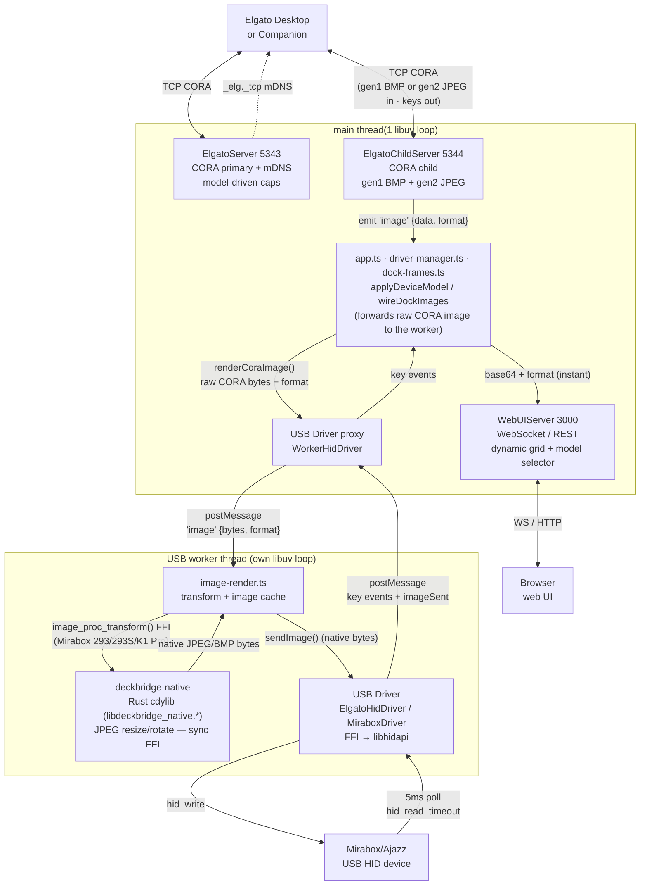
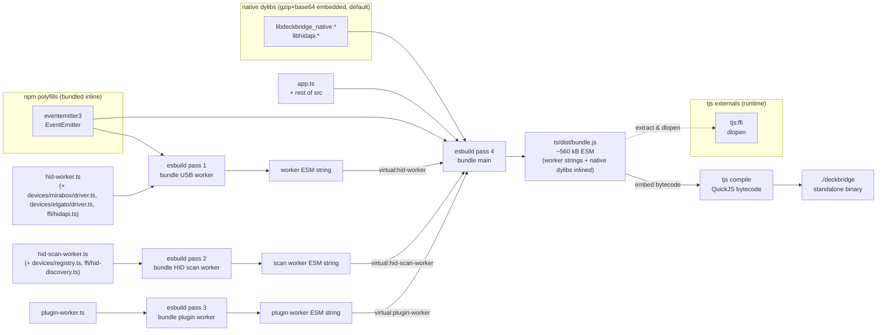
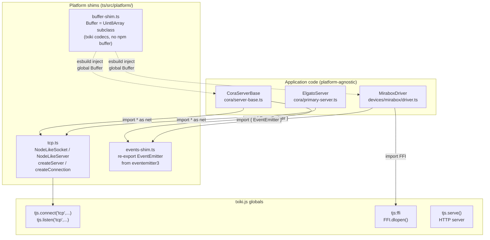
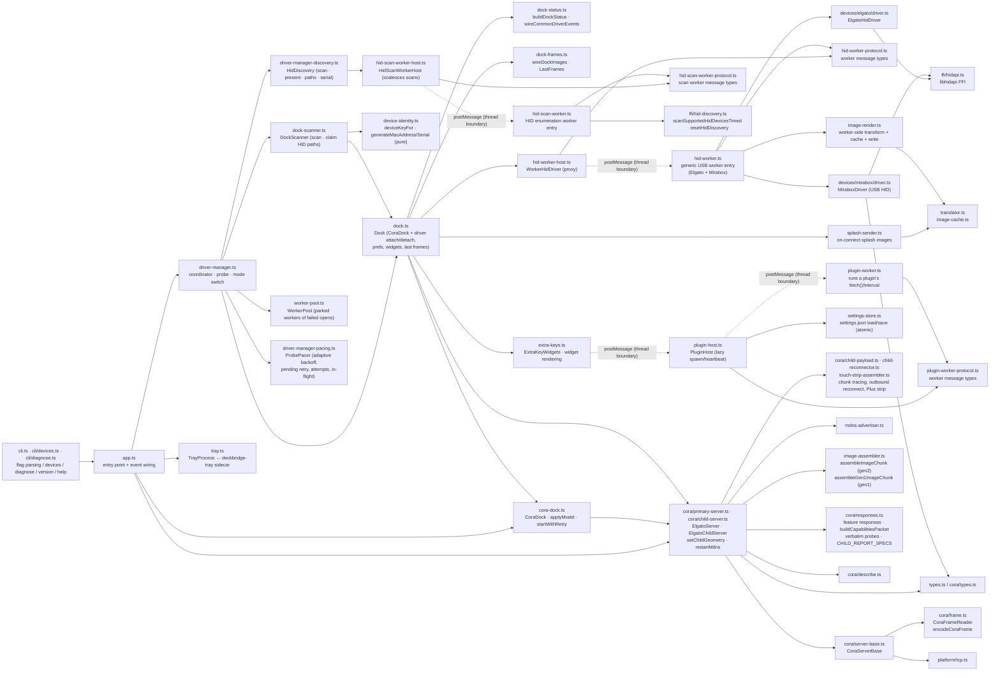

# DeckBridge — architecture & development

Deep technical documentation: build pipeline, threading model, protocol handling, and
module layout. For the user-facing overview see
[README.md](https://github.com/lukasMega/DeckBridge/blob/main/README.md); rendered docs at
<https://lukasmega.github.io/DeckBridge/>.

**Runtime:** [txiki.js](https://github.com/saghul/txiki.js) (QuickJS-ng + libuv + libffi)

## Quick start (from source)

```bash
# Prerequisites: libhidapi installed (txiki.js runtime is provided by mise)
mise run start

# Or step by step:
mise run build     # fetch txiki.js (mise) + bundle TS + build Rust sidecars (cdylib + tray)
mise run compile   # produce ./deckbridge binary
./deckbridge
```

## Slim txiki.js runtime (size optimization)

`mise run compile` self-embeds the txiki.js runtime, so a smaller runtime means a smaller
`deckbridge`. This app uses only `tjs:ffi`, raw TCP, and `tjs.serve` (HTTP + WebSocket) —
**none** of txiki.js's `sqlite3` or `WebAssembly`/WASI (WAMR) — so it ships a **slim**
runtime.

`mise run tjs-setup` (a dependency of `build`) puts that runtime at `$TJS` under
`../vendor`, and no-ops when it already exists. It downloads the prebuilt
**`slim-ffi`** asset of `$TXIKI_VERSION` (pinned in [`mise.toml`](https://github.com/lukasMega/DeckBridge/blob/main/mise.toml)) from
[lukasMega/txiki.js-with-slim-builds](https://github.com/lukasMega/txiki.js-with-slim-builds/releases)
— no toolchain needed. That profile keeps `tjs:ffi`, WebCrypto, `run`/`compile` and the
REPL, and drops TLS, WebAssembly, SQLite, mimalloc and the `eval`/`serve`/`test`/`bundle`/
`app` subcommands, built MinSizeRel + hardened with compressed bytecode. TLS costs ~430 KB
and buys nothing: every `fetch()` in this repo runs in the browser UI, not the runtime.

Effect on the shipped binary (macOS arm64): **6.4 MB → 2.4 MB**.

From-source is the fallback — required on **macOS x86_64** (no prebuilt slim asset) and
useful when changing the runtime itself:

```bash
mise run tjs-build     # or TJS_FROM_SOURCE=1 mise run build
```

[`../scripts/tjs-build.mjs`](../scripts/tjs-build.mjs) clones the fork at `$TXIKI_VERSION`
and runs *its* `scripts/build-dist.mjs --profile ffi` — the same driver that produces the
published assets, so the result matches the download byte for byte in configuration.

**Build deps (from-source only):** `git`, `cmake`, `npm`, a C/C++ toolchain, `libffi`
— macOS: `xcode-select --install && brew install cmake libffi`; Debian/Ubuntu:
`sudo apt-get install -y build-essential cmake git libffi-dev`.

## Running a packaged release

The standalone `deckbridge` binary is self-contained — just `../deckbridge`. Native dylibs
(`libdeckbridge_native`, `libhidapi`) are embedded (gzip+base64) and auto-extracted to a per-version
cache dir on first run (see [Build pipeline](#build-pipeline) for paths); no sidecar `.dylib`/`.so`
needed. A `deckbridge-tray` sidecar next to the binary is auto-detected and launched if present — the
tray is optional.

## Data flow


```mermaid
flowchart TD
    ELGATO["Elgato Desktop<br/>or Companion"]
    BROWSER["Browser<br/>web UI"]
    USB["Mirabox/Ajazz<br/>USB HID device"]

    subgraph "main thread(1 libuv loop)"
        EL_SERVER["ElgatoServer 5343<br/>CORA primary + mDNS<br/>model-driven caps"]
        EL_CHILD["ElgatoChildServer 5344<br/>CORA child<br/>gen1 BMP + gen2 JPEG"]
        APP["app.ts · driver-manager.ts · dock-frames.ts<br/>applyDeviceModel / wireDockImages<br/>(forwards raw CORA image to the worker)"]
        WEB["WebUIServer 3000<br/>WebSocket / REST<br/>dynamic grid + model selector"]
        HOST["USB Driver proxy<br/>WorkerHidDriver"]
    end

    subgraph "USB worker thread (own libuv loop)"
        REND["image-render.ts<br/>transform + image cache"]
        IMG["deckbridge-native<br/>Rust cdylib (libdeckbridge_native.*)<br/>JPEG resize/rotate — sync FFI"]
        MIR["USB Driver<br/>ElgatoHidDriver / MiraboxDriver<br/>FFI → libhidapi"]
    end

    ELGATO <-- "TCP CORA" --> EL_SERVER
    ELGATO <-- "TCP CORA<br/>(gen1 BMP or gen2 JPEG in · keys out)" --> EL_CHILD
    EL_CHILD -- "emit 'image' {data, format}" --> APP
    APP -- "base64 + format (instant)" --> WEB
    WEB <-- "WS / HTTP" --> BROWSER
    APP -- "renderCoraImage()<br/>raw CORA bytes + format" --> HOST
    HOST -- "postMessage<br/>'image' {bytes, format}" --> REND
    REND -- "image_proc_transform() FFI<br/>(Mirabox 293/293S/K1 Pro)" --> IMG
    IMG -- "native JPEG/BMP bytes" --> REND
    REND -- "sendImage() (native bytes)" --> MIR
    MIR -- "postMessage<br/>key events + imageSent" --> HOST
    HOST -- "key events" --> APP
    MIR -- "hid_write" --> USB
    USB -- "5ms poll<br/>hid_read_timeout" --> MIR
    EL_SERVER -.->|"_elg._tcp mDNS"| ELGATO
```

### Concurrency model

DeckBridge's core loop runs on **two threads**, connected only by `postMessage`, per connected
device. Two further worker types sit outside that loop (HID enumeration and plugins) — see
*Supporting workers* below, for **four** thread contexts in total:

- **Main thread** — the CORA TCP servers (Elgato primary/child), the WebUI HTTP/WebSocket server,
  and the orchestration forwarding each received CORA image to the worker. It must stay responsive:
  CORA image chunks are **ACK-paced** (Elgato waits for our ACK before the next), so any stall here
  throttles image delivery *and* the WebUI previews riding on it.
- **USB worker thread** — owns the libhidapi handle and does all **synchronous, blocking** work that
  must never stall the main loop: the JPEG/BMP **transform** (`image-render.ts` →
  `image_proc_transform` FFI, ~1 ms) + LRU **image cache**, then HID I/O (`hid_write` uploads,
  `hid_read_timeout` key polling). The main thread hands over raw CORA bytes via
  `WorkerHidDriver.renderCoraImage()`; the worker transforms, caches, and writes — so neither the
  transform nor a large upload stalls the CORA ACK loop (P1). A single generic worker
  (`hid-worker.ts`, proxied by `WorkerHidDriver`) serves every device; `USB_DRIVERS`
  ([usb-drivers.ts](../ts/src/devices/usb-drivers.ts)) picks by `model.protocol`:
  `ElgatoHidDriver` (MK.2, Mini), `MiraboxDriver` (293/293S/K1 Pro), or `Akp05Driver`
  (AJAZZ AKP05/AKP05E).

The split makes a full profile load fast on **both** sides: the main thread pushes every image to
the browser immediately while the device updates in parallel on the worker. USB I/O gets a whole
thread; the WebUI rides the main thread's spare time. Mock mode stays on the main thread.

**Multi-device**: this whole pair (CORA server pair + worker thread) repeats per physical device.

#### Supporting workers

Two lighter worker types sit outside the CORA/image hot path:

- **HID scan worker** ([hid-scan-worker.ts](../ts/src/worker/hid-scan-worker.ts), proxied by
  `HidScanWorkerHost` in [hid-scan-worker-host.ts](../ts/src/worker/hid-scan-worker-host.ts), message
  types in [hid-scan-worker-protocol.ts](../ts/src/worker/hid-scan-worker-protocol.ts)) — owns HID
  **enumeration**. `hid_enumerate` can block for seconds on Windows and on a wedged macOS HID
  interface, so it never runs on the main thread, where it would stall the CORA ACK loop. One
  worker for the whole process lifetime; the host coalesces concurrent callers onto a single
  native scan, so a fixed probe timer cannot queue duplicate scans behind a blocked interface.
  It builds its VID/PID match list from `DEVICE_MODELS` directly and calls
  `scanSupportedHidDevicesTimed()` ([ffi/hid-discovery.ts](../ts/src/ffi/hid-discovery.ts)),
  returning both the device list and the elapsed time — the latter is what feeds the adaptive
  probe backoff below. A `reset` message triggers `resetHidDiscovery()`, which **must** run on
  this thread: a new `IOHIDManager` binds to the run loop of whichever thread called `hid_init`.
- **Plugin worker** ([plugin-worker.ts](../ts/src/plugin/plugin-worker.ts), proxied by
  [plugin-host.ts](../ts/src/plugin/plugin-host.ts)) — runs plugin-widget code for side keys, lazily
  spawned and not part of the CORA/image path. A crash/CPU isolation boundary, **not** a
  capability sandbox; the host supervises it with a `HEARTBEAT_MS` (2 s) ping and kills/restarts
  a wedged worker, giving up after `MAX_CONSECUTIVE_KILLS` (3).

To keep image bursts from flooding the WebUI, per-chunk CORA tx/ACK and keepalive logs are `debug`
level, and `WebUIServer.notifyComm()` batches comm entries into one `commBatch` message every ~100 ms
(`COMM_BROADCAST_FLUSH_MS`) instead of one WS message per chunk. In `__SIMPLE_ONLY__` builds (the
default — no log/comm panel exists to render them) the `commBatch`/`logBatch` broadcasts and the
`/api/state` `logs`/`commLogs` fields are skipped entirely; the ring buffers themselves keep
filling, since diagnostics reads them directly.

### Network exposure

The CORA servers (5343/5344) listen on **all interfaces** (`0.0.0.0`) with **no
authentication** — protocol-inherent, as the real Elgato Network Dock has none either. Any LAN host
can connect, push images, and read key events. Set `DECKBRIDGE_BIND` (e.g. `127.0.0.1`) to restrict
the listen address. The WebUI (3000) binds `127.0.0.1` by default; `--bind`/`DECKBRIDGE_BIND` moves
both the CORA servers and the WebUI.

`/api/push/*` is the one token-authenticated path (bearer token, `Origin` must be absent or the
WebUI's own, no `Host` check; see [push-api.md](push-api.md)). A token authorizes nothing else, and
the admin routes stay unauthenticated on a LAN bind. A push flows: route → `PushController` →
in-memory `PushChannels` store → coalesced `pushChanged` event → `ExtraKeyWidgets.paintChanged()`,
which repaints only keys whose content changed. The CORA servers are never touched.

To reduce session-stealing, an actively-used CORA connection (sent data within
`CLIENT_EVICTION_GRACE_MS`, default 10 s) can't be evicted by a new connection — the newcomer's
socket is closed instead. A quiet connection (desktop app closed) can still be replaced.

Malformed-input guards on the CORA path: incoming images (gen2 JPEG / gen1 BMP) are decoded by
`deckbridge-native` with bounded limits (max 500×500 px, 900 KB decode alloc), so an
oversized/malformed image is rejected rather than allocating large buffers (real key images are ≤
~800 px); image chunks with an out-of-range `keyIndex` are dropped before assembly (an
unauthenticated peer can't grow assembly buffers or repaint key 0 via index coercion); and a frame
header declaring a `payloadLength` larger than the receive buffer forces a resync past the bad
header instead of stalling the reader.

### Startup & error handling

The CORA ports (5343/5344) are protocol-fixed and can't fall back like the WebUI port. If either is
in use (a second DeckBridge, a real Network Dock, or the ESP32 bridge), `CoraDock.startWithRetry()`
([cora-dock.ts](../ts/src/main/cora-dock.ts)) logs "port in use" to the console + WebUI feed and
retries every few seconds (unbounded for the primary dock — the port can't fall back, so it keeps
retrying), keeping the already-started WebUI alive instead of crashing. A shutdown signal during the
wait still exits cleanly. A scanned dock calls the same method with `maxAttempts: 1`: a bind failure
there throws back to the `DockScanner`'s own scan-tick retry loop instead of looping in place.

A global `unhandledrejection` handler (`app.ts`) turns an otherwise-fatal rejection into a graceful
`shutdown()` (device disconnect handshake, socket teardown, tray kill) rather than a hard-abort with
no cleanup. (txiki aborts on an un-`preventDefault`'d rejection, and a synchronous throw in a timer
callback has no global hook, so the two recurring timers — CORA keepalive and WebUI comm-flush — are
wrapped too.) On shutdown the `deckbridge-tray` sidecar is sent `SIGTERM` so it doesn't outlive the
main process.

## CLI

`app.ts` is still the sole entry point — there's no separate CLI binary. But CLI parsing
([cli.ts](../ts/src/shared/cli.ts)) is the very first thing `app.ts` does, before anything else runs,
because `version`/`help`/`devices` must exit immediately and any flags must land in `tjs.env`
before other modules read it. `parseCliArgs()` is a hand-rolled, zero-dependency parser (deliberately
kept dependency-free — it must not import anything else in the tree) recognizing one of five
commands (`run` (default), `devices`, `diagnose`, `version`, `help`) plus flags: `--bind`,
`--webui-port`, `--no-webui`, `--open`, `--headless`, `--log-level`, `--no-overrides`,
`--cache-dir`, `-h/--help`, `-V/--version`, and the `diagnose`-only `--out` and
`--redact-commands`. `applyFlagsToEnv()` normalizes flags into the corresponding `DECKBRIDGE_*` env vars
(flags override pre-existing env vars, which override defaults), so every downstream reader
(including the HID worker thread, since env is process-wide) keeps using its existing env-var reads
unchanged.
Development builds made with `DECKBRIDGE_BUILD_MOCK=1` also accept `--mock`;
release builds omit the mock driver and simulation routes.

`devices` ([cli/devices.ts](../ts/src/cli/devices.ts)) enumerates HID devices via
`deckbridge-native` — enumeration-only, never `hid_open` (the same macOS SIGBUS rule as
`driver-manager.ts`'s presence check applies here too) — and prints a formatted table before
`app.ts` calls `tjs.exit(0)`. Not wired into any `mise` task or `package.json` bin; it's invoked
directly (`./deckbridge devices`).

`diagnose` ([cli/diagnose.ts](../ts/src/cli/diagnose.ts)) writes a diagnostics report for bug
reports and exits — no server, and enumeration-only (never `hid_open`, same rule as above). It
shares its builder with `GET /api/diagnostics`: `web/server/diagnostics.ts` is a **pure** function
over injected sources, which is what lets both emit an identical report. The report embeds
settings.json verbatim, commands and all, by decision — `--redact-commands` opts out, and a review
notice is the report's first line. `--out <path>` overrides the default cache-dir location.

## HID device detection

At startup `app.ts` constructs a `DriverManager` ([driver-manager.ts](../ts/src/main/driver-manager.ts)); its `probeAndOpen()` iterates `DEVICE_MODELS` in priority order and returns the first device that opens. `driver-manager.ts` delegates three concerns: `driver-manager-discovery.ts` (`HidDiscovery`) scans on the scan worker and answers presence/path/serial queries from that snapshot, `worker-pool.ts` (`WorkerPool`) keeps the parked worker of a failed open for reuse (shared with the dock scan), and `driver-manager-pacing.ts` (`ProbePacer`) owns the reconnect state — the one pending retry timer, the failed-attempt count the tray shows, and the probe-in-flight flag. `DriverManager` itself holds only the mode (`'real'`/`'mock'`); the driver is dock 0's (`Dock.driver`). Tests inject fakes of the first two through `DriverManagerDeps`.

The retry interval is **adaptive, not fixed**. `ProbePacer` starts at `HID_POLL_INTERVAL_MS` (3 s) and keeps it while the scan stays fast; once a scan takes `SLOW_ENUMERATE_MS` (250 ms) or longer, `pacer.note()` doubles the delay on each subsequent slow scan, capped at `RECONNECT_BACKOFF_MAX_MS` (30 s). The enumeration timing comes from the HID scan worker, so a machine where `hid_enumerate` is pathologically slow backs off instead of spending its main thread on a scan every 3 s.

### Probe order

| Priority | Model | VID | PIDs | Open strategy |
|----------|-------|-----|------|---------------|
| 1 | Stream Deck MK.2 | `0x0fd9` | `0x0080`, `0x006d`, `0x00a5` | VID+PID |
| 2 | Stream Deck Mini | `0x0fd9` | `0x0063`, `0x0090`, `0x00b3`, `0x00b8` | VID+PID |
| 3 | Mirabox 293V3 | `0x6603` | `0x1005`, `0x1006`, `0x1010`, `0x1014` ‡ | usage-page path first, then VID+PID |
| 4 | Mirabox 293S | `0x5548` | `0x6670` | usage-page path first, then VID+PID |
| 5 | Mirabox K1 Pro | `0x6603` | `0x1015`, `0x1019` | usage-page path first, then VID+PID |
| 6 | Ajazz AKP153E (rev. 2) † | `0x0300` | `0x3010` | usage-page path first, then VID+PID |
| 7 | Ajazz AKP153R (rev. 2) † | `0x0300` | `0x3011` | usage-page path first, then VID+PID |
| 8 | Fifine AmpliGame D6 ¶ | `0x3142` | `0x0007` | usage-page path first, then VID+PID |
| 9 | Fifine AmpliGame D6 (rev. 2) ¶ | `0x3142` | `0x0060` | usage-page path first, then VID+PID |
| 10 | Ajazz AKP153 § | `0x5548` | `0x6674` | usage-page path first, then VID+PID |
| 11 | Ajazz AKP153E § | `0x0300` | `0x1010` | usage-page path first, then VID+PID |
| 12 | Ajazz AKP153R § | `0x0300` | `0x1020` | usage-page path first, then VID+PID |
| 13 | Mars Gaming MSD-ONE § | `0x0b00` | `0x1000` | usage-page path first, then VID+PID |
| 14 | Mad Dog GK150K § | `0x0c00` | `0x1000` | usage-page path first, then VID+PID |
| 15 | Risemode Vision 01 § | `0x0a00` | `0x1001` | usage-page path first, then VID+PID |
| 16 | TMICE Stream Controller § | `0x0500` | `0x1001` | usage-page path first, then VID+PID |

‡ `0x1014` is the **HSV293SV3 / "293S V3"** refresh — the same v3 board, so it rides the
293V3 model rather than getting its own entry (opendeck-akp153 names `0x1005` and `0x1014`
identically; keydeck's two device JSONs differ only in PID). Untested — no hardware. Note
it reports as "Mirabox 293V3" in the WebUI and mDNS name.

† **Untested — no hardware.** Both are the 293V3 board behind a different VID/PID: same
`mirabox-cora` v3 wire (1024-byte CRT packets, 512-byte reads), same `0xffa0`/`1` usage,
same 3×6 grid and key map, so `ajazz/akp153-rev2.ts` clones `MIRABOX_293_MODEL`. Rev. 1
(`0x0300:0x1010`/`0x1020`) is a **v1/512-byte** device and is deliberately not in the
registry — it would need a 293S-style model.

¶ **Rev. 2 hardware-tested (macOS); rev. 1 untested — no hardware.** The Fifine AmpliGame
D6 (`devices/fifine/fifine-d6.ts`) is the 293V3 board behind VID `0x3142`: same
`mirabox-cora` v3 wire, same `0xffa0`/`1` usage, same 3×5 grid and key map, so it clones
`MIRABOX_293_MODEL`. It is **two** models rather than one model with two PIDs because the
revisions use **different CRT packet sizes**: rev. 1 (`0x0007`) is 512-byte, rev. 2
(`0x0060`) is 1024-byte — 512-byte writes render black on rev. 2 according to four
independent reports. That asymmetry is deliberate; see the packet-size test in
`ts/test/device-models.test.ts`. A rev. 2 unit confirmed the whole path end to end:
enumeration via the `0xffa0`/`1` usage path, all 15 keys rendered through the sidecar, and
key events mapped as expected (wire `0x0f` → MK.2 index 14, `0x0b` → 10).

Because rev. 1's size is inferred rather than measured, these are the only models that set
`wire.packetSizeCandidates: [512, 1024]`. On open, `MiraboxDriver` reads the device's HID
report descriptor (`devices/hid-report-descriptor.ts`) and, if it states an
unambiguous output-report size that is one of those candidates, uses it instead of the
model constant and logs a warning. This is the one D6 unknown the hardware can settle for
itself: a wrong `packetSize` is otherwise **silent** — the firmware discards short writes
while `hid_write` still returns success, so the device enumerates and reports key presses
normally and only the panel stays black. The parser refuses (keeps the model constant) on
anything it cannot read with certainty, and the candidate list means a probe can only
correct a guess, never introduce an untested value. Panel resolution and
press-vs-release, by contrast, are **not** detectable and stay as plain constants.
`wire.chunkDelayMs` (inter-chunk busy-wait pacing) also exists for this family but is
left off — our worker already writes chunks synchronously and in order.

§ **Untested — no hardware, whole block.** The 7 v1 rebadges of the 293S board
(`devices/rebadge/akp153-v1-clones.ts`) — same `mirabox-cora-v1` wire (512-byte
packets, keydown-only), same `0xffa0`/`1` usage, same 3×6 grid and key map, so each
clones `MIRABOX_293S_MODEL` verbatim (only `id`/`name`/`vendor`/`usbVendorId`/
`usbProductIds` differ). Rest on two agreeing reference implementations (keydeck +
opendeck-akp153) plus the 293S board itself being hardware-verified — nothing here has
been probed on real units. v1 firmware also reports a hardcoded serial shared by every
unit of every v1 model (`355499441494`); `deviceKeyFor()` disambiguates by model id (see
[Settings persistence](#settings-persistence)).

Elgato models are probed first so they take priority over Mirabox; the loop is generic — every model opens through the same `WorkerHidDriver`. Models needing key remapping (Mirabox 293/293S/K1 Pro, via `hasInputKeyMap(model)`) have wire input codes translated by `deviceInputToMk2Index()` before forwarding to the CORA child server; Elgato models (empty `keyMap`) pass through unchanged.

### Open strategy per device

Every driver opens by path only, through `HidDeviceBase._openPath(path)` ([devices/hid-device-base.ts](../ts/src/devices/hid-device-base.ts)). The path comes from the main thread: the HID scan worker enumerates, `HidDiscovery.paths(model)` filters that snapshot by VID + PIDs (+ `usagePage`/`usage` when the model sets them), and `DriverManager`/`DockScanner` pass one path per physical unit to `open(hidPath)`. A model with no matching path is skipped, and the USB worker never enumerates.

There is no `hid_open(VID, PID)` fallback. On macOS it opens the device's first IOKit interface (often an unrelated collection) and a permission-denied open SIGBUSes the process; elsewhere it can grab the wrong unit when two of the same model are plugged in. A refused `hid_open_path` releases hidapi (`_releaseLibAfterFailedOpen`, so `worker.terminate()` stays safe) and throws — on macOS with the Input Monitoring hint — and the next scan retries.

The Mirabox/Ajazz/Fifine models set `usagePage`/`usage` (all `0xffa0`/`1`) to pick the data interface; Elgato models match on VID + PID alone.

### libhidapi loading

`loadHidapi()` ([ffi/hidapi.ts](../ts/src/ffi/hidapi.ts)) tries a platform-specific candidate list via `FFI.dlopen`. If the `HIDAPI_LIB` env var is set (packaged releases: the extracted embedded lib), it is tried first:

| Platform | Candidates (tried in order, after `HIDAPI_LIB`) |
|----------|-----------------------------|
| macOS | `/opt/homebrew/lib/libhidapi.dylib` (Apple Silicon), `/usr/local/lib/libhidapi.dylib` (Intel), bare `libhidapi.dylib` |
| Linux | `/usr/lib/x86_64-linux-gnu/libhidapi-hidraw.so.0`, `/usr/lib/libhidapi-hidraw.so.0`, bare `libhidapi-hidraw.so.0`, bare `libhidapi.so` |
| Windows | `hidapi.dll`, `C:\Windows\System32\hidapi.dll` |

If all candidates fail, the error includes install instructions (`brew install hidapi` / `sudo apt install libhidapi-dev`). The handle is shared across the worker session (module-level `_workerHidLib`); `hid_exit()` + `close()` run on disconnect.

### HID path enumeration

The Rust `deckbridge-native` cdylib ([rust/deckbridge-native/](https://github.com/lukasMega/DeckBridge/tree/main/rust/deckbridge-native)) is loaded at runtime via the `DECKBRIDGE_NATIVE_LIB` env var. Among its exports is:

```c
int mirabox_hid_find_path(uint16_t vid, uint16_t pid, uint16_t usage_page, uint16_t usage,
                          uint8_t *buf, size_t buf_len);
// pid == 0 matches any product ID. Returns 1 and writes the null-terminated HID path into buf on success, 0 if not found.
```

If `DECKBRIDGE_NATIVE_LIB` is unset, path-based open is skipped and the driver falls straight through to VID+PID.

### Serial and firmware reading

`ElgatoHidDriver.open()` calls `_readDeviceInfo()` after acquiring the handle, reading serial (feature report 0x03/0x06) and firmware (0x04/0x05) into `deviceSerial`/`deviceFirmware`. The worker propagates them via the `'opened'` message, and `applyDeviceModel()` forwards them to the CORA capabilities packet — only when `model.cora.usePhysicalIdentity` is set — so the desktop sees the physical device's own serial/firmware.

### Adding a new device model

Full walkthrough: [docs/adding-a-device.md](adding-a-device.md). In short:

1. Create a `DeviceModel` ([driver.ts](../ts/src/devices/driver.ts)) under `devices/elgato/` or `devices/mirabox/`; most behavior is in the nested specs (`image`, required `wire`, `keyMap`, `cora`, optional `splash`).
2. Add to `DEVICE_MODELS` in [registry.ts](../ts/src/devices/registry.ts) — list position is probe priority.
3. Set `usagePage`+`usage` only for a vendor-specific HID interface (all Mirabox use `0xffa0`/`1`); undefined for standard Elgato VID+PID.
4. Pick the `protocol`: it selects the driver in `USB_DRIVERS` ([usb-drivers.ts](../ts/src/devices/usb-drivers.ts)), the single registration point, and the tunable wire keys in `TUNABLE_WIRE_KEYS` ([driver.ts](../ts/src/devices/driver.ts)).
5. For a new wire protocol beyond the four variants, add a `DeviceProtocol` literal: Elgato variants implement pack/parse behavior under [protocol/](https://github.com/lukasMega/DeckBridge/tree/main/ts/src/devices/protocol) (in `PROTOCOL_STRATEGY`); packet and input sizes remain model-owned in `wire`. Mirabox variants are driven by `wire` fields in `devices/mirabox/driver.ts`.

## CORA device capabilities

The CORA capabilities packet (sent to the Elgato desktop on connect) advertises the child device geometry: rows, columns, key count, image dimensions, PID, product name, and serial.

`applyDeviceModel()` in [driver-manager.ts](../ts/src/main/driver-manager.ts) is the entry point for a
primary-dock model change; it delegates its server-facing half to `applyModelToServers()`
([dock-status.ts](../ts/src/main/dock-status.ts)), wrapped as `CoraDock.applyModel()`
([cora-dock.ts](../ts/src/main/cora-dock.ts)) for every dock (`Dock.setModel()`/`Dock.start()`) — one call replacing the
config/geometry/mDNS/capabilities push sequence below. Each
model's `cora` spec (`DeviceCoraSpec`) drives it:

1. **PID** — `model.cora.productId`. Elgato models use their real USB PID; Mirabox 293/293S advertise `ELGATO_MK2_PID`; K1 Pro advertises the Mini PID (`0x0063`).
2. **Geometry** — `advertisedGeometry(model)` resolves `model.cora.advertiseAs` through the registry, then derives geometry from that canonical model. Mirabox 293/293S reference `mk2`; K1 Pro references `mini`; Elgato models omit the reference and use their own geometry. No copied geometry constants exist.
3. **Identity** — when `model.cora.usePhysicalIdentity` is true (Elgato only), the device's real serial/firmware (read by the worker) is patched into the config; Mirabox keeps the default dock identity.

It then applies the change to both CORA servers and the WebUI:

- `resetImagePipeline()` + `webui.resetImages()` — drop the old model's per-key write queues and
  cached WebUI images so stale keys don't linger, then broadcast a repaint
- `server.setDeviceConfig(patch)` — update PID (+ serial/firmware for Elgato)
- `setChildGeometry(geo)` on both CORA servers (child reallocates `keyStates`, keeping the overlapping prefix on a hot-swap)
- `server.restartMdns(pid)` — re-advertise with the new PID (skipped when PID + serial are unchanged, to avoid dns-sd/avahi churn on every unplug/replug)
- `server.pushChildCapabilities()` — push updated caps to a connected desktop
- `webui.notifyDeviceModel(...)` — broadcast model state to the browser

Called on real connect (with worker serial/firmware), disconnect (resets to `DEFAULT_MODEL` = MK.2),
mock-mode startup, and a WebUI model-selector change.

## Multi-device: scanned docks

DeckBridge runs **one** dock by default: once the primary device is connected it stops scanning USB
altogether, and no second dock is created. Setting `"multiDeck": true` in settings.json (the
Settings → *Multiple decks* toggle in the web UI) raises the cap to `MAX_MULTI_DECK_DOCKS` (= 2)
docks — dock 0 (the primary, the only one with tray/key-activity coupling) plus one **scanned**
dock. Turning it back off tears the scanned dock down. `MAX_DOCKS` (= 4) remains the structural
ceiling: it sizes the dock-index/CORA-port space, not the user-facing limit.

Every dock — dock 0 and each scanned dock — is one **`Dock`** ([dock.ts](../ts/src/main/dock.ts)): a
**`CoraDock`** server pair ([cora-dock.ts](../ts/src/main/cora-dock.ts) — the composition unit above
`ElgatoServer`/`ElgatoChildServer` that owns the pairing watchdog, `applyModel()` and
`startWithRetry()`), whichever driver is attached (`attach()`/`detach()` — a `DockDriver`
([devices/driver.ts](../ts/src/devices/driver.ts)): the `WorkerHidDriver` proxy, or `MockDriver`
whose worker-only calls are no-ops, so no call site needs `?.`), the per-device identity and
`DockPrefs`, the `ExtraKeyWidgets` scheduler, knob (`EncoderActions`) and side-key
(`ExtraKeyActions`) overrides, and its own last-frame store (`LastFrames`,
[dock-frames.ts](../ts/src/main/dock-frames.ts)). The Dock handles the CORA side itself: images
(`wireDockImages()`: driver first, then the frame store, then the WebUI mirror), Elgato-app brightness
(unless the per-device override is on), and pairing (`markPaired`, auto-restart notice, the ~1 s
brightness re-push). Everything a Dock reports out goes through optional `DockHooks` (status changed,
disconnect, key activity, WebUI image/strip/widget mirrors, …), so the WebUI mirror is just the hook
set the caller passes.

`DriverManager` emits one `'changed'` event for any dock/probe state change (a dock attached or
stopped, brightness, pairing, rename, a failed probe); app.ts refreshes the WebUI dock list and the tray
from that one listener. It keeps every live dock in one `Map<index, Dock>`: WebUI per-dock actions go to
`driverManager.dock(i)` (or `dockForDevice(deviceKey)` for an identity edit), `getDockStatuses()`
lists every dock with a driver attached, and an image-only tuning change loops the map
(`Dock.applyTuning()` re-derives the effective model from the registry entry). Dock 0 is the one whose
servers live for the process: `DriverManager` attaches each newly probed driver to it, detaches it on
unplug, and `attach()` replays the app's last frames over the splash when the same model comes back
(the Elgato app keeps its pairing and never re-pushes).

- **`DockScanner`** ([dock-scanner.ts](../ts/src/main/dock-scanner.ts)) — runs
  its own scan timer (every `HID_POLL_INTERVAL_MS`) over HID paths not already claimed by the primary
  or another scanned dock, and builds a `Dock` per newly found physical unit (`createDock()`)
  into that same map, claiming its HID path and drawing its index from a pool of free indices
  (1..cap-1, lowest wins). With multi-deck off
  the pool is **empty and the timer never runs** — that is what makes a single connected deck the end
  of all USB enumeration, rather than a 3 s tick for the life of the process.

A scanned dock is self-contained: its own CORA server pair on ports strided by `CORA_PORT_STRIDE`
(`5343 + 2·index` / `5344 + 2·index`), its own mDNS advertisement and device identity, its own
`WorkerHidDriver` (its own worker thread and libhidapi handle). `Dock.start()` binds with
`maxAttempts: 1` (the primary's `startWithRetry()` in app.ts retries unboundedly — its ports are
protocol-fixed); the scanner's tick is its retry. A scanned dock has no tray, no
key-activity feed, and no replug replay: its Dock stops with its USB unit, and a replugged unit is a
new dock.

`app.ts` wires a `coraDockFactory` that returns a `CoraDock` per identity, calls
`driverManager.startScan()` on startup, and `stopScannedDocks()` on shutdown. The primary dock's
own CORA pair is wrapped in a `CoraDock` the same way; app.ts constructs and starts it and hands it to
`DriverManager` (`cora` dep), which wraps it as dock 0.

## Settings persistence

Per-device settings (brightness, brightness override, extra-key widget config)
and device identity (a stable MAC/serial pair so the Elgato desktop doesn't see a "new" device every
reconnect) persist to `<cacheRoot>/settings.json` (same cache root as the extracted native libs; see
[Build pipeline](#build-pipeline)):

- [settings-store.ts](../ts/src/infra/settings-store.ts) — disk I/O only: `loadSettings()`/`saveSettings()`
  write atomically (`<target>.tmp-<pid>-<counter>` + rename, same pattern as `native-libs.ts`), and
  `pluginsDir()` resolves the plugin-file directory.
- [device-identity.ts](../ts/src/infra/device-identity.ts) — pure, no I/O. `deviceKeyFor(hidPath, serial?,
  modelId?)` prefers a stable `usb:<serial>`-prefixed key over the volatile HID path;
  `generateMacAddress()` / `generateSerial()` derive a deterministic MAC/serial from that key via
  FNV-1a hashing, so replugging the same physical device reproduces the same identity. `protocol_version
  1` devices (293S + its 7 rebadges, `model.wire.sharedSerial`) all report the same hardcoded USB
  serial, so callers pass `modelId` for those models — the key becomes `usb:<serial>:<modelId>`,
  keeping two *different* v1 models apart (two units of the *same* v1 model still collide; there's no
  per-unit bit available). `settings-store.ts` migrates a pre-fix bare `usb:355499441494` entry to the
  293S-suffixed key on load, once, only when unambiguous (exactly one bare entry, no suffixed entry
  yet) — so an existing 293S user's identity survives the fix instead of forcing an Elgato re-pair.
- [settings.ts](../ts/src/infra/settings.ts) — `PersistedSettings` is the sole `settings.json`
  writer, loaded once by `app.ts` before the WebUI (also under `--no-webui`): shape-guards on load
  and on JSON import (a corrupt `extraKeys` map is stripped rather than dropping the whole identity
  entry, which would otherwise force an Elgato re-pair), `getOrCreateIdentity()`, `importDevices()`,
  `syncDockBrightness()`.
- [dock-prefs.ts](../ts/src/infra/dock-prefs.ts) — `settings.for(deviceKey)` returns a `DockPrefs`:
  one dock's brightness override, extra keys, strip mode, knobs and tap feedback, read and written
  live. A dock with no entry (mock mode, pre-connect) gets a runtime-only fallback, never persisted.
- [web/server/settings-file-controller.ts](../ts/src/web/server/settings-file-controller.ts) — the
  WebUI's file surface: export, open in the OS, and settings import, pushing an imported
  brightness/override/extra-key change live to the running driver + WS clients.

Nothing outside these files touches `settings.json` directly — `DriverManager`/`Dock`/
`DockScanner` get the `PersistedSettings` instance from `app.ts` and read
per-device values through `DockPrefs`.

## WebUI (`http://localhost:3000`)

### Dynamic grid

The key grid rebuilds when the model changes: `KeyPreview.rebuild(keyCount, columns)` (key-preview.ts) sets `root.style.gridTemplateColumns` and creates the right number of buttons; `KeyGridPreview.tsx` calls it from an effect keyed on `[keyCount, columns, modelId, coraProfile, clickable]`. Initial render is 5×3 (MK.2 default); the first `status` WebSocket message (sent on connect) rebuilds to the actual layout.

| Device | Grid |
|--------|------|
| Stream Deck MK.2 | 5×3 (15 keys) |
| Stream Deck Mini | 3×2 (6 keys) |
| Mirabox 293V3 | 5×3 (advertised as MK.2) |
| Mirabox 293S | 5×3 (left 5 of 6 hardware columns; advertised as MK.2) |
| Mirabox K1 Pro | 3×2 (advertised as Mini) |
| Ajazz AKP153E/R (rev. 2) | 5×3 (same as 293V3; advertised as MK.2) |
| Fifine AmpliGame D6 (rev. 1 and rev. 2) | 5×3 (same as 293V3; advertised as MK.2) |
| AKP153/E/R, MSD-ONE, GK150K, Vision 01, TMICE Stream Controller (v1 rebadges) | 5×3 (left 5 of 6 hardware columns, same as 293S; advertised as MK.2) |

### Device model selector

A `<select id="model-select">` dropdown switches the advertised model in **mock mode** (visible but disabled while a physical device is connected — the device determines the model). Selecting one tears down the mock driver, creates a new `MockDriver` with that geometry, and calls `applyDeviceModel(model)` (updates CORA caps, mDNS, grid). The dropdown is populated from `/api/state` on load; changes POST to `/api/device-model`.

### `WebUIServer` collaborators

`web-ui-server.ts` composes several focused collaborators rather than doing everything itself.
Route handlers get the per-concern controllers on `RouteContext` directly; `WebUIController` is only
the state that spans them (full state, dock selection, mock device):

| Class | File | Owns |
|---|---|---|
| `ActivityBuffers` | `web/server/activity-buffers.ts` | ring buffers for logs/CORA-comm/key-events; batches comm entries on the `COMM_BROADCAST_FLUSH_MS` timer (see [Concurrency model](#concurrency-model)); broadcast skipped in `__SIMPLE_ONLY__` builds, ring buffers still fill |
| `DockRegistry` | `web/server/dock-registry.ts` | the live per-dock `DockStatus[]` list + which dock is selected |
| `ImageChannel` | `web/server/image-channel.ts` | per-dock CORA image cache + the single live WS image channel (mirrors only the selected dock; instant dock-switch without an Elgato re-push) |
| `PersistedSettings` | `infra/settings.ts` (passed in by `app.ts`) | `settings.json` — see [Settings persistence](#settings-persistence) |
| `SettingsFileController` | `web/server/settings-file-controller.ts` | settings export/import + the multi-deck toggle |
| `ExtraKeysController` | `web/server/extra-keys-controller.ts` | extra-key widget config — see [Plugins and extra-key widgets](#plugins-and-extra-key-widgets) |
| `MockConfig` (`defaultMockConfig`/`mergeMockConfig`) | `web/server/mock-config.ts` | the mock driver's spoofed identity fields, validated for the WebUI's mock-config editor |
| `WebRequestGuard` (`isAllowedWebRequest`) | `web/server/web-request-guard.ts` | Host/Origin check against `localhost`/`127.0.0.1`/`[::1]` (+ this machine's own interface IPs when `--bind 0.0.0.0`) — DNS-rebinding/CSRF hardening for the WebUI, independent of the CORA ports' lack of auth (see [Network exposure](#network-exposure)) |

## Plugins and extra-key widgets

Some device models expose physical keys **outside** the emulated CORA grid — the Mirabox 293S's 6th
column (wire ids 16/17/18, `model.keyMap.extraKeys`) has no switches under those keys, display-only,
so they can't act as CORA keys but can show something. [extra-keys.ts](../ts/src/main/extra-keys.ts) lets
the WebUI assign each one a **widget**: `clock`, `date`, `text`, `weather` (Open-Meteo, no API key,
plain HTTP since the slim runtime has no TLS), `command` (runs a user-supplied shell command and
shows its stdout — full trust, same tradeoff as a build script), `plugin` (below), or `none`.
`renderWidgetLines()` picks the text; [widget-layout.ts](../ts/src/shared/widget-layout.ts) (`shared`) lays it
out in pixels on one of two six-rung bitmap-font ladders (`assets/font-atlas.ts`: Spleen monospace, or
proportional X11 Helvetica with per-glyph advances) per the key's `style` (`ExtraKeyTextStyle`: size
step or `'fit'`, wrap, font, alignment, padding, line gap, bold/outline, ellipsis), and
[widget-raster.ts](../ts/src/shared/widget-raster.ts) rasterizes it into a 24-bit BMP in the style's colours,
pushed through the existing splash path — so the worker's transform, not the main thread, does the
FFI JPEG encode. Each paint (bitmap, lines, style, clipped flag) is mirrored to the WebUI;
`POST /api/extra-key/preview` re-lays the last painted lines at every size in that style for the size
picker, which is exact because the lines don't depend on the size. Both atlases hold ASCII, Latin-1
and `…`; `scripts/gen-font-atlas.mjs` regenerates them from the upstream BDFs. A per-dock `ExtraKeyWidgets` scheduler
(one instance per `Dock` with a driver attached) ticks every second
and repaints a key only when its content changed.

Extra keys *with* a switch exist too: the AJAZZ AKP05E re-paired as a Stream Deck + drops its right
column from the 4×2 Plus grid, and its emulation key map lists those keys in `extraKeys` (image wire
ids 15/10) with their input codes in the parallel `extraKeyInputs` (5/10). `wireCommonDriverEvents`
routes such a press to `onExtraKey` by image wire id instead of CORA, and a per-dock `ExtraKeyActions`
([command-actions.ts](../ts/src/main/command-actions.ts), shared with the knob override in `encoders.ts`)
runs the key's `pressCommand`, at most one process per key.
[web/server/extra-keys-controller.ts](../ts/src/web/server/extra-keys-controller.ts) is the
WebUI-facing glue: assign/clear a widget or set a press command (independent fields of one config;
persists + broadcasts), "run now" for command widgets, and the plugin dropdown/status for the popup.

### Plugins — a third, lazily-spawned worker thread

A `plugin` widget runs arbitrary user JS from a file in `pluginsDir()` (see
[Settings persistence](#settings-persistence)) on its own worker thread — separate from, and much
lighter than, the always-on USB worker:

- **`plugin-worker.ts`** — the worker entry. A plugin exports `{ interval?, async fetch(ctx) }`.
  Before importing any plugin file it deletes the global `fetch`/`WebSocket`, because calling either
  inside *any* txiki Worker aborts the whole process (a runtime constraint, not a plugin-specific
  bug) — so a plugin's own `ctx.fetch` is proxied back to the main thread over `postMessage` instead.
  `pollLoop()` imports the plugin once, then polls it forever at its configured interval, posting a
  `value`/`error` message each tick.
- **`plugin-host.ts`** — main-thread owner, `class PluginHost`. Spawns the worker lazily on the
  *first* request for a configured plugin key, and tears it down once no plugin keys reference it
  (unlike the always-on HID worker). Runs a `ping`/`pong` heartbeat (`HEARTBEAT_MS = 2000`) and
  respawns a hung/crashed worker, permanently disabling a plugin after `MAX_CONSECUTIVE_KILLS = 3`
  crash-loop restarts. Also executes the actual `fetch()` calls proxied from the worker
  (`http://` only — no TLS in the slim build). Exposes `pluginValueFor()` (used by `extra-keys.ts`),
  `pluginKeyStatus()`, and `listPluginFiles()` (the WebUI dropdown).
- **`plugin-worker-protocol.ts`** — the `MainToPluginWorker`/`PluginWorkerToMain` message union,
  mirroring `hid-worker-protocol.ts`'s role for the USB worker.

Built the same way as the HID worker (see [Build pipeline](#build-pipeline)): a second esbuild pass
bundles `plugin-worker.ts` into an ESM string embedded as `virtual:plugin-worker`, spawned as a
blob-URL module worker. Plugin JS has the same trust level as the `command` widget — full fs/spawn/
FFI access; the worker thread is a crash/CPU isolation boundary only, not a sandbox. `app.ts` and
`driver-manager*.ts` have no references to plugins — the whole subsystem is private to
`extra-keys.ts` plus the WebUI controller, entirely outside the core CORA/USB orchestration.

## System tray

A small Rust sidecar (`deckbridge-tray`, built with the `tray-icon` + `tao` crates) shows a status icon and menu. The
main process spawns it and talks to it over two channels: the tray's **stdout** (lifecycle + menu
events) and a **loopback TCP** connection (icon/status pushes). `../ts/src/infra/tray.ts` (`TrayProcess`)
owns the TS side; `app.ts` pushes a `TrayState` on every device/client connect and disconnect.
`TrayProcess.close()` sends the sidecar `SIGTERM` so it doesn't outlive the main process across
shutdowns/restarts.

| Icon | Condition |
|------|-----------|
| green (`full`) | USB device open **and** Elgato client connected |
| yellow (`usb_only`) | USB device open, no Elgato client |
| gray (`disconnected`) | no USB device |

The menu offers **Open Web UI**, **Check Requirements** (the `/requirements` diagnostics page),
**Restart Elgato App** (manual restart of the local Elgato Stream Deck app — see
[Troubleshooting](./troubleshooting.md#restarting-the-elgato-app)), and **Quit**. Rust only emits the
click event for the restart item; the restart itself runs on the TS side, which owns settings,
logging and the running-process check. The tray is spawned only when `DECKBRIDGE_TRAY_BIN` points at the binary (`mise run start` sets it);
if it is unset or the spawn fails, `startTray()` returns `null` and the app runs normally. See
[rust/deckbridge-tray/README.md](https://github.com/lukasMega/DeckBridge/blob/main/rust/deckbridge-tray/README.md) for the full protocol.

## Build pipeline

Four esbuild passes (`build.mjs`). Each worker is bundled into a self-contained ESM **string**
and embedded into the main bundle through a virtual module:

| Pass | Entry | Virtual module | Also written to (debug) |
|---|---|---|---|
| 1 | `hid-worker.ts` (generic USB worker — Mirabox + Elgato gen1/gen2) | `virtual:hid-worker` | `dist/hid-worker.js` |
| 2 | `hid-scan-worker.ts` (HID enumeration, see [Supporting workers](#supporting-workers)) | `virtual:hid-scan-worker` | `dist/hid-scan-worker.js` |
| 3 | `plugin-worker.ts` (see [Plugins and extra-key widgets](#plugins-and-extra-key-widgets)) | `virtual:plugin-worker` | `dist/plugin-worker.js` |
| 4 | `app.ts` + rest of `src` | — | `dist/bundle.js` |

(The browser-side `ui-entry.ts` subtree is bundled the same way too and embedded as text via the
`ui-ts-as-text` plugin.)

Native dylibs (`libdeckbridge_native`, `libhidapi`) are **gzip+base64-encoded** into `bundle.js` at
build time (default on; `EMBED_NATIVE_LIBS=0` / `--no-embed` to disable), making the bundle
**platform-specific**. At runtime they extract on first run to `~/Library/Caches/deckbridge/native-<hash>/`
(macOS) or `${XDG_CACHE_HOME:-~/.cache}/deckbridge/native-<hash>/` (Linux). `DECKBRIDGE_NATIVE_LIB` /
`HIDAPI_LIB` take precedence when set (dev: `mise run build` populates them from the just-built dylibs).


```mermaid

flowchart LR
    WTS["hid-worker.ts<br/>(+ devices/mirabox/driver.ts, devices/elgato/driver.ts, ffi/hidapi.ts)"]
    SWTS["hid-scan-worker.ts<br/>(+ devices/registry.ts, ffi/hid-discovery.ts)"]
    PWTS["plugin-worker.ts"]
    TS["app.ts<br/>+ rest of src"]
    EB1["esbuild pass 1<br/>bundle USB worker"]
    EBS["esbuild pass 2<br/>bundle HID scan worker"]
    EBP["esbuild pass 3<br/>bundle plugin worker"]
    WSTR["worker ESM string"]
    SWSTR["scan worker ESM string"]
    PWSTR["plugin worker ESM string"]
    EB2["esbuild pass 4<br/>bundle main"]
    BUNDLE["ts/dist/bundle.js<br/>~560 kB ESM<br/>(worker strings + native dylibs inlined)"]
    TJSC["tjs compile<br/>QuickJS bytecode"]
    BIN["./deckbridge<br/>standalone binary"]

    WTS --> EB1 --> WSTR
    SWTS --> EBS --> SWSTR
    PWTS --> EBP --> PWSTR
    WSTR -->|"virtual:hid-worker"| EB2
    SWSTR -->|"virtual:hid-scan-worker"| EB2
    PWSTR -->|"virtual:plugin-worker"| EB2
    TS --> EB2 --> BUNDLE
    BUNDLE -->|"embed bytecode"| TJSC --> BIN

    subgraph "native dylibs (gzip+base64 embedded, default)"
        IMG_DL["libdeckbridge_native.*<br/>libhidapi.*"]
    end
    IMG_DL --> EB2

    subgraph "npm polyfills (bundled inline)"
        EE["eventemitter3<br/>EventEmitter"]
    end
    EE --> EB1
    EE --> EB2

    subgraph "tjs externals (runtime)"
        FFI["tjs:ffi<br/>dlopen"]
    end
    BUNDLE -.->|"extract & dlopen"| FFI
```

At runtime the worker starts as a **blob-URL module worker**
(`new Worker(URL.createObjectURL(new Blob([src])), { type: 'module' })`): a compiled `tjs` binary
can't load a worker from a disk path or `data:` URL, but a blob URL works in both `tjs run` and the
compiled binary — keeping the single-file binary self-contained.

## Testing

```bash
mise run test        # bundle + run every ts/test/*.test.ts on the txiki.js runtime
mise run test-client # browser regressions for the web UI, in headless Chrome
mise run ci-checks   # lint + typecheck + test + test-client + knip
```

Tests run on the same QuickJS/txiki.js runtime as the app (not Node), with **no test framework**:
each `ts/test/*.test.ts` is a standalone script using `tjs:assert` + a local `test()`/`runTest()`
helper and exits `tjs.exit(failed > 0 ? 1 : 0)`. The `test` task bundles each with
`node build.mjs --test <name>` then runs `$TJS run dist/test/<name>.js` (also the single-file recipe).

All tests are **hardware-free** (pure logic, fakes, local sockets). Real-device work lives in the
`smoke` task (USB HID, needs a Mirabox) or `e2e` (black-box test of a packaged zip).

The web UI has a second, separate suite: `ts/test/client-regressions.tsx` renders Preact against a
real DOM in **headless Chrome** — `ts/scripts/test-client.mjs` bundles it to an IIFE, loads it in a
temp HTML page with `--dump-dom`, and asserts the dumped DOM contains `data-result="pass"`
(browser from `CHROME_BIN`, else the macOS Chrome path, else `google-chrome` on `PATH`). It covers
the parts that can't run under `tjs`: the hand-rolled `useSyncExternalStore` port and the
shallow-memo `useStore` selector in `ts/src/web/client/lib/store.ts`, plus the clipboard copy UI
(`lib/use-copy-text.ts`, `CopyChip`, `LogConsolePanel`). It is a `.tsx`, not a `*.test.ts`, so
`mise run test` never picks it up; `ci-checks` runs it as the `test-client` task.

| Area | Test files · notable coverage |
|---|---|
| CORA framing | `packets` (Mirabox builders + framing), `cora-frame` (resync/overflow/oversized-`payloadLength` E10), `assembler`, `elgato-child-image-bounds` (out-of-range `keyIndex` drop, L4) |
| Image pipeline | `translator` (key-map incl. `-1` E2 + Rust transform), `image-cache` (full-buffer FNV-1a incl. icon-on-black regression, LRU), `dock-frames` (driver-before-WebUI order, record-while-attached, same-model replay), `image-render` (worker transform/cache/remap/passthrough), `hash-bench` |
| Drivers & models | `device-models` (probe order, keyMap perms, 293S 6th-col drop, caps geometry), `driver-manager` (connect/reconnect, mode-switch, E1), `dock` (per-index ports, splash on start, key/image event wiring, Elgato brightness/override, mDNS rename), `hid-worker-host` (failed-`open` reuse — SIGBUS-safe), `mirabox-parse` (0x04 vs 0x00), `k1pro-chunk-pad` |
| Servers | `server` (primary+child over real TCP; L6/E3/E4/H3 + WebUI brightness), `pairing` (full MK.2 handshake), `feature-response` (cora/responses.ts report-id branches + MAC guard) |
| Web & infra | `web-ui-server` (MAC/port/Broadcaster, NaN-PID V4, `resetImages` L3), `ui-helpers-docks` (dock list vs legacy-field synthesis), `key-preview`, `tray` (path helpers + `SIGTERM` L1), `mdns-advertiser` (per-platform `buildArgs`, E9), `native-libs` (extract/gunzip/cleanup), `buffer-shim` |
| Settings & identity | `settings-store` (atomic write, corrupt/missing/array-shaped JSON → `{}`, concurrent-save safety), `device-identity` (stable `usb:<serial>` key vs unstable path fallback, deterministic MAC/serial, no-collision sampling) |
| CLI | `cli` (flag parsing incl. `tjs run <bundle>` vs compiled-binary argv shape), `cli-devices` (device table formatting, known/unknown VID+PID rows) |
| Plugins & extra keys | `extra-keys` (widget rendering: clock/date/text/weather/command/plugin, lat/lon parsing), `plugin-host` (message round-trip, lazy spawn, heartbeat respawn, `MAX_CONSECUTIVE_KILLS` disable, `http://`-only fetch proxy) |
| Probes (non-assertion) | `k1pro-probe-layout`, `splash-size` — reproduce K1 Pro JPEG variants byte-for-byte and write samples under `/tmp` for offline analysis |
| Captured hardware | `hid-report-descriptor`'s last block replays the real 54-byte report descriptor of a Fifine D6 rev. 2 (`test/fixtures/fifine-d6-rev2.report-descriptor.json`, taken with `mise run d6-capture`) — it pins the packet-size probe to bytes a physical board emitted, not to synthetic ones |

### Coverage

```bash
mise run coverage    # instrument, run all tests, emit merged report
```

`mise run coverage` runs the full tjs suite under **Istanbul source instrumentation** — which is
engine-agnostic (rewrites JS to increment counters on `globalThis.__coverage__`), so tests run on
real **txiki.js/QuickJS-ng**, not Node/vitest (which can't host the FFI, socket, and worker tests).
Each process flushes its map to `ts/coverage/.tmp/<name>.json`; `scripts/coverage-report.mjs` (Node)
merges them into `../ts/coverage` — stdout summary, `index.html` (+ `lcov-report/`), and `lcov.info`.
The task builds the Rust dylib first (`depends = ["deckbridge-native"]`) so FFI tests run for real.
Set `COVERAGE_ENFORCE=1` to fail below thresholds (off by default).

## Platform abstraction layer


```mermaid
flowchart TD
    subgraph "Application code (platform-agnostic)"
        CSB["CoraServerBase<br/>cora/server-base.ts"]
        ELG["ElgatoServer<br/>cora/primary-server.ts"]
        MIR["MiraboxDriver<br/>devices/mirabox/driver.ts"]
    end

    subgraph "Platform shims (ts/src/platform/)"
        TCP["tcp.ts<br/>NodeLikeSocket / NodeLikeServer<br/>createServer / createConnection"]
        BUF_SHIM["buffer-shim.ts<br/>Buffer = Uint8Array subclass<br/>(txiki codecs, no npm buffer)"]
        EV_SHIM["events-shim.ts<br/>re-export EventEmitter<br/>from eventemitter3"]
    end

    subgraph "txiki.js globals"
        TJS_TCP["tjs.connect('tcp',...)<br/>tjs.listen('tcp',...)"]
        TJS_FFI["tjs:ffi<br/>FFI.dlopen()"]
        TJS_SERVE["tjs.serve()<br/>HTTP server"]
    end

    CSB -- "import * as net" --> TCP
    ELG -- "import * as net" --> TCP
    TCP --> TJS_TCP

    MIR -- "import FFI" --> TJS_FFI

    CSB -- "import { EventEmitter }" --> EV_SHIM
    MIR -- "import { EventEmitter }" --> EV_SHIM

    BUF_SHIM -. "esbuild inject<br/>global Buffer" .-> CSB
    BUF_SHIM -. "esbuild inject<br/>global Buffer" .-> MIR
```

## Module map


```mermaid
graph LR
    CLI["cli.ts · cli/devices.ts · cli/diagnose.ts<br/>flag parsing / devices / diagnose / version / help"]
    APP["app.ts<br/>entry point + event wiring"]

    DM["driver-manager.ts<br/>coordinator · probe · mode switch"]
    DM_E["dock-scanner.ts<br/>DockScanner (scan · claim HID paths)"]
    DM_D["driver-manager-discovery.ts<br/>HidDiscovery (scan · present · paths · serial)"]
    DM_POOL["worker-pool.ts<br/>WorkerPool (parked workers of failed opens)"]
    DM_PACE["driver-manager-pacing.ts<br/>ProbePacer (adaptive backoff,<br/>pending retry, attempts, in-flight)"]
    DS["dock.ts<br/>Dock (CoraDock + driver attach/detach,<br/>prefs, widgets, last frames)"]
    DSS["dock-status.ts<br/>buildDockStatus · wireCommonDriverEvents"]
    DID["device-identity.ts<br/>deviceKeyFor · generateMacAddress/Serial (pure)"]
    IP["dock-frames.ts<br/>wireDockImages · LastFrames"]
    SPLASH["splash-sender.ts<br/>on-connect splash images"]
    CORA_DOCK["cora-dock.ts<br/>CoraDock · applyModel · startWithRetry"]
    EK["extra-keys.ts<br/>ExtraKeyWidgets · widget rendering"]

    HOST_HID["hid-worker-host.ts<br/>WorkerHidDriver (proxy)"]
    WRK_HID["hid-worker.ts<br/>generic USB worker entry<br/>(Elgato + Mirabox)"]
    PROTO_HID["hid-worker-protocol.ts<br/>worker message types"]
    HID_BASE["devices/elgato/driver.ts<br/>ElgatoHidDriver"]
    MIR["devices/mirabox/driver.ts<br/>MiraboxDriver (USB HID)"]
    REND["image-render.ts<br/>worker-side transform + cache + write"]

    HOST_SCAN["hid-scan-worker-host.ts<br/>HidScanWorkerHost (coalesces scans)"]
    WRK_SCAN["hid-scan-worker.ts<br/>HID enumeration worker entry"]
    PROTO_SCAN["hid-scan-worker-protocol.ts<br/>scan worker message types"]
    HID_DISC["ffi/hid-discovery.ts<br/>scanSupportedHidDevicesTimed · resetHidDiscovery"]

    HOST_PLG["plugin-host.ts<br/>PluginHost (lazy spawn/heartbeat)"]
    WRK_PLG["plugin-worker.ts<br/>runs a plugin's fetch()/interval"]
    PROTO_PLG["plugin-worker-protocol.ts<br/>worker message types"]

    TRAY_N["tray.ts<br/>TrayProcess → deckbridge-tray sidecar"]
    SETTINGS["settings-store.ts<br/>settings.json load/save (atomic)"]

    HIDAPI["ffi/hidapi.ts<br/>libhidapi FFI"]

    ELG["cora/primary-server.ts · cora/child-server.ts<br/>ElgatoServer · ElgatoChildServer<br/>setChildGeometry · restartMdns"]
    ELG_PAYLOAD["cora/child-payload.ts · child-reconnector.ts<br/>touch-strip-assembler.ts<br/>chunk tracing, outbound reconnect, Plus strip"]
    CSB["cora/server-base.ts<br/>CoraServerBase"]
    CF["cora/frame.ts<br/>CoraFrameReader<br/>encodeCoraFrame"]

    MDNS["mdns-advertiser.ts"]
    IMG_A["image-assembler.ts<br/>assembleImageChunk (gen2)<br/>assembleGen1ImageChunk (gen1)"]
    FEAT["cora/responses.ts<br/>feature responses · buildCapabilitiesPacket<br/>verbatim probes · CHILD_REPORT_SPECS"]
    DESC["cora/describe.ts"]
    TRANS["translator.ts<br/>image-cache.ts"]
    TYPES["types.ts / cora/types.ts"]

    TCP["platform/tcp.ts"]

    CLI --> APP
    APP --> DM
    DS --> IP
    APP --> ELG
    APP --> TRAY_N
    APP --> CORA_DOCK
    CORA_DOCK --> ELG
    DS --> CORA_DOCK
    DM --> DS
    DM --> DM_E
    DM --> DM_D
    DM --> DM_POOL
    DM --> DM_PACE
    DM_D --> HOST_SCAN
    HOST_SCAN -.->|"postMessage (thread boundary)"| WRK_SCAN
    HOST_SCAN --> PROTO_SCAN
    WRK_SCAN --> PROTO_SCAN
    WRK_SCAN --> HID_DISC
    DM_E --> DS
    DS --> DSS
    DS --> HOST_HID
    DS --> ELG
    DM_E --> DID
    DS --> SPLASH
    SPLASH --> TRANS
    DS --> EK
    EK -.->|"postMessage (thread boundary)"| HOST_PLG
    HOST_PLG -.->|"postMessage (thread boundary)"| WRK_PLG
    HOST_PLG --> PROTO_PLG
    WRK_PLG --> PROTO_PLG
    HOST_PLG --> SETTINGS

    HOST_HID -.->|"postMessage (thread boundary)"| WRK_HID
    HOST_HID --> PROTO_HID
    WRK_HID --> PROTO_HID
    WRK_HID --> HID_BASE
    WRK_HID --> MIR
    WRK_HID --> REND
    REND --> TRANS
    HID_BASE --> HIDAPI
    MIR --> HIDAPI

    ELG --> CSB
    ELG --> ELG_PAYLOAD
    CSB --> CF
    CSB --> TCP
    ELG --> IMG_A
    ELG --> FEAT
    ELG --> DESC
    ELG --> MDNS
    ELG --> TYPES
    MIR --> TYPES
```

## Directory layout

```
deckbridge/
├── mise.toml           ← task runner (build, compile, run, typecheck, test)
├── docs-site/          ← Docusaurus documentation site (npm; mermaid→SVG, local search)
├── ts/
│   ├── build.mjs       ← esbuild config (also bundles tests via --test <name>)
│   ├── tsconfig.json
│   ├── package.json    ← dev deps: esbuild, typescript/tsgo (@typescript/native-preview), eventemitter3, preact, lint/coverage tooling (oxlint/eslint, istanbul, knip)
│   ├── test/           ← *.test.ts suite (run on the txiki.js runtime; see "Testing")
│   ├── src/   (see the Module map above for relationships; one folder per runtime tier,
│   │          and each folder is one eslint-plugin-boundaries element)
│   │   ├── main/         ← main-thread composition root: app.ts · driver-manager*.ts (probe/open,
│   │   │                    adaptive backoff) · dock.ts · dock-status.ts · dock-frames.ts
│   │   │                    · dock-scanner*.ts (docks 1..N) · image-perf.ts
│   │   │                    · cora-dock.ts (server pair, watchdog, applyModel, startWithRetry)
│   │   │                    · extra-keys.ts · widget-lines.ts · widget-refresh.ts
│   │   │                    · encoders.ts · command-actions.ts
│   │   ├── cora/         ← CORA primary/child servers (5343/5344): primary-server.ts · child-server.ts
│   │   │                    · child-payload.ts · child-reconnector.ts · touch-strip-assembler.ts
│   │   │                    · plus-reports.ts · server-base.ts · frame.ts · describe.ts
│   │   │                    · responses.ts (every CORA reply builder)
│   │   │                    · image-assembler.ts (gen1/gen2 assembly) · pairing-watchdog.ts · types.ts
│   │   ├── worker/       ← USB worker (hid-worker.ts; drivers via devices/usb-drivers.ts) + HID scan worker, their
│   │   │                    main-side hosts (*-host.ts) and message protocols (*-protocol.ts)
│   │   ├── plugin/       ← plugin-widget worker, its supervising host and message protocol
│   │   ├── transform/    ← worker-side image path: translator.ts (FFI transform) · image-render.ts
│   │   │                    · image-cache.ts (LRU)
│   │   ├── devices/      ← driver.ts (DeviceModel + specs) · registry.ts · hid-device-base.ts
│   │   │                    (HidDeviceBase) · model-overrides.ts · mock.ts · elgato/driver.ts
│   │   │                    (ElgatoHidDriver) · mirabox/{driver,protocol}.ts · ajazz/ · fifine/
│   │   │                    · rebadge/ · protocol/
│   │   ├── infra/        ← native-libs.ts · mdns-advertiser.ts · tray.ts · log-file.ts
│   │   │                    · settings-store.ts · device-identity.ts · os-utils.ts · update-check.ts
│   │   │                    · daily-ping*.ts
│   │   ├── cli/          ← devices.ts · diagnose.ts (`devices` / `diagnose` subcommands)
│   │   ├── shared/       ← zero-FFI leaves any tier may import: types.ts · logger.ts · cli.ts (flag
│   │   │                    parsing) · key-map.ts · splash-sender.ts · widget-*.ts …
│   │   ├── dev/          ← hardware probes (mirabox-smoke, k1pro-probe, d6-capture, akp05-*) + probe-utils
│   │   ├── ffi/          ← hidapi.ts (libhidapi) · hid-discovery.ts (timed enumeration + reset)
│   │   │                    · image-proc.ts (libdeckbridge_native, DECKBRIDGE_NATIVE_LIB)
│   │   ├── platform/     ← tcp.ts · buffer-shim.ts · events-shim.ts (shims over txiki globals)
│   │   ├── assets/       ← generated splash JPEGs + font atlas
│   │   └── web/          ← contract.ts (wire DTOs) · server/ (WebUIServer + activity-buffers/
│   │                          dock-registry/image-channel/*-controller/…) · client/ (browser UI)
│   └── dist/             ← bundle.js (~560 kB, workers + native dylibs inlined)
│                            · hid-worker.js · hid-scan-worker.js · plugin-worker.js (debug copies)
├── rust/
│   ├── deckbridge-native/   ← JPEG resize/rotate + HID path-enum cdylib (FFI via DECKBRIDGE_NATIVE_LIB);
│   │                          Cargo features: jpeg-upstream (default) / jpeg-fork, HID behind `usb`
│   ├── jpeg-encoder/        ← vendored jpeg-encoder 0.6.1 fork (interleaved optimized Huffman; JPEG_FORK=1)
│   └── deckbridge-tray/     ← system-tray sidecar binary (Rust; tray-icon + tao)
```
