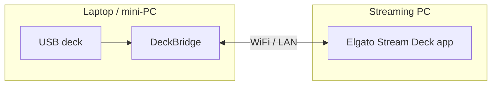

# Features & Use Cases

DeckBridge turns a USB Stream Deck into a network device the Elgato app can use over
WiFi.

## Use a budget deck with the Elgato app

DeckBridge lets the **official Elgato Stream Deck app** drive cheap, non-Elgato decks —
Mirabox, Ajazz, and similar 15-key (3×5) boards — on the same PC that runs the app. The
app sees a regular **Network device** at `localhost`; the deck behaves like Elgato
hardware.

<input type="radio" name="db-step" id="db-s1" />
<input type="radio" name="db-step" id="db-s2" />
<input type="radio" name="db-step" id="db-s3" />
<input type="radio" name="db-step" id="db-s4" />

<svg viewBox="0 0 760 300" xmlns="http://www.w3.org/2000/svg" role="img" aria-label="DeckBridge pairing scene">
<rect x="4" y="4" width="752" height="292" rx="16" fill="#f5f6f8" stroke="#e2e5eb"/>
<polygon points="58,222 292,222 308,236 42,236" fill="#c2c7d2" stroke="#b0b6c2"/>
<rect x="70" y="86" width="210" height="132" rx="10" fill="#ffffff" stroke="#d2d6df" stroke-width="2"/>
<rect x="72" y="88" width="206" height="24" rx="6" fill="#4f63d2"/>
<text x="82" y="105" fill="#ffffff" font-size="13" font-weight="700" font-family="sans-serif">DeckBridge</text>
<circle class="db-sdot" cx="86" cy="142" r="5"/>
<text class="db-status st1" x="98" y="146" font-size="12" fill="#6b7280" font-family="sans-serif">Starting…</text>
<text class="db-status st2" x="98" y="146" font-size="12" fill="#6b7280" font-family="sans-serif">Waiting for USB…</text>
<text class="db-status st3" x="98" y="146" font-size="12" font-weight="600" fill="#2bb673" font-family="sans-serif">Mirabox detected</text>
<text class="db-status st4" x="98" y="146" font-size="12" font-weight="600" fill="#2bb673" font-family="sans-serif">Streaming to Elgato</text>
<text x="82" y="178" font-size="10" fill="#9aa0ad" font-family="sans-serif">Network dock · CORA :5343</text>
<g class="db-cable"><path d="M286 150 C 352 150, 372 196, 444 196" fill="none" stroke="#9aa0ad" stroke-width="7" stroke-linecap="round"/><rect x="436" y="188" width="16" height="16" rx="3" fill="#7a8290"/></g>
<rect x="430" y="110" width="270" height="170" rx="16" fill="#23262e" stroke="#0f1115" stroke-width="2"/>
<rect class="db-btn" x="444" y="124" width="42" height="42" rx="6"/>
<rect class="db-btn" x="494" y="124" width="42" height="42" rx="6"/>
<rect class="db-btn" x="544" y="124" width="42" height="42" rx="6"/>
<rect class="db-btn" x="594" y="124" width="42" height="42" rx="6"/>
<rect class="db-btn" x="644" y="124" width="42" height="42" rx="6"/>
<rect class="db-btn" x="444" y="174" width="42" height="42" rx="6"/>
<rect class="db-btn" x="494" y="174" width="42" height="42" rx="6"/>
<rect class="db-btn" x="544" y="174" width="42" height="42" rx="6"/>
<rect class="db-btn" x="594" y="174" width="42" height="42" rx="6"/>
<rect class="db-btn" x="644" y="174" width="42" height="42" rx="6"/>
<rect class="db-btn" x="444" y="224" width="42" height="42" rx="6"/>
<rect class="db-btn" x="494" y="224" width="42" height="42" rx="6"/>
<rect class="db-btn" x="544" y="224" width="42" height="42" rx="6"/>
<rect class="db-btn" x="594" y="224" width="42" height="42" rx="6"/>
<rect class="db-btn" x="644" y="224" width="42" height="42" rx="6"/>
<rect class="db-dim" x="4" y="4" width="752" height="292" rx="16" fill="#0b0d12"/>
<g class="db-elg"><rect x="200" y="92" width="360" height="150" rx="14" fill="#ffffff" stroke="#d4d8e0"/><rect x="200" y="92" width="360" height="34" rx="14" fill="#15171c"/><rect x="200" y="112" width="360" height="14" fill="#15171c"/><text x="218" y="114" fill="#ffffff" font-size="13" font-weight="600" font-family="sans-serif">Elgato Stream Deck</text><text x="218" y="150" font-size="11" fill="#6b7280" font-family="sans-serif">Devices › Add a network device</text><rect x="218" y="160" width="324" height="56" rx="8" fill="#f4f6fb" stroke="#dfe3ec"/><rect x="230" y="172" width="32" height="32" rx="5" fill="#23262e"/><text x="274" y="184" font-size="12" font-weight="600" fill="#2b2f38" font-family="sans-serif">Network Stream Deck</text><text x="274" y="201" font-size="11" fill="#4f63d2" font-family="sans-serif">IP  localhost</text><rect x="466" y="172" width="62" height="32" rx="6" fill="#4f63d2"/><text x="497" y="193" fill="#ffffff" font-size="12" font-weight="600" text-anchor="middle" font-family="sans-serif">Pair</text></g>
</svg>

1 · Run DeckBridge2 · Plug the Stream Deck into USB3 · DeckBridge detects the deck4 · Pair it in Elgato — Network device · localhost

<label class="db-nav nav-p1" for="db-s1" title="Previous">‹</label>
<label class="db-nav nav-p2" for="db-s1" title="Previous">‹</label>
<label class="db-nav nav-p3" for="db-s2" title="Previous">‹</label>
<label class="db-nav nav-p4" for="db-s3" title="Previous">‹</label>

<label class="db-dot dot1" for="db-s1" title="Step 1"></label>
<label class="db-dot dot2" for="db-s2" title="Step 2"></label>
<label class="db-dot dot3" for="db-s3" title="Step 3"></label>
<label class="db-dot dot4" for="db-s4" title="Step 4"></label>

<label class="db-nav nav-n1" for="db-s2" title="Next">›</label>
<label class="db-nav nav-n2" for="db-s3" title="Next">›</label>
<label class="db-nav nav-n3" for="db-s4" title="Next">›</label>
<label class="db-nav nav-n4" for="db-s4" title="Next">›</label>

## Feature overview

- **Network Dock emulation** — Elgato CORA protocol over TCP, advertised via mDNS
  `_elg._tcp` ("Network Stream Deck"); the app discovers it like real hardware.
- **Works with non-Elgato decks** — [supported](./introduction.md#supported-devices)
  Mirabox / Ajazz decks present themselves to the app as an Elgato model it already
  knows, so nothing changes app-side.
- **Per-device image pipeline** — resizes, rotates, and (for the K1 Pro) re-encodes every
  button image to the device's native format via a Rust native library, with a cache
  to skip repeat work.
- **Non-blocking by design** — USB HID and the 50–200 ms image transforms run on a
  separate worker thread, so the network ACK loop and web UI never stall.
- **Live web UI** — `http://localhost:3000` shows the key grid and a log feed in real time.
- **System tray + diagnostics** — installer builds add a status tray icon
  ([states](./getting-started.md#3-run-it)) and a `/requirements` self-check page.
- **Standalone binary** — one **&lt;5 MB** file built on txiki.js; no Node.js.

## Use cases

- **Put the deck on another computer** — plug the deck into a laptop or mini-PC, run
  DeckBridge there, and control the Elgato app on your streaming PC across the LAN.
- **Skip the Network Dock** — network-dock behaviour for hobby setups without buying
  the hardware.
- **Use a real Stream Deck wirelessly** — a Stream Deck Mini or MK.2 works the same way,
  over WiFi instead of a cable.
- **Bitfocus Companion** — Companion also speaks the dock protocol and discovers
  DeckBridge the same way.

<strong>⚠ Hobby use</strong> 
DeckBridge is for personal and hobby use, and does not replace the Elgato Network Dock. See the <a href="/introduction">Introduction</a> for the full disclaimer.

## Permissions

Each permission is requested on first use; no admin / root rights are required.

| Permission | Platform | Why |
|---|---|---|
| **Input Monitoring** | macOS | Reading HID reports (key presses) from the deck. Grant it to the app or terminal running DeckBridge, then restart it. |
| **Local Network** | macOS 15+ | Advertising over Bonjour / mDNS and serving the CORA ports on the LAN. macOS may prompt on first run. |
| **Firewall allow** | macOS / Windows | Inbound TCP on 5343 / 5344 so the Elgato app can connect. Allow it if your firewall prompts. |

## Requirements

The `/requirements` page (tray → **Check Requirements**) verifies each of these at runtime:

| Requirement | macOS | Linux | Windows |
|---|---|---|---|
| **libhidapi** | bundled / `brew install hidapi` | `sudo apt install libhidapi-dev` | bundled |
| **deckbridge-native** (Rust lib) | bundled | bundled | bundled |
| **mDNS** | Bonjour (built in) | `avahi-daemon` running | built in (Win10 1803+) |
| **Tray helper** | bundled (installer builds) | — | bundled |
| **Free TCP ports** | 5343 / 5344 must be free | same | same |

Packaged releases embed libhidapi and the native library, so a **source build** is the
only case that needs a system libhidapi installed.

## Files, ports & data

**DeckBridge stores no personal data and sends no telemetry.**

### Reads

- Its **own embedded libraries** (libhidapi, deckbridge-native) from inside the binary.
- The system **libhidapi** (source builds, or when overridden via `HIDAPI_LIB`).
- A handful of **environment variables** (below). There is no config file.

### Writes

- **Native library cache** — extracts the embedded libs once per version to:
  - macOS: `~/Library/Caches/deckbridge/native-<build-hash>/`
  - Linux: `$XDG_CACHE_HOME/deckbridge/` (or `~/.cache/deckbridge/`)
  - fallback: a temp directory if the cache root isn't writable

  Old `native-<hash>` folders from previous versions are cleaned up automatically.
- **Debug image dumps** — only when `DECKBRIDGE_DUMP_DIR` / `DECKBRIDGE_RAW_DUMP_DIR` are
  set. Off by default.

### Network ports

| Port | Bind | Purpose |
|---|---|---|
| **5343** | `0.0.0.0` (LAN) | CORA main server — the Elgato app connects here |
| **5344** | `0.0.0.0` (LAN) | CORA child server — image / data channel |
| **3000** | `127.0.0.1` only | Web UI |
| mDNS `_elg._tcp` | LAN | Service discovery ("Network Stream Deck") |

Set `DECKBRIDGE_BIND=127.0.0.1` to restrict the CORA ports to the local machine. The web
UI is always localhost-only.

## Limitations

- **One deck at a time** — a single connected device is bridged; multiple simultaneous
  devices are not yet supported (planned).
- **Keys only** — no dials, encoders, touchscreens, or LCD strips (Stream Deck +/Plus,
  Neo, and similar are out of scope).
- **Fixed ports** — CORA is hard-wired to **5343 / 5344**; conflicts with a real Elgato
  Network Dock or a second DeckBridge instance on the same machine.
- **No auth or encryption** — the CORA ports trust the LAN; see
  [Network ports](#network-ports).

### Environment variables

| Variable | Effect |
|---|---|
| `DECKBRIDGE_BIND` | Bind address for the CORA servers (default `0.0.0.0`) |
| `HIDAPI_LIB` | Path to a specific libhidapi |
| `DECKBRIDGE_NATIVE_LIB` | Path to the deckbridge-native cdylib |
| `DECKBRIDGE_TRAY_BIN` | Path to the tray helper binary |
| `DECKBRIDGE_OPEN` | Auto-open the web UI in a browser on start |
| `DECKBRIDGE_MOCK` | Run with a mock device (no hardware) |
| `DECKBRIDGE_DUMP_DIR` | Write each transformed device image here (debug) |
| `DECKBRIDGE_RAW_DUMP_DIR` | Write paired raw + transformed images here (debug) |
