# Features & Use Cases

DeckBridge turns a USB Stream Deck into a network device the Elgato app can use over
WiFi.

## Use a budget deck with the Elgato app

DeckBridge lets the **official Elgato Stream Deck app** drive cheap, non-Elgato decks —
Mirabox, Ajazz, and similar boards, from 6-key minis to 15-key (3×5) decks. The app sees
a regular **Network device** at `localhost`; the deck behaves like Elgato hardware.

<div class="db-stepper" role="group" aria-label="Pairing a budget Stream Deck with DeckBridge in four steps">
<input type="radio" name="db-step" id="db-s1" />
<input type="radio" name="db-step" id="db-s2" />
<input type="radio" name="db-step" id="db-s3" />
<input type="radio" name="db-step" id="db-s4" />
<div class="db-stage">
<svg viewBox="0 0 760 300" xmlns="http://www.w3.org/2000/svg" role="img" aria-label="DeckBridge pairing scene">
<rect x="4" y="4" width="752" height="292" rx="16" fill="#f5f6f8" stroke="#e2e5eb"/>
<polygon points="58,222 292,222 308,236 42,236" fill="#c2c7d2" stroke="#b0b6c2"/>
<rect x="70" y="86" width="210" height="132" rx="10" fill="#ffffff" stroke="#d2d6df" stroke-width="2"/>
<rect x="72" y="88" width="206" height="24" rx="6" fill="#4f63d2"/>
<text x="82" y="105" fill="#ffffff" font-size="13" font-weight="700" font-family="sans-serif">DeckBridge</text>
<circle class="db-sdot" cx="86" cy="142" r="5"/>
<text class="db-status st1" x="98" y="146" font-size="12" fill="#6b7280" font-family="sans-serif">Starting…</text>
<text class="db-status st2" x="98" y="146" font-size="12" fill="#6b7280" font-family="sans-serif">Waiting for USB…</text>
<text class="db-status st3" x="98" y="146" font-size="12" font-weight="600" fill="#2bb673" font-family="sans-serif">Mirabox detected</text>
<text class="db-status st4" x="98" y="146" font-size="12" font-weight="600" fill="#2bb673" font-family="sans-serif">Streaming to Elgato</text>
<text x="82" y="178" font-size="10" fill="#9aa0ad" font-family="sans-serif">Network dock · CORA :5343</text>
<g class="db-cable"><path d="M286 150 C 352 150, 372 196, 444 196" fill="none" stroke="#9aa0ad" stroke-width="7" stroke-linecap="round"/><rect x="436" y="188" width="16" height="16" rx="3" fill="#7a8290"/></g>
<rect x="430" y="110" width="270" height="170" rx="16" fill="#23262e" stroke="#0f1115" stroke-width="2"/>
<rect class="db-btn" x="444" y="124" width="42" height="42" rx="6"/>
<rect class="db-btn" x="494" y="124" width="42" height="42" rx="6"/>
<rect class="db-btn" x="544" y="124" width="42" height="42" rx="6"/>
<rect class="db-btn" x="594" y="124" width="42" height="42" rx="6"/>
<rect class="db-btn" x="644" y="124" width="42" height="42" rx="6"/>
<rect class="db-btn" x="444" y="174" width="42" height="42" rx="6"/>
<rect class="db-btn" x="494" y="174" width="42" height="42" rx="6"/>
<rect class="db-btn" x="544" y="174" width="42" height="42" rx="6"/>
<rect class="db-btn" x="594" y="174" width="42" height="42" rx="6"/>
<rect class="db-btn" x="644" y="174" width="42" height="42" rx="6"/>
<rect class="db-btn" x="444" y="224" width="42" height="42" rx="6"/>
<rect class="db-btn" x="494" y="224" width="42" height="42" rx="6"/>
<rect class="db-btn" x="544" y="224" width="42" height="42" rx="6"/>
<rect class="db-btn" x="594" y="224" width="42" height="42" rx="6"/>
<rect class="db-btn" x="644" y="224" width="42" height="42" rx="6"/>
<rect class="db-dim" x="4" y="4" width="752" height="292" rx="16" fill="#0b0d12"/>
<g class="db-elg"><rect x="200" y="92" width="360" height="150" rx="14" fill="#ffffff" stroke="#d4d8e0"/><rect x="200" y="92" width="360" height="34" rx="14" fill="#15171c"/><rect x="200" y="112" width="360" height="14" fill="#15171c"/><text x="218" y="114" fill="#ffffff" font-size="13" font-weight="600" font-family="sans-serif">Elgato Stream Deck</text><text x="218" y="150" font-size="11" fill="#6b7280" font-family="sans-serif">Devices › Add a network device</text><rect x="218" y="160" width="324" height="56" rx="8" fill="#f4f6fb" stroke="#dfe3ec"/><rect x="230" y="172" width="32" height="32" rx="5" fill="#23262e"/><text x="274" y="184" font-size="12" font-weight="600" fill="#2b2f38" font-family="sans-serif">Network Stream Deck</text><text x="274" y="201" font-size="11" fill="#4f63d2" font-family="sans-serif">IP  localhost</text><rect x="466" y="172" width="62" height="32" rx="6" fill="#4f63d2"/><text x="497" y="193" fill="#ffffff" font-size="12" font-weight="600" text-anchor="middle" font-family="sans-serif">Pair</text></g>
</svg>
</div>
<div class="db-controls">
<div class="db-caption"><span class="db-cap cap1">1 · Run DeckBridge</span><span class="db-cap cap2">2 · Plug the Stream Deck into USB</span><span class="db-cap cap3">3 · DeckBridge detects the deck</span><span class="db-cap cap4">4 · Pair it in Elgato — Network device · localhost</span></div>
<div class="db-navrow">
<label class="db-nav nav-p1" for="db-s1" title="Previous">‹</label>
<label class="db-nav nav-p2" for="db-s1" title="Previous">‹</label>
<label class="db-nav nav-p3" for="db-s2" title="Previous">‹</label>
<label class="db-nav nav-p4" for="db-s3" title="Previous">‹</label>
<div class="db-dots">
<label class="db-dot dot1" for="db-s1" title="Step 1"></label>
<label class="db-dot dot2" for="db-s2" title="Step 2"></label>
<label class="db-dot dot3" for="db-s3" title="Step 3"></label>
<label class="db-dot dot4" for="db-s4" title="Step 4"></label>
</div>
<label class="db-nav nav-n1" for="db-s2" title="Next">›</label>
<label class="db-nav nav-n2" for="db-s3" title="Next">›</label>
<label class="db-nav nav-n3" for="db-s4" title="Next">›</label>
<label class="db-nav nav-n4" for="db-s4" title="Next">›</label>
</div>
</div>
</div>

## Feature overview

- **Network Dock emulation** — Elgato CORA protocol over TCP, advertised via mDNS
  `_elg._tcp` ("Network Stream Deck"); the app discovers it like real hardware.
- **Works with non-Elgato decks** — [supported](./introduction.mdx#supported-devices)
  Mirabox / Ajazz decks present themselves to the app as an Elgato model it already
  knows, so nothing changes app-side.
- **Browser deck (opt-in)** — a phone or tablet becomes one more network dock, with press
  and hold; see [Browser deck](./browser-deck.md).
- **Multiple decks (opt-in, max 2)** — off by default: DeckBridge uses one deck and stops
  looking for further USB devices once it is connected. Switch it on in Settings and a
  second deck appears as its own network dock, with per-deck pairing cards, a selectable
  live preview, and per-deck brightness in the web UI; see
  [Multiple decks](#multiple-decks) for the walkthrough and
  [Limitations](#limitations) for the rules and caveats.
- **Per-device image pipeline** — resizes, rotates, and (for the K1 Pro) re-encodes every
  button image to the device's native format via a Rust native library, with a cache
  to skip repeat work.
- **Non-blocking by design** — USB HID and the image transforms run on a
  separate worker thread, so the network ACK loop and web UI never stall.
- **Side-key widgets** — decks with display-only keys outside the grid (e.g. the 293S
  sixth column) show server-rendered clock / date / text / weather / command / plugin
  widgets; see [Side-key widgets](./side-keys.md).
- **Push API** — other tools (OBS, Home Assistant, scripts, `deckbridge push`) write text
  onto side keys and AKP05/AKP05E strip zones over token-authenticated HTTP, with a TTL;
  see [Push API](./push-api.md).
- **Standby and burn-in care (opt-in)** — dim or turn off an idle deck, show a dim moving
  clock while the Elgato app is away, run a night-time brightness window, and shift
  DeckBridge's own widgets by 1 px; see [Standby and burn-in care](#standby-and-burn-in-care).
- **Live web UI** — `http://localhost:3000` shows the key grid and a log feed in real time.
- **Device tuning** — rotation, flip, image fit, quality and size are adjustable at
  runtime per model, with a key-map learn mode that derives the correct key mapping from
  the hardware itself. For boards supported from documentation rather than from hardware
  we own; see [Device tuning](./troubleshooting.md#device-tuning).
- **Log file + diagnostics report** — logs are written to disk (rotated, ~6 MB cap), and
  a single pasteable report can be produced from the web UI or with
  `./deckbridge diagnose` — which works even when the web UI never starts. See
  [Troubleshooting](./troubleshooting.md).
- **System tray + diagnostics** — packaged releases (installers and release zips) include
  a status tray icon ([states](./getting-started.mdx#3-run-it)) and a `/requirements`
  self-check page.
- **Standalone binary** — one **&lt;5 MB** file built on txiki.js; no Node.js.

## Web UI states

Web UI always shows current setup state. No guessing required.

| Waiting for USB | Elgato conflict |
|---|---|
| 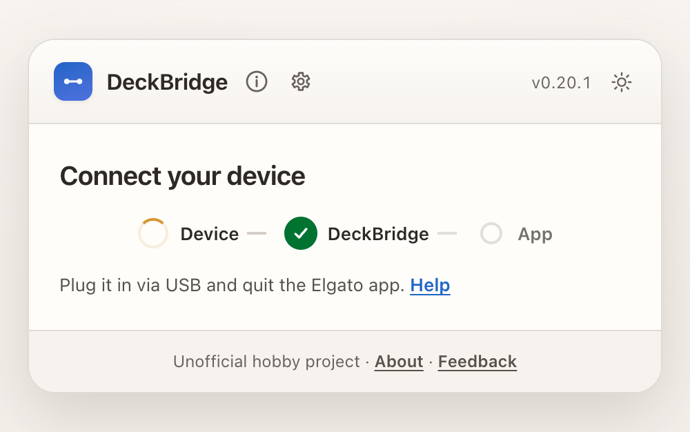 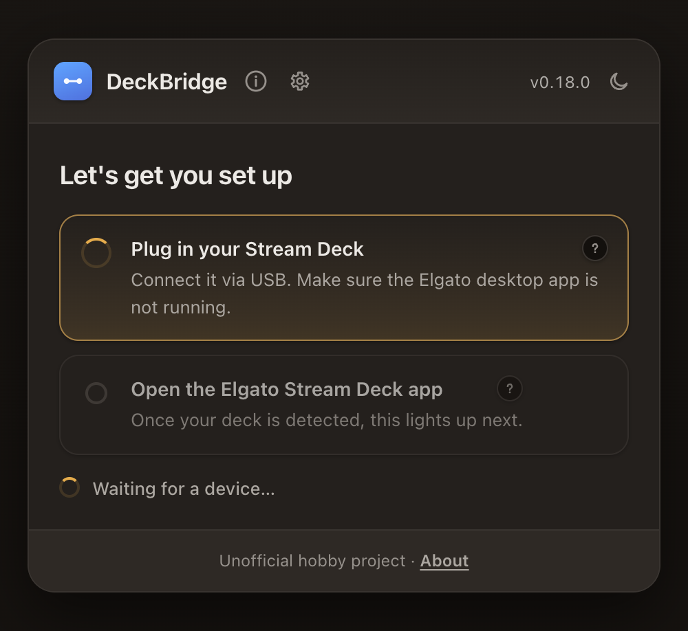 | 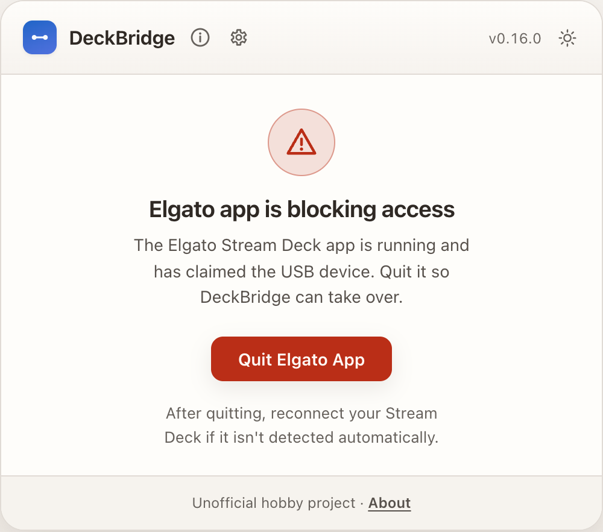 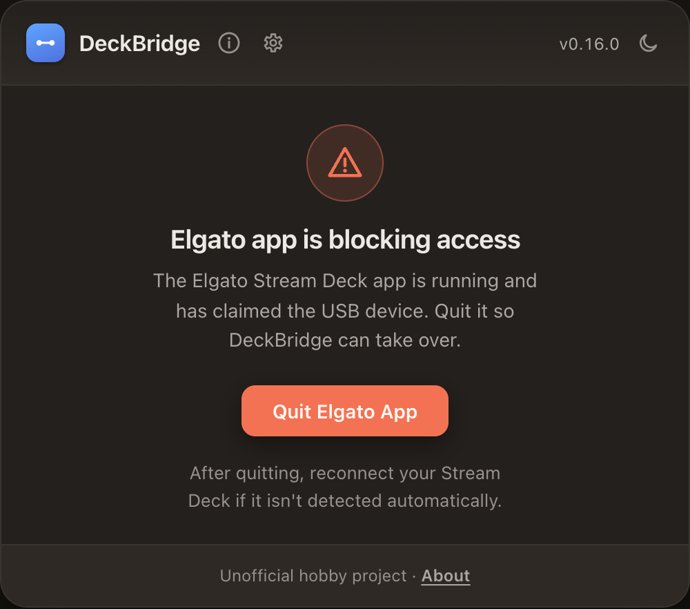 |
| **Ready to pair** | **Connected and working** |
| 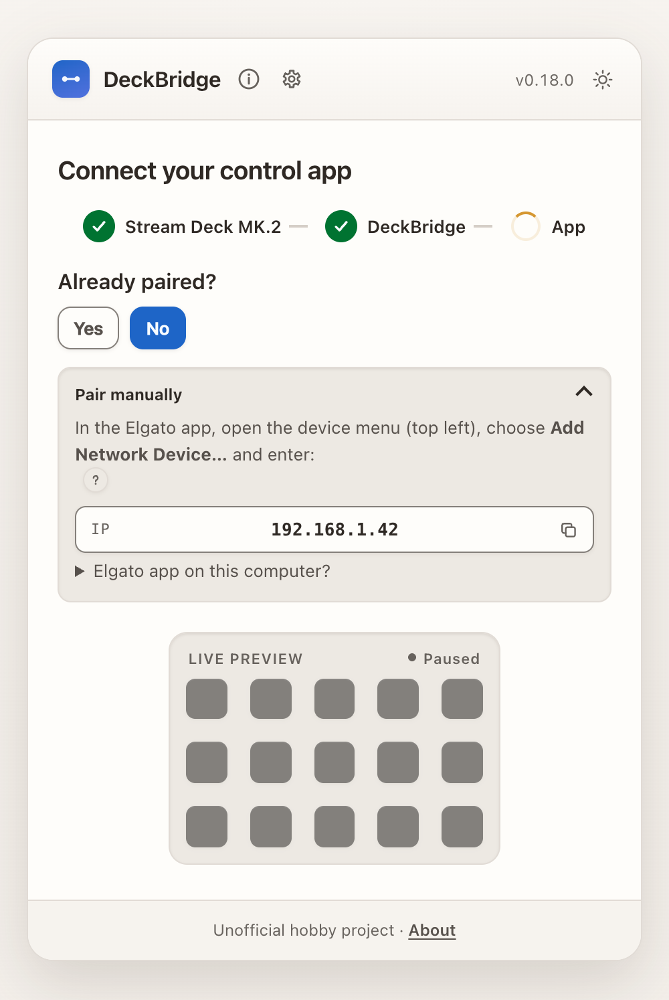 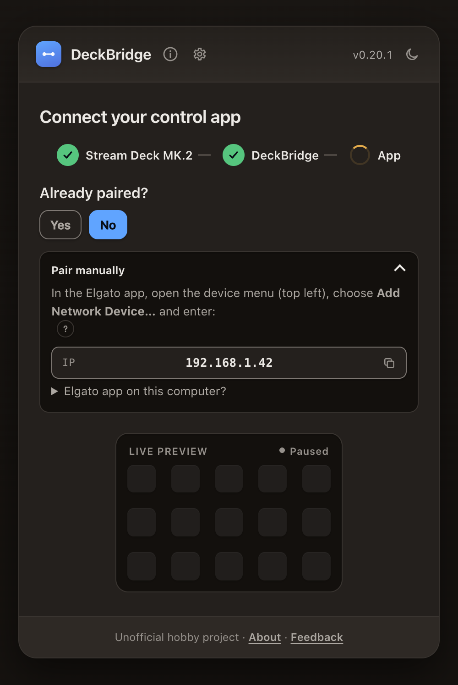 | 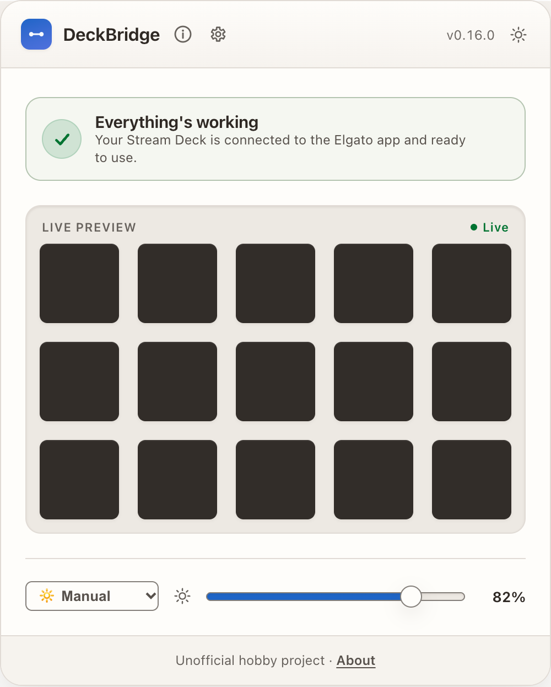 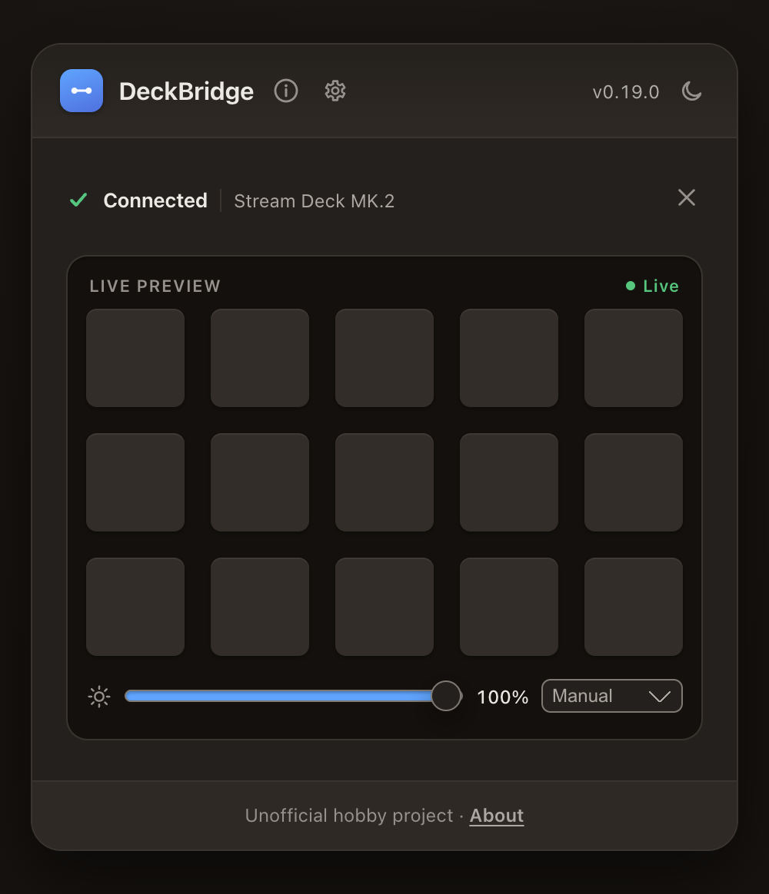 |

### AKP05 as Elgato Stream Deck +

This mock pairing shows the AKP05's eight app keys, touch strip, side keys, and knob
controls with **Stream Deck +** emulation.

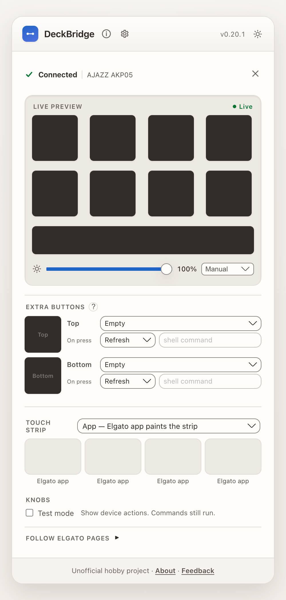 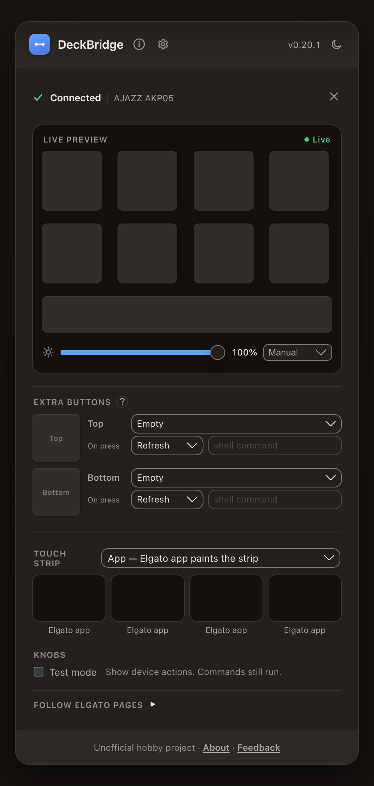

## Use cases

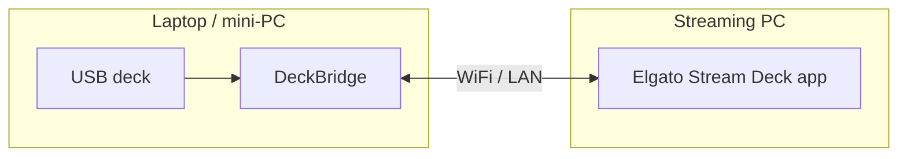
```mermaid
flowchart LR
    subgraph host["Laptop / mini-PC"]
        deck["USB deck"] --> dbx["DeckBridge"]
    end
    subgraph pc["Streaming PC"]
        elg["Elgato Stream Deck app"]
    end
    dbx <-->|"WiFi / LAN"| elg
```

- **Put the deck on another computer** — plug the deck into a laptop or mini-PC, run
  DeckBridge there, and control the Elgato app on your streaming PC across the LAN.
- **Skip the Network Dock** — use a computer you already own and avoid buying the
  [Elgato Network Dock](https://www.elgato.com/us/en/p/network-dock-stream-deck), listed at
  **$79.99 USD** in September 2026.

  <details class="db-dock-compare">
  <summary>Compare DeckBridge with Network Dock</summary>

  | | DeckBridge | Elgato Network Dock |
  |---|---|---|
  | **Cost** | Free software; needs a running computer. | $79.99 USD hardware (September 2026). |
  | **Connection** | USB deck plugged into that computer; the computer can use WiFi or wired LAN. | [Ethernet and PoE](https://www.elgato.com/us/en/p/network-dock-stream-deck), or Ethernet with separate USB-C power. No computer needed beside the deck. |
  | **Decks** | [Supported Elgato and non-Elgato models](./introduction.mdx#supported-devices); limited device selection. | [Supported Stream Deck models](https://www.elgato.com/uk/en/explorer/products/stream-deck/stream-deck-network-dock-overview/), including XL and +; some older models are excluded. |
  | **Use** | Hobby project with setup flexibility; host computer must stay on. | Dedicated, officially supported hardware for fixed installations; requires purchase and wired network. |

  </details>
- **Use a real Stream Deck wirelessly** — a Stream Deck Mini or MK.2 works the same way,
  over WiFi instead of a cable.
- **Bitfocus Companion** — Companion also speaks the dock protocol and discovers
  DeckBridge the same way.

<div style="border-left:4px solid #e6a700;background:rgba(230,167,0,0.12);padding:12px 16px;border-radius:6px;margin:20px 0">
<strong>⚠ Hobby use</strong><br/>
DeckBridge is for personal and hobby use, and does not replace the Elgato Network Dock. See the <a href="/introduction">Introduction</a> for the full disclaimer.
</div>

## Multiple decks

**Off by default.** DeckBridge drives a single deck and, once that deck is connected,
stops scanning USB for other supported devices entirely. To use two decks at once, open
**Settings → Multiple decks** in the web UI and turn on *Use two decks at once* (stored as
`"multiDeck": true` in settings.json). Two decks is the maximum.

With it on, a second deck becomes its own network dock: own mDNS name, own CORA port pair
(see [Network ports](#network-ports)). The web UI lists every connected deck as a card:

1. **Pair one at a time.** Each deck shows in the Elgato app as a separate Network Dock.
   An unpaired card shows an amber "Waiting for Elgato app" chip and the exact
   `IP : port` copy-chips for the app's **Add Network Device…** dialog — the port differs
   per deck (5343, 5345, …), so copy it from that deck's card.
2. **Card flips green** ("Paired") when the app connects — no reload. The app remembers
   paired docks across restarts.
3. **Click a card to select it** — the selected deck gets the live preview and the
   brightness slider. Each deck keeps its own brightness (also applied per deck from the
   Elgato app, unless "Ignore brightness from Elgato app" is on).

Unplugging an extra deck removes its card; replugging brings it back automatically.
Turning the setting back off disconnects the second deck (its settings are kept, so
switching it on again restores the dock).

Every dock needs its **own IP address** in the Elgato app — see
[one dock per IP address](./browser-deck.md#one-dock-per-ip-address). A phone or tablet can
be an extra dock too: see the [Browser deck](./browser-deck.md).

## Standby and burn-in care

Cheap LCD panels keep a ghost of a static image, and a deck left at full brightness with a
stale page glares at night. **Settings → Standby & burn-in care** (for the selected deck) protects the
panel. **Everything is off by default**; a deck behaves as before until you switch a piece on.

- **Dim when idle** — after N minutes without a key, knob or touch input, the backlight drops
  to the level you pick. Any input brings it back.
- **Screen off** — a second idle stage turns the screen off after N more minutes. *How to turn
  it off* is `auto` (the device's sleep mode where it has a verified one, else brightness 0)
  or `brightness0`. No model uses hardware sleep yet, because it has not been verified on
  real hardware: today both choices write brightness 0.
- **Wake press** — by default the first press on a dimmed or dark deck only wakes it and is
  not sent to the Elgato app. Switch it to *Wakes and runs the key* to forward it. A click
  in the web UI (Click to press) is never swallowed.
- **When the Elgato app is away** — keep the last images (default), show a dim clock, or turn
  the screen off. DeckBridge waits 15 s before it acts, so the app's own reconnects and
  restarts never flash the clock. It acts only for a paired deck (or one that was paired
  since DeckBridge started) and not in the first minute after DeckBridge starts. The clock
  moves to a new key every minute; when the app returns, its last images come back at once.
  The Companion app is not treated as the Elgato app.
- **Night mode** — between *From* and *To* the brightness is capped at the night level, and the
  screen can go fully dark when idle. The window follows the **DeckBridge computer's clock**
  (the web UI shows its current time), including its time zone and daylight saving.
- **Pixel shift** — moves the side-key and touch-strip widgets DeckBridge draws by 1 px every
  five minutes. The Elgato app's own key images are never shifted.

Your brightness slider keeps the level you chose; dimming only changes what the panel shows,
and the header of the panel says what is on the deck now. On the [Browser deck](./browser-deck.md)
dimming and screen off work on the page, the clock choice acts as *Turn the screen off*, and
pixel shift does not apply.

Two optional shell commands run when the screen goes off and when it wakes. They are set in
`settings.json` only (the web UI never shows or edits them), per device:

```json
{
  "devices": [
    {
      "deviceKey": "usb:A00000000000",
      "standby": {
        "sleepCommand": "osascript -e 'tell application \"System Events\" to sleep'",
        "wakeCommand": "echo woke >> /tmp/deck.log"
      }
    }
  ]
}
```

Like [command widgets](./side-keys.md#security), these run on your host with your rights, so
keep the Web UI off untrusted networks. A command has 10 s, its output is dropped, and only
one of each kind runs at a time. `./deckbridge diagnose --redact-commands` hides them in the
report.

## Click to press

**Off by default.** *Settings → Click to press* lets you double-click a key in the web UI
preview to press it on the Elgato app (Enter or Space on a focused key does the same). The
dock must be paired. Anyone who can open the web UI can then press your keys, so keep the UI
on `127.0.0.1` (the default) unless you trust the network. It is stored as
`"webuiKeyPress": true` in settings.json and is never taken from an imported settings file.
A virtual press is not a hardware press: key-map learn mode ignores it.

## Permissions

Each permission is requested on first use; no admin / root rights are required.

| Permission | Platform | Why |
|---|---|---|
| **Input Monitoring** | macOS | Reading HID reports (key presses) from the deck. Grant it to the app or terminal running DeckBridge, then restart it. |
| **Local Network** | macOS 15+ | Advertising over Bonjour / mDNS and serving the CORA ports on the LAN. macOS may prompt on first run. |
| **Firewall allow** | macOS / Windows | Inbound TCP on 5343 / 5344 so the Elgato app can connect. Allow it if your firewall prompts. |
| **udev rule** | Linux | Opening the deck's `hidraw` device as a non-root user needs a udev rule; without it, DeckBridge fails with `Permission denied`. |

On Linux, add a udev rule (once), then unplug/replug the device:

```bash
sudo tee /etc/udev/rules.d/99-mirabox.rules <<'EOF'
SUBSYSTEM=="hidraw", ATTRS{idVendor}=="6603", MODE="0666"
SUBSYSTEM=="hidraw", ATTRS{idVendor}=="5548", MODE="0666"
SUBSYSTEM=="hidraw", ATTRS{idVendor}=="0300", MODE="0666"
SUBSYSTEM=="hidraw", ATTRS{idVendor}=="0b00", MODE="0666"
SUBSYSTEM=="hidraw", ATTRS{idVendor}=="0c00", MODE="0666"
SUBSYSTEM=="hidraw", ATTRS{idVendor}=="0a00", MODE="0666"
SUBSYSTEM=="hidraw", ATTRS{idVendor}=="0500", MODE="0666"
SUBSYSTEM=="hidraw", ATTRS{idVendor}=="3142", MODE="0666"
EOF
sudo udevadm control --reload-rules && sudo udevadm trigger
```

(`6603` = Mirabox 293V3 / HSV293SV3 / K1 Pro, `5548` = Mirabox 293S / Ajazz AKP153,
`0300` = Ajazz AKP153E/R (rev. 1 and rev. 2), `0b00` = Mars Gaming MSD-ONE, `0c00` = Mad
Dog GK150K, `0a00` = Risemode Vision 01, `0500` = TMICE Stream Controller, `3142` =
Fifine AmpliGame D6 (rev. 1 and rev. 2).)

## Requirements

The `/requirements` page (tray → **Check Requirements**) verifies each of these at runtime:

| Requirement | macOS | Linux | Windows |
|---|---|---|---|
| **libhidapi** | bundled / `brew install hidapi` | `sudo apt install libhidapi-dev` | bundled |
| **deckbridge-native** (Rust lib) | bundled | bundled | bundled |
| **mDNS** | Bonjour (built in) | `avahi-daemon` running | built in (Win10 1803+) |
| **Tray helper** | bundled (installer builds) | — | bundled |
| **Free TCP ports** | 5343 / 5344 must be free | same | same |

Packaged releases embed libhidapi and the native library, so a **source build** is the
only case that needs a system libhidapi installed.

## Files, ports & data

**DeckBridge stores no personal data and sends no telemetry.**

### Reads

- Its **own embedded libraries** (libhidapi, deckbridge-native) from inside the binary.
- The system **libhidapi** (source builds, or when overridden via `HIDAPI_LIB`).
- A handful of **environment variables** (below). There is no config file.

### Writes

- **Native library cache** — extracts the embedded libs once per version to:
  - macOS: `~/Library/Caches/deckbridge/native-<build-hash>/`
  - Linux: `$XDG_CACHE_HOME/deckbridge/` (or `~/.cache/deckbridge/`)
  - fallback: a temp directory if the cache root isn't writable

  Old `native-<hash>` folders from previous versions are cleaned up automatically.
- **Settings** — `settings.json` in the cache root: per-device brightness/identity,
  side-key widgets, log level, device tuning (`modelOverrides`), the browser-deck and
  click-to-press opt-ins, and push-API / browser-deck tokens (hashed; never exported).
- **Log file** — `<cache-root>/logs/deckbridge.log`, rotated at 2 MB with three files
  kept. See [Troubleshooting](./troubleshooting.md#where-the-logs-live).
- **Diagnostics reports** — `<cache-root>/diagnostics/`, only when you ask for one.
- **Debug image dumps** — only when `DECKBRIDGE_DUMP_DIR` / `DECKBRIDGE_RAW_DUMP_DIR` are
  set. Off by default.

### Network ports

| Port | Bind | Purpose |
|---|---|---|
| **5343** | `0.0.0.0` (LAN) | CORA main server — the Elgato app connects here |
| **5344** | `0.0.0.0` (LAN) | CORA child server — image / data channel |
| **5345–5346** | `0.0.0.0` (LAN) | Second deck — its own CORA pair at +2 (only with *Use two decks at once*) |
| **5349–5350** | `0.0.0.0` (LAN) | The [browser deck](./browser-deck.md)'s dock (only when it is turned on) |
| **44660** | `0.0.0.0` (LAN) | Browser deck page, pairing and WebSocket (only when it is turned on; `DECKBRIDGE_DECK_PORT`) |
| **3000** | `127.0.0.1` (LAN with `--bind`) | Web UI and [Push API](./push-api.md) |
| mDNS `_elg._tcp` | LAN | Service discovery ("Network Stream Deck") |

Set `DECKBRIDGE_BIND` (or `--bind`) to change the listen address; it moves both the CORA
ports and the Web UI. The Web UI binds `127.0.0.1` unless you pass `--bind`.

## Limitations

- **Multiple decks: two USB decks** — *Use two decks at once* docks one extra USB deck
  (same model is fine), each its own network dock (own mDNS name and port pair — see
  [Network ports](#network-ports)). A phone or tablet [browser deck](./browser-deck.md) is
  one more dock on top. The web UI shows a live preview for **one selected deck at a time**
  (click its card); the others stay static.
- **Keys and dials only** — DeckBridge drives keys plus the AJAZZ AKP05E's four rotary
  encoders and its touch strip (as widget displays, or a Stream Deck + window image).
  Dials and strip swipes and taps reach the Elgato app only when the AKP05E is re-paired
  as a Stream Deck + (Device tuning → Emulation profile); a strip tap lands on the centre
  of its zone (the strip reports four zones, not coordinates), and other Stream Deck +/Plus/Neo-style LCD strips remain out of scope.
- **Fixed ports** — CORA is hard-wired to **5343 / 5344** (extra decks add a fixed +2
  offset per device); conflicts with a real Elgato Network Dock or a second DeckBridge
  instance on the same machine.
- **No auth or encryption** — the CORA ports trust the LAN; see
  [Network ports](#network-ports).
- **Elgato desktop app: one network dock per IP address** — the Elgato app itself, not
  DeckBridge, pairs only **one** network dock per IP address of the computer, whatever the
  port. Use `127.0.0.1` for the first deck and the computer's LAN IP (e.g. `192.168.1.42`)
  for the second. A third needs another local address, for example the loopback alias
  `127.0.0.2` (on macOS: `sudo ifconfig lo0 alias 127.0.0.2 up`); the web UI's
  **Need another address?** guide shows the steps and tests the address. Verified on macOS.

### Environment variables

| Variable | Effect |
|---|---|
| `DECKBRIDGE_BIND` | Bind address for the CORA servers and the browser deck (default `0.0.0.0`) |
| `DECKBRIDGE_DECK_PORT` | Browser deck page port (default `44660`, no fallback) |
| `HIDAPI_LIB` | Path to a specific libhidapi |
| `DECKBRIDGE_NATIVE_LIB` | Path to the deckbridge-native cdylib |
| `DECKBRIDGE_TRAY_BIN` | Path to the tray helper binary |
| `DECKBRIDGE_OPEN` | Auto-open the web UI in a browser on start |
| `DECKBRIDGE_MOCK` | Run with a mock device in a `DECKBRIDGE_BUILD_MOCK=1` development build only |
| `DECKBRIDGE_DUMP_DIR` | Write each transformed device image here (debug) |
| `DECKBRIDGE_RAW_DUMP_DIR` | Write paired raw + transformed images here (debug) |
| `DECKBRIDGE_LOG_LEVEL` | Log verbosity: `debug`/`info`/`warn`/`error`/`silent` |
| `DECKBRIDGE_CACHE_DIR` | Cache root (settings, logs, extracted native libs) |
| `DECKBRIDGE_NO_OVERRIDES` | Safe mode: ignore device tuning for this session |
| `DECKBRIDGE_PUSH_TOKEN` | Token used by `deckbridge push` (see [Push API](./push-api.md)) |

Log verbosity resolves as `--log-level` > `$DECKBRIDGE_LOG_LEVEL` > `"logLevel"` in
`settings.json` (what the web UI's **Debug logging** toggle writes) > the level compiled
into the build (`info` for releases). See
[Turning on debug logging](./troubleshooting.md#turning-on-debug-logging).
