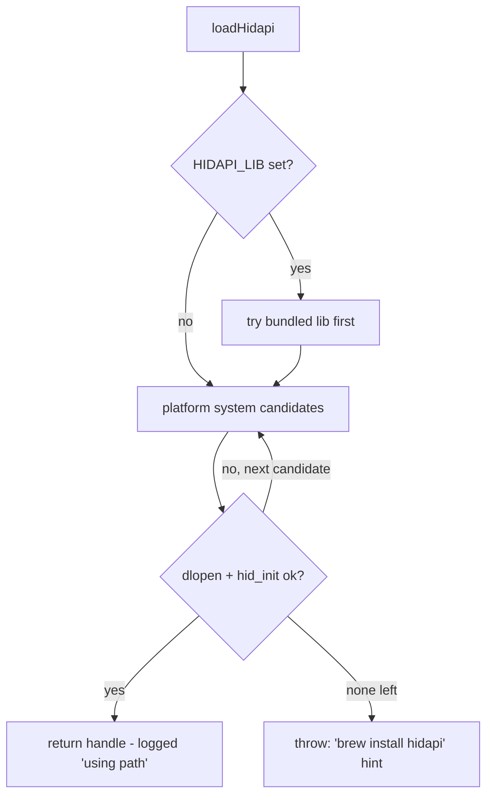

# HID via FFI: why `libhidapi` is loaded from Homebrew

Documents `ts/src/ffi/hidapi.ts` — why DeckBridge reaches out to a system-installed
`libhidapi` (the Homebrew `dylib` on macOS) instead of bundling HID support, and how
that loading works at runtime.

## TL;DR

txiki.js (QuickJS-ng + libuv + libffi) has **no built-in USB/HID support**, so DeckBridge
binds the OS's `libhidapi` shared library at runtime via **FFI (`dlopen`)**. The Homebrew
paths (`/opt/homebrew/lib/libhidapi.dylib` on Apple Silicon,
`/usr/local/lib/libhidapi.dylib` on Intel) are just well-known **search candidates** in a
fallback chain, not a hard dependency — hence the hint `brew install hidapi`.

## Why FFI at all

Rather than compile a C extension into the binary, the project **borrows the OS's
`libhidapi` at runtime**:

- `import FFI from 'tjs:ffi'` — txiki.js's foreign-function interface (libffi under the hood).
- `FFI.dlopen(path, { ...signatures })` opens the shared library and declares each C
  function's arg/return types so JS can call them. That is the entire `HidapiSymbols`
  surface: `hid_init`, `hid_open`, `hid_open_path`, `hid_write`, `hid_read_timeout`,
  feature reports, `hid_close`, `hid_error`.

So `libhidapi` is the actual device driver; `hidapi.ts` is the thin, typed bridge from
TypeScript into it.

## The candidate chain

`loadHidapi()` builds a list of paths and tries each until `dlopen` **and** `hid_init()`
succeed. The first that works is logged (`loadHidapi: using <path>`) and returned.

| Order | Source | Path(s) | When used |
|-------|--------|---------|-----------|
| 1 | `HIDAPI_LIB` env (bundled) | extracted lib in the per-version cache dir | Packaged releases — `ts/src/native-libs.ts` extracts the embedded lib and sets `HIDAPI_LIB` before launch. End users need no brew. |
| 2 | macOS system (`FFI.suffix === 'dylib'`) | `/opt/homebrew/lib/libhidapi.dylib`, `/usr/local/lib/libhidapi.dylib`, then bare `libhidapi.dylib` | Dev machines / unbundled runs — relies on `brew install hidapi`. |
| 2 | Windows (`'dll'`) | `hidapi.dll`, `C:\Windows\System32\hidapi.dll` | — |
| 2 | Linux (else) | `/usr/lib/x86_64-linux-gnu/libhidapi-hidraw.so.0`, `/usr/lib/libhidapi-hidraw.so.0`, then `libhidapi-hidraw.so.0` / bare `libhidapi.so` | `sudo apt install libhidapi-dev`. |

The branch key is `FFI.suffix` (the platform's native shared-lib extension: `dylib` /
`dll` / `so`). If every candidate fails, `loadHidapi()` throws an error whose message
lists what it tried and tells the user to `brew install hidapi` (macOS) /
`sudo apt install libhidapi-dev` (Linux).



The handle is opened once and reused for the worker session (module-level
`_workerHidLib`); `hid_exit()` + `close()` run on disconnect.

## Two separate libraries

Do not conflate the two `dlopen`s in this file — they serve different roles:

| Library | Loaded by | Source | Role |
|---------|-----------|--------|------|
| **`libhidapi`** | `loadHidapi()` | OS / Homebrew (or bundled `HIDAPI_LIB`) | The real HID driver: open device, read/write reports. Drives the Stream Deck. |
| **`deckbridge-native`** (HID export) | `loadHidEnum()` | Project's own Rust cdylib via `DECKBRIDGE_NATIVE_LIB` | Device **enumeration only** — `mirabox_hid_find_path(vid, pid, usagePage, usage)` returns a single device-path string (`pid=0` matches any PID). |

### Why a Rust helper just for enumeration

`loadHidapi`'s binding list **deliberately omits** `hid_enumerate` — it returns a
linked-list of C structs painful to marshal across this FFI. Instead the
`deckbridge-native` cdylib walks the device list natively and returns one null-terminated
path, which the driver opens with `hid_open_path()`. Opening by path avoids claiming
system-owned interfaces on macOS (the OS grants the first `hid_open(VID,PID)` caller
exclusive access).

If `DECKBRIDGE_NATIVE_LIB` is unset or fails to load, `findHidPath()` returns `null`. Off
macOS, the driver then falls through to plain `hid_open(VID, PID)` — one attempt per PID,
no retry loop. On macOS this fallback is skipped entirely: there, `hid_open(VID, PID)`
opens the device's first IOKit interface, and a permission-denied open on it SIGBUSes the
whole process; reconnect retries instead happen at a higher level, in `driver-manager`.
Three Mirabox models set `usagePage`/`usage` (293V3, 293S, K1 Pro — all `0xffa0`/`1`);
Elgato models skip path-based open entirely.

## FFI type signatures

```
hid_init()                         → int
hid_exit()                         → int
hid_open(uint16 vid, uint16 pid, pointer serial)   → pointer (device handle)
hid_open_path(string path)         → pointer
hid_write(pointer dev, buffer, size_t len)         → int
hid_read_timeout(pointer dev, buffer, size_t len, int timeoutMs) → int
hid_send_feature_report(pointer dev, buffer, size_t len)         → int
hid_get_feature_report(pointer dev, buffer, size_t len)          → int
hid_close(pointer dev)             → void
hid_error(pointer dev)             → string

// deckbridge-native HID exports:
mirabox_hid_find_path(uint16 vid, uint16 pid, uint16 usagePage, uint16 usage,
                      buffer out, size_t bufLen)   → int  (1=found, 0=not; pid=0 matches any PID)
mirabox_hid_present(uint16 vid, uint16 pid)        → int  (1=found, 0=not; presence via enumeration, never opens)
```

`isNullPtr()` guards returns from `hid_open` / `hid_open_path` — an FFI pointer that
`.equals(null)` means the open failed.

## Key files

| File | Role |
|------|------|
| `ts/src/ffi/hidapi.ts` | `loadHidapi()` candidate chain · `loadHidEnum()` / `findHidPath()` · FFI signatures · `isNullPtr()` |
| `rust/deckbridge-native/` | Rust cdylib exporting `mirabox_hid_find_path` (loaded via `DECKBRIDGE_NATIVE_LIB`), plus `image_proc_transform` |
| `ts/src/native-libs.ts` | Extracts the embedded native libs at runtime and sets `DECKBRIDGE_NATIVE_LIB` / `HIDAPI_LIB` (no separate `run.sh` — libs are embedded in the binary) |
| `ts/src/devices/.../*` driver | Consumes `loadHidapi()` symbols; tries path-based open then VID+PID fallback |

## Related docs

- The development repo's `ARCHITECTURE.md` → **libhidapi loading** / **HID path enumeration** sections (the canonical reference; not part of this public docs site).
- `rust/README.md` → how `DECKBRIDGE_NATIVE_LIB` is wired and the open-fallback flow.
- [Adding a Device](./adding-a-device.md) → using `loadHidapi` / `findHidPath` from a new device driver.
