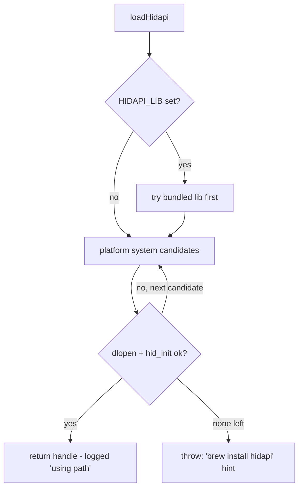

# HID transport and discovery through FFI

Validated against source: 2026-10-03.
Packaged builds embed their native libraries.
Development builds can use system libraries.
Discovery and device transport remain separate.

## TL;DR

txiki.js (QuickJS-ng + libuv + libffi) has **no built-in USB/HID support**, so DeckBridge
binds the OS's `libhidapi` shared library at runtime via **FFI (`dlopen`)**. The Homebrew
paths (`/opt/homebrew/lib/libhidapi.dylib` on Apple Silicon,
`/usr/local/lib/libhidapi.dylib` on Intel) are just well-known **search candidates** in a
fallback chain, not a hard dependency — hence the hint `brew install hidapi`.

## Why FFI at all

Rather than compile a C extension into the binary, the project **borrows the OS's
`libhidapi` at runtime**:

- `import FFI from 'tjs:ffi'` — txiki.js's foreign-function interface (libffi under the hood).
- `FFI.dlopen(path, { ...signatures })` opens the shared library and declares each C
  function's arg/return types so JS can call them. That is the entire `HidapiSymbols`
  surface: `hid_init`, `hid_exit`, `hid_open_path`, `hid_write`, `hid_read_timeout`,
  feature reports, `hid_close`, `hid_error`.
  Report-descriptor access loads optionally.

So `libhidapi` is the actual device driver; `hidapi.ts` is the thin, typed bridge from
TypeScript into it.

## The candidate chain

`loadHidapi()` builds a list of paths and tries each until `dlopen` **and** `hid_init()`
succeed. The first that works is logged (`loadHidapi: using <path>`) and returned.

| Order | Source | Path(s) | When used |
|-------|--------|---------|-----------|
| 1 | `HIDAPI_LIB` env (bundled) | extracted lib in the per-version cache dir | Packaged releases — `ts/src/infra/native-libs.ts` extracts the embedded lib and sets `HIDAPI_LIB` before launch. End users need no brew. |
| 2 | macOS system (`FFI.suffix === 'dylib'`) | `/opt/homebrew/lib/libhidapi.dylib`, `/usr/local/lib/libhidapi.dylib`, then bare `libhidapi.dylib` | Dev machines / unbundled runs — relies on `brew install hidapi`. |
| 2 | Windows (`'dll'`) | `hidapi.dll`, `C:\Windows\System32\hidapi.dll` | — |
| 2 | Linux (else) | `/usr/lib/x86_64-linux-gnu/libhidapi-hidraw.so.0`, `/usr/lib/libhidapi-hidraw.so.0`, then `libhidapi-hidraw.so.0` / bare `libhidapi.so` | `sudo apt install libhidapi-dev`. |

The branch key is `FFI.suffix` (the platform's native shared-lib extension: `dylib` /
`dll` / `so`). If every candidate fails, `loadHidapi()` throws an error whose message
lists what it tried and tells the user to `brew install hidapi` (macOS) /
`sudo apt install libhidapi-dev` (Linux).


```mermaid
flowchart TD
    A[loadHidapi] --> B{HIDAPI_LIB set?}
    B -->|yes| C[try bundled lib first]
    B -->|no| D[platform system candidates]
    C --> D
    D --> E{dlopen + hid_init ok?}
    E -->|yes| F[return handle - logged 'using path']
    E -->|no, next candidate| D
    E -->|none left| G[throw: 'brew install hidapi' hint]
```

The handle is opened once and reused for the worker session (module-level
`_workerHidLib`); `hid_exit()` + `close()` run on disconnect.

## Two separate libraries

| Library | Binding | Responsibility |
|---|---|---|
| `libhidapi` | `ffi/hidapi.ts` | Open paths; read/write reports |
| `deckbridge-native` | `ffi/hid-discovery.ts` | Filtered operational inventory and reset |
| `deckbridge-native` | `ffi/hidapi.ts` | Full diagnostic inventory |
| `deckbridge-native` | `ffi/image-proc.ts` | Image transform and strip composition |

### Why native enumeration exists

Native code walks HID enumeration structures.
TypeScript receives tab-separated inventory rows.
Operational scans filter supported VID/PID pairs.
Diagnostics can request full inventories separately.
Server-side enumeration runs on `hid-scan-worker.ts`.
Standalone CLI diagnostics can enumerate synchronously.

```text
DEVICE_MODELS → supported VID/PID pairs
  → scan worker → mirabox_hid_list_supported
  → inventory → HidDiscovery.paths(model)
  → USB worker → HidDeviceBase._openPath
  → libhidapi.hid_open_path
```

All real drivers open explicit paths.
Elgato models also use this flow.
Optional usage filters select HID collections.
Missing discovery libraries mean no matching paths.
There is no VID/PID open fallback.

## FFI type signatures

```text
hid_init() → int
hid_exit() → int
hid_open_path(string path) → pointer
hid_write(pointer, buffer, size_t) → int
hid_read_timeout(pointer, buffer, size_t, int) → int
hid_send_feature_report(pointer, buffer, size_t) → int
hid_get_feature_report(pointer, buffer, size_t) → int
hid_close(pointer) → void
hid_error(pointer) → pointer
hid_get_report_descriptor(pointer, buffer, size_t) → int  [optional]

mirabox_hid_list_supported(string filters, buffer, size_t) → int
mirabox_hid_list_all(buffer, size_t) → int
mirabox_hid_reset() → int
```

`hid_error` returns native wide characters.
Decode them through `hidErrorString()`.
`isNullPtr()` checks failed path opens.
Descriptor loading falls back to core symbols.
Older libraries therefore retain basic transport.

Native legacy lookup exports remain available.
Current discovery bindings bypass those exports.
See `rust/deckbridge-native/src/hid.rs` for declarations.

## Handle lifecycle

`HidDeviceBase` owns worker-local transport handles.
Successful sessions close before library teardown.
Failed opens call `hid_exit()` without unloading.
Preserve this distinction during driver changes.
Discovery reset runs on its scan thread.

## Key files

| File | Responsibility |
|---|---|
| `ts/src/ffi/hidapi.ts` | Transport loading; full inventory; matching |
| `ts/src/ffi/hid-discovery.ts` | Filtered scans and discovery reset |
| `ts/src/worker/hid-scan-worker.ts` | Enumeration thread and registry filters |
| `ts/src/main/driver-manager-discovery.ts` | Snapshot-based device path selection |
| `ts/src/devices/hid-device-base.ts` | Path open, polling, transport cleanup |
| `rust/deckbridge-native/src/hid.rs` | Native inventory and legacy exports |
| `ts/src/infra/native-libs.ts` | Embedded-library extraction and environment |

## Related docs

- [ARCHITECTURE.md](./ARCHITECTURE.md) → **libhidapi loading** / **HID path enumeration** sections (the canonical reference; a deep-dive page, not listed in the sidebar).
- `rust/README.md` → how `DECKBRIDGE_NATIVE_LIB` is wired and the path-based open flow.
- [Adding a new protocol](./new-protocol.md) → a new device driver on `HidDeviceBase`.
