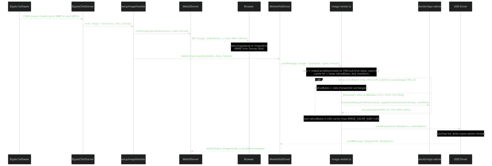
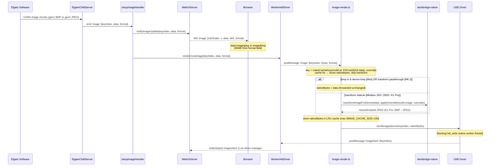

# Image Flow: DeckBridge

Documents how a key image travels from the Elgato software to the USB device and the web UI preview.

## Overview



The Elgato desktop sends image data to the CORA child server in the format matching the capabilities the relay advertises via `model.cora` (geometry, PID, product name) — so the CORA format depends on what's physically plugged in. **Everything device-specific is read from the active `DeviceModel`** (`model.image`, `model.keyMap`, `model.cora`) — there is no per-brand branching in the pipeline.

| Connected device | Advertised caps (`model.cora`) | CORA format | Sidecar | `model.image` transform |
|-----------------|-----------------|-------------|---------|-----------|
| Mirabox 293V3/Ajazz (`mirabox-cora`) | MK.2 spoof (PID `0x00a5`, `MK2_CHILD_GEOMETRY`) | gen2 JPEG 72×72 | Yes | `sidecar`: resize 72→112 (lanczos3), rotate 0 |
| Mirabox 293S (`mirabox-cora-v1`) | MK.2 spoof (PID `0x00a5`, `MK2_CHILD_GEOMETRY`) | gen2 JPEG 72×72 | Yes | `sidecar`: pad 72→85 (edge), rotate 90 |
| Mirabox K1 Pro (`mirabox-cora`) | Mini spoof (PID `0x0063`, `MINI_CHILD_GEOMETRY`) | gen1 BMP 80×80 | Yes | `sidecar`: crop 6 px/side (80→68) → resize 64, rotate 0 + flipH, BMP→JPEG |
| Stream Deck MK.2 (`elgato-gen2`) | real MK.2 (PID `0x0080`) | gen2 JPEG 72×72 | No | `passthrough` (rotate 0) |
| Stream Deck Mini (`elgato-gen1`) | real Mini (6 key, 3×2, PID `0x0063`) | gen1 BMP 80×80 BGR | No | `passthrough` (BMP short-circuit) |

Each **Mirabox** model advertises as an Elgato device whose CORA profile the desktop already knows (MK.2 for the 293V3/293S, Mini for the K1 Pro — see table), and the sidecar resizes/rotates — for the K1 Pro re-encodes BMP→JPEG — to the device's native key size per `model.image`. **Elgato devices** advertise their real geometry and the desktop's device-native data is forwarded with no transform — the desktop pre-applies all orientation/color work itself.

The path splits into two tracks on image arrival (`setupImageHandler` in `image-pipeline.ts`), running on **different threads**:

- **WebUI path (main thread)** — fires immediately. The received CORA bytes are pushed **inline (base64) over WebSocket** so the browser renders at arrival time with no follow-up request.
- **Transform + USB path (USB worker thread)** — the main thread forwards the raw CORA bytes to the worker via `WorkerHidDriver.renderCoraImage()`; the worker (`image-render.ts`) transforms through the Rust deckbridge-native cdylib (with an LRU cache to skip redundant work), then writes to the device. Running on the worker keeps the 50–200 ms transform off the CORA ACK loop (P1).

## Image format by device

### gen2 (MK.2, Mirabox)

Chunks arrive in `ElgatoChildServer.handleCoraPacket` (`elgato-child-server.ts`) as `byte1 === IMG_CMD_WRITE` (`0x07`) frames:

```
byte 0:  0x02 (output report type)
byte 1:  0x07 (IMG_CMD_WRITE)
byte 2:  key index (0-based)        [IMAGE_CHUNK_KEY_OFFSET]
byte 3:  isLast (1 = last page)     [IMAGE_CHUNK_FLAG_OFFSET / IMAGE_CHUNK_LAST_FLAG]
bytes 4-5: bodyLength (LE uint16)   [IMAGE_CHUNK_LEN_OFFSET]
bytes 8+:  JPEG payload             [ELGATO_IMAGE_HEADER_SIZE = 8]
```

`assembleImageChunk()` reassembles pages into `{ keyIndex, data: Buffer, format: 'jpeg' }`.

### gen1 (Mini)

Chunks arrive as `byte1 === GEN1_IMG_CMD` (`0x01`) frames, always 1024 bytes:

```
byte 0:  0x02
byte 1:  0x01 (GEN1_IMG_CMD)
byte 2:  partIndex (0-based)
byte 3:  0x00
byte 4:  isLast (1 = last packet)   [GEN1_IMAGE_LAST_OFFSET]
byte 5:  keyIndex + 1  ← 1-based!   [GEN1_IMAGE_KEY_OFFSET]
bytes 6-15:  0x00
bytes 16-1023: BMP payload (trailing zeros on last packet)   [GEN1_IMAGE_HEADER_SIZE = 16]
```

`assembleGen1ImageChunk()` reassembles pages, then trims trailing zeros by parsing the BMP `bfSize` field (LE uint32 at offset 2). Returns `{ keyIndex, data: Buffer, format: 'bmp' }`.

The Elgato desktop pre-applies the Mini's 90° CW rotation and BGR colour transform before encoding the BMP, so the relay forwards verbatim.

## End-to-End Flow



Key behaviours (the format/cache/remap logic now lives in `renderImage` in `image-render.ts`, on the worker; `setupImageHandler` on the main thread only broadcasts to the WebUI and calls `renderCoraImage`):

- **No per-brand branching.** The native format is chosen purely from `format` and the effective image spec: BMP input whose device format is also BMP (true gen1 Mini) → forward as-is; `transform === 'passthrough'` → forward the CORA JPEG as-is; otherwise (`transform === 'sidecar'`) → `transformImageForDevice(data, applyOverride(model.image, override))` (resize/pad + `rotate`/`flipH`/`flipV`, re-encode). The K1 Pro takes the sidecar path even though its input is BMP, because its device format is JPEG (BMP→JPEG).
- **WebUI image-fit override.** The WebUI can switch the fit mode at runtime (`ImageModeOverride`: `resize` ⇄ `pad-black`/`pad-average`/`pad-edge`, `null` = model default). The main thread forwards it with `WorkerHidDriver.setImageOverride()`; the worker stores it (`imageOverride`, ordered on its serial queue w.r.t. `'image'` messages) and `renderImage` overlays it onto `model.image` via `applyOverride()`. The override discriminator is part of the cache key, so flipping modes never serves a stale entry.
- **WebUI shows the CORA arrival image.** Device-native bytes live only on the worker and go straight to the device (the old `setImageState(nativeBytes)` step was dropped with P1); the upright CORA image is the better preview anyway.
- **Device key remap:** `deviceKeyIndex = (model.keyMap.coraToWireImage || model.keyMap.imageOffset != null) ? mk2IndexToDeviceImgId(keyIndex, model) : keyIndex`. Elgato models (empty `keyMap`) use identity; Mirabox models remap via their `coraToWireImage` array. An out-of-range key (`-1`) is skipped (warn).
- **Wire chunk padding (K1 Pro):** inside `MiraboxDriver.sendImage`, models with `wire.chunkPadByte` get the JPEG wire-encoded by `padChunkBoundaries()` — one sacrificial `0x00` after every 1023 payload bytes, because the K1 Pro firmware drops the last byte of every full 1024-byte chunk (see internal probe notes). The BAT length is the padded wire length.

## Orientation

Orientation is fully described by the active model: `model.image` for live CORA frames and `model.splash.transformOverride` for splash images (whose sources are upright, not desktop-pre-rotated).

<details>
<summary>Per-model orientation values</summary>

| Model | Live `image` rotate/flip | `splash.transformOverride` |
|---|---|---|
| MK.2 | rotate 0 (passthrough) | — (none) |
| Mini | rotate 90, BGR (desktop pre-applies; forwarded verbatim) | rotate 90, flipH |
| Mirabox 293V3 | rotate 0, resize 72→112 | rotate 180 |
| Mirabox 293S | rotate 90, pad 72→85 (edge) | rotate 270 |
| Mirabox K1 Pro | crop 6 px/side (80→68) → resize 64, rotate 0, flipH (BMP→JPEG) | rotate 90 (flipH off) |

</details>

The Rust deckbridge-native cdylib applies rotations CW first, then flips. To re-calibrate a device, change `model.image` (live) or `model.splash.transformOverride` (splash) — see [Adding a Device, Phase 4](./adding-a-device.md#phase-4--measure-image-orientation-on-hardware).

### Web preview orientation

The browser shows the **received CORA bytes** immediately (72×72 JPEG for the 293/293S and MK.2, native 80×80 BMP for the Mini and the K1 Pro), then on reconnect re-fetches the stored bytes via `/api/image/{key}` — both are the CORA arrival image, so live and reconnect previews are consistent. Because the preview shows desktop-oriented bytes rather than device-oriented ones, the web UI corrects orientation with **per-model CSS** keyed on a `data-model` attribute (set via `KeyPreview.setModel()` from `status.modelId`):

```css
/* ui-base.css — single source of truth for BOTH views */
.key-grid .key-cell img                            { transform: rotate(180deg); } /* default */
.key-grid[data-model='mini'] .key-cell img         { transform: rotate(270deg) rotateY(180deg); }
.key-grid[data-model='mirabox-k1pro'] .key-cell img { transform: rotate(90deg) rotateX(180deg); }
```

Both views render through the shared `KeyPreview` class (`key-preview.ts`), which sets `data-model` on the grid root. Adjust these selectors if a new device's preview appears rotated.

## Threading & ordering

Since P1 there is **no main-thread image queue** — the main thread only does the two cheap steps from the Overview (WebUI broadcast, `renderCoraImage()` → one `postMessage`) and returns to the CORA ACK loop. All heavy work runs on the **USB worker**:

- **One FIFO message queue** (`hid-worker.ts`) — the worker processes `'image'` messages in arrival order, each fully completing (transform → cache → `hid_write`) before the next. This preserves per-key (and overall) ordering for free, **without any main-thread write queue**; the old per-key `imageWriteQueue` and the `SIDECAR_CONCURRENCY` round-trip queue were deleted.
- **LRU cache** (`image-render.ts`, holding the `image-cache.ts` singleton, max `IMAGE_CACHE_SIZE` = 100) — keyed by `makeCacheKey(model.id, FNV-1a-32(full data), override)`. The model id and the image-fit override are part of the key, so the same CORA frame yields separate entries per device and per fit mode. (The hash covers the **whole** buffer — an earlier first/last-4 KB sampling collided a small centred icon with a blank frame for gen1 BMP.) On a hit the Rust transform is skipped entirely (reconnect / static deck → 0 transform calls).

## State stored in WebUIServer

| Map / field | Written by | Contains |
|---|---|---|
| `imageState` | `notifyImageUpdate` / `setImageState` | The **CORA arrival image** bytes for each key (the same bytes base64-broadcast to the browser) |
| `imageFormat` | `notifyImageUpdate` | Per-key wire format (`'jpeg'`/`'bmp'`) of the last CORA frame, so a later repaint uses the right MIME |
| `imageModeOverride` | `notifyImageMode` | Current WebUI fit override (`ImageModeOverride`); mirrored to the worker via the `setImageOverride` event |

`notifyImageUpdate(mk2Index, data, format = 'jpeg')` stores `data` (and `format` in `imageFormat`), bumps the per-key version, and broadcasts a WebSocket `image` event (`{ mk2Index, v, data: b64, format }`). `setImageState(mk2Index, jpeg)` (updates `imageState` + bumps the version, no WS broadcast) is retained on `WebUIServer` as a capability but is **no longer called by the live image path** (see "WebUI shows the CORA arrival image" above).

On browser reconnect the browser re-fetches `/api/state` and per-key `/api/image/{key}?v=` to rehydrate previews.

## WebSocket `image` event

```json
{
  "event": "image",
  "data": {
    "mk2Index": 3,
    "v": 7,
    "data": "<base64>",
    "format": "jpeg"
  }
}
```

`format` is the CORA **arrival** format: `"jpeg"` when the desktop sent a gen2 JPEG (MK.2, 293/293S) and `"bmp"` when it sent a gen1 BMP (Mini, K1 Pro). The client `imageSrc(index, entry)` in `key-preview.ts` builds the data URI with the correct MIME type (shared by both views):

```js
const mime = entry.format === 'bmp' ? 'image/bmp' : 'image/jpeg';
return entry.data ? `data:${mime};base64,${entry.data}` : `/api/image/${index}?v=${entry.v}`;
```

## Key Files

| File | Role |
|---|---|
| `ts/src/image-pipeline.ts` | `setupImageHandler(childServer, webui, getDriver)` (main thread) — immediate WebUI base64 push, then forwards raw CORA bytes via `getDriver()?.renderCoraImage?.(...)` |
| `ts/src/image-render.ts` | `renderImage(driver, model, keyIndex, coraBytes, format, override)` (worker) — `applyOverride` + transform (deckbridge-native FFI) + LRU cache + CORA→wire remap + `sendImage` to the device |
| `ts/src/app.ts` | Wires it up: `setupImageHandler(childServer, webui, getCurrentDriver)` |
| `ts/src/image-assembler.ts` | `assembleImageChunk()` (gen2 JPEG) · `assembleGen1ImageChunk()` (gen1 BMP, BMP `bfSize` trim) |
| `ts/src/elgato-child-server.ts` | `ElgatoChildServer.handleCoraPacket` — dispatches `IMG_CMD_WRITE` / `GEN1_IMG_CMD`, emits `'image'` |
| `ts/src/image-cache.ts` | `LruCache` (`IMAGE_CACHE_SIZE` = 100) · `hashJpeg()` (full-buffer FNV-1a 32-bit) · `makeCacheKey(modelId, hash, mode)` |
| `ts/src/translator.ts` | `transformImageForDevice(jpeg, spec)` (resize/rotate/flip/format) · `applyOverride(spec, mode)` (WebUI fit override) · `mk2IndexToDeviceImgId()` · `deviceInputToMk2Index()` |
| `rust/deckbridge-native/src/lib.rs` | Rust deckbridge-native cdylib (`image_proc_transform` over FFI): reads EXIF, rotates/flips pixels, resizes, re-encodes JPEG (or BMP) |
| `ts/src/hid-worker.ts` · `hid-worker-host.ts` | USB worker entry + `WorkerHidDriver` proxy — carry the `'image'` / `'imageSent'` / `'setImageOverride'` messages across the thread boundary |
| `ts/src/web/server/web-ui-server.ts` | `notifyImageUpdate()` · `notifyImageMode()` · `imageState`/`imageFormat` maps (`setImageState()` retained but unused by the image path) |
| `ts/src/web/client/key-preview.ts` | Shared `KeyPreview` grid + image store + `imageSrc()` — single render path for both views |
| `ts/src/web/client/ui-base.css` | Per-model `.key-grid[data-model] .key-cell img` rotation (single source of truth) |
| `ts/src/web/client/advanced-key-grid.tsx` | Advanced view — Preact component owning a persistent `KeyPreview`; `rebuild/setModel/setClickable` on `status` changes |
| `ts/src/web/client/simple/controls.tsx` | Simple view — Preact component creating its `KeyPreview` on mount, rebuilding on prop changes |
| `ts/src/web/client/ui-ws.ts` | WS message handler — `applyImage`/`clearImage`/`flashKey` into the shared image store |
