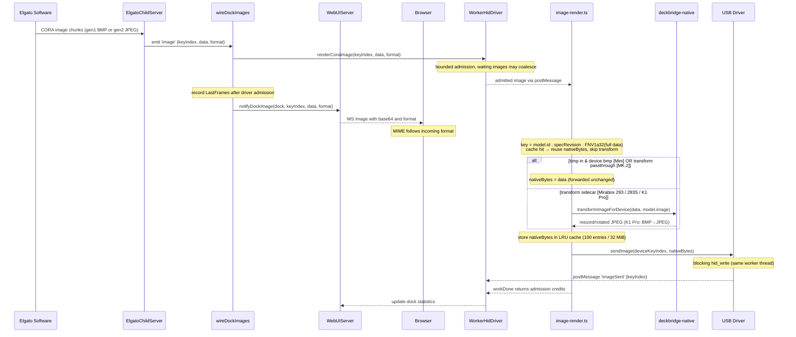

# Image Flow: DeckBridge

Documents how a key image travels from the Elgato software to the USB device and the web UI preview.

## Overview

See current sequence diagram below.

The Elgato desktop sends image data to the CORA child server in the format matching the capabilities the relay advertises via `model.cora` (geometry, PID, product name) — so the CORA format depends on what's physically plugged in. **Everything device-specific is read from the active `DeviceModel`** (`model.image`, `model.keyMap`, `model.cora`) — there is no per-brand branching in the pipeline.

[Device specs](./device-specs.mdx) derives model values.
[Supported devices](./devices.mdx) records verification status.
CORA profiles determine incoming image formats.
USB protocols determine outgoing report framing.
Those choices are independent.

| Example | Incoming format | Worker behavior |
|---|---|---|
| MK.2 | 72×72 JPEG | Forward native bytes |
| Mini | 80×80 BMP | Forward native bytes |
| K1 Pro emulating Mini | 80×80 BMP | Crop, transform, encode JPEG |
| Mirabox 293S emulating MK.2 | 72×72 JPEG | Pad and rotate |
| AKP05 / AKP05E emulating Plus | 120×120 JPEG; strip updates | Transform keys; composite strip |

AKP05 and AKP05E advertise as a Stream Deck + by default.
Each emulation carries its own mapping.

On image arrival (`wireDockImages` in `dock-frames.ts`, one per dock) the path splits into two tracks on **different threads**:

- **WebUI path (main thread)** — fires immediately: the CORA bytes are pushed **inline (base64) over WebSocket**, so the browser renders at arrival with no follow-up request.
- **Transform + USB path (USB worker thread)** — the main thread forwards raw CORA bytes via `WorkerHidDriver.renderCoraImage()`; the worker (`image-render.ts`) transforms through the Rust deckbridge-native cdylib (LRU-cached), then writes to the device. Running on the worker keeps the transform — and, dominantly, the burst of blocking `hid_write` chunk uploads that follows it — off the CORA ACK loop (P1).

## Image format by device

### gen2 (MK.2, Mirabox)

Chunks arrive in `ElgatoChildServer.handleCoraPacket` (`cora/child-server.ts`) as `byte1 === IMG_CMD_WRITE` (`0x07`) frames:

```
byte 0:  0x02 (output report type)
byte 1:  0x07 (IMG_CMD_WRITE)
byte 2:  key index (0-based)        [IMAGE_CHUNK_KEY_OFFSET]
byte 3:  isLast (1 = last page)     [IMAGE_CHUNK_FLAG_OFFSET / IMAGE_CHUNK_LAST_FLAG]
bytes 4-5: bodyLength (LE uint16)   [IMAGE_CHUNK_LEN_OFFSET]
bytes 8+:  JPEG payload             [ELGATO_IMAGE_HEADER_SIZE = 8]
```

`assembleImageChunk()` reassembles pages into `{ keyIndex, data: Buffer, format: 'jpeg' }`.

### gen1 (Mini)

Chunks arrive as `byte1 === GEN1_IMG_CMD` (`0x01`) frames, always 1024 bytes:

```
byte 0:  0x02
byte 1:  0x01 (GEN1_IMG_CMD)
byte 2:  partIndex (0-based)
byte 3:  0x00
byte 4:  isLast (1 = last packet)   [GEN1_IMAGE_LAST_OFFSET]
byte 5:  keyIndex + 1  ← 1-based!   [GEN1_IMAGE_KEY_OFFSET]
bytes 6-15:  0x00
bytes 16-1023: BMP payload (trailing zeros on last packet)   [GEN1_IMAGE_HEADER_SIZE = 16]
```

`assembleGen1ImageChunk()` reassembles pages, then trims trailing zeros by parsing the BMP `bfSize` field (LE uint32 at offset 2). Returns `{ keyIndex, data: Buffer, format: 'bmp' }`.

The Elgato desktop pre-applies the Mini's 90° CW rotation and BGR colour transform before encoding the BMP, so the relay forwards verbatim.

## End-to-End Flow


```mermaid
sequenceDiagram
    participant EL as Elgato Software
    participant CS as ElgatoChildServer
    participant PIPE as wireDockImages
    participant WEB as WebUIServer
    participant BR as Browser
    participant HOST as WorkerHidDriver
    participant REND as image-render.ts
    participant RS as deckbridge-native
    participant DRV as USB Driver

    EL->>CS: CORA image chunks (gen1 BMP or gen2 JPEG)
    CS->>PIPE: emit 'image' {keyIndex, data, format}

    PIPE->>HOST: renderCoraImage(keyIndex, data, format)
    Note over HOST: bounded admission, waiting images may coalesce
    HOST-->>REND: admitted image via postMessage
    Note over PIPE: record LastFrames after driver admission
    PIPE->>WEB: notifyDockImage(dock, keyIndex, data, format)
    WEB-->>BR: WS image with base64 and format
    Note over BR: MIME follows incoming format
    Note over REND: key = model.id : specRevision : FNV1a32(full data)<br/>cache hit → reuse nativeBytes, skip transform

    alt bmp in & device bmp [Mini]  OR  transform passthrough [MK.2]
        Note over REND: nativeBytes = data (forwarded unchanged)
    else transform sidecar [Mirabox 293 / 293S / K1 Pro]
        REND->>RS: transformImageForDevice(data, model.image)
        RS-->>REND: resized/rotated JPEG (K1 Pro: BMP→JPEG)
    end

    Note over REND: store nativeBytes in LRU cache (100 entries / 32 MiB)
    REND->>DRV: sendImage(deviceKeyIndex, nativeBytes)
    Note over DRV: blocking hid_write (same worker thread)
    DRV-->>HOST: postMessage 'imageSent' {keyIndex}
    REND-->>HOST: workDone returns admission credits
    HOST-->>WEB: update dock statistics
```

Key behaviours (the format/cache/remap logic now lives in `renderImage` in `image-render.ts`, on the worker; `wireDockImages` on the main thread only calls `renderCoraImage`, records the dock's last frame, and broadcasts to the WebUI):

- **No per-brand branching.** The native format is chosen purely from `format` and the effective image spec: BMP input whose device format is also BMP (true gen1 Mini) → forward as-is; `transform === 'passthrough'` → forward the CORA JPEG as-is; otherwise (`transform === 'sidecar'`) → `transformImageForDevice(data, model.image)` (resize/pad + `rotate`/`flipH`/`flipV`, re-encode). The K1 Pro takes the sidecar path even though its input is BMP, because its device format is JPEG (BMP→JPEG).
- **Image fit is device tuning, not a runtime WebUI toggle.** `model.image.resizeMode`/`padFill` come from the model default merged with the user's per-model device tuning (Settings → Device tuning, `POST /api/device-overrides`); the effective spec is fixed for the life of the open driver (or swapped in place by a live tuning change, `'setOverrides'`) — `renderImage` never overlays a separate runtime override.
- **WebUI shows the CORA arrival image.** Device-native bytes live only on the worker and go straight to the device (the old `setImageState(nativeBytes)` step was dropped with P1); the upright CORA image is the better preview anyway.
- **Device key remap:** `deviceKeyIndex = (model.keyMap.coraToWireImage || model.keyMap.imageOffset != null) ? mk2IndexToDeviceImgId(keyIndex, model) : keyIndex`. Elgato models (empty `keyMap`) use identity; Mirabox models remap via their `coraToWireImage` array. An out-of-range key (`-1`) is skipped (warn).
- **Wire chunk padding (K1 Pro):** inside `MiraboxDriver.sendImage`, models with `wire.chunkPadByte` get the JPEG wire-encoded by `padChunkBoundaries()` — one sacrificial `0x00` after every 1023 payload bytes, because the K1 Pro firmware drops the last byte of every full 1024-byte chunk (see internal probe notes). The BAT length is the padded wire length.

## Orientation

Orientation is fully described by the active model: `model.image` for live CORA frames and `model.splash.transformOverride` for splash images (whose sources are upright, not desktop-pre-rotated).

Live transforms follow effective `model.image`.
Splash transforms overlay `splash.transformOverride`.
MK.2 splash currently rotates 180 degrees.
AKP153E rev. 2 uses calibrated 95×95.
AKP153R still inherits 293V3 defaults.
Keep individual values in generated specifications.

Rust crops source pixels first.
Padding operates before rotation and flips.
Ordinary resizing operates after those transforms.
EXIF auto-rotation is disabled.
See [hardware calibration](./adding-a-device.md#phase-4--measure-image-orientation-on-hardware).

### Web preview orientation

The browser shows the **received CORA bytes** immediately (72×72 JPEG for the 293/293S and MK.2, native 80×80 BMP for the Mini and the K1 Pro), and a newly connected WebSocket is sent the stored bytes of every key — both are the CORA arrival image, so live and reconnect previews are consistent. Because the preview shows desktop-oriented bytes rather than device-oriented ones, the web UI corrects orientation with **per-model CSS** keyed on a `data-model` attribute (set via `KeyPreview.setModel()` from `status.modelId`):

```css
/* ui-base.css — single source of truth for BOTH views */
.key-grid .key-cell img                            { transform: rotate(180deg); } /* default */
.key-grid[data-model='mini'] .key-cell img         { transform: rotate(270deg) rotateY(180deg); }
.key-grid[data-model='mirabox-k1pro'] .key-cell img { transform: rotate(90deg) rotateX(180deg); }
.key-grid[data-cora='stream-deck-plus'] .key-cell img { transform: none; }
```

`KeyPreview.setModel(modelId, coraProfile)` sets both attributes.
Check previews for each advertised profile.
USB image rotation cannot determine preview rotation.

## Threading & ordering

Main-thread `HidWorkQueue` bounds admission and memory.
It performs no transforms or writes.

| Budget | Current default |
|---|---:|
| Posted messages | 15 |
| Posted payload bytes | 2 MiB |
| Waiting messages | 64 |
| Waiting payload bytes | 4 MiB |
| Additional control slots | 32 |

Waiting complete-key frames may replace predecessors.
Touch frames and controls form barriers.
Their ordering must survive coalescing.
Lifecycle resets discard queued work.
`workDone` returns credits after processing.

USB workers serialize admitted messages.
Eligible models collect bounded image batches.
Batch limits are 15 images / 16ms.
Final STP precedes completion notifications.
Currently only 293S enables batching by default.
Its seven rebadges require explicit tuning.

Image caching has two independent limits.
Maximum count is 100 entries.
Maximum retained payload is 32 MiB.
Keys combine model, mode, revision, and hash.
Current rendering uses constant mode `'def'`.
`specRevision(model.image)` distinguishes effective tuning.
Cache hits skip encoding, not USB writes.

Source: `worker/hid-work-queue-host.ts`, `worker/hid-worker.ts`,
`transform/image-render.ts`, and `transform/image-cache.ts`.

### Image-cache hash

`hashJpeg()` (`ts/src/transform/image-cache.ts`) runs on the USB worker for **every** image, hit or
miss, *before* the cache lookup — so a cache hit pays it in full. Three constraints shaped
it, and each one has already been violated once:

**It must cover the whole buffer.** An earlier version sampled only the first/last 4 KB
above 8 KB. For gen1 BMP (80×80×3 ≈ 19 KB) those samples are just the top/bottom border
rows, so a small centred icon on a black background hashed identically to a blank black
frame — the cached black transform was served and the key rendered black.

**It must not be byte-at-a-time.** In QuickJS (no JIT) the byte loop measured 1.60 ms on
an 8 KB CORA JPEG and 3.72 ms on a 19 KB gen1 BMP — *more* than the 0.91 ms native
transform it exists to avoid. Reading the 4-byte-aligned prefix through a `Uint32Array`
cuts interpreter iterations 4× and measured **4.2×** end-to-end (0.38 ms / 0.88 ms), i.e.
a 15-key profile load drops from 24.0 ms to 5.7 ms (JPEG) and 55.8 ms to 13.2 ms (BMP).
Every byte still contributes.

**The in-loop xorshift is load-bearing.** `FNV_PRIME` is `0x01000193` = 2²⁴ + 0x193, so
the multiply carries bits *upward only*. Consuming a whole word at a time, a delta confined
to a word's top byte lane never leaves that lane — `(d<<24)·P mod 2³²` = `(d·0x93 mod 256)<<24`
— leaving just 256 reachable digests for every such change. Measured **5053 collisions in
20 000 single-byte variants**; the byte-wise version had 0. `h ^= h >>> 15` inside the loop
diffuses high→low and restores 0. A final avalanche cannot substitute for it: `fmix32` is a
bijection, so by then the collisions have already happened. A `rotl13` variant performs
identically; a full murmur3 body also fixes it but is only 1.7× (3 multiplies + 2 rotates
per word) and was rejected.

Two accepted properties: an **unaligned** `byteOffset` falls back to the byte path and
digests differently from the same bytes aligned — that can only cause a cache *miss*
(a re-transform), never a false hit. And the digest is **platform-endian**, which is fine
because it is an in-process cache key, never persisted or sent over the wire.

Regression tests for all of the above (including the lane-3 family by name) are in
`ts/test/image-cache.test.ts`.

## State stored in the WebUI server

`ImageChannel` (`web/server/image-channel.ts`) caches the last CORA frame of every key
of every dock (`{ data, format }`, `format` = the arrival format `'jpeg'`/`'bmp'`).
`notifyDockImage(dock, mk2Index, data, format)` updates that cache and, when the dock
is the selected one, broadcasts a WebSocket `image` event. A newly connected
WebSocket is sent the selected dock's frames straight away (`sendSnapshot`), and
selecting another dock replays its frames; there is no per-key HTTP route. When a
dock's frames are dropped (model change, disconnect) the server sends `imagesReset`
and the browser blanks its previews.

## WebSocket `image` event

```json
{
  "event": "image",
  "data": {
    "mk2Index": 3,
    "data": "<base64>",
    "format": "jpeg"
  }
}
```

`format` is the CORA **arrival** format: `"jpeg"` when the desktop sent a gen2 JPEG (MK.2, 293/293S) and `"bmp"` when it sent a gen1 BMP (Mini, K1 Pro). The client `imageSrc(entry)` in `key-preview.ts` builds the data URI with the correct MIME type (shared by both views):

```js
const mime = entry.format === 'bmp' ? 'image/bmp' : 'image/jpeg';
return `data:${mime};base64,${entry.data}`;
```

Every WS event and its payload is declared once in `WsEvents` (`web/contract.ts`);
the server's `broadcast<K>` and the client's handler table are both typed by it.

## Key Files

| File | Role |
|---|---|
| `ts/src/main/dock-frames.ts` | `wireDockImages(childServer, sink)` (main thread, one per dock) — forwards raw CORA bytes via `driver()?.renderCoraImage(...)` (a no-op on the mock), records the dock's `LastFrames` (replug replay, live-tuning repaint), then the WebUI base64 push |
| `ts/src/transform/image-render.ts` | `renderImage(driver, model, keyIndex, coraBytes, format)` (worker) — transform (deckbridge-native FFI) + LRU cache + CORA→wire remap + `sendImage` to the device |
| `ts/src/cora/image-assembler.ts` | `assembleImageChunk()` (gen2 JPEG) · `assembleGen1ImageChunk()` (gen1 BMP, BMP `bfSize` trim) |
| `ts/src/cora/child-server.ts` | `ElgatoChildServer.handleCoraPacket` — dispatches `IMG_CMD_WRITE` / `GEN1_IMG_CMD`, emits `'image'` |
| `ts/src/transform/image-cache.ts` | `LruCache` (`IMAGE_CACHE_SIZE` = 100; 32 MiB) · `hashJpeg()` (full-buffer FNV-1a 32-bit) · `makeCacheKey(modelId, hash)` |
| `ts/src/transform/translator.ts` | `transformImageForDevice(jpeg, spec)`; native blit and BMP helpers |
| `ts/src/shared/key-map.ts` | Pure input/image index mappings |
| `rust/deckbridge-native/src/transform.rs` | Native transforms; EXIF auto-rotation disabled |
| `ts/src/worker/hid-worker.ts` · `hid-worker-host.ts` | USB worker entry + `WorkerHidDriver` proxy — carry the `'image'` / `'imageSent'` messages across the thread boundary |
| `ts/src/web/server/image-channel.ts` | Per-dock frame cache · `notifyDockImage()` · `sendSnapshot()` for a new WS client · `replay()` on dock select |
| `ts/src/web/client/key-preview.ts` | Shared `KeyPreview` grid + image store + `imageSrc()` — single render path for both views |
| `ts/src/web/client/ui-base.css` | Per-model `.key-grid[data-model] .key-cell img` rotation (single source of truth) |
| `ts/src/web/client/advanced/key-grid.tsx` | Advanced view — Preact component owning a persistent `KeyPreview`; `rebuild/setModel/setClickable` on `status` changes |
| `ts/src/web/client/components/KeyGridPreview.tsx` | Simple-view grid lifecycle and profile selection |
| `ts/src/web/client/lib/ui-ws.ts` | WS message handler — `applyImage`/`resetPreviews`/`flashKey` into the shared image store |
