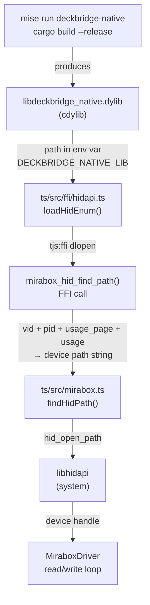
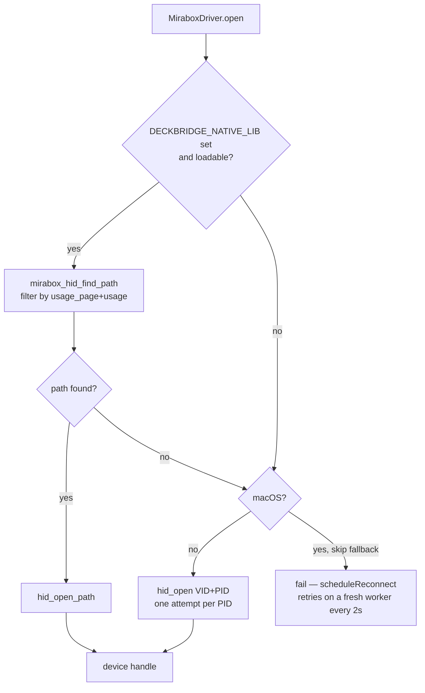

# deckbridge — Rust components

Three Rust crates that extend the TypeScript runtime with OS-level capabilities that QuickJS/txiki.js cannot provide directly.

| Crate | Artifact | IPC | Purpose |
|---|---|---|---|
| `deckbridge-native` | `libdeckbridge_native.dylib` / `.so` | FFI (`dlopen`) | JPEG/BMP decode, resize, rotate/flip, re-encode + (usb feature) HID device-path enumeration |
| `deckbridge-tray` | `deckbridge-tray` (binary) | stdout (events) + TCP (state) | System tray icon + menu sidecar process |
| `jpeg-encoder` | (rlib, vendored fork — opt-in dep of `deckbridge-native`) | — | jpeg-encoder 0.6.1 fork: optimized Huffman kept in a single interleaved scan |

---

## deckbridge-native

A single cdylib loaded in-process over txiki.js FFI (it replaced the former subprocess sidecar
and its TCP/JSON protocol, and merged what used to be two separate cdylibs — `image-proc` and
`hid-enum` — into one). It exports three C-ABI symbols:

- `image_proc_transform()` — decode JPEG/BMP → resize (`triangle` or `nearest`) → rotate/flip →
  re-encode as JPEG (iterative quality step-down to fit `max_bytes`) or BMP. See
  `rust/deckbridge-native/README.md` for the full FFI contract.
- `mirabox_hid_find_path()` (behind the `usb` Cargo feature) — enumerate HID devices by
  usage page/usage and return a device path.
- `mirabox_hid_present()` (behind the `usb` Cargo feature) — enumerate HID devices by VID/PID
  to check presence, without opening the device. Used by the TS side (`ts/src/ffi/hidapi.ts`)
  to probe which model is connected.

```
DECKBRIDGE_NATIVE_LIB = "{{config_root}}/rust/target/release/libdeckbridge_native.dylib"
```

Build via `mise run deckbridge-native` (expands to `cargo build --release` inside `rust/deckbridge-native/`).
`mise.toml` sets `DECKBRIDGE_NATIVE_LIB` to the build output path so the TypeScript runtime can find it.

### Why HID enumeration exists

`libhidapi` exposes `hid_open(vid, pid)` which opens the **first** matching interface. On macOS
this picks whichever IOKit interface the kernel serves first — often the system-claimed one, not
the data interface. `mirabox_hid_find_path` wraps the full `hid_enumerate()` loop so the
TypeScript side can filter by `usage_page` and `usage` before opening:

```c
int32_t mirabox_hid_find_path(
    uint16_t vid,
    uint16_t pid,        // 0 = match any product ID
    uint16_t usage_page,
    uint16_t usage,
    char    *out_buf,
    size_t   out_len
);
// Returns 1 + writes null-terminated path into out_buf, or 0 if not found.
```

### Integration flow



### Call path in TypeScript

```
mirabox.ts  MiraboxDriver.open()
  └─ ffi/hidapi.ts  findHidPath(MIRABOX_VID, MIRABOX_USAGE_PAGE, MIRABOX_USAGE)
       └─ loadHidEnum()           ← dlopen($DECKBRIDGE_NATIVE_LIB) via tjs:ffi
       └─ mirabox_hid_find_path() ← FFI call into libdeckbridge_native.dylib
            └─ hidapi::HidApi::new().device_list()
                 iterate → match vid + (pid==0 or pid) + usage_page + usage → return path
  └─ hid_open_path(path)          ← opens the correct interface
```

If `DECKBRIDGE_NATIVE_LIB` is unset or the dylib fails to load, `findHidPath` returns `null` and `MiraboxDriver` falls back to `hid_open(VID, PID)` — one attempt per PID, off macOS only (see below).

> Since the worker-thread refactor, `MiraboxDriver` — and therefore this whole `findHidPath` → `hid_open_path` call path, plus the read/write loops — runs inside the **USB worker thread** (`hid-worker.ts`), not on the main thread. The dylib is `dlopen`ed from within the worker, which has its own `tjs.env` access.

### Fallback behaviour



---

## deckbridge-tray

A standalone binary that puts a status icon in the system tray with a short menu, run as a
sidecar to the main txiki.js process (it replaced a former Go binary, `tray-go`). A separate
process is mandatory because `tray-icon`'s Cocoa event loop must own thread 0 on macOS — and
txiki.js already needs its main thread for libuv — so the two cannot share one process.

Build via `mise run tray-rs` (expands to `cargo build --release` inside `rust/deckbridge-tray/`).
Output binary: `rust/target/release/deckbridge-tray` (shared workspace target). `app.ts` spawns it via `DECKBRIDGE_TRAY_BIN`,
and if that is unset or the spawn fails, `startTray()` returns `null` and the bridge runs
normally — the tray is an enhancement, not a dependency.

### IPC

Two independent channels carry data in opposite directions over a loopback connection whose
TCP port is negotiated at startup:

- **Rust → TS** over **stdout** (pipe), newline-delimited JSON — `TrayEvent`: lifecycle
  (`ready` with port) and menu clicks (`open_webui`, `check_requirements`, `quit`).
- **TS → Rust** over **TCP** `127.0.0.1:N`, newline-delimited JSON — `TrayState`: icon
  (`full` / `usb_only` / `disconnected`) + status string updates.

Stdout carries Rust→TS because it is available from process start, before the TCP connection
exists. See `rust/deckbridge-tray/README.md` for the startup handshake, data types, menu structure,
and shutdown sequence.

### Dependencies

- `tray-icon = "0.22"` + `tao = "0.35"` + `muda` (re-exported via `tray_icon::menu`) — tray
  icon, event loop, and menus.
- `png = "0.17"` — icon loading (disk override in `icons/`, embedded fallback).
- `serde` / `serde_json` — IPC (de)serialization.

Release binary is ~806 KB (stripped, LTO, `opt-level = "z"`).

---

## JPEG encoder backends

`deckbridge-native` selects its JPEG entropy encoder via cargo features (exactly one):

- `jpeg-upstream` (default) — crates.io `jpeg-encoder 0.6.1`, standard Huffman tables, single interleaved baseline scan. Device-safe everywhere.
- `jpeg-fork` — the vendored `rust/jpeg-encoder` fork, which keeps **optimized Huffman tables in a single interleaved scan** (~20 % smaller files at identical pixels; upstream switches to one scan per component when optimizing, which the K1 Pro firmware cannot decode — probe round 5).

Build the fork variant with `JPEG_FORK=1 mise run build` (expands to `cargo build --release --no-default-features --features jpeg-fork`). Both deps expose lib name `jpeg_encoder`; `compile_error!` guards enforce the choice. Background: internal probe notes (K1 Pro JPEG artifact investigation, round 5).

---

## Dependency summary

| Crate | Dependencies |
|---|---|
| `deckbridge-native` | `image` (decode/resize/BMP), `jpeg-encoder` **or** vendored `jpeg-encoder-fork` (feature-selected), `hidapi = "2"` (usb feature) |
| `deckbridge-tray` | `tray-icon = "0.22"`, `tao = "0.35"`, `muda` (via `tray_icon::menu`), `png = "0.17"`, `serde` / `serde_json` |
