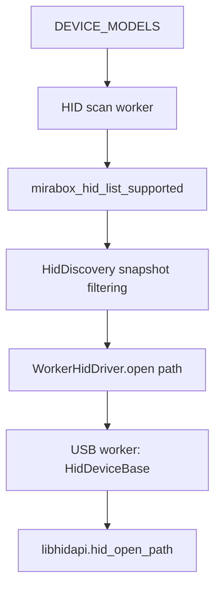

# deckbridge — Rust components

Three Rust crates that extend the TypeScript runtime with OS-level capabilities that QuickJS/txiki.js cannot provide directly.

| Crate | Artifact | IPC | Purpose |
|---|---|---|---|
| `deckbridge-native` | `libdeckbridge_native.dylib` / `.so` | FFI (`dlopen`) | JPEG/BMP decode, resize, rotate/flip, re-encode + (usb feature) HID device-path enumeration |
| `deckbridge-tray` | `deckbridge-tray` (binary) | stdout (events) + TCP (state) | System tray icon + menu sidecar process |
| `jpeg-encoder` | (rlib, vendored fork — opt-in dep of `deckbridge-native`) | — | jpeg-encoder 0.6.1 fork: optimized Huffman kept in a single interleaved scan |

---

## deckbridge-native

One cdylib supplies native runtime services.
Image transforms execute on USB workers.
Operational discovery uses its scan worker.
See [native API documentation](deckbridge-native/README.md).

| Export | Responsibility |
|---|---|
| `image_proc_transform` | Crop, fit, rotate, encode |
| `image_proc_blit` | Compose incoming touch-strip patches |
| `mirabox_hid_list_supported` | Inventory filtered by supported VID/PID |
| `mirabox_hid_list_all` | Full diagnostic inventory |
| `mirabox_hid_reset` | Reset thread-bound discovery state |

Legacy HID lookup exports also remain.
Production discovery bypasses those legacy helpers.
Windows builds additionally expose native mDNS.

Build through `mise run deckbridge-native`.
`mise.toml` supplies `DECKBRIDGE_NATIVE_LIB`.
Default Cargo features include USB discovery.
`JPEG_FORK=1` preserves USB while changing encoders.

### Integration flow

```mermaid
flowchart TD
    R[DEVICE_MODELS] --> S[HID scan worker]
    S --> N[mirabox_hid_list_supported]
    N --> D[HidDiscovery snapshot filtering]
    D --> W[WorkerHidDriver.open path]
    W --> B[USB worker: HidDeviceBase]
    B --> H[libhidapi.hid_open_path]
```

Usage filters select appropriate HID interfaces.
Every real driver opens explicit paths.
Missing native discovery produces empty inventories.
No VID/PID opening fallback exists.

---

## deckbridge-tray

A standalone binary that puts a status icon in the system tray with a short menu, run as a
sidecar to the main txiki.js process (it replaced a former Go binary, `tray-go`). A separate
process is mandatory because `tray-icon`'s Cocoa event loop must own thread 0 on macOS — and
txiki.js already needs its main thread for libuv — so the two cannot share one process.

Build via `mise run tray-rs` (expands to `cargo build --release` inside `rust/deckbridge-tray/`).
Output binary: `rust/target/release/deckbridge-tray` (shared workspace target). `app.ts` spawns it via `DECKBRIDGE_TRAY_BIN`,
and if that is unset or the spawn fails, `startTray()` returns `null` and the bridge runs
normally — the tray is an enhancement, not a dependency.

### IPC

Two independent channels carry data in opposite directions over a loopback connection whose
TCP port is negotiated at startup:

- **Rust → TS** over **stdout** (pipe), newline-delimited JSON — `TrayEvent`: lifecycle
  (`ready` with port) and menu clicks (`open_webui`, `check_requirements`, `quit`).
- **TS → Rust** over **TCP** `127.0.0.1:N`, newline-delimited JSON — `TrayState`: icon
  (`full` / `usb_only` / `disconnected`) + status string updates.

Stdout carries Rust→TS because it is available from process start, before the TCP connection
exists. See `rust/deckbridge-tray/README.md` for the startup handshake, data types, menu structure,
and shutdown sequence.

### Dependencies

- `tray-icon = "0.22"` + `tao = "0.35"` + `muda` (re-exported via `tray_icon::menu`) — tray
  icon, event loop, and menus.
- `png = "0.17"` — icon loading (disk override in `icons/`, embedded fallback).
- `serde` / `serde_json` — IPC (de)serialization.

Release binary is ~806 KB (stripped, LTO, `opt-level = "z"`).

---

## JPEG encoder backends

`deckbridge-native` selects its JPEG entropy encoder via cargo features (exactly one):

- `jpeg-upstream` (default) — crates.io `jpeg-encoder 0.7.1`, standard Huffman tables, single interleaved baseline scan. Device-safe everywhere.
- `jpeg-fork` — the vendored `rust/jpeg-encoder` fork, which keeps **optimized Huffman tables in a single interleaved scan** (~20 % smaller files at identical pixels; upstream switches to one scan per component when optimizing, which the K1 Pro firmware cannot decode — probe round 5).

Build the fork variant with `JPEG_FORK=1 mise run build` (expands to `cargo build --release --no-default-features --features jpeg-fork,usb`). Both deps expose lib name `jpeg_encoder`; `compile_error!` guards enforce the choice. Background: internal probe notes (K1 Pro JPEG artifact investigation, round 5).

---

## Dependency summary

| Crate | Dependencies |
|---|---|
| `deckbridge-native` | `image` (decode/resize/BMP), `jpeg-encoder` **or** vendored `jpeg-encoder-fork` (feature-selected), `hidapi = "2"` (usb feature) |
| `deckbridge-tray` | `tray-icon = "0.22"`, `tao = "0.35"`, `muda` (via `tray_icon::menu`), `png = "0.17"`, `serde` / `serde_json` |
