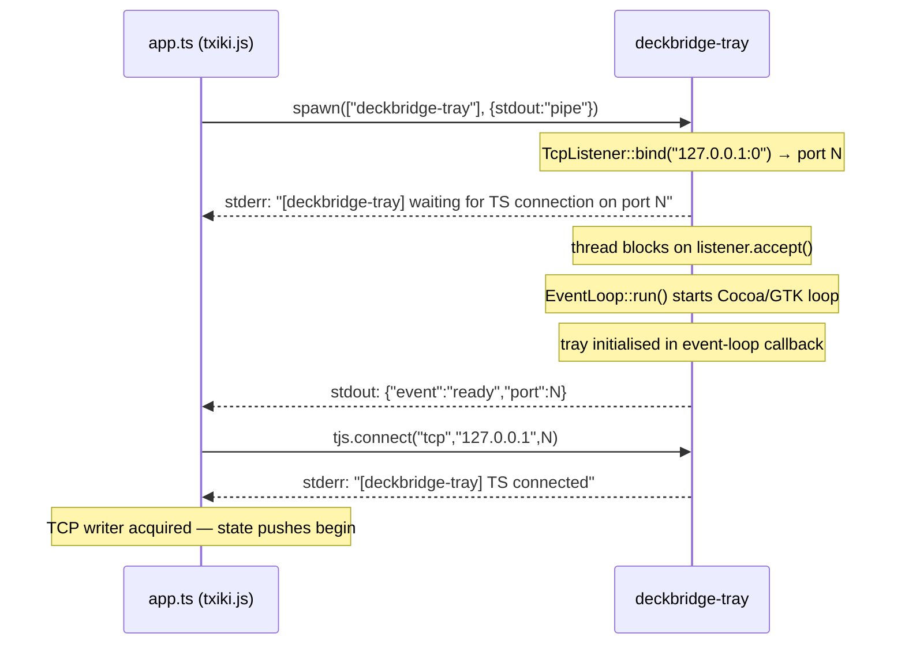
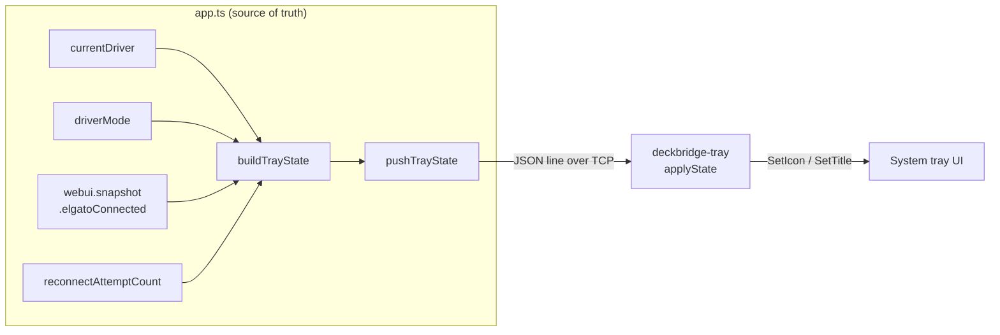
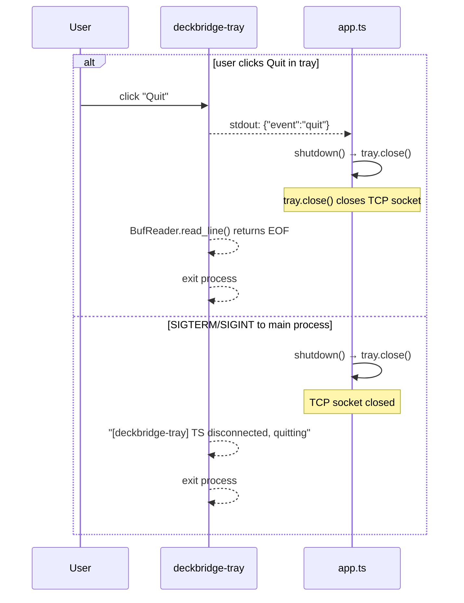

# deckbridge-tray — mira2el system tray sidecar

A small Rust binary that puts a status icon in the system tray and a short menu below it. It runs as a sidecar to the main `deckbridge` txiki.js process.

## Why a separate process

Two constraints make a sidecar mandatory:

1. **`tray-icon` owns the main thread.** On macOS, the Cocoa event loop must run on thread 0. `EventLoop::run(...)` blocks forever and never returns. txiki.js also needs its main thread for the libuv event loop. Two main threads cannot share one process.

2. **No suitable FFI path.** There is no cross-platform systray library callable from txiki.js FFI. A native subprocess is the only practical option.

The two processes talk over a loopback TCP connection whose port is negotiated at startup.

---

## Startup sequence



Key timing property: the thread is already blocking on `listener.accept()` before the `"ready"` event is emitted, so the TypeScript TCP connect always finds an acceptor waiting.

---

## IPC channels

Two independent channels carry data in opposite directions.

```
┌──────────────────────────┐          ┌──────────────────────────┐
│  app.ts (txiki.js)       │          │  deckbridge-tray (Rust)        │
│                          │          │                          │
│  TrayProcess._readLoop() │◄─stdout──│  serde_json::to_writer   │
│                          │          │  emit(TrayEvent{...})    │
│  TrayProcess._send()     │──TCP────►│  BufReader over TcpStream│
│  JSON line per update    │          │  stateC <- TrayState     │
└──────────────────────────┘          └──────────────────────────┘
```

| Direction | Transport | Format | Purpose |
|---|---|---|---|
| Rust → TS | **stdout** (pipe) | newline-delimited JSON | `TrayEvent`: lifecycle events, menu clicks |
| TS → Rust | **TCP** `127.0.0.1:N` | newline-delimited JSON | `TrayState`: icon + status string updates |

Stdout is used for Rust→TS because it is always available from the moment the process starts; the TCP connection might not be established yet when the `"ready"` event fires. Stdin is left alone (not piped) so it does not interfere with the tray process's own input handling.

---

## Data types

### `TrayState` — TS → Rust (over TCP)

```rust
#[derive(Deserialize)]
struct TrayState {
    icon: String,               // "full" | "usb_only" | "disconnected"
    status: String,             // human-readable label for menu item
    reconnect_attempts: u32,    // informational only; Rust ignores it
}
```

| `icon` | Icon file | Condition |
|---|---|---|
| `"full"` | `icon-full.png` (green) | USB device open **and** Elgato client connected |
| `"usb_only"` | `icon-usb-only.png` (yellow) | USB device open, no Elgato client |
| `"disconnected"` | `icon-disconnected.png` (gray) | No USB device |

### `TrayEvent` — Rust → TS (over stdout)

```rust
#[derive(Serialize)]
struct TrayEvent {
    event: String,
    #[serde(skip_serializing_if = "Option::is_none")]
    port: Option<u16>,  // only in "ready"
}
```

| `event` | When | Action in TS |
|---|---|---|
| `"ready"` | tray initialised | TCP-connect to `port` |
| `"open_webui"` | "Open Web UI" clicked | *(informational — Rust already opened browser)* |
| `"check_requirements"` | "Check Requirements" clicked | *(informational)* |
| `"quit"` | "Quit" clicked | call `shutdown()` → `tjs.exit(0)` |

---

## State ownership

All device state lives in `app.ts`. `deckbridge-tray` is display-only — it stores nothing and derives nothing. The Rust binary just applies whatever `TrayState` it last received.



`pushTrayState()` is called from six sites in `app.ts`:

| Event | Location |
|---|---|
| USB device connected | `tryRealConnect()` — after `notifyDriverStatus('real', true)` |
| USB device disconnected | `probeAndOpen()` disconnect handler (gen1/2 and mirabox) |
| Reconnect scheduled | `scheduleReconnect()` — after incrementing `reconnectAttemptCount` |
| No device found, retry | `tryRealConnect()` — after `scheduleReconnect()` |
| Elgato client connected | `childServer` `clientConnected` handler |
| Elgato client disconnected | `childServer` `clientDisconnected` handler |

---

## Menu structure

```
DeckBridge                         ← disabled header
Status: Mirabox + Elgato connected  ← disabled, updated by TrayState.status
────────────────────────────────
Open Web UI                     → opens http://localhost:3000
Check Requirements              → opens http://localhost:3000/requirements
────────────────────────────────
Quit                            → emit "quit", exit process
```

---

## Shutdown



---

## Non-fatal design

If `DECKBRIDGE_TRAY_BIN` is unset or the binary fails to spawn, `startTray()` returns `null` and `app.ts` logs a single warning. All core functionality (USB bridge, CORA servers, web UI) continues normally. The tray is an enhancement, not a dependency.

---

## Build

```bash
# from deckbridge/
mise run tray-rs          # cargo build --release

# or directly
cd rust/deckbridge-tray && cargo build --release
```

Output binary: `rust/target/release/deckbridge-tray` (shared workspace target).  
Icons are loaded at runtime from `icons/` relative to the binary's location (set by `app.ts` via the `cwd` spawn option).

---

## Files

```
rust/deckbridge-tray/
├── src/main.rs              — entire implementation
├── Cargo.toml               — deckbridge-tray, tray-icon, tao, png, serde_json
├── Cargo.lock
└── icons/
    ├── icon-full.png        — 22×22 green circle (USB + Elgato connected)
    ├── icon-usb-only.png    — 22×22 yellow circle (USB only)
    └── icon-disconnected.png — 22×22 gray circle (no device)
```

TypeScript side: `ts/src/tray.ts` — `TrayProcess` class + `startTray()` factory.
